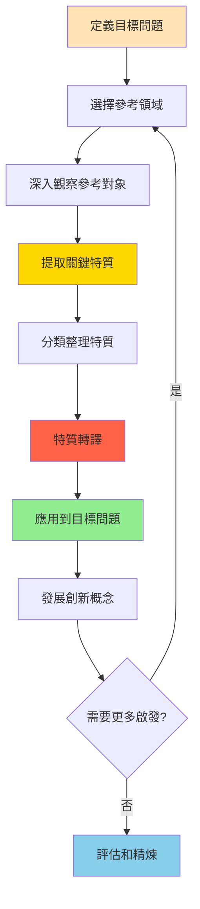

# 特質轉移技術 (Trait Transfer)

## 基本資訊

| 項目 | 內容 |
|------|------|
| **技術名稱** | Trait Transfer（特質轉移/屬性遷移） |
| **創始人** | 多位創新理論家，包括George Prince等 |
| **年代** | 1960-1970年代發展 |
| **類型** | 結構化類比、跨域創新 |
| **難度** | ⭐⭐⭐ 中高 |
| **人數** | 4-12人 |
| **時間** | 60-120分鐘 |
| **適用階段** | 創新突破、產品設計、問題解決 |
| **核心價值** | 跨域借鑒、突破框架 |

## 技術概述

特質轉移是一種系統化的類比創新技術，通過識別一個領域、對象或系統的獨特特質，然後將這些特質轉移應用到完全不同的領域，從而激發創新想法。這個技術的核心在於「借用」其他領域的成功特性，創造出令人驚喜的解決方案。

### 核心概念

**類比思考（Analogical Thinking）**
- 尋找表面不相關但深層相似的事物
- 將一個領域的智慧應用到另一個領域
- 突破領域界限的創新

**特質（Traits）**
- 物理特性：形狀、顏色、質地、結構
- 功能特性：作用、機制、流程
- 行為特性：互動方式、適應性、韌性
- 體驗特性：感受、氛圍、情感

**轉移（Transfer）**
- 不是直接複製
- 而是提取本質並重新詮釋
- 在新語境中創造新價值

## 核心流程圖

## 核心原理

### 理論基礎

#### 1. 認知科學基礎

**結構映射理論（Structure-Mapping Theory）**
- 人類通過映射相似結構進行類比
- 表面特徵不同，但關係結構相似
- 深層關係比表面特徵更重要

**概念混合理論（Conceptual Blending）**
- 將不同概念空間混合
- 創造新的認知結構
- 產生創新想法

#### 2. 特質的層次

**表層特質**（容易觀察）
- 外觀、顏色、形狀
- 直接可見的特徵
- 易於轉移但可能較淺

**功能特質**（需要理解）
- 如何運作
- 達成什麼目的
- 解決什麼問題

**深層特質**（需要洞察）
- 為什麼成功
- 底層原理
- 本質特性

**體驗特質**（需要感受）
- 使用者感受
- 情感連結
- 氛圍營造

#### 3. 轉移的類型

**直接轉移**
- 物理特性的直接應用
- 例：蓮葉的疏水性 → 防水塗料

**功能轉移**
- 功能機制的借用
- 例：螞蟻的群體智慧 → 物流優化演算法

**原理轉移**
- 底層原理的應用
- 例：生態系統的平衡 → 商業生態系統設計

**體驗轉移**
- 感受和氛圍的重現
- 例：五星飯店的服務感 → 銀行VIP體驗

## 執行步驟

### 準備階段（15分鐘）

#### 第一步：明確目標問題（5分鐘）

清楚定義要解決的問題或創新的方向：
- 我們想改進什麼？
- 面臨什麼挑戰？
- 希望達成什麼目標？

**例子**：
- 「如何讓網站更吸引人？」
- 「如何改善客戶服務體驗？」
- 「如何設計更好的包裝？」

#### 第二步：選擇參考領域（10分鐘）

**策略A：隨機激發**
- 隨機選擇不相關的領域
- 例：動物、自然、運動、藝術、歷史
- 越不相關，潛在創新越大

**策略B：成功案例**
- 選擇在某方面做得很好的領域
- 例：想改善速度 → 研究F1賽車
- 想改善體驗 → 研究迪士尼

**策略C：問題導向**
- 尋找面臨類似挑戰的領域
- 看他們如何解決
- 借鑒成功經驗

**常用參考領域**：
- 自然界（仿生設計）
- 其他產業
- 歷史事件
- 運動競技
- 藝術和娛樂
- 文化和傳統

### 執行階段（60-90分鐘）

#### 第一步：深入觀察（15-20分鐘）

**沉浸式觀察**：
- 如果可能，實地觀察或體驗
- 觀看影片、閱讀資料
- 與專家交流
- 收集圖片和案例

**多角度觀察**：
- 物理層面：看到什麼？
- 功能層面：如何運作？
- 體驗層面：感覺如何？
- 原理層面：為什麼這樣？

**記錄方式**：
- 拍照或素描
- 關鍵詞筆記
- 錄影或錄音
- 感受記錄

#### 第二步：提取特質（20-30分鐘）

**系統性提取**：

**物理特質**
- 形狀和結構
- 顏色和質感
- 大小和比例
- 材料和組成

**功能特質**
- 核心功能
- 運作機制
- 效率和速度
- 適應能力

**行為特質**
- 互動方式
- 反應模式
- 協作機制
- 演化適應

**體驗特質**
- 感官體驗
- 情感反應
- 氛圍營造
- 記憶點

**提取技巧**：
- 使用便利貼，一個特質一張
- 具體描述，不要太抽象
- 數量優先，越多越好（目標：20-40個）
- 包含意外和細微的觀察

#### 第三步：分類和聚焦（10-15分鐘）

**分類方式**：
- 按特質類型分組
- 識別最獨特的特質
- 標記特別有趣的
- 合併相似的

**優先排序**：
- 投票選出最有潛力的特質
- 通常選擇5-10個深入探索
- 平衡不同類型的特質

#### 第四步：特質轉譯（20-30分鐘）

**這是最關鍵的步驟**

對每個選定的特質：

1. **理解本質**
   - 這個特質的核心是什麼？
   - 為什麼它重要/有效？
   - 底層原理是什麼？

2. **轉譯提問**
   - 如果我們的【目標問題】有這個特質會怎樣？
   - 這個特質如何應用在【目標領域】？
   - 可以如何重新詮釋？

3. **激發想法**
   - 腦力激盪所有可能的應用
   - 不批判，先發散
   - 記錄所有想法

**轉譯範例**：

**特質**：變色龍的變色能力
- **本質**：適應環境、溝通、偽裝
- **轉譯到產品包裝**：
  - 包裝可根據環境光線改變顏色
  - 根據溫度顯示不同資訊
  - 在不同背景下呈現最佳對比

**特質**：螞蟻的群體智慧
- **本質**：分散式決策、費洛蒙溝通、自組織
- **轉譯到網站設計**：
  - 根據用戶行為路徑優化導航
  - 熱門內容自動浮現
  - 用戶貢獻內容引導其他用戶

#### 第五步：發展概念（15-20分鐘）

**選擇最有潛力的想法**：
- 評估創新性
- 評估可行性
- 評估影響力

**深入發展**：
- 具體化概念
- 繪製草圖或原型
- 討論實施方式
- 識別挑戰

### 收斂階段（15分鐘）

1. **整理所有概念**（5分鐘）
   - 展示所有產生的想法
   - 分組相似概念
   - 識別主題

2. **評估和選擇**（5分鐘）
   - 選出2-3個最佳概念
   - 討論優缺點
   - 決定深入發展方向

3. **下一步規劃**（5分鐘）
   - 分配後續行動
   - 設定時間表
   - 規劃原型製作

## 引導提示/問題模板

### 觀察階段

**深入觀察**：
- 你注意到什麼？
- 有什麼特別的地方？
- 為什麼它成功/有效？
- 有什麼意外的細節？
- 如果你是【對象】，感覺如何？

**多感官觀察**：
- 看起來如何？
- 聽起來如何？
- 摸起來如何？
- 甚至聞起來如何？
- 整體感覺是什麼？

### 提取特質

**物理特質**：
- 形狀有什麼特點？
- 顏色和質感如何？
- 結構如何組織？
- 材料有什麼特性？
- 大小和比例關係？

**功能特質**：
- 主要功能是什麼？
- 如何達成目的？
- 運作機制是什麼？
- 有什麼巧妙的設計？
- 效率如何實現？

**行為特質**：
- 如何與環境互動？
- 如何回應變化？
- 有什麼適應機制？
- 協作方式如何？
- 演化過程是什麼？

**體驗特質**：
- 給人什麼感覺？
- 氛圍如何？
- 有什麼情感連結？
- 令人難忘的是什麼？
- 為什麼吸引人？

### 轉譯階段

**理解本質**：
- 這個特質的核心是什麼？
- 為什麼它有效？
- 底層原理是什麼？
- 可以用一句話描述嗎？

**轉譯提問**：
- 如果【目標】有這個特質會怎樣？
- 這可以如何應用在【領域】？
- 可以如何重新詮釋？
- 有什麼類似的功能或效果？
- 本質可以用不同形式表現嗎？

**激發應用**：
- 這能解決什麼問題？
- 能創造什麼價值？
- 用戶會有什麼體驗？
- 實施起來會是什麼樣子？
- 有什麼意外的應用？

## 實際案例

### 案例1：仿生設計 - 鯊魚皮泳衣

**參考對象**：鯊魚

**觀察特質**：
- 鯊魚皮表面有V型細小凹槽
- 減少水流阻力
- 防止微生物附著
- 高效率游動

**轉移應用**：
- **Speedo Fastskin泳衣**：模仿鯊魚皮紋理，減少水阻
- **船體塗料**：防止藻類附著，減少清潔需要
- **飛機表面**：減少空氣阻力，提升燃油效率
- **醫療設備**：抗菌表面，減少感染

**結果**：創造了革命性的運動裝備和工業應用

### 案例2：蘋果專賣店借鑒飯店體驗

**參考對象**：麗思卡爾頓飯店（Ritz-Carlton）

**觀察特質**：
- 溫暖歡迎的氛圍
- 禮賓服務（Concierge）
- 個人化關注
- 優雅的空間設計
- 記憶客戶偏好
- 解決問題，不說「不」

**轉移應用到Apple Store**：
- **Genius Bar** → 禮賓服務台
- **個人化服務** → 一對一諮詢
- **空間設計** → 開放、優雅、可探索
- **員工訓練** → 不是銷售員，是顧問
- **問題解決** → 專注於解決方案，不是交易

**結果**：重新定義零售體驗，創造業界標竿

### 案例3：Uber借鑒餐廳預訂

**參考對象**：OpenTable餐廳訂位系統

**觀察特質**：
- 即時查看可用性
- 簡單的預訂流程
- 確認通知
- 評價系統
- 使用記錄
- 雙向溝通

**轉移應用到叫車服務**：
- 即時查看附近車輛
- 簡單叫車流程
- 司機和乘客雙向確認
- 雙向評價系統
- 乘車記錄和偏好
- 司機和乘客溝通

**結果**：革新交通服務產業

### 案例4：樂高借鑒電影宇宙

**參考對象**：漫威電影宇宙（MCU）

**觀察特質**：
- 互相連結的故事
- 跨系列角色
- 復活節彩蛋
- 長期敘事弧線
- 粉絲社群參與
- 持續擴展的世界

**轉移應用到樂高主題**：
- 跨主題的樂高電影宇宙
- 樂高Masters節目（競賽和敘事）
- 主題間的連結和彩蛋
- 粉絲創作鼓勵
- 持續擴展的樂高世界

**結果**：從玩具品牌轉型為娛樂品牌

### 案例5：Airbnb借鑒家的溫暖

**參考對象**：朋友家作客體驗

**觀察特質**：
- 主人的歡迎
- 家的溫馨感
- 當地人的建議
- 真實的生活體驗
- 信任和分享
- 個性化空間

**轉移應用**：
- **房東歡迎** → 個人化check-in體驗
- **當地指南** → 房東推薦和城市指南
- **真實空間** → 不是標準化酒店
- **社群信任** → 評價系統和驗證
- **歸屬感** → "Belong Anywhere"品牌定位

**結果**：創造共享經濟新模式

## 適用場景

### 最適合的情境

1. **產品創新**
   - 新產品設計
   - 改進現有產品
   - 尋找差異化
   - 使用者體驗設計

2. **服務設計**
   - 改善服務流程
   - 創造新服務模式
   - 提升客戶體驗
   - 服務差異化

3. **問題解決**
   - 突破既有框架
   - 尋找創新解決方案
   - 跨領域靈感
   - 技術挑戰

4. **策略創新**
   - 商業模式創新
   - 市場定位
   - 品牌重塑
   - 組織變革

### 不太適合的情境

- 需要快速決策
- 問題有明確標準答案
- 領域知識極度專業（難以類比）
- 完全沒有參考案例的全新領域

## 注意事項

### 執行要點

1. **選擇合適的參考對象**
   - 夠不同，產生驚喜
   - 有成功經驗可學習
   - 可觀察和研究
   - 團隊感興趣

2. **深入而非表面**
   - 不只看表面特徵
   - 理解底層原理
   - 挖掘深層特質
   - 感受體驗

3. **創意轉譯**
   - 不是直接複製
   - 重新詮釋和調整
   - 適應新語境
   - 創造新價值

4. **保持開放**
   - 接受意外的連結
   - 不要過早批判
   - 鼓勵大膽想法
   - 允許失敗

5. **實際可行**
   - 最終要能實施
   - 考慮技術可行性
   - 評估成本效益
   - 測試和驗證

### 常見陷阱

1. **表面模仿**
   - 問題：只複製外觀，未掌握本質
   - 解決：深入理解「為什麼」有效

2. **過度字面**
   - 問題：太直接，缺乏創意轉化
   - 解決：提取原理，重新詮釋

3. **參考太相似**
   - 問題：選擇相關領域，限制創新
   - 解決：刻意選擇不相關的領域

4. **缺乏轉譯**
   - 問題：列出特質但未應用
   - 解決：強制進行轉譯練習

5. **忽視可行性**
   - 問題：創意但無法實施
   - 解決：平衡創意和實用性

6. **單一特質**
   - 問題：只專注一個特質
   - 解決：探索多個特質和組合

## 變體與延伸

### 仿生設計（Biomimicry）

專注於自然界：
- 觀察生物和生態系統
- 學習38億年的演化智慧
- 永續和高效的解決方案

**資源**：
- Biomimicry Institute
- AskNature.org資料庫

### 跨產業創新

借鑒其他產業：
- 系統性研究成功產業
- 轉移商業模式和實踐
- 創造藍海策略

### 歷史類比

從歷史學習：
- 研究歷史事件和人物
- 識別模式和原理
- 應用到當代挑戰

### 藝術與科技融合

結合藝術和技術：
- 藝術的美學和情感
- 技術的功能和效率
- 創造獨特體驗

### 文化轉移

跨文化借鑒：
- 研究不同文化的智慧
- 轉移價值觀和實踐
- 創造文化混搭創新

## 與其他技術的整合

### 特質轉移 + SCAMPER
- 用SCAMPER調整轉移來的特質
- 系統性探索應用方式

### 特質轉移 + 心智圖
- 用心智圖組織特質
- 視覺化轉移路徑
- 探索連結

### 特質轉移 + 六頂思考帽
- 用不同帽子評估轉移的想法
- 全面分析可行性
- 平衡創意和實用

### 特質轉移 + 原型製作
- 快速製作轉移概念的原型
- 測試和學習
- 迭代改進

## 參考資源

### 核心書籍

1. **"Biomimicry: Innovation Inspired by Nature"**
   - 作者：Janine Benyus
   - 出版：1997
   - 內容：仿生設計的經典之作

2. **"Creative Analogies"**
   - 作者：Gordon Prince
   - 內容：系統性類比思考方法

3. **"Borrowing Brilliance"**
   - 作者：David Kord Murray
   - 出版：2009
   - 內容：如何借用其他領域的創意

4. **"Blue Ocean Strategy"**
   - 作者：W. Chan Kim & Renée Mauborgne
   - 出版：2005
   - 內容：跨產業價值創新

### 線上資源

**仿生設計**：
- AskNature.org：生物特性資料庫
- Biomimicry Institute：教育和案例
- Biomimicry 3.8：顧問和培訓

**創新案例**：
- IDEO案例研究
- 設計博物館
- TED演講（特別是設計和創新主題）

**跨產業學習**：
- Harvard Business Review案例
- Stanford d.school資源
- MIT Media Lab研究

### 工具和方法

**觀察工具**：
- 相機和素描本
- 錄音錄影設備
- 觀察日誌
- 感官筆記模板

**組織工具**：
- 特質卡片
- 親和圖法
- 心智圖
- 矩陣分析

## 實施檢查清單

### 準備階段
- [ ] 明確定義目標問題或創新方向
- [ ] 確定團隊成員和角色
- [ ] 選擇參考領域或對象
- [ ] 準備觀察和記錄工具
- [ ] 收集參考資料（影片、圖片、文章）
- [ ] 預留足夠時間

### 觀察階段
- [ ] 深入觀察參考對象
- [ ] 多角度探索（物理、功能、行為、體驗）
- [ ] 記錄所有觀察
- [ ] 收集視覺資料
- [ ] 團隊分享觀察

### 提取階段
- [ ] 系統性提取特質（目標20-40個）
- [ ] 使用便利貼記錄
- [ ] 涵蓋不同類型特質
- [ ] 包含細微和意外的觀察
- [ ] 分類和整理特質
- [ ] 優先排序（選5-10個深入）

### 轉譯階段
- [ ] 理解每個特質的本質
- [ ] 進行轉譯提問
- [ ] 腦力激盪應用方式
- [ ] 不批判，先發散
- [ ] 記錄所有想法
- [ ] 繪製草圖或示意圖

### 發展階段
- [ ] 選擇最有潛力的概念
- [ ] 深入發展細節
- [ ] 評估可行性
- [ ] 識別挑戰和風險
- [ ] 規劃原型製作
- [ ] 設定下一步行動

### 評估階段
- [ ] 評估創新性
- [ ] 評估可行性
- [ ] 評估影響力
- [ ] 收集反饋
- [ ] 調整優化
- [ ] 記錄學習

---

**技術難度**：⭐⭐⭐ 中高
**建議場景**：產品創新、服務設計、突破性創新
**最佳團隊**：6-10人
**推薦頻率**：創新專案或突破性需求時

**相關技術**：
- [SCAMPER方法](./01-scamper-method.md) - 可用於調整轉移的特質
- [心智圖技術](./03-mind-mapping.md) - 組織和視覺化特質
- [六頂思考帽](./02-six-thinking-hats.md) - 評估轉移概念

**標籤**：#結構化 #跨域創新 #類比思考 #仿生設計 #特質轉移

---

## 設計模式與方法論對照

| 相關模式/方法論 | 連結點 | 應用價值 |
|----------------|--------|----------|
| **Biomimicry (仿生學)** | 自然界借鑒 | Janine Benyus的系統化仿生方法 |
| **Analogical Reasoning** | 認知科學基礎 | 類比思考的心理學研究 |
| **Cross-Industry Innovation** | 跨產業學習 | 從其他產業借鑒解決方案 |
| **Synectics** | Gordon的類比法 | 使用隱喻和類比激發創意 |
| **Conceptual Blending** | 概念混合理論 | Fauconnier的認知語言學理論 |

**核心洞察**：特質轉移的關鍵不是「這像什麼」而是「這為什麼有效」。蓮葉讓水珠滾落不是因為它「光滑」（實際上它有微觀結構），而是因為它創造了「超疏水表面」。如果你只看到「光滑」，你會做出光滑的塗料（效果一般）；如果你理解「微觀結構減少接觸面」，你會做出仿生塗料（革命性突破）。好的特質轉移者是「為什麼專家」：他們不停留在觀察，而是追問到原理層面，然後在新語境中重新實現那個原理。
