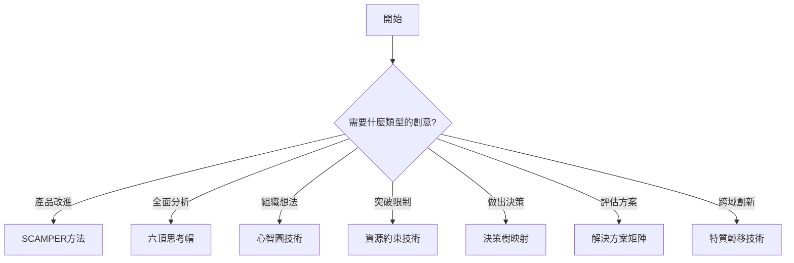

# 05-Structured 結構化技術類別

結構化腦力激盪技術提供明確的框架和步驟，使團隊能夠系統化地產生創意。這些技術易於學習、執行一致，特別適合需要標準化流程的組織環境。

## 類別特色

- **框架明確**：每個技術都有清晰的結構和步驟
- **易於執行**：不需要特殊訓練即可上手
- **團隊友善**：適合團隊協作和統一使用
- **可重複性**：結果穩定，流程可標準化
- **普遍適用**：適合多種問題類型和產業

## 技術列表

### 1. [SCAMPER方法](./01-scamper-method.md)
七個創意鏡頭系統，通過替代、合併、調整、修改、他用、消除、重組來激發創意。

**關鍵詞**：創意檢查清單、產品創新、系統性思考

### 2. [六頂思考帽](./02-six-thinking-hats.md)
Edward de Bono的經典方法，通過六種思考模式全面探索問題。

**關鍵詞**：平行思考、角色切換、全面分析

### 3. [心智圖技術](./03-mind-mapping.md)
Tony Buzan的視覺化思考工具，以放射狀結構組織和擴展想法。

**關鍵詞**：視覺思考、關聯性、創意擴散

### 4. [資源約束技術](./04-resource-constraints.md)
通過刻意限制資源來激發創造性解決方案。

**關鍵詞**：創意約束、逆向思考、突破限制

### 5. [決策樹映射](./05-decision-tree-mapping.md)
系統化地映射決策路徑和可能結果。

**關鍵詞**：決策分析、路徑規劃、風險評估

### 6. [解決方案矩陣](./06-solution-matrix.md)
多維度評估和比較不同解決方案。

**關鍵詞**：系統評估、優先排序、權衡分析

### 7. [特質轉移技術](./07-trait-transfer.md)
將一個領域的特質轉移應用到另一個領域。

**關鍵詞**：跨域創新、類比思考、特性借用

## 使用指南

### 選擇合適的技術

### 技術組合建議

#### 產品創新流程
1. **心智圖** → 發散思考，收集所有想法
2. **SCAMPER** → 系統性改進每個方向
3. **解決方案矩陣** → 評估和選擇最佳方案

#### 策略決策流程
1. **六頂思考帽** → 多角度分析問題
2. **決策樹映射** → 規劃可能路徑
3. **資源約束** → 測試方案韌性

#### 跨領域創新流程
1. **特質轉移** → 借用其他領域特性
2. **SCAMPER** → 系統性調整和組合
3. **六頂思考帽** → 全面評估可行性

## 實施建議

### 團隊準備
- 提前分享技術說明文件
- 準備必要的工具和材料
- 設定明確的時間框架
- 指定引導者和記錄者

### 執行原則
1. **嚴格遵循結構**：不要跳過步驟
2. **充分利用時間**：每個階段都要深入
3. **鼓勵參與**：確保所有人都發言
4. **記錄完整**：捕捉所有想法和洞察
5. **及時總結**：每個階段結束後回顧

### 常見陷阱
- 過早評判想法（特別是心智圖和SCAMPER）
- 混淆思考模式（特別是六頂思考帽）
- 結構過於僵化，失去創意空間
- 時間分配不當，某些步驟過於倉促

## 效果評估

### 量化指標
- **想法數量**：產生的獨特想法總數
- **想法質量**：可行且創新的想法比例
- **參與度**：團隊成員的參與均衡度
- **時間效率**：達成目標所需的時間

### 質性評估
- 團隊對過程的滿意度
- 想法的創新程度
- 解決方案的實用性
- 對問題理解的深度

## 進階應用

### 技術混搭
結合多種技術創造新的工作流程：
- **SCAMPER + 心智圖**：視覺化展示七個鏡頭的探索結果
- **六頂思考帽 + 決策樹**：用不同思考模式評估每個決策點
- **資源約束 + 特質轉移**：在限制下尋找跨域解決方案

### 數位工具整合
- Miro/Mural：視覺化協作平台
- XMind/MindMeister：專業心智圖工具
- Lucidchart：決策樹和流程圖
- Airtable：解決方案矩陣和評估

## 延伸學習

### 推薦書籍
1. "Thinkertoys" by Michael Michalko（SCAMPER和多種技術）
2. "Six Thinking Hats" by Edward de Bono（六頂思考帽）
3. "The Mind Map Book" by Tony Buzan（心智圖）
4. "Beautiful Constraint" by Adam Morgan & Mark Barden（資源約束）

### 線上資源
- Miro Templates：各種結構化技術的模板
- Strategyzer：商業模式和價值主張工具
- Decision School：決策分析學習資源

## 相關類別

- [01-Collaborative 協作技術](../01-collaborative/) - 團隊協作方法
- [02-Creative 創意技術](../02-creative/) - 發散性創意技術
- [03-Deep 深度技術](../03-deep/) - 深入探索技術

---

**類別維護者**：BMAD Team
**最後更新**：2025-12-30
**版本**：1.0.0
