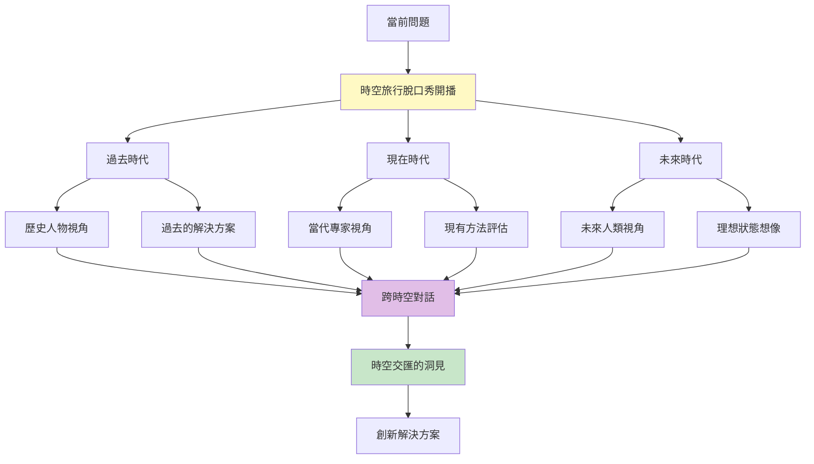
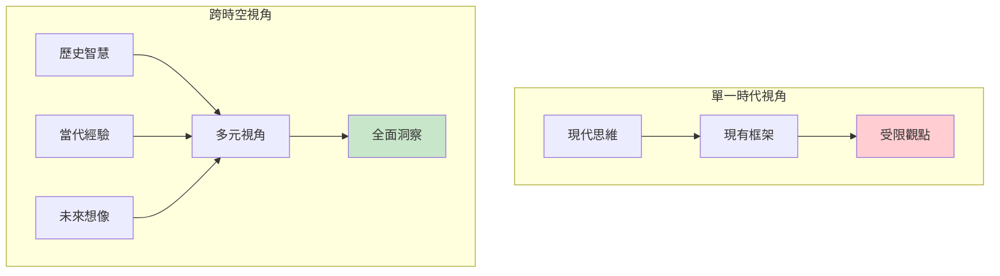
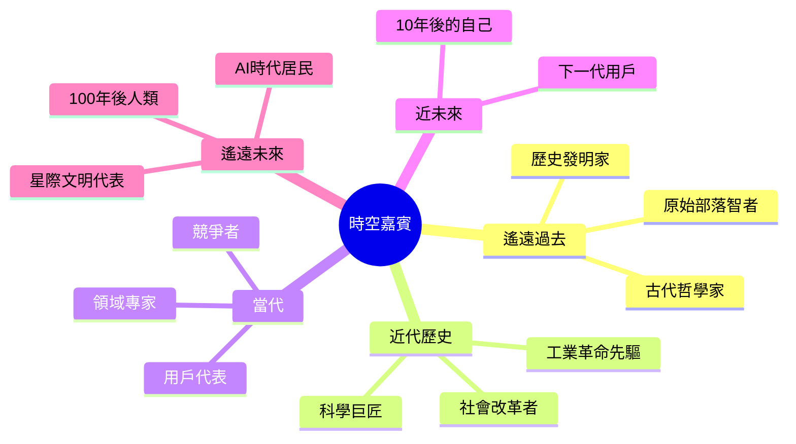
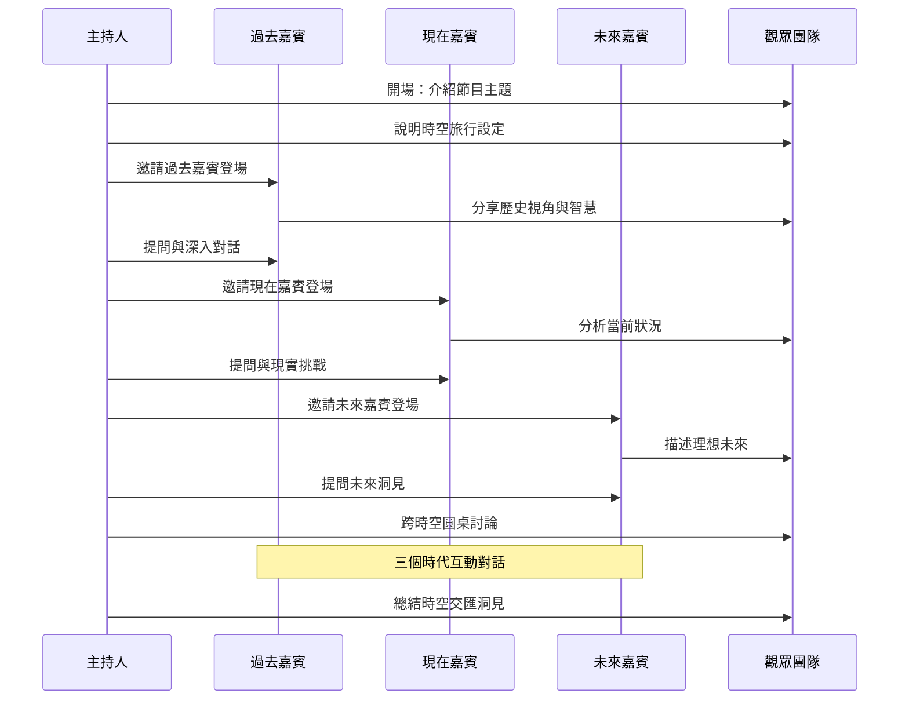
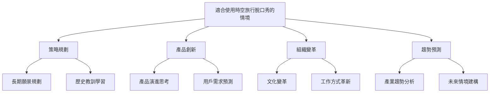
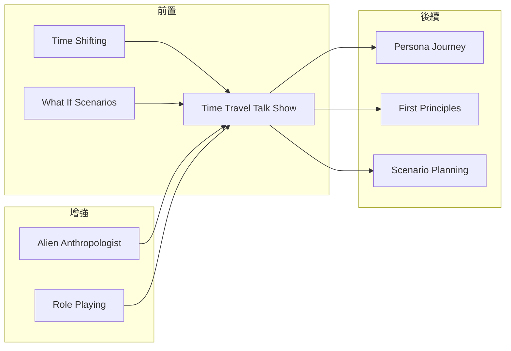

# Time Travel Talk Show

> 時空旅行脫口秀 - 穿梭時空的創意訪談

## 基本資訊

| 屬性 | 值 |
|------|-----|
| 類別 | Theatrical |
| 能量等級 | 高 |
| 建議時長 | 30-45 分鐘 |
| 參與人數 | 3-12 人 |
| 難度 | 中 |

## 技術概述

**Time Travel Talk Show**（時空旅行脫口秀）是一種結合角色扮演與時間旅行概念的腦力激盪技術。參與者模擬一場跨時空的訪談節目，邀請來自過去、現在、未來的「嘉賓」，從不同時代的視角探討當前問題，獲得歷史智慧與未來洞見。

## 歷史背景

這個技術融合了訪談節目的互動性、時間旅行的想像力、以及角色扮演的投入感。靈感來自於經典脫口秀節目的對話形式，以及科幻作品中時空穿梭的概念，創造出既有趣又富洞察力的腦力激盪方式。

## 核心原理

### 為什麼時空旅行訪談有效？

### 關鍵原則

1. **時代跨度**
   - 涵蓋過去、現在、未來
   - 每個時代提供獨特視角
   - 時空對話產生火花

2. **角色投入**
   - 深入扮演時代角色
   - 使用時代特有的思維
   - 保持角色一致性

3. **主持人引導**
   - 串聯不同時空的觀點
   - 引導深度對話
   - 總結跨時空洞見

## 時空嘉賓類型

## 執行步驟

### 詳細步驟

#### 第一階段：節目準備（10分鐘）

1. **選擇節目主題**
   - 明確要探討的問題或挑戰
   - 例：「未來的工作型態」

2. **分配角色**
   - 主持人（1人）：引導對話
   - 過去嘉賓（1-2人）：歷史視角
   - 現在嘉賓（1-2人）：當代觀點
   - 未來嘉賓（1-2人）：未來想像
   - 觀眾（其他人）：提問與記錄

3. **時空設定**
   - 過去：選擇具體時代（如 1920年代、文藝復興）
   - 未來：設定時間點（如 2050年、2100年）

#### 第二階段：時空訪談（25-30分鐘）

**開場（3分鐘）**
- 主持人介紹節目主題
- 營造脫口秀氣氛
- 說明時空旅行情境

**過去時代訪談（8分鐘）**
- 嘉賓登場自我介紹
- 主持人提問：「在您的時代，如何看待這個問題？」
- 分享歷史智慧與經驗
- 觀眾提問

**現在時代訪談（8分鐘）**
- 嘉賓分析當前狀況
- 討論現有解決方案
- 面對的挑戰與限制
- 觀眾提問

**未來時代訪談（8分鐘）**
- 嘉賓描述未來場景
- 分享問題如何被解決
- 未來視角的建議
- 觀眾提問

**跨時空圓桌（5-8分鐘）**
- 三個時代嘉賓互動對話
- 主持人引導比較與對比
- 尋找跨時空的共同智慧

#### 第三階段：洞見總結（5-10分鐘）

1. **主持人總結**
   - 整理跨時空的關鍵洞見
   - 找出可行的創新方向

2. **團隊討論**
   - 哪些歷史智慧可以應用？
   - 未來願景如何啟發當下？
   - 具體行動方案

## 引導提示與對話範例

### 主持人開場範例

> 「歡迎來到《時空交匯》訪談節目！今天我們將進行一場跨越時空的對話，探討『遠距工作的未來』。我們邀請了來自 1950年代的辦公室經理、2024年的數位遊牧工作者、以及 2070年的全息工作者。讓我們開始這趟奇妙的時空之旅！」

### 過去嘉賓訪談範例

**主持人：** 「歡迎來自 1950年代的辦公室經理！在您的時代，工作是什麼樣子？」

**過去嘉賓（進入角色）：** 「在我們那個年代，工作就是每天早上 9 點準時打卡，在同一間辦公室工作到下午 5 點。所有同事都在同一個空間，有問題隨時可以面對面討論。雖然通勤辛苦，但那種團隊凝聚力是很強的...」

### 未來嘉賓訪談範例

**主持人：** 「來自 2070年的朋友，在您的時代，人們如何工作？」

**未來嘉賓：** 「在我們的時代，物理辦公室已經很罕見了。我們使用全息投影技術，可以瞬間『出現』在任何虛擬工作空間。AI 助手處理大部分例行工作，人類專注於創意和情感智慧相關的任務。工作和生活的界線已經重新定義...」

### 跨時空對話範例

**主持人：** 「有趣！1950年代重視的面對面互動，和 2070年的全息技術，似乎都在追求『連結』。現在的數位遊牧者，你怎麼看？」

**現在嘉賓：** 「確實！我們正處於轉型期。我們用 Zoom、Slack 嘗試複製面對面的連結，但還沒達到全息技術的沉浸感...」

## 問題引導清單

### 給過去嘉賓的問題
- 在您的時代，這個問題是如何解決的？
- 當時的限制條件是什麼？
- 有什麼智慧或原則至今仍然適用？
- 如果用當時的資源，您會建議什麼？

### 給現在嘉賓的問題
- 目前最大的挑戰是什麼？
- 現有的解決方案有哪些？
- 什麼阻礙了我們前進？
- 我們正在往哪個方向發展？

### 給未來嘉賓的問題
- 在未來，這個問題還存在嗎？
- 如果已解決，是如何解決的？
- 未來回看現在，我們忽略了什麼？
- 您會給現在的我們什麼建議？

### 跨時空對話問題
- 三個時代有什麼共同點？
- 最大的差異在哪裡？
- 如何結合歷史智慧與未來願景？
- 當下應該採取什麼行動？

## 適用場景

## 注意事項

### Do's（應該做）
- **充分準備角色背景**
  - 研究所選時代的特徵
  - 思考該時代的價值觀與限制

- **鼓勵深入扮演**
  - 用第一人稱說話
  - 保持角色一致性
  - 投入情感與想像

- **主持人積極引導**
  - 提出深入問題
  - 串聯不同觀點
  - 控制時間節奏

- **記錄跨時空洞見**
  - 標記歷史智慧
  - 記錄未來啟發
  - 整理可行方案

### Don'ts（不應該做）
- 太早跳出角色
- 只停留在表面對話
- 忽略某個時代的觀點
- 忘記連結回當前問題

## 變體技術

### 1. 專家時空訪談
- 邀請特定歷史人物
- 例：達文西、愛迪生、賈伯斯
- 更聚焦的專業視角

### 2. 多重未來訪談
- 設定多個未來情境
- 樂觀未來 vs 悲觀未來
- 探索不同可能性

### 3. 時空辯論賽
- 不同時代嘉賓進行辯論
- 「過去的方法更好」vs「未來才是答案」
- 激發深度思考

### 4. 時光膠囊訪談
- 從現在寄信給未來
- 從未來回信給現在
- 書面形式的時空對話

## 與其他技術的結合

## 案例研究

### 案例一：電商平台的未來策略

**主題：** 電商購物體驗的演進

**時空嘉賓：**
- 1990年代：實體百貨公司經理
- 2024年：電商產品經理
- 2050年：AI 購物助理設計師

**關鍵洞見：**
- 過去：個人化服務的重要性（導購員的價值）
- 現在：便利性與選擇多樣性的平衡
- 未來：AI 預測需求 + 沉浸式購物體驗

**行動方案：**
結合過去的「人性化服務」、現在的「數據分析」、未來的「預測性推薦」，開發新一代 AI 購物顧問功能。

### 案例二：遠距工作文化建立

**主題：** 如何建立遠距團隊文化

**時空嘉賓：**
- 1960年代：傳統企業 CEO
- 2024年：遠距工作倡導者
- 2080年：全球分散式組織領導者

**關鍵洞見：**
- 儀式感與歸屬感是跨時代的需求
- 技術改變形式，但人性需求不變
- 未來：異步協作成為常態

## 工具推薦

### 時代卡片組

| 時代 | 特徵 | 關鍵問題 |
|------|------|----------|
| 古代 | 智慧、哲學、簡單 | 本質是什麼？ |
| 工業時代 | 效率、系統、規模 | 如何優化？ |
| 資訊時代 | 連結、數據、速度 | 如何整合？ |
| AI 時代 | 智能、預測、個人化 | 如何增強人性？ |
| 後人類時代 | 融合、超越、新定義 | 什麼是永恆的？ |

### 角色準備表

**角色：** _____________（例：2070年的教育工作者）

**時代背景：**
- 科技發展：_______________
- 社會結構：_______________
- 價值觀：_______________

**關鍵觀點：**
1. _______________
2. _______________
3. _______________

**可能的建議：**
- _______________
- _______________

## 研究支持

心理學研究顯示：
- **時間旅行想像**能激活大腦的情景記憶系統
- **角色扮演**增強同理心和視角轉換能力
- **對話形式**促進社會學習和集體智慧湧現
- **跨時空視角**打破當下偏見，提升策略思考

## 參考資源

- [Future Hindsight Technique](https://www.interaction-design.org/literature/article/learn-how-to-use-the-best-ideation-methods-future-hindsight)
- [Time Travel Brainstorming](https://www.sessionlab.com/methods/time-travel-brainstorming)
- [Role-Playing in Design Thinking](https://www.designthinking.org.au/role-playing)

---

*返回 [Theatrical 類別](./index.md) | [技術總覽](../index.md)*
