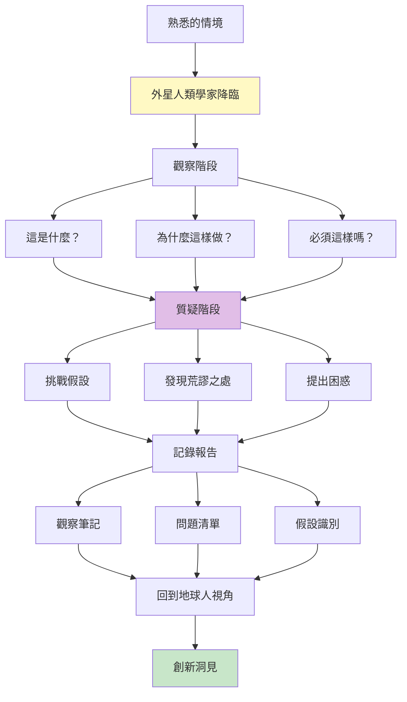
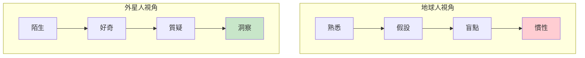
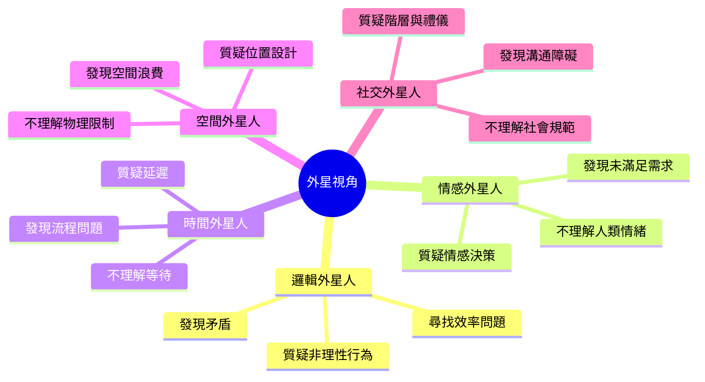
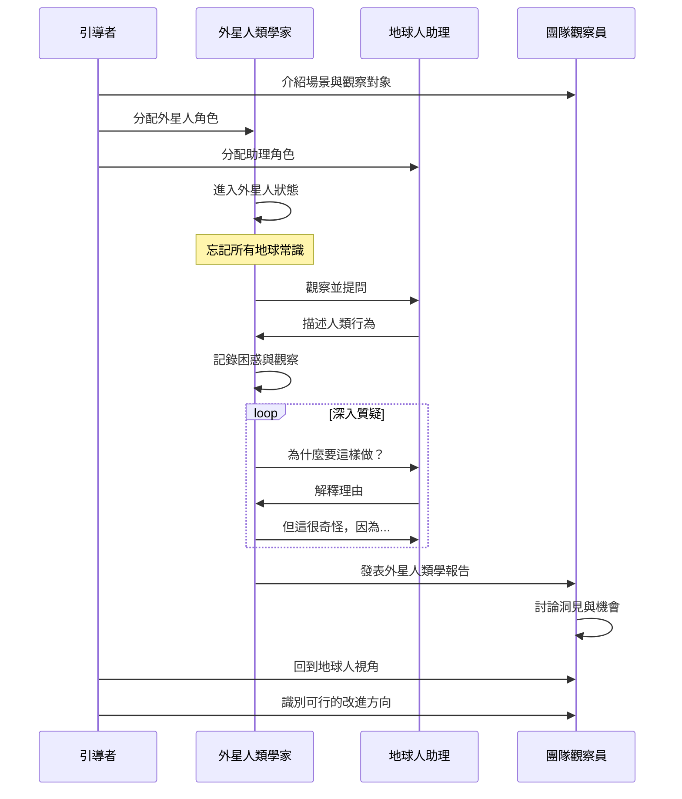
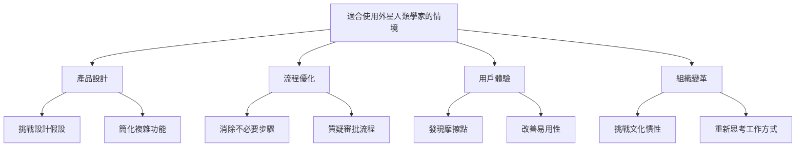
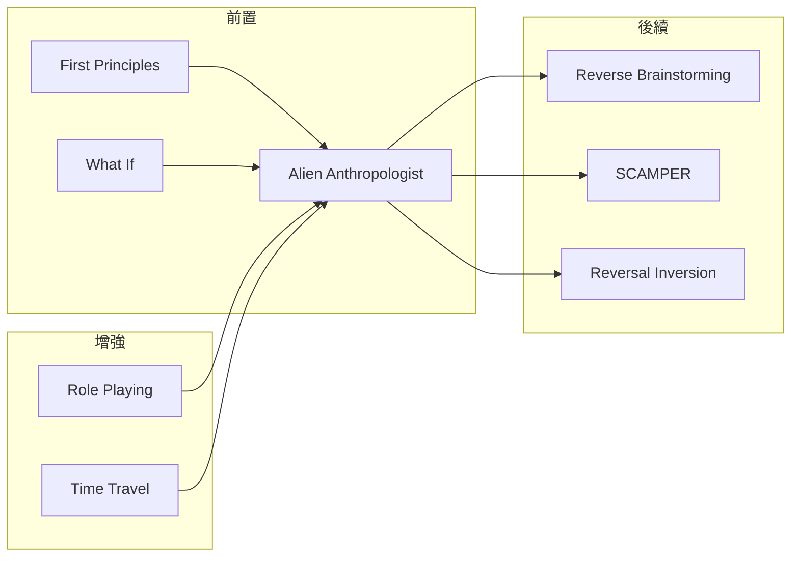

# Alien Anthropologist

> 外星人類學家 - 用完全陌生的眼光重新觀察

## 基本資訊

| 屬性 | 值 |
|------|-----|
| 類別 | Theatrical |
| 能量等級 | 中 |
| 建議時長 | 25-35 分鐘 |
| 參與人數 | 2-10 人 |
| 難度 | 中 |

## 技術概述

**Alien Anthropologist**（外星人類學家）是一種透過扮演外星訪客來觀察人類行為與系統的技術。參與者假裝自己是第一次接觸地球文明的外星人類學家，用完全陌生、不帶任何假設的眼光來觀察和質疑一切「理所當然」的事物，從而發現隱藏的盲點和創新機會。

## 歷史背景

這個技術源自人類學的「文化相對主義」概念，以及設計思維中的「初心者心態」（Beginner's Mind）。通過假裝完全不理解某個系統，我們能夠質疑那些「因為一直都這樣」的做法，發現改進機會。IDEO 和其他設計公司經常使用類似技術來挑戰產品設計的既有假設。

## 核心原理

### 為什麼外星視角有效？

### 關鍵原則

1. **零假設思維**
   - 不預設任何「常識」
   - 質疑一切「理所當然」
   - 像孩子一樣不斷問「為什麼」

2. **純粹觀察**
   - 描述行為而非解釋
   - 記錄現象而非判斷
   - 發現模式與異常

3. **好奇而非批判**
   - 保持真誠的困惑
   - 避免價值判斷
   - 尋求理解而非評價

## 外星人類學家的視角類型

## 執行步驟

### 詳細步驟

#### 第一階段：準備與設定（5分鐘）

1. **選擇觀察對象**
   - 產品使用流程
   - 工作流程
   - 客戶體驗
   - 組織文化
   - 溝通模式

2. **分配角色**
   - 外星人類學家（1-3人）：提問與觀察
   - 地球人助理（1-2人）：解釋人類行為
   - 觀察員（其他人）：記錄洞見

3. **設定外星人背景**
   - 來自哪個星球？（可以設定特色）
   - 那裡的生活方式如何？
   - 有什麼完全不同的概念？

#### 第二階段：外星觀察（15-20分鐘）

**觀察與質疑循環：**

1. **外星人觀察**
   - 「我觀察到地球人在做 X...」
   - 純粹描述，不加解釋

2. **外星人困惑**
   - 「這很奇怪/不合邏輯，因為...」
   - 「在我的星球，我們...」

3. **地球人解釋**
   - 「我們這樣做是因為...」
   - 嘗試解釋理由

4. **外星人深入質疑**
   - 「但為什麼一定要...？」
   - 「有沒有其他方式...？」
   - 「如果不這樣會怎樣？」

5. **記錄發現**
   - 假設清單
   - 矛盾之處
   - 改進機會

#### 第三階段：報告與洞見（10分鐘）

1. **外星人類學報告**
   - 外星人整理觀察報告
   - 列出最困惑的 5-10 個現象
   - 提出替代方案的想像

2. **回到地球人視角**
   - 團隊討論哪些質疑有道理
   - 識別真正的假設與限制
   - 找出創新機會

3. **行動方案**
   - 可以打破哪些假設？
   - 可以簡化哪些流程？
   - 可以重新設計什麼？

## 引導提示與對話範例

### 場景：觀察「會議」這個人類儀式

**外星人類學家：** 「請問，我觀察到地球人會定期聚集在一個房間裡，坐著不動很長時間。這是某種宗教儀式嗎？」

**地球人助理：** 「不，這叫做『會議』，是我們討論工作的方式。」

**外星人：** 「有趣！但我觀察到，大部分地球人在這期間都在看他們的小型光屏設備，而不是互相交流。這是為什麼？」

**助理：** 「嗯...有時候會議內容跟某些人無關，或者他們在處理其他工作...」

**外星人：** 「那為什麼這些地球人要參加呢？為什麼不讓相關的人進行小型交流就好？」

**助理：** 「這個...因為大家都習慣定期開會，而且可以確保資訊同步...」

**外星人：** 「但如果大部分人都在做別的事，資訊真的有同步嗎？還有，我觀察到這些會議經常延長，超過原定時間。時間在地球上不寶貴嗎？」

**助理：** 「當然寶貴！但有時候討論需要時間...」

**外星人：** 「我注意到會議前沒有人準備，會議中花很多時間討論應該事先決定的事。在我的星球，我們會先個別準備，然後只花很短時間做最終決策。為什麼地球人不這樣做？」

**助理：** 「你說的有道理...我們確實可以改進會議效率...」

---

### 場景：觀察「電子郵件」

**外星人：** 「地球人發明了即時通訊技術，但我觀察到他們還在使用一種叫『電子郵件』的古老系統。這些訊息需要地球人主動去『檢查』，而不是自動通知。為什麼？」

**助理：** 「郵件比較正式，而且可以保留記錄...」

**外星人：** 「但我看到地球人每天要檢查郵件幾十次，甚至上百次。這似乎產生了焦慮和干擾。如果真的重要，為什麼不直接通知呢？如果不重要，為什麼要頻繁檢查？」

**助理：** 「因為...怕錯過重要訊息...」

**外星人：** 「所以地球人創造了一個系統，強迫他們持續焦慮地檢查，以免錯過可能根本不存在的重要訊息？這在我的星球被稱為『自我折磨裝置』。」

## 外星人類學家的觀察清單

### 產品/服務觀察

- 為什麼需要這麼多步驟？
- 為什麼用戶必須學習使用方法？
- 為什麼不能自動完成？
- 為什麼需要說明書？
- 為什麼要重複輸入相同資訊？
- 為什麼要等待？
- 為什麼有這麼多選項？
- 為什麼錯誤訊息不能直接告訴如何修正？

### 流程觀察

- 為什麼需要審批？
- 為什麼不能並行處理？
- 為什麼要交接給另一個人？
- 為什麼要填寫表格？
- 為什麼要開會討論這個？
- 為什麼要等到下週？

### 組織文化觀察

- 為什麼要準時到達但可以晚離開？
- 為什麼要寄送抄送很多人的郵件？
- 為什麼要在辦公室才算工作？
- 為什麼職稱這麼重要？
- 為什麼要穿特定服裝？

## 適用場景

## 注意事項

### Do's（應該做）

- **完全投入角色**
  - 真正忘記「常識」
  - 保持天真的好奇心
  - 用外星人的語氣說話

- **專注觀察而非批判**
  - 表達困惑而非批評
  - 尋求理解而非指責
  - 保持幽默和輕鬆

- **深入追問「為什麼」**
  - 至少問 5 次為什麼
  - 不接受「一直都這樣」的答案
  - 追問到根本假設

- **記錄所有觀察**
  - 困惑的點
  - 發現的矛盾
  - 替代方案的想像

### Don'ts（不應該做）

- 太快回到地球人視角
- 接受第一層解釋就停止
- 變成單純的批評
- 忽略情感與社會因素（除非你扮演的是情感外星人）

## 變體技術

### 1. 特定星球外星人

**效率星球外星人**
- 極度重視效率
- 質疑所有浪費時間的行為
- 「為什麼不自動化？」

**和諧星球外星人**
- 重視關係與情感
- 質疑冷冰冰的系統
- 「這讓人感覺如何？」

**邏輯星球外星人**
- 純粹理性思考
- 質疑所有非理性行為
- 「這符合邏輯嗎？」

### 2. 外星人用戶測試
- 外星人嘗試使用產品
- 記錄所有困惑的地方
- 真實反映易用性問題

### 3. 外星人影子觀察
- 外星人跟隨地球人一天
- 觀察所有日常行為
- 質疑每個習慣動作

### 4. 反向外星人
- 地球人向外星人解釋
- 在解釋過程中發現荒謬
- 「說出來就發現不合理」

## 與其他技術的結合

## 案例研究

### 案例一：Amazon 的一鍵購買

**外星人困惑：** 「為什麼地球人購物需要填寫這麼多表格？地址、付款方式、確認...每次都要重複？」

**洞見：** 這個質疑啟發了「一鍵購買」功能的概念。系統應該記住用戶資訊，而不是每次都要求重新輸入。

### 案例二：Slack 的設計哲學

**外星人困惑：** 「為什麼地球人要在郵件和即時通訊之間選擇？為什麼不能根據情境自動選擇最適合的溝通方式？」

**洞見：** 這導致 Slack 整合了即時訊息、檔案分享、搜尋等多種功能，消除了工具切換的需求。

### 案例三：醫院流程改善

**外星人觀察：** 「病人為什麼要在這麼多不同的房間之間移動？為什麼要重複告訴不同的地球人相同的症狀？為什麼要等這麼久？」

**洞見：** 許多醫院重新設計流程，讓醫護人員流動而非病人流動，整合病歷系統減少重複詢問，優化排程減少等待時間。

## 外星人類學家工具包

### 觀察記錄表

| 觀察到的行為 | 外星人困惑 | 地球人解釋 | 深層假設 | 改進機會 |
|-------------|-----------|-----------|---------|---------|
| 例：每天開晨會 | 為什麼每天都要聚集？ | 同步資訊 | 假設：面對面是唯一同步方式 | 可以用異步方式+ 偶爾面對面 |
| | | | | |

### 「為什麼」階梯

1. **現象：** ___________
2. **為什麼？** ___________
3. **為什麼？** ___________
4. **為什麼？** ___________
5. **為什麼？** ___________
6. **根本假設：** ___________

### 外星替代方案

**地球做法：** ___________

**外星人觀察的問題：** ___________

**在外星人的星球會怎麼做：**
- 方案一：___________
- 方案二：___________
- 方案三：___________

**可以借鑑的元素：** ___________

## 研究支持

認知心理學研究顯示：
- **去熟悉化**（Defamiliarization）能夠打破認知偏見
- **初心者心態**提升創造力和問題發現能力
- **角色扮演**增強視角轉換和同理心
- **持續質疑**能夠揭示深層假設和盲點

## 設計模式與方法論對照

| 相關模式/方法論 | 連結點 | 應用價值 |
|----------------|--------|----------|
| **Defamiliarization** | 俄國形式主義Shklovsky | 陌生化讓熟悉事物重新被看見 |
| **Beginner's Mind (初心)** | 禪宗概念、設計思維 | 放下專家偏見的核心心法 |
| **Ethnographic Research** | 文化人類學方法 | 觀察而非判斷的研究態度 |
| **First Principles Thinking** | 從根本質疑的思維 | 打破「一直都這樣做」的慣性 |
| **Five Whys** | 豐田生產系統 | 連續追問揭示根本假設 |
| **Fresh Eyes Review** | 品質管理方法 | 用新人視角檢視流程問題 |

**核心洞察**：Alien Anthropologist的威力在於「系統性的天真」——這不是真正的無知，而是刻意選擇「忘記」我們認為理所當然的事物。人類學家Margaret Mead說：「永遠記得你是獨特的，就像其他每個人一樣。」外星人視角翻轉了這句話：「永遠記得你的『正常』是奇異的，就像每個文化的正常一樣。」當我們用外星人的困惑來面對自己的系統，那些隱藏在「常識」中的荒謬就會浮現，而每個荒謬都是一個創新機會。

## 參考資源

- [IDEO Method Cards: Unfocus Eyes](https://www.ideo.com/post/method-cards)
- [Beginner's Mind in Design Thinking](https://www.interaction-design.org/literature/article/design-thinking-getting-started-with-empathy)
- [Ethnographic Research Methods](https://www.nngroup.com/articles/ethnographic-research/)
- [Martian Anthropologist Exercise](https://www.liberatingstructures.com/)

---

*返回 [Theatrical 類別](./index.md) | [技術總覽](../index.md)*
