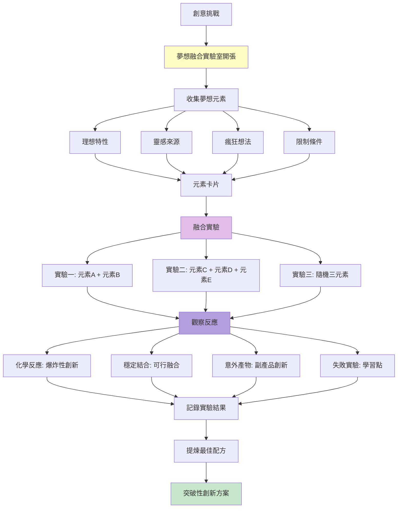
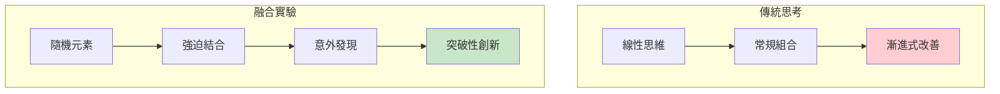
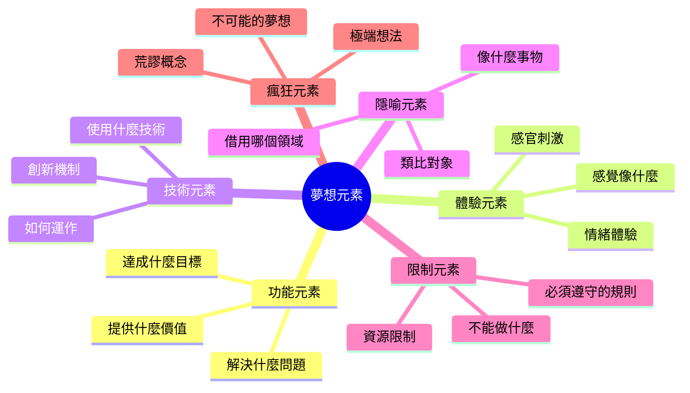
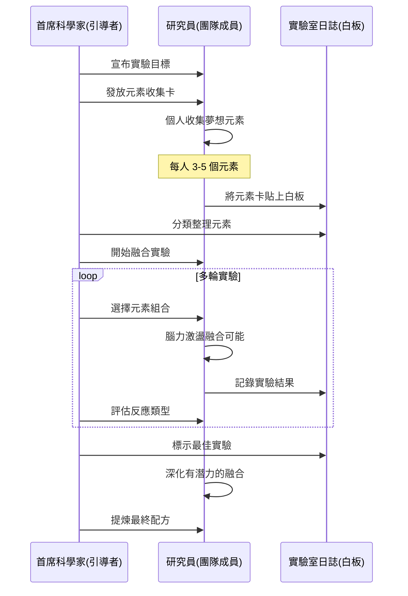
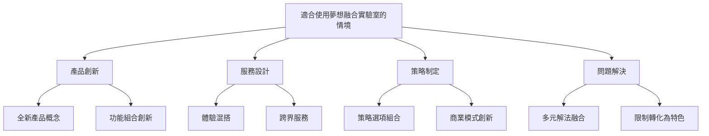
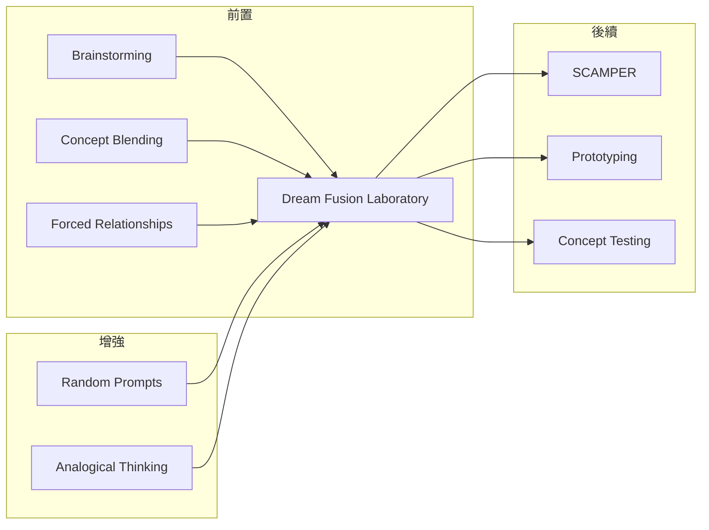

# Dream Fusion Laboratory

> 夢想融合實驗室 - 在創意熔爐中煉製突破性創新

## 基本資訊

| 屬性 | 值 |
|------|-----|
| 類別 | Theatrical |
| 能量等級 | 高 |
| 建議時長 | 35-50 分鐘 |
| 參與人數 | 4-12 人 |
| 難度 | 中-高 |

## 技術概述

**Dream Fusion Laboratory**（夢想融合實驗室）是一種將腦力激盪轉化為科學實驗遊戲的創意技術。參與者扮演「瘋狂科學家」，在虛擬的實驗室中進行「夢想元素」的混合實驗，透過隨機組合、化學反應式的創意碰撞，產生意想不到的創新概念。



## 歷史背景

這個技術受到「隨機刺激」（Random Stimuli）、「強迫連結」（Forced Connections）和遊戲化設計的啟發。將創意過程比喻為科學實驗，降低了「想出好點子」的壓力，讓參與者更願意嘗試大膽的組合。IDEO、frog design 等創新公司常用類似的「混搭」技巧來產生突破性概念。

## 核心原理

### 為什麼夢想融合有效？



### 關鍵原則

1. **遊戲化心態**
   - 這是「實驗」，不是「正確答案」
   - 允許失敗，從失敗中學習
   - 保持玩心與好奇

2. **強迫連結**
   - 隨機組合看似無關的元素
   - 大腦自動尋找意義
   - 產生創新連結

3. **化學反應思維**
   - 元素混合 ≠ 簡單加法
   - 尋找「化學反應」的火花
   - 產物可能完全不同於原料

4. **多樣性原則**
   - 元素越多樣，可能性越豐富
   - 跨領域元素產生最佳火花
   - 包含矛盾元素增加張力

## 夢想元素類型



## 執行步驟



### 詳細步驟

#### 第一階段：實驗準備（10-15分鐘）

1. **設定實驗目標**
   - 明確定義要解決的問題或探索的機會
   - 例：「創造下一代學習體驗」

2. **角色設定**
   - 首席科學家（引導者）
   - 研究員（參與者）
   - 實驗室助理（記錄者）

3. **收集夢想元素**
   - 給每人 5-10 張卡片
   - 個人靜默收集（5分鐘）
   - 可以參考元素類型清單

**元素收集提示：**
- 功能元素：「如果能自動適應學習速度」
- 體驗元素：「感覺像玩遊戲一樣有趣」
- 技術元素：「使用 AI 個人化導師」
- 隱喻元素：「像健身教練對待運動」
- 限制元素：「不需要網路也能用」
- 瘋狂元素：「直接把知識下載到大腦」

4. **元素池建立**
   - 所有元素卡貼到白板
   - 首席科學家快速分類
   - 建立「元素週期表」

#### 第二階段：融合實驗（20-25分鐘）

**實驗輪次：**

**第一輪：配對實驗（10分鐘）**
- 隨機抽取兩個元素
- 小組討論：「如果這兩個元素融合會怎樣？」
- 記錄融合概念
- 評估反應類型

**第二輪：三元融合（10分鐘）**
- 隨機抽取三個元素
- 更複雜的融合挑戰
- 尋找化學反應的火花

**第三輪：定向實驗（5分鐘）**
- 科學家指定特定元素組合
- 針對有潛力的方向深化

**反應類型評估：**
```
💥 爆炸性反應：極具創新但需要馴化
🧪 穩定結合：可行且有價值
✨ 意外產物：副產品帶來新機會
❌ 失敗實驗：不可行但有學習價值
```

#### 第三階段：提煉配方（10分鐘）

1. **回顧所有實驗**
   - 檢視所有融合結果
   - 找出最有潛力的 3-5 個

2. **深化最佳實驗**
   - 選擇最佳融合概念
   - 團隊共同深化細節
   - 思考實現可能性

3. **記錄最終配方**
   - 配方名稱
   - 元素組成
   - 預期效果
   - 實現路徑

## 引導提示與對話範例

### 首席科學家開場範例

> 「歡迎來到夢想融合實驗室！今天我們的實驗目標是『創造讓人上癮的健康習慣養成產品』。在這個實驗室裡，沒有失敗的實驗，只有意外的發現！我們要像瘋狂科學家一樣，大膽混合各種不可能的元素，看看會產生什麼化學反應。準備好你們的護目鏡，我們要開始了！」

### 元素融合對話範例

**首席科學家：** 「好！第一個實驗：我們隨機抽到『遊戲化獎勵』和『社群壓力』。研究員們，如果這兩個元素融合，會產生什麼？」

**研究員 A：** 「嗯...遊戲化通常是正向激勵，社群壓力是負向推力...這兩個感覺會衝突？」

**研究員 B：** 「等等！如果我們把它們融合成『社群挑戰賽』呢？朋友之間相互挑戰，但用遊戲化的方式呈現，有排行榜、徽章、但也有團隊支持...」

**研究員 C：** 「像 Strava 那樣！你看到朋友跑步，會激勵你也去跑，但不是負面壓力，而是友善競爭！」

**首席科學家：** 「太好了！我們看到了化學反應！把負向的『壓力』轉化為正向的『激勵』。我評估這是一個 🧪 穩定結合！記錄下來：『友善競爭系統』。繼續下一個實驗...」

---

**首席科學家：** 「這次有點瘋狂...我們抽到『直接下載技能』、『冥想』和『不需要網路』三個元素。這...該怎麼融合？」

**研究員 D：** 「這太荒謬了吧...直接下載技能是科幻，冥想是傳統，不需網路是限制...」

**研究員 E：** 「等等...如果我們想像一種『離線技能訓練包』呢？像冥想一樣，你下載一個完整的引導程式到設備，然後可以在沒網路的地方，透過漸進式的練習和反饋，『感覺』像是在下載技能到大腦...」

**研究員 F：** 「對！而且冥想 app 本來就是這樣運作的—你離線練習，但感覺在『重新編程』你的大腦！」

**首席科學家：** 「哇！這是一個 💥 爆炸性反應！『離線神經可塑性訓練包』—聽起來既有科學依據又很酷！標記為高潛力實驗！」

## 實驗記錄表格

### 融合實驗記錄單

| 實驗# | 元素組合 | 融合概念 | 反應類型 | 潛力評分 | 備註 |
|------|---------|---------|---------|---------|------|
| 001 | 遊戲化 + 社群壓力 | 友善競爭系統 | 🧪 穩定 | ⭐⭐⭐⭐ | 參考 Strava |
| 002 | AI導師 + 手寫筆記 | 智能手寫分析 | ✨ 意外 | ⭐⭐⭐ | 新機會 |
| 003 | 直接下載 + 冥想 + 離線 | 離線技能訓練包 | 💥 爆炸 | ⭐⭐⭐⭐⭐ | 超創新 |

### 最終配方卡

```
配方名稱：_________________

元素組成：
□ _________________
□ _________________
□ _________________

融合機制：
_________________________

預期效果：
_________________________

實現難度：□ 低  □ 中  □ 高

下一步行動：
_________________________
```

## 適用場景



## 注意事項

### Do's（應該做）

- **營造實驗室氛圍**
  - 使用科學術語增加趣味
  - 鼓勵「瘋狂科學家」心態
  - 慶祝「爆炸性」發現

- **擁抱隨機性**
  - 真正隨機抽選元素
  - 不跳過「困難」的組合
  - 最怪異的組合往往最有價值

- **記錄所有實驗**
  - 包括失敗的融合
  - 意外產物可能很有價值
  - 過程中的笑話可能是洞見

- **深化有潛力的融合**
  - 不只停留在表面組合
  - 探索「化學反應」的機制
  - 思考實現的可能性

### Don'ts（不應該做）

- 太快評估可行性
- 只選擇「安全」的組合
- 忽略看似荒謬的融合
- 失去遊戲化的趣味性

## 變體技術

### 1. 主題實驗室

**生物實驗室**
- 元素是「基因」
- 培育「混種生物」
- 觀察「突變」

**廚房實驗室**
- 元素是「食材」
- 創造「創意料理」
- 調配「秘密配方」

**調酒實驗室**
- 元素是「材料」
- 混合「創意調酒」
- 測試「風味組合」

### 2. 定向融合實驗
- 預設某個核心元素
- 其他元素必須與之融合
- 更聚焦的創新

### 3. 限制實驗
- 必須使用恰好 N 個元素
- 必須包含某類型元素
- 增加創意挑戰

### 4. 連鎖反應實驗
- 實驗 A 的產物成為實驗 B 的元素
- 逐步演化的創新
- 觀察概念如何變異

## 與其他技術的結合



## 案例研究

### 案例一：Netflix 的創新配方

**元素融合：**
- 「電影租賃」+ 「訂閱制」+ 「無限制」
- 反應：💥 爆炸性創新
- 結果：顛覆整個產業

**進化融合：**
- 「訂閱串流」+ 「數據分析」+ 「原創內容」
- 反應：💥 再次爆炸
- 結果：從租賃到內容帝國

### 案例二：iPhone 的元素融合

**初始融合：**
- 「iPod」+ 「手機」+ 「網路瀏覽器」
- 「觸控螢幕」+ 「簡約設計」+ 「App 生態」

**化學反應：**
產生了一個全新類別，不只是功能的加總，而是完全改變了人與科技的互動方式。

### 案例三：Airbnb 的配方

**元素融合：**
- 「住宿」+ 「社群平台」+ 「在地體驗」
- 「閒置資源」+ 「信任機制」+ 「故事分享」

**意外產物：**
不只是住宿平台，而是「歸屬感」的創造者。

## 元素激發清單

### 產品設計元素
- 個人化
- 自動化
- 遊戲化
- 社群化
- AI 驅動
- 語音控制
- AR/VR
- 訂閱制
- 共享經濟
- 環保永續

### 體驗元素
- 驚喜
- 懷舊
- 高科技感
- 溫暖人性
- 專業權威
- 輕鬆有趣
- 奢華感
- 極簡主義
- 冒險刺激
- 安心療癒

### 隱喻元素
- 像健身教練
- 像私人管家
- 像遊樂園
- 像圖書館
- 像咖啡廳
- 像太空船
- 像花園
- 像實驗室

### 限制元素（轉化為特色）
- 預算有限 → 極簡主義
- 技術限制 → 人性化服務
- 時間緊迫 → 快速迭代
- 資源稀少 → 精緻專注

## 研究支持

創意研究指出：
- **遠距聯想**（Remote Association）是創造力的關鍵
- **強迫連結**能激活大腦的模式識別能力
- **遊戲化框架**降低評判焦慮，提升創意表現
- **隨機刺激**打破固定思維路徑

## 設計模式與方法論對照

| 相關模式/方法論 | 連結點 | 應用價值 |
|----------------|--------|----------|
| **Bisociation** | Arthur Koestler創意理論 | 兩個無關框架碰撞產生創新 |
| **Conceptual Blending** | Fauconnier & Turner | 認知語言學的概念融合理論 |
| **Forced Relationships** | 強迫連結技術 | 隨機組合打破固定思維路徑 |
| **Random Stimulation** | 橫向思維Edward de Bono | 隨機輸入激發新聯想 |
| **Synectics** | Gordon創意方法 | 「使陌生變熟悉、熟悉變陌生」 |
| **Morphological Analysis** | Fritz Zwicky | 系統化組合不同維度的可能性 |

**核心洞察**：Dream Fusion Laboratory的精髓是「創意煉金術」——正如煉金術士相信基本元素可以轉化成黃金，這個技術相信看似無關的概念可以融合成突破性創新。關鍵在於「化學反應」隱喻：元素A + 元素B ≠ A和B的簡單加總，而是產生全新的物質C。這就是為什麼最瘋狂的組合往往產生最有價值的結果——因為它們強迫大腦在毫無路徑的地方開闢新道路，而這正是真正創新發生的地方。

## 參考資源

- [Forced Relationships Technique](https://www.mycoted.com/Forced_Relationships)
- [Random Input Brainstorming](https://www.mindtools.com/pages/article/newCT_92.htm)
- [IDEO's Concept Blending](https://www.ideou.com/pages/brainstorming)
- [Gamification of Creativity](https://hbr.org/2013/09/how-to-make-brainstorming-fun)

---

*返回 [Theatrical 類別](./index.md) | [技術總覽](../index.md)*
