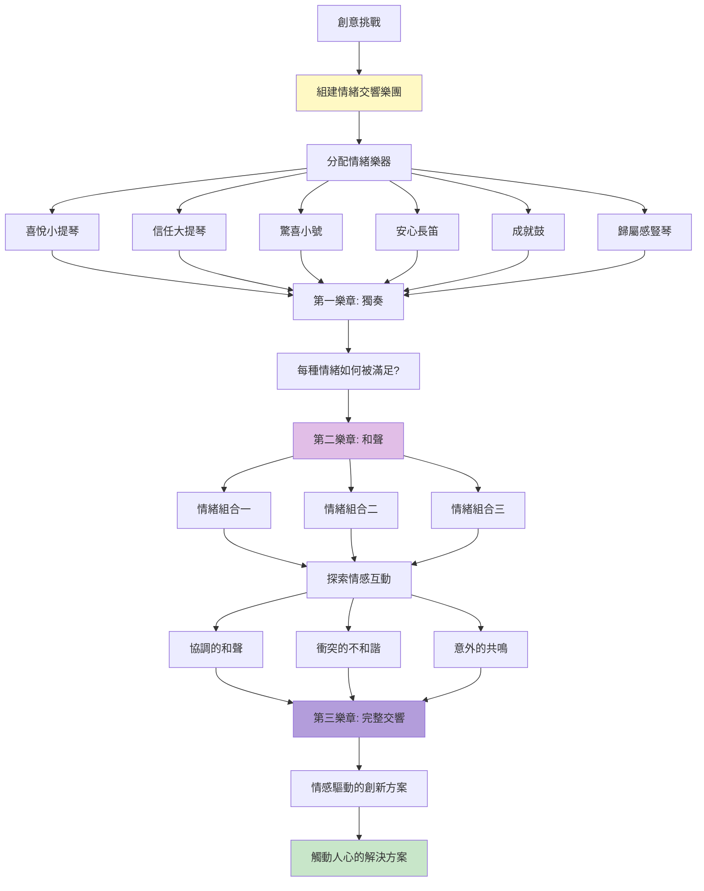
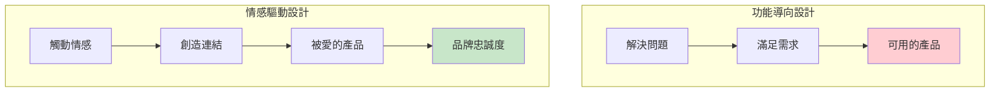
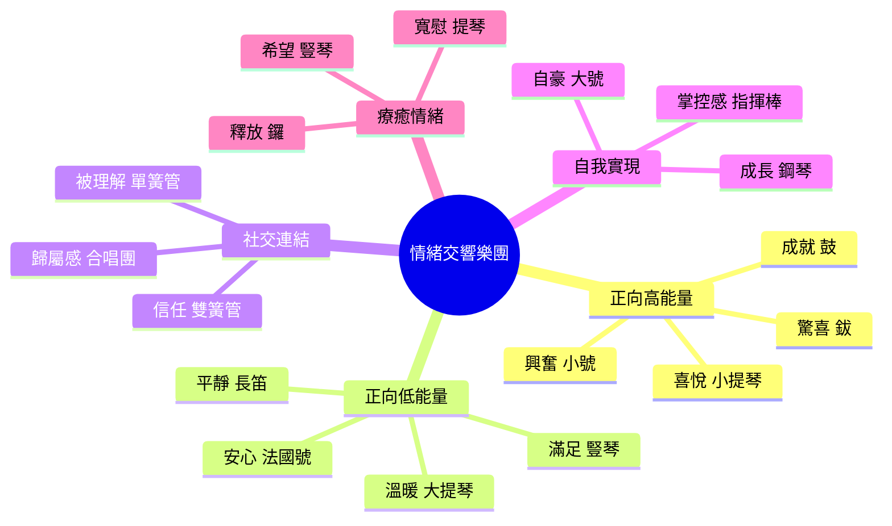
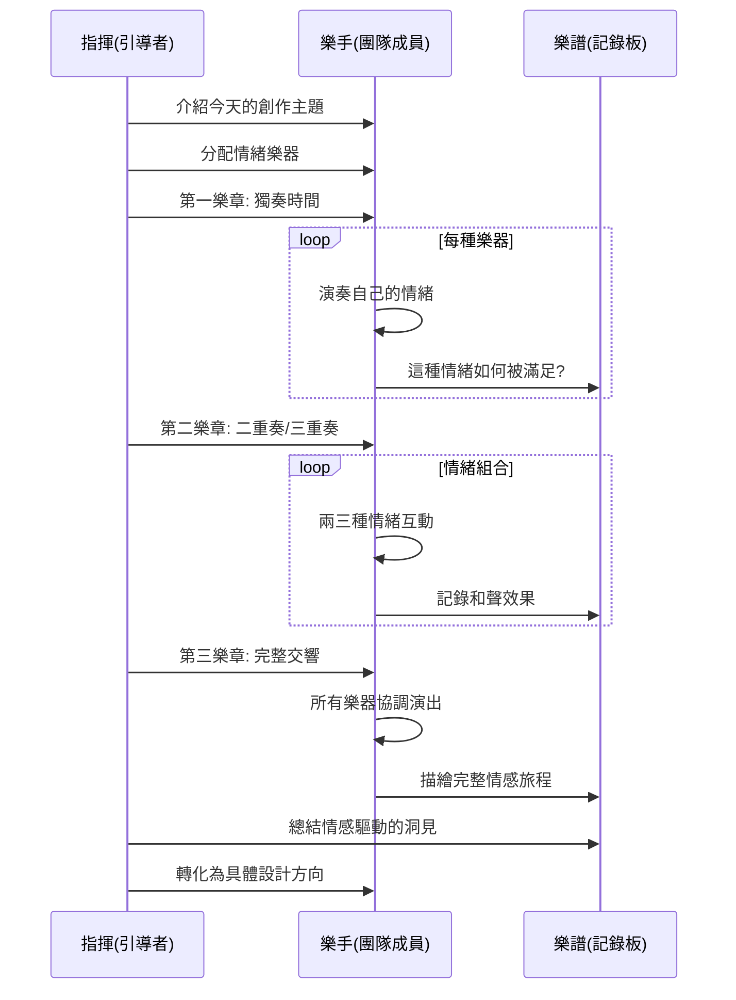
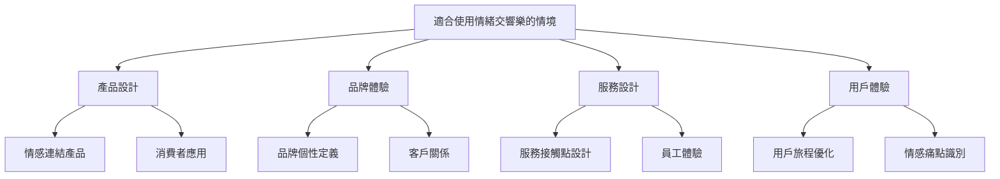
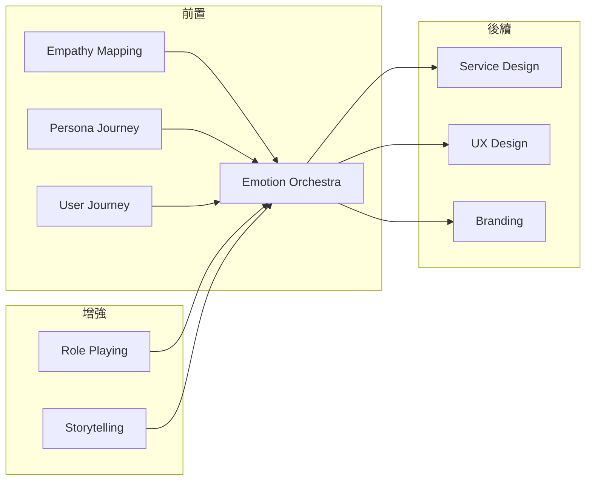

# Emotion Orchestra

> 情緒交響樂 - 用情感譜寫創新樂章

## 基本資訊

| 屬性 | 值 |
|------|-----|
| 類別 | Theatrical |
| 能量等級 | 中-高 |
| 建議時長 | 30-40 分鐘 |
| 參與人數 | 4-15 人 |
| 難度 | 中 |

## 技術概述

**Emotion Orchestra**（情緒交響樂）是一種以情感為核心的創意技術。參與者扮演交響樂團的不同樂器，每個樂器代表一種特定情緒或情感需求。透過「演奏」不同的情緒組合，團隊探索產品、服務或解決方案如何觸動人心，創造深層的情感連結。



## 歷史背景

這個技術源自於情感設計（Emotional Design）理論和同理心地圖（Empathy Mapping）。心理學家 Paul Ekman 的情緒研究、Don Norman 的情感設計三層次理論，以及 Aarron Walter 的「需求層次金字塔」都強調：真正成功的產品不只解決功能需求，更要觸動情感。用音樂隱喻讓抽象的情感變得可討論、可設計。

## 核心原理

### 為什麼情緒交響樂有效？



### 關鍵原則

1. **情感優先**
   - 從情感需求出發，而非功能
   - 問「想讓人感覺如何」而非「要做什麼功能」
   - 情感是記憶與忠誠的關鍵

2. **多元情緒組合**
   - 單一情緒太單薄
   - 複雜情緒組合更真實
   - 就像音樂需要和聲與層次

3. **情緒旅程**
   - 使用過程中的情緒變化
   - 高潮與低谷的設計
   - 情感弧線的完整性

4. **真實性**
   - 情感必須真誠
   - 不能操縱或欺騙
   - 長期情感連結vs短期刺激

## 情緒樂器分類



## 執行步驟



### 詳細步驟

#### 第一階段：組建樂團（5-10分鐘）

1. **定義創作主題**
   - 明確要設計的產品/服務/體驗
   - 例：「線上學習平台的用戶體驗」

2. **選擇情緒調色板**
   - 根據主題選擇 6-10 種核心情緒
   - 平衡正向/負向、高/低能量
   - 包含社交與個人情緒

3. **分配樂器角色**
   - 每人選擇 1-2 種情緒樂器
   - 理解這種情緒的特質
   - 準備「演奏」這種情緒

**情緒選擇範例（學習平台）：**
- 🎻 好奇心（探索的喜悅）
- 🎺 成就感（完成挑戰）
- 🎵 自信心（能力提升）
- 🎹 歸屬感（學習社群）
- 🎸 安全感（不怕失敗）
- 🥁 進步感（持續成長）

#### 第二階段：三個樂章（20-25分鐘）

**第一樂章：獨奏時間（8分鐘）**

每個樂器輪流「演奏」：
- **描述情緒**：「好奇心」感覺像什麼？
- **用戶何時體驗**：在學習過程的哪個時刻？
- **如何滿足**：什麼設計能引發這種情緒？
- **如果缺失**：沒有這種情緒會怎樣？

**第二樂章：和聲探索（10分鐘）**

選擇情緒組合，探索互動：
- **和諧組合**：哪些情緒一起很美？
  - 例：好奇心 + 安全感 = 勇於探索
- **衝突組合**：哪些情緒會矛盾？
  - 例：競爭 vs 歸屬感 = 需要平衡
- **意外共鳴**：哪些組合產生驚喜？
  - 例：挫折 + 幽默 = 有趣的失敗

**第三樂章：完整交響（7分鐘）**

設計完整的情感旅程：
- **開場**：用戶第一次接觸時的情緒
- **發展**：學習過程中的情緒變化
- **高潮**：最強烈的情感時刻
- **結尾**：完成後的情緒狀態
- **餘韻**：長期留下的感受

#### 第三階段：譜寫樂章（5-10分鐘）

1. **情感地圖**
   - 視覺化整個情感旅程
   - 標記關鍵情緒時刻
   - 識別情緒缺口

2. **設計洞見**
   - 哪些情緒最重要？
   - 目前體驗缺少哪些情緒？
   - 如何設計來觸發期望的情緒？

3. **具體行動**
   - 將情感需求轉化為設計決策
   - 優先排序情感目標
   - 定義成功的情感指標

## 引導提示與對話範例

### 指揮開場範例

> 「歡迎各位音樂家來到情緒交響樂團！今天我們要為『遠距工作協作工具』譜寫一首情感樂章。記住，最好的產品不只是工具，而是能觸動人心的體驗。每位樂手都掌握一種獨特的情緒樂器，讓我們開始吧！」

### 獨奏時間對話範例

**指揮：** 「首先，請『信任大提琴』演奏！」

**信任樂手：** 「信任...在遠距工作中，信任聽起來像是深沉的、溫暖的低音。當我知道團隊成員會完成他們承諾的事，當我可以放心地分享未完成的工作...那種安心的感覺。」

**指揮：** 「很好！那麼，我們的協作工具如何『演奏』這個音符？」

**信任樂手：** 「可能是...透明的進度顯示？讓大家看到彼此的工作。或是非正式的分享空間，不只是完美的成果。還有，也許是信任指標—不是監控，而是展現可靠性的方式。」

---

**指揮：** 「現在，請『孤獨低音管』演奏。」

**孤獨樂手：** 「這個音符不太好聽，但很真實。遠距工作的孤獨感...像是在空蕩蕩的房間裡的回音。你在工作，但感覺不到人的存在。」

**指揮：** 「負面情緒也是重要的樂器！我們要如何處理這個音符？」

**孤獨樂手：** 「也許不是消除它，而是...加入其他樂器來平衡？比如設計『虛擬茶水間』，隨機配對閒聊？或是讓人感受到『雖然不在一起，但我們都在這裡』的連結感。」

### 和聲探索對話範例

**指揮：** 「讓我們嘗試一個和聲：『成就感』+ 『歸屬感』。這兩個音符一起會如何？」

**成就樂手：** 「成就感是個人的，『我做到了！』的喜悅。」

**歸屬樂手：** 「歸屬感是集體的，『我們在一起』的溫暖。」

**團隊成員：** 「如果結合...可能是『共享的勝利』？當我完成任務，團隊慶祝；當團隊達成目標，我感到自豪。」

**指揮：** 「美妙的和聲！這啟發了什麼設計？」

**團隊成員：** 「也許是『團隊里程碑牆』？顯示個人貢獻和團隊進度。或是當有人完成困難任務時，團隊成員可以給予『掌聲』？」

---

**指揮：** 「試試這個不和諧音：『效率壓力』+ 『創意自由』。」

**團隊成員：** 「這兩個感覺會打架...效率要求快速、明確，創意需要時間、探索。」

**指揮：** 「沒錯！那我們如何調和這個不和諧？」

**團隊成員：** 「也許...時間分區？明確的『效率時段』和『創意時段』？或是在高效率的工具中，保留創意的彈性空間？」

## 情感設計工作表

### 情緒樂器卡

```
樂器：_________ (例：喜悅小提琴)

代表情緒：_________

音色描述：
- 感覺像：_________
- 聲音：_________
- 顏色：_________

觸發時刻：
□ _________
□ _________
□ _________

設計元素：
□ _________
□ _________
□ _________

如果缺失的影響：
_________
```

### 情感旅程圖

```
時間線：[開始] -----> [過程] -----> [高潮] -----> [結束] -----> [之後]

情緒強度：
    高 |     *              *
       |   *   *          *   *
    中 | *       *      *       *
       |           *  *
    低 |             *

主要情緒：___ → ___ → ___ → ___ → ___

關鍵時刻：
1. _________：觸發_________情緒
2. _________：觸發_________情緒
3. _________：觸發_________情緒
```

### 和聲分析表

| 情緒 A | 情緒 B | 互動效果 | 設計啟發 |
|--------|--------|---------|---------|
| 好奇 | 安全 | 和諧 ✓ | 安全的探索空間 |
| 競爭 | 歸屬 | 衝突 ⚠ | 需要平衡機制 |
| 挫折 | 幽默 | 意外共鳴 ✨ | 有趣的失敗提示 |

## 適用場景



## 注意事項

### Do's（應該做）

- **深入理解情緒**
  - 不只是情緒標籤
  - 探索細微差別
  - 連結真實體驗

- **保持真誠**
  - 情感設計要真實
  - 不操縱或欺騙
  - 長期情感 > 短期刺激

- **平衡情緒組合**
  - 包含正向與負向
  - 高能量與低能量
  - 個人與社交

- **視覺化情感旅程**
  - 繪製情緒曲線
  - 標記關鍵時刻
  - 識別缺口與機會

### Don'ts（不應該做）

- 只關注正向情緒（負向也重要）
- 情緒太單一或太複雜
- 忘記從情感轉化為設計
- 情感設計流於表面

## 變體技術

### 1. 情緒調色板
- 用顏色而非樂器
- 混合情緒色彩
- 視覺化情感

### 2. 情緒天氣報告
- 情緒是天氣狀態
- 晴天、雨天、暴風雨
- 天氣變化的旅程

### 3. 情緒劇場
- 演出情緒場景
- 角色扮演情感狀態
- 身體化的情緒探索

### 4. 情緒對比
- 當前情緒 vs 期望情緒
- 競品情緒 vs 我們的情緒
- 找出情感差異化

## 與其他技術的結合



## 案例研究

### 案例一：Headspace 冥想 App

**情緒樂章：**
- 開場：焦慮 → 好奇（友善的引導）
- 發展：平靜 → 專注（漸進的練習）
- 高潮：釋放 → 輕盈（冥想完成）
- 結尾：滿足 → 成長（進度追蹤）
- 餘韻：平靜成為日常（習慣養成）

**情感設計元素：**
- 溫暖幽默的動畫減少焦慮
- 漸進式引導建立自信
- 慶祝小里程碑帶來成就感

### 案例二：Duolingo 語言學習

**情緒組合：**
- 好奇（新語言探索）+ 安全（不怕錯誤）
- 成就（連續打卡）+ 歸屬（排行榜）
- 挫折（困難關卡）+ 幽默（有趣的失敗）

**關鍵洞見：**
用遊戲化和幽默「轉調」學習的焦慮，變成有趣的挑戰。

### 案例三：Airbnb 的情感承諾

**核心情緒：** 歸屬感（Belong Anywhere）

**情感旅程：**
- 期待（瀏覽特色房源）
- 信任（房東個人檔案與評價）
- 興奮（預訂確認）
- 溫暖（房東歡迎）
- 歸屬（像在家一樣）
- 感激（回憶與評價）

## 情緒類型參考

### Plutchik 情緒輪

| 基本情緒 | 強度變化 | 組合情緒 |
|---------|---------|---------|
| 喜悅 | 寧靜 → 喜悅 → 狂喜 | 喜悅+信任=愛 |
| 信任 | 接受 → 信任 → 欽佩 | 信任+喜悅=愛 |
| 恐懼 | 憂慮 → 恐懼 → 驚恐 | 恐懼+驚訝=敬畏 |
| 驚訝 | 分心 → 驚訝 → 驚愕 | 驚訝+悲傷=失望 |
| 悲傷 | 沉思 → 悲傷 → 哀慟 | 悲傷+厭惡=悔恨 |
| 厭惡 | 無聊 → 厭惡 → 憎恨 | 厭惡+憤怒=鄙視 |
| 憤怒 | 煩躁 → 憤怒 → 暴怒 | 憤怒+期待=侵略 |
| 期待 | 興趣 → 期待 → 警戒 | 期待+喜悅=樂觀 |

### 產品設計常用情緒

**高優先級正向情緒：**
- 信任、安全感、掌控感
- 成就、能力、進步
- 歸屬、連結、被理解
- 喜悅、驚喜、滿足

**需要處理的負向情緒：**
- 焦慮、不確定、困惑
- 挫折、無力、失控
- 孤獨、被排除
- 無聊、麻木

## 研究支持

情感設計研究發現：
- **情感驅動決策**：95% 的購買決策是情感性的（Harvard）
- **情感記憶**：情感強烈的體驗記憶保留更久
- **品牌忠誠度**：情感連結是忠誠度的最強預測因子
- **口碑傳播**：觸動情感的產品獲得更多推薦

## 設計模式與方法論對照

| 相關模式/方法論 | 連結點 | 應用價值 |
|----------------|--------|----------|
| **Emotional Design** | Don Norman三層次理論 | 本能、行為、反思層次的情感設計 |
| **Plutchik's Wheel** | 情緒心理學 | 八種基本情緒及其組合的系統框架 |
| **Designing for Emotion** | Aarron Walter | 用戶需求金字塔頂端是愉悅 |
| **Empathy Mapping** | 設計思維工具 | 理解用戶所想、所感、所說、所做 |
| **Peak-End Rule** | Kahneman行為經濟學 | 高潮與結尾決定整體體驗記憶 |
| **Jobs to Be Done** | 功能與情感任務並重 | 產品解決的情感任務往往比功能更重要 |

**核心洞察**：Emotion Orchestra揭示了一個被忽略的真相——產品不只是功能的集合，而是情感體驗的編排。就像交響樂不是隨機音符的堆砌，卓越的產品是精心設計的情感旅程。音樂隱喻的力量在於它將抽象的情感變得可討論、可設計：我們可以問「這裡需要什麼樂器」、「這個和聲是否和諧」、「高潮來得太早還是太晚」。95%的購買決策是情感性的——這意味著如果你只設計功能而忽略情感，你只觸及了用戶決策的5%。

## 參考資源

- [Don Norman: Emotional Design](https://www.jnd.org/books/emotional-design-why-we-love-or-hate-everyday-things/)
- [Aarron Walter: Designing for Emotion](https://abookapart.com/products/designing-for-emotion)
- [Plutchik's Wheel of Emotions](https://www.6seconds.org/2022/03/13/plutchik-wheel-emotions/)
- [The Emotional Journey in UX](https://www.nngroup.com/articles/emotion-ux/)

---

*返回 [Theatrical 類別](./index.md) | [技術總覽](../index.md)*
