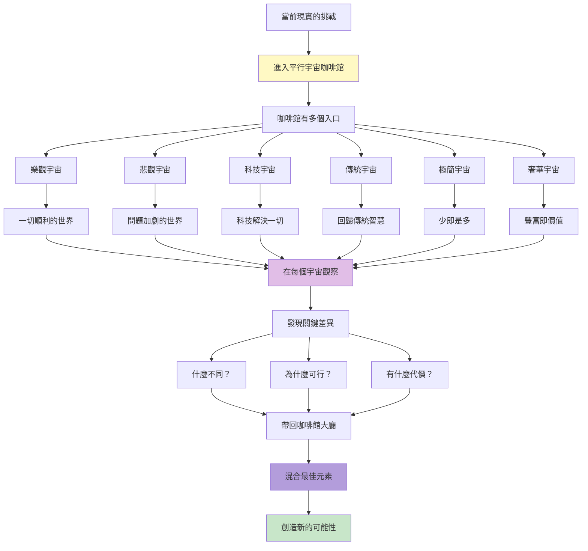
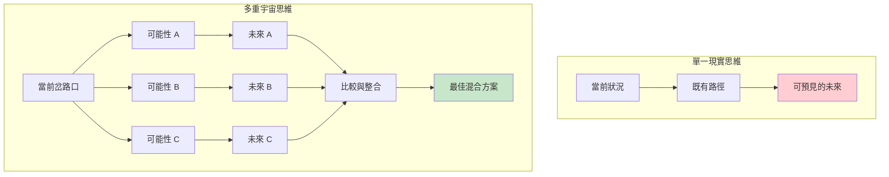
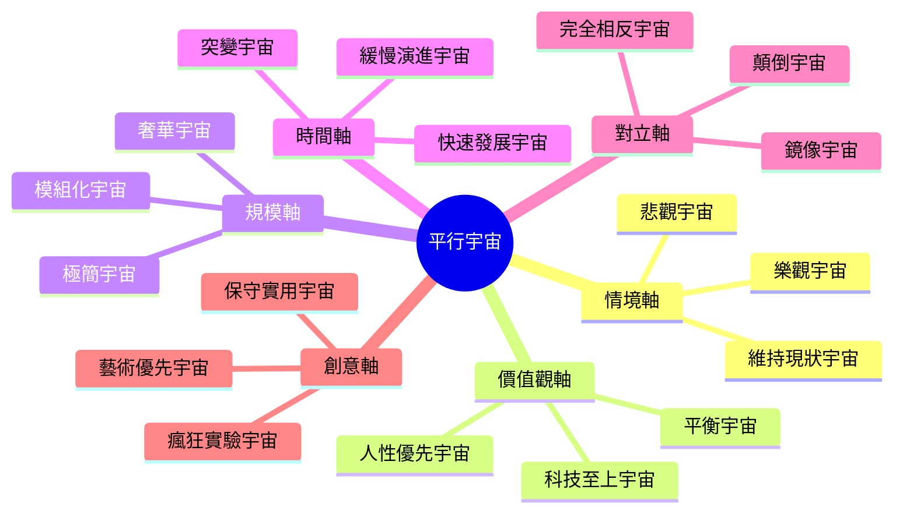
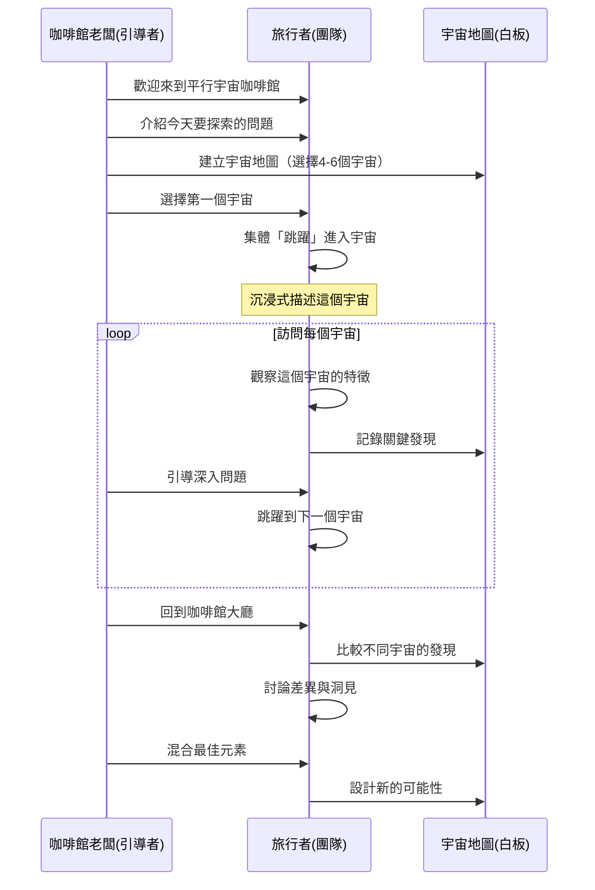
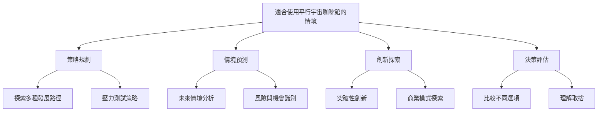
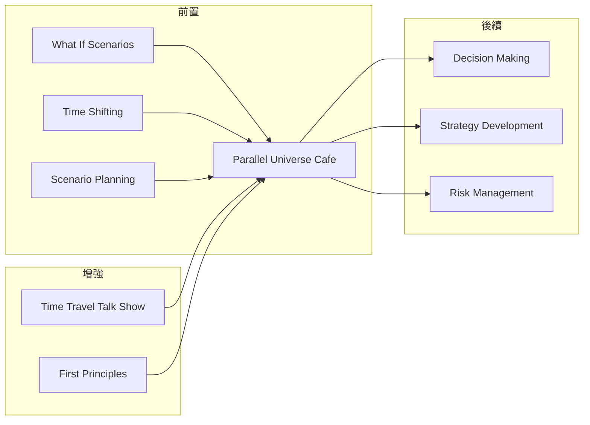

# Parallel Universe Cafe

> 平行宇宙咖啡館 - 在多重現實中探索無限可能

## 基本資訊

| 屬性 | 值 |
|------|-----|
| 類別 | Theatrical |
| 能量等級 | 中-高 |
| 建議時長 | 30-45 分鐘 |
| 參與人數 | 3-12 人 |
| 難度 | 中 |

## 技術概述

**Parallel Universe Cafe**（平行宇宙咖啡館）是一種透過探索多重現實來激發創意的技術。想像一間神奇的咖啡館，每張桌子都通往不同的平行宇宙，每個宇宙中問題有不同的解決方式、不同的發展路徑。參與者在不同宇宙間「跳躍」，收集洞見，並將最佳元素帶回我們的現實。



## 歷史背景

這個技術結合了科幻小說的多重宇宙概念、情境規劃（Scenario Planning）的策略思維，以及設計思維的「如果...會怎樣」探索。物理學家如 Hugh Everett 的多世界詮釋啟發了「所有可能性都存在於某處」的思考方式。在商業領域，Shell 石油公司的情境規劃就是類似的平行可能性探索。

## 核心原理

### 為什麼平行宇宙探索有效？



### 關鍵原則

1. **多元可能性**
   - 同時探索多個極端情境
   - 不受限於「最可能」的未來
   - 每個宇宙都有其洞見

2. **對比學習**
   - 透過差異發現關鍵因素
   - 理解「如果 X 不同，Y 會如何」
   - 識別槓桿點

3. **自由探索**
   - 在平行宇宙中沒有風險
   - 可以嘗試任何想法
   - 失敗在其他宇宙，不在這裡

4. **混合創新**
   - 最佳方案往往是混合體
   - 從每個宇宙擷取精華
   - 創造獨特組合

## 平行宇宙類型



## 執行步驟



### 詳細步驟

#### 第一階段：咖啡館設定（5-10分鐘）

1. **定義探索問題**
   - 明確要探索的挑戰或機會
   - 例：「公司的遠距工作文化」

2. **建立宇宙地圖**
   - 選擇 4-6 個平行宇宙
   - 確保宇宙足夠多元
   - 給每個宇宙命名

**宇宙地圖範例（遠距工作）：**
- 🌟 **全同步宇宙**：所有人同時在線，密集協作
- 🌙 **全異步宇宙**：完全不需即時溝通
- 🤖 **AI 助理宇宙**：AI 處理所有協調工作
- 🏡 **社群宇宙**：工作與生活社群深度融合
- ⚡ **超效率宇宙**：4小時工作日，極致專注
- 🎨 **創意優先宇宙**：沒有時間壓力，只追求品質

3. **準備旅行**
   - 解釋「宇宙跳躍」規則
   - 在每個宇宙中全情投入
   - 暫時忘記其他宇宙

#### 第二階段：宇宙探索（20-25分鐘）

**每個宇宙的探索流程（5分鐘/宇宙）：**

**步驟 1：進入宇宙（1分鐘）**
- 咖啡館老闆描述宇宙特徵
- 團隊想像自己在這個宇宙中
- 設定情境細節

**步驟 2：觀察與體驗（2分鐘）**
- 在這個宇宙中，典型的一天是什麼樣子？
- 人們如何工作/互動/解決問題？
- 什麼是理所當然的？
- 什麼問題被解決了？
- 什麼新問題出現了？

**步驟 3：記錄發現（2分鐘）**
- 這個宇宙的優點
- 這個宇宙的代價
- 關鍵差異因素
- 可以借鑑的元素

#### 第三階段：咖啡館大廳綜合（10-15分鐘）

1. **宇宙對比分析**
   - 並列所有宇宙的發現
   - 找出模式與矛盾
   - 識別關鍵變數

2. **元素提取**
   - 從每個宇宙選出最佳元素
   - 思考如何結合
   - 注意互斥或協同

3. **創造混合宇宙**
   - 設計「我們的理想宇宙」
   - 融合不同宇宙的精華
   - 創造獨特可能性

4. **回到現實**
   - 從混合宇宙中提取可行行動
   - 第一步是什麼？
   - 如何朝理想宇宙前進？

## 引導提示與對話範例

### 咖啡館老闆開場範例

> 「歡迎光臨平行宇宙咖啡館！我是咖啡館老闆，你們看到的每扇門都通往不同的宇宙。在那些宇宙中，『遠距工作文化』以完全不同的方式演進。今天我們要訪問六個宇宙，觀察他們如何處理協作、文化、與平衡。準備好了嗎？讓我們從全同步宇宙開始...」

### 宇宙探索對話範例

**老闆：** 「這扇發光的門通往『全同步宇宙』。推開門...你們現在在這個宇宙中。在這裡，所有人都在同一時區，每天有固定的協作時段。描述一下，早上醒來是什麼樣子？」

**旅行者 A：** 「我早上 9 點打開電腦，所有同事都已經在線了。有一種『大家都在這裡』的能量...」

**旅行者 B：** 「我們有固定的晨會、午餐社交時間、下午的專注時段。就像在辦公室一樣，但是在家裡。」

**老闆：** 「很好！那這個宇宙解決了什麼問題？」

**旅行者 C：** 「孤獨感！還有溝通延遲的問題。需要討論的時候，大家都在，可以立刻解決。」

**老闆：** 「那代價是什麼？」

**旅行者 A：** 「彈性...沒有了。你必須在固定時間在線，不能利用不同時區的優勢，也很難兼顧家庭。」

**老闆：** 「好！記錄這些。現在，讓我們跳到完全相反的宇宙...」

---

**老闆：** 「歡迎來到『全異步宇宙』。在這裡，沒有人期待即時回應，一切都透過非同步溝通。」

**旅行者 D：** 「這感覺...很自由但也很孤獨？我早上起床，看到同事昨晚留下的訊息和工作成果。我回應，但知道他們可能8小時後才會看到。」

**旅行者 E：** 「工作品質應該很高！因為每個人都有充足時間思考和準備，不是即興回應。」

**旅行者 F：** 「但緊急情況怎麼辦？如果需要快速決策...」

**老闆：** 「好問題！在這個宇宙中，他們如何處理緊急情況？」

**旅行者 B：** 「也許...他們重新定義了『緊急』？或是有特殊的快速通道機制？」

**老闆：** 「很好的觀察！這個宇宙讓你們看到什麼不同的假設？」

---

**老闆：** 「現在，讓我們進入『AI 助理宇宙』。在這裡，每個團隊都有 AI 協調者。」

**旅行者 C：** 「哇...AI 知道每個人的時區、偏好、當前任務。它會自動找到最佳會議時間，甚至預先整理討論要點。」

**旅行者 D：** 「而且它可以 24/7 工作，連結異步和同步世界。你發送訊息，AI 判斷緊急程度，決定如何通知對方。」

**旅行者 A：** 「這解決了協調的負擔...但感覺有點冰冷？少了人的溫度。」

**老闆：** 「有趣！所以技術解決了效率，但可能犧牲了什麼？」

### 咖啡館大廳綜合對話

**老闆：** 「好！我們回到咖啡館大廳。你們訪問了六個宇宙，讓我們比較一下。」

**旅行者：** 「同步宇宙有連結感，但沒彈性。異步宇宙有自由，但缺即時性。AI 宇宙效率高，但少了溫度...」

**老闆：** 「如果我們要創造『第七個宇宙』—我們理想的宇宙，可以從每個宇宙拿什麼元素？」

**旅行者 A：** 「我想要異步宇宙的自由和深度工作時間...」

**旅行者 B：** 「但也要同步宇宙的『人的連結感』...也許不是每天，但定期的同步時刻？」

**旅行者 C：** 「AI 宇宙的智能協調很棒，但作為工具，不是替代人。」

**旅行者 D：** 「社群宇宙教我們工作不只是任務，也是關係。」

**老闆：** 「太好了！聽起來你們在設計一個『混合宇宙』：異步為主，定期同步，AI 輔助，重視社群。這個宇宙的名字是什麼？」

**旅行者們：** 「『節奏宇宙』！有自己的節奏，但也有共同的節拍。」

## 宇宙探索工作表

### 宇宙檔案卡

```
宇宙名稱：_________________

核心特徵：
_________________________

關鍵差異（與當前現實）：
1. _______________________
2. _______________________
3. _______________________

一天的生活：
早上：____________________
中午：____________________
下午：____________________
晚上：____________________

解決的問題：
□ _______________________
□ _______________________

付出的代價：
□ _______________________
□ _______________________

可借鑑元素：
★ _______________________
★ _______________________
```

### 宇宙對比矩陣

|  | 宇宙A | 宇宙B | 宇宙C | 宇宙D |
|---|-------|-------|-------|-------|
| **優點** | | | | |
| **缺點** | | | | |
| **關鍵因素** | | | | |
| **可借鑑元素** | | | | |

### 混合宇宙設計表

```
我們的理想宇宙名稱：_______________

融合元素：
□ 來自宇宙 A：_______________
□ 來自宇宙 B：_______________
□ 來自宇宙 C：_______________
□ 來自宇宙 D：_______________

融合方式：
_________________________________

預期效果：
_________________________________

潛在衝突：
_________________________________

解決方案：
_________________________________

第一步行動：
_________________________________
```

## 適用場景



## 注意事項

### Do's（應該做）

- **創造豐富的宇宙**
  - 詳細描述宇宙特徵
  - 讓參與者真正「進入」
  - 使用感官細節

- **選擇對比宇宙**
  - 確保宇宙間有顯著差異
  - 涵蓋不同維度（樂觀/悲觀、快/慢等）
  - 包含一些極端宇宙

- **深入探索**
  - 不只是表面描述
  - 探索二階、三階效應
  - 問「然後呢？」

- **真誠比較**
  - 每個宇宙都有優缺點
  - 避免偏好某個宇宙
  - 尊重所有可能性

### Don'ts（不應該做）

- 選擇太相似的宇宙
- 太快跳到「最佳」宇宙
- 忽略不舒服的宇宙（往往最有洞見）
- 忘記回到現實（行動方案）

## 變體技術

### 1. 時間線分岔
- 過去某個關鍵點做了不同決策
- 追蹤到現在會如何
- 識別關鍵岔路口

### 2. 角色宇宙
- 每個宇宙中你是不同角色
- 體驗不同視角
- 增強同理心

### 3. 反事實宇宙
- 「如果 X 沒發生」的宇宙
- 理解關鍵因素的重要性
- 預防性思考

### 4. 宇宙演化
- 不只是靜態宇宙
- 觀察10年後會變成什麼
- 動態情境規劃

## 與其他技術的結合



## 案例研究

### 案例一：Shell 的情境規劃

**平行宇宙：**
- 高油價宇宙
- 低油價宇宙
- 綠能主導宇宙
- 地緣政治動盪宇宙

**洞見：**
Shell 透過探索這些「宇宙」，提前準備多種策略，在1970年代石油危機中表現優於競爭對手。

### 案例二：Amazon 的多重押注

**探索的宇宙：**
- 電商持續主導
- 雲端運算成為主力
- AI 語音成為介面
- 實體零售復興

**策略：**
Amazon 不選擇單一宇宙，而是在多個可能性中都有投資，創造適應性策略。

### 案例三：Netflix 的轉型

**早期宇宙探索：**
- DVD 租賃持續宇宙
- 串流媒體主導宇宙
- 內容製作商宇宙
- 平台開放宇宙

**決策：**
Netflix 觀察到串流宇宙和內容製作宇宙的融合可能，成功轉型。

## 宇宙類型庫

### 常用宇宙軸向

**樂觀 ←→ 悲觀**
- 最佳情況宇宙
- 最壞情況宇宙

**科技 ←→ 人性**
- 全自動化宇宙
- 手工/傳統宇宙

**快速 ←→ 緩慢**
- 超音速發展宇宙
- 慢活宇宙

**複雜 ←→ 簡單**
- 功能豐富宇宙
- 極簡主義宇宙

**開放 ←→ 封閉**
- 完全透明宇宙
- 隱私至上宇宙

**集體 ←→ 個人**
- 社群主導宇宙
- 個人化極致宇宙

### 產業特定宇宙範例

**教育領域：**
- AI 個人導師宇宙
- 同儕學習宇宙
- 微證書宇宙
- 終身學習宇宙
- 遊戲化學習宇宙

**醫療領域：**
- 預防醫學宇宙
- 個人化醫療宇宙
- 遠距醫療宇宙
- 社群照護宇宙
- 長壽優化宇宙

## 研究支持

策略管理研究顯示：
- **情境規劃**提升組織適應力和韌性
- **多重未來思考**減少認知偏見和路徑依賴
- **對比學習**增強決策品質
- **可能性探索**激發創新和策略靈活性

## 設計模式與方法論對照

| 相關模式/方法論 | 連結點 | 應用價值 |
|----------------|--------|----------|
| **Scenario Planning** | Shell石油公司方法 | 企業級多重未來情境規劃的經典方法 |
| **Counterfactual Thinking** | 認知心理學 | 「如果不同」的反事實推理訓練 |
| **Red Team/Blue Team** | 軍事策略思維 | 對立視角壓力測試方案的穩健性 |
| **Options Thinking** | 實質選擇權理論 | 在不確定中保持多重可能性的價值 |
| **Backcasting** | 從願景倒推路徑 | 從理想未來反推現在該做什麼 |
| **Pre-mortem Analysis** | Gary Klein | 假設已失敗，探索失敗宇宙的智慧 |

**核心洞察**：Parallel Universe Cafe的深層智慧是「可能性的民主」——不是選擇「最可能」的未來然後押注，而是同時存在於多個可能性之中。Shell石油公司用這種思維在1970年代石油危機中勝出，不是因為他們預測對了，而是因為他們為多個宇宙都做好了準備。這個技術教我們：真正的策略智慧不是預測未來，而是創造適應多重未來的能力。從每個宇宙提取精華、混合成「第七個宇宙」的過程，正是創新的本質——不是在已有選項中選擇，而是創造新的選項。

## 參考資源

- [Shell Scenario Planning](https://www.shell.com/energy-and-innovation/the-energy-future/scenarios.html)
- [Future Scenario Techniques](https://www.interaction-design.org/literature/article/future-scenarios-a-powerful-tool-for-innovation)
- [Multiverse Thinking in Strategy](https://hbr.org/2020/11/strategic-planning-for-an-uncertain-future)
- [Parallel Worlds Exercise](https://www.liberatingstructures.com/)

---

*返回 [Theatrical 類別](./index.md) | [技術總覽](../index.md)*
