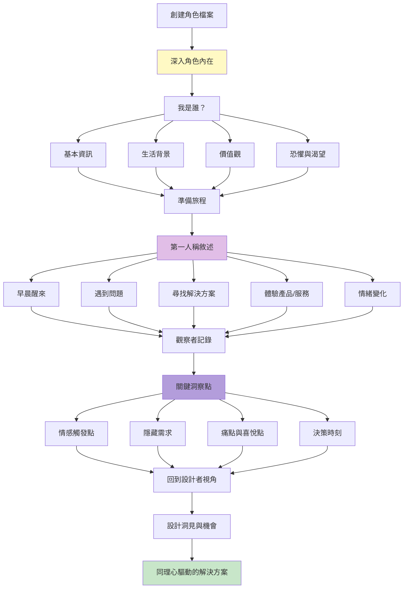
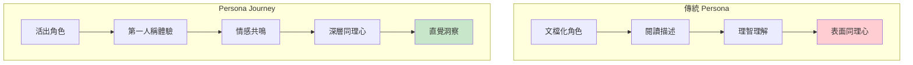
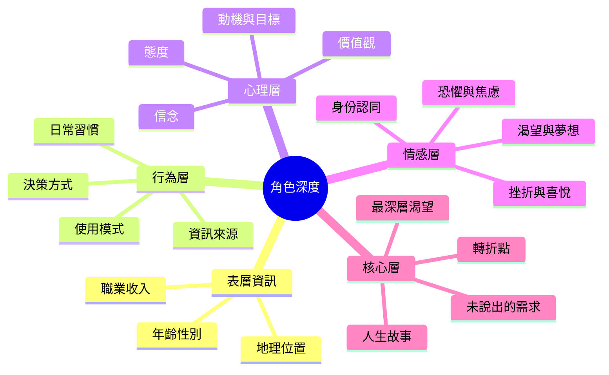
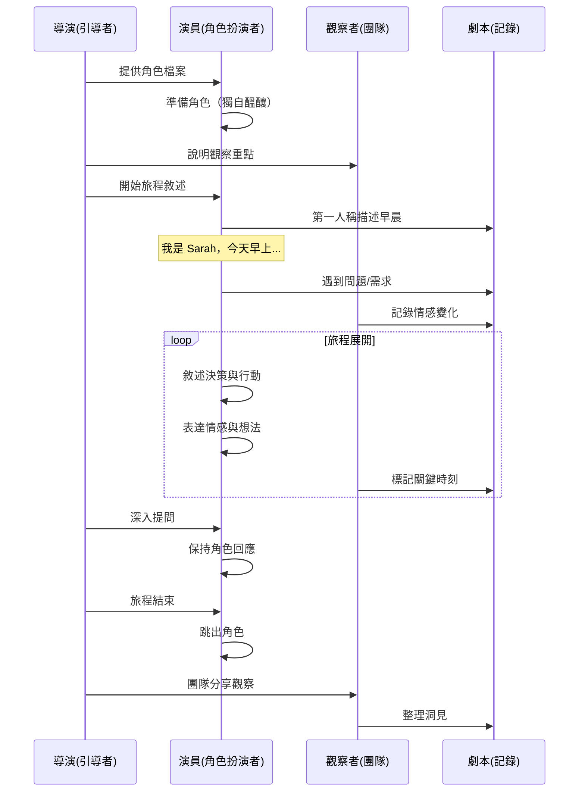
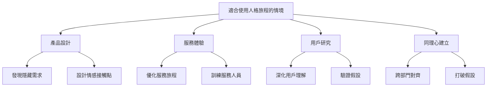
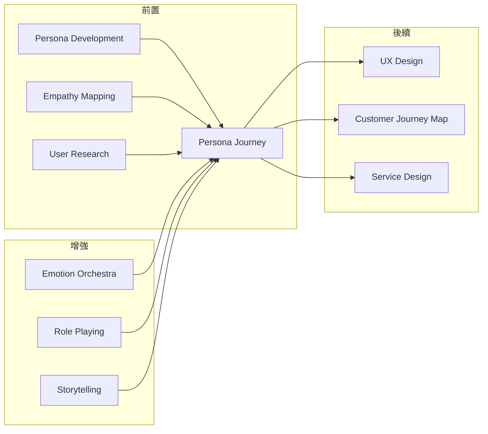

# Persona Journey

> 人格旅程 - 深入角色內心的沉浸式探索

## 基本資訊

| 屬性 | 值 |
|------|-----|
| 類別 | Theatrical |
| 能量等級 | 中 |
| 建議時長 | 35-50 分鐘 |
| 參與人數 | 2-10 人 |
| 難度 | 中 |

## 技術概述

**Persona Journey**（人格旅程）是一種深度角色扮演技術，參與者不只是「描述」用戶角色，而是真正「成為」他們，從第一人稱視角體驗完整的旅程。透過身體化、情感化的角色投入，團隊能夠獲得深層的同理心洞察，發現傳統用戶研究可能錯過的細微需求和痛點。



## 歷史背景

這個技術融合了史坦尼斯拉夫斯基的方法演技（Method Acting）、設計思維的同理心階段、以及人類學的參與式觀察。在產品設計領域，IDEO、Cooper 等公司發展出 Persona 方法，但傳統 Persona 往往停留在文檔化；Persona Journey 則強調「活出」這個角色，獲得體驗式的深度理解。

## 核心原理

### 為什麼人格旅程有效？



### 關鍵原則

1. **第一人稱體驗**
   - 用「我」而非「她/他」
   - 說出角色的想法與感受
   - 身體化的表達

2. **完整旅程**
   - 不只是產品接觸點
   - 包含前因後果
   - 看見更大的生活脈絡

3. **情感真實性**
   - 真正感受角色的情緒
   - 不只是理智推理
   - 允許自己被觸動

4. **多重角色**
   - 探索不同的用戶類型
   - 對比不同的旅程
   - 發現共性與差異

## 角色建構層次



## 執行步驟



### 詳細步驟

#### 第一階段：角色準備（10-15分鐘）

1. **創建或選擇角色**
   - 使用現有 Persona 或創建新角色
   - 提供豐富的背景資訊
   - 包含照片、名言、生活細節

2. **角色檔案範例：**

```
姓名：Sarah Chen，35歲
職業：行銷經理，科技新創公司
家庭：已婚，一個3歲的女兒
住處：城市公寓

一天的開始：
早上6:30被女兒吵醒，匆忙準備早餐...

價值觀：
- 效率至上（時間永遠不夠）
- 希望做好媽媽，但工作壓力大
- 渴望成長，但害怕落後

她的話：
"我想要一切都在掌控中，但現實是...一團混亂。"

最大恐懼：
不夠好—不夠好的媽媽、不夠好的員工

未滿足的需求：
簡化、平靜、被理解
```

3. **演員準備**
   - 分配角色給參與者
   - 給予 5-10 分鐘獨自準備
   - 鼓勵找到角色的「感覺」
   - 可以走動、調整姿態

**準備提示：**
- 如果你是這個人，你的身體感覺如何？
- 什麼表情是自然的？
- 內心有什麼持續的聲音？

#### 第二階段：旅程展開（20-25分鐘）

**敘述結構：**

**開場：日常生活（5分鐘）**
- 從普通的一天開始
- 建立角色的生活脈絡
- 用第一人稱，現在式

範例：
> 「我是 Sarah。今天早上又是被 Emma 的哭聲吵醒。6:30，比鬧鐘早半小時。我看著身旁還在睡的老公，有點羨慕，但也習慣了。快速洗漱，準備女兒的早餐...腦子裡已經在想今天的會議...」

**觸發：問題或需求出現（5分鐘）**
- 什麼事件觸發了需求？
- 當下的情緒是什麼？
- 內心的對話

範例：
> 「到了辦公室，發現客戶要提前兩天交報告。我的心跳加速，腦中快速盤算...今晚女兒的生日...老公出差...保姆請假...該死。我感到胸口發緊，呼吸急促。『冷靜，Sarah，妳可以的。』我對自己說，但聲音沒什麼說服力。」

**探索：尋找解決方案（5分鐘）**
- 如何尋找幫助？
- 評估選項的標準？
- 內心的掙扎與權衡

範例：
> 「我打開電腦，搜尋『快速製作行銷報告』。出現一堆工具，看得我頭暈。我沒時間學新工具...但舊方法要熬夜...我點開第一個，介面複雜，關掉。第二個，要信用卡，猶豫...我看了看時間，9:15，會議9:30...焦慮感上升...」

**體驗：使用產品/服務（5分鐘）**
- 第一印象？
- 每個步驟的感受？
- 內心OS

範例：
> 「我試了第三個工具。首頁很簡潔，『三步驟完成報告』。哼，真的假的？但...我點擊開始。上傳數據...好，這個我會。選擇模板...咦，有針對我產業的？心裡放鬆一點。AI 開始生成...我緊張地等待...出來了！看起來...還不錯？我感到一絲希望...」

**結果：旅程結束（5分鐘）**
- 問題解決了嗎？
- 感受如何改變？
- 對未來的影響

範例：
> 「報告及時完成了，甚至比我自己做的更專業。會議很順利，客戶讚賞。但更重要的是...我6點就下班了。接到女兒，她的笑容...那一刻我感到完整。晚上吹蠟燭時，我沒有愧疚感。這個工具...它給了我時間，給了我做好媽媽的可能。」

#### 第三階段：洞察提取（10-15分鐘）

1. **角色跳出**
   - 演員正式跳出角色
   - 分享扮演中的感受
   - 什麼時刻最真實？

2. **觀察者分享**
   - 記錄到的關鍵時刻
   - 情感轉折點
   - 意外發現

3. **集體洞察**
   - 真正的痛點是什麼？
   - 情感需求是什麼？
   - 產品應該提供什麼？

4. **多角色對比**（如果有多個角色）
   - 不同角色的旅程差異
   - 共同的核心需求
   - 需要差異化的地方

## 引導提示與對話範例

### 導演引導技巧

**深入提問：**

當演員在敘述時，導演可以介入提問（不打斷沉浸）：

- 「此刻你的身體感覺如何？」
- 「你最擔心什麼？」
- 「你告訴自己什麼？」
- 「如果可以許願，你希望什麼？」

**情感探索：**

- 「這讓你想起什麼？」
- 「你有注意到自己的情緒變化嗎？」
- 「什麼觸動了你？」

**決策剖析：**

- 「為什麼選擇這個而非那個？」
- 「什麼會讓你改變主意？」
- 「你信任這個嗎？為什麼？」

### 演員敘述範例

**好的敘述（深入、第一人稱、情感豐富）：**

> 「我是 David，58歲的高中老師。今天又是星期一，拖著疲憊的身體走進教室。學生們在滑手機，根本不看我。我開始講解代數，聽到後排的笑聲...他們在看短視頻。我感到無力、過時、被忽略。我曾經愛教書，但現在...我不知道如何連結這代孩子。下課後，我坐在空蕩蕩的教室，盯著電腦螢幕，想著：『一定有更好的方式...』」

**較弱的敘述（第三人稱、事實陳述、缺乏情感）：**

> 「David 是個老師，他發現學生不專心。他想要找新的教學方法。他會上網搜尋。」

### 觀察者記錄範例

**關鍵時刻標記：**

```
⏰ 時間點：早上9:15
💬 角色說：「我沒時間學新工具...」
😰 情緒：焦慮、時間壓力
💡 洞察：學習曲線是採用障礙
🎯 機會：零學習曲線設計

⏰ 時間點：試用產品時
💬 角色說：「咦，有針對我產業的？」
😊 情緒：驚喜、希望
💡 洞察：相關性立即建立信任
🎯 機會：垂直化、情境化設計

⏰ 時間點：晚上女兒生日
💬 角色說：「這個工具給了我時間」
😭 情緒：感激、完整感
💡 洞察：真正賣的不是效率，是時間換親情
🎯 機會：情感價值主張
```

## 人格旅程工作表

### 角色準備卡

```
我是 ___________________

今天早上醒來，我感到：___________________

我最在乎的是：___________________

我最擔心的是：___________________

我的一天通常是：
早上：___________________
中午：___________________
下午：___________________
晚上：___________________

當遇到問題時，我通常：___________________

我做決策基於：___________________

我的口頭禪是：「___________________」

如果有魔法棒，我希望：___________________
```

### 旅程地圖模板

```
旅程階段：

1. 日常 → 2. 觸發 → 3. 探索 → 4. 體驗 → 5. 結果

每階段記錄：
- 🎬 做什麼（行動）
- 💭 想什麼（內心對話）
- 💗 感覺如何（情緒）
- ⚡ 痛點/喜悅點
- 💡 設計洞察
```

### 同理心洞察表

| 用戶說的 | 用戶想的 | 用戶感受的 | 用戶做的 | 真正需求 |
|---------|---------|----------|---------|---------|
| 「這太複雜了」 | 「我會不會看起來很笨」 | 焦慮、挫折 | 放棄嘗試 | 自信、簡單 |
| 「還不錯」 | 「但不是為我設計的」 | 失望、疏離 | 敷衍使用 | 歸屬、相關性 |

## 適用場景



## 注意事項

### Do's（應該做）

- **充分準備角色**
  - 提供豐富背景資料
  - 包含情感與心理層面
  - 真實而具體

- **創造安全空間**
  - 鼓勵真誠投入
  - 不評判演出
  - 尊重情感展現

- **保持第一人稱**
  - 用「我」說話
  - 現在式敘述
  - 避免跳出分析

- **記錄關鍵時刻**
  - 情感轉折點
  - 決策時刻
  - 意外洞察

### Don'ts（不應該做）

- 中途打斷角色沉浸（除非引導提問）
- 停留在表面行為描述
- 跳過情感層面
- 忘記將洞察轉化為行動

## 變體技術

### 1. 雙角色對話
- 兩個角色互動
- 例：用戶與客服、夫妻共同決策
- 探索人際動態

### 2. 一天的生活
- 完整的24小時體驗
- 產品只是生活的一部分
- 看見更大脈絡

### 3. 對比旅程
- 同一需求，不同角色
- 或同一角色，不同解決方案
- 識別關鍵差異

### 4. 時間跨度旅程
- 數週或數月的旅程
- 追蹤行為與態度改變
- 理解長期影響

### 5. 身體化旅程
- 實際走完物理旅程
- 例：醫院就診流程
- 身體記憶的洞察

## 與其他技術的結合



## 案例研究

### 案例一：醫療服務設計

**角色：** Linda，68歲，剛確診糖尿病

**旅程片段：**
> 「醫生說我有糖尿病。那個詞...糖尿病...像一記重擊。我聽到他在解釋，但腦中一片空白。拿到一疊衛教單張，密密麻麻的字，我感到窒息。回家的路上，我一直想：我做錯了什麼...」

**洞見：**
- 確診時刻需要情感支持，不只是資訊
- 衛教材料太複雜，時機不對
- 設計改進：診斷後的情感緩衝期、分階段教育

### 案例二：金融 App 設計

**角色：** Marcus，28歲，第一次投資

**旅程片段：**
> 「我打開投資 App，看到『風險承受度測驗』。老實說，我根本不知道我能承受多少風險。我隨便選了『中等』，感覺很虛。看到那些股票代號...AAPL、TSLA...我知道是蘋果和特斯拉，但數字上下跳動讓我焦慮。我不想賠錢，但也怕錯過機會。我退出了 App，心想：也許我還沒準備好...」

**洞見：**
- 風險測驗假設用戶理解風險
- 代號與數字增加認知負擔
- 焦慮阻止行動
- 設計改進：教育式引導、視覺化風險、小額試水

### 案例三：學習平台

**角色：** Aisha，45歲，想轉職的行政人員

**旅程片段：**
> 「我看著『數據分析課程』的介紹，心跳加速。我高中數學就不好...現在45歲了，還能學嗎？我看到課程時長：60小時。我算了算，如果每天一小時...兩個月。但我晚上要接女兒、做飯...現實嗎？我感到一陣疲倦。也許...我應該放棄轉職的夢想。但...我真的厭倦了現在的工作...」

**洞見：**
- 自我懷疑是最大障礙（不只是時間）
- 需要可實現感
- 身份轉換的恐懼
- 設計改進：建立自信的小步驟、靈活學習路徑、社群支持

## 角色類型庫

### 常見用戶原型

**科技採用度：**
- 早期採用者：追求新穎、願意冒險
- 實用主義者：需要證明、重視可靠
- 晚期採用者：抗拒改變、需要支持

**生活階段：**
- 年輕單身：自由但不穩定
- 新手父母：忙碌、需要效率
- 三明治世代：上有老下有小
- 空巢期：重新定義自己
- 退休人士：時間多但技術焦慮

**心理類型：**
- 完美主義者：高標準、自我要求
- 冒險家：尋求刺激、新體驗
- 照顧者：以他人需求為先
- 創造者：表達自我、獨特性

## 研究支持

神經科學與心理學研究顯示：
- **鏡像神經元**：體驗他人視角激活相同大腦區域
- **具身認知**：身體狀態影響思考與理解
- **敘事同理心**：故事形式增強記憶和情感連結
- **第一人稱視角**：提升移情能力和決策洞察

## 參考資源

- [IDEO Human-Centered Design Toolkit](https://www.ideo.com/post/design-kit)
- [Empathy Mapping by Nielsen Norman Group](https://www.nngroup.com/articles/empathy-mapping/)
- [User Story Mapping by Jeff Patton](https://www.jpattonassociates.com/user-story-mapping/)
- [Jobs to Be Done Framework](https://jobs-to-be-done.com/)
- [Stanislavski Method Acting](https://en.wikipedia.org/wiki/Method_acting)

---

*返回 [Theatrical 類別](./index.md) | [技術總覽](../index.md)*
