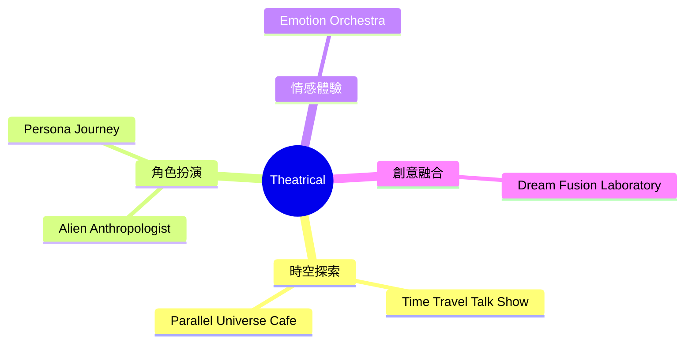
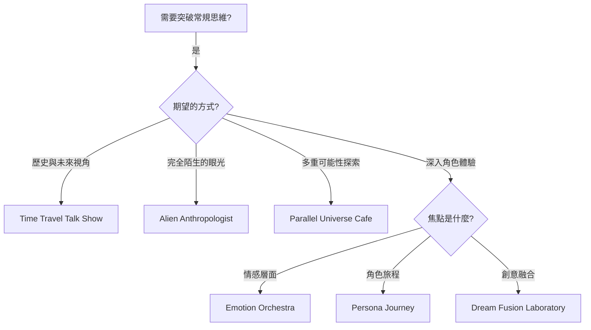
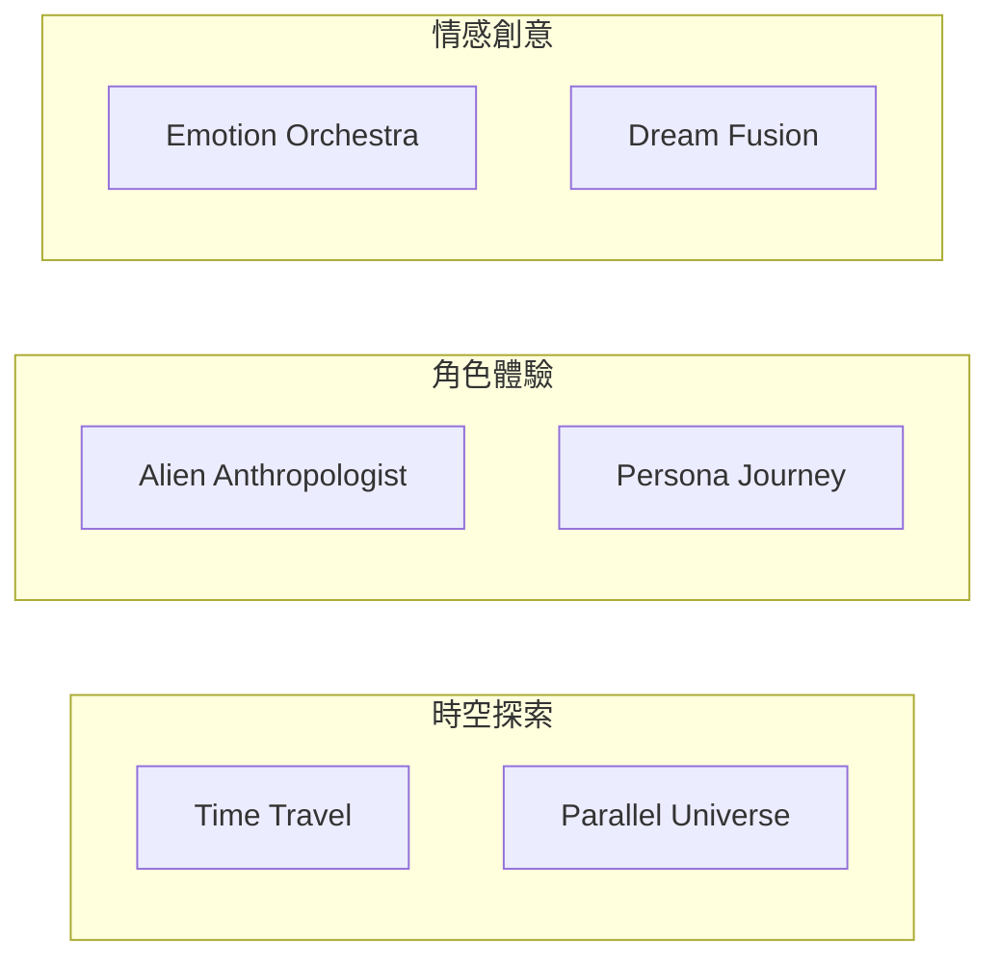

# Theatrical Brainstorming Techniques

> 戲劇類腦力激盪技術 - 角色扮演、打破常規、釋放創意

## 類別概述

戲劇類技術包含 6 種技術，透過角色扮演、情境模擬和戲劇化的方式來激發創意。這些技術特別適合需要突破常規思維、增加趣味性、並透過不同視角探索問題的情境。

## 核心特性

| 特性 | 說明 |
|------|------|
| 角色扮演 | 透過扮演不同角色獲得新視角 |
| 戲劇化情境 | 創造引人入勝的想像場景 |
| 高度趣味性 | 寓教於樂，提高參與度 |
| 打破常規 | 用非傳統方式激發創意 |

## 技術列表

| # | 技術名稱 | 核心概念 | 適用情境 |
|---|----------|----------|----------|
| 1 | [Time Travel Talk Show](./01-time-travel-talk-show.md) | 時空旅行訪談 | 歷史視角與未來想像 |
| 2 | [Alien Anthropologist](./02-alien-anthropologist.md) | 外星人類學家 | 全新視角觀察 |
| 3 | [Dream Fusion Laboratory](./03-dream-fusion-laboratory.md) | 夢想融合實驗室 | 創意混合實驗 |
| 4 | [Emotion Orchestra](./04-emotion-orchestra.md) | 情緒交響樂 | 情感驅動設計 |
| 5 | [Parallel Universe Cafe](./05-parallel-universe-cafe.md) | 平行宇宙咖啡館 | 多重現實探索 |
| 6 | [Persona Journey](./06-persona-journey.md) | 人格旅程 | 角色深度體驗 |

## 技術選擇流程

## 能量等級

| 能量 | 技術 |
|------|------|
| 高 | Time Travel Talk Show, Dream Fusion Laboratory |
| 中-高 | Emotion Orchestra, Parallel Universe Cafe |
| 中 | Alien Anthropologist, Persona Journey |

## 思維模式對照

## 與其他類別的搭配

| 戲劇技術 | 搭配類別 | 搭配效果 |
|----------|----------|----------|
| Time Travel Talk Show | Creative (What If) | 時空創意探索 |
| Alien Anthropologist | Deep (First Principles) | 根本性重新思考 |
| Emotion Orchestra | Collaborative | 情感共鳴設計 |
| Persona Journey | Introspective | 深度角色洞察 |

## 使用建議

### 最適合的情境
- 團隊陷入慣性思維
- 需要打破嚴肅氣氛
- 產品設計需要用戶視角
- 策略規劃需要多元觀點

### 引導者準備
- 營造安全的遊戲空間
- 準備適當的道具或情境描述
- 鼓勵全情投入角色
- 管理時間和能量節奏

---

*返回 [技術總覽](../index.md)*
