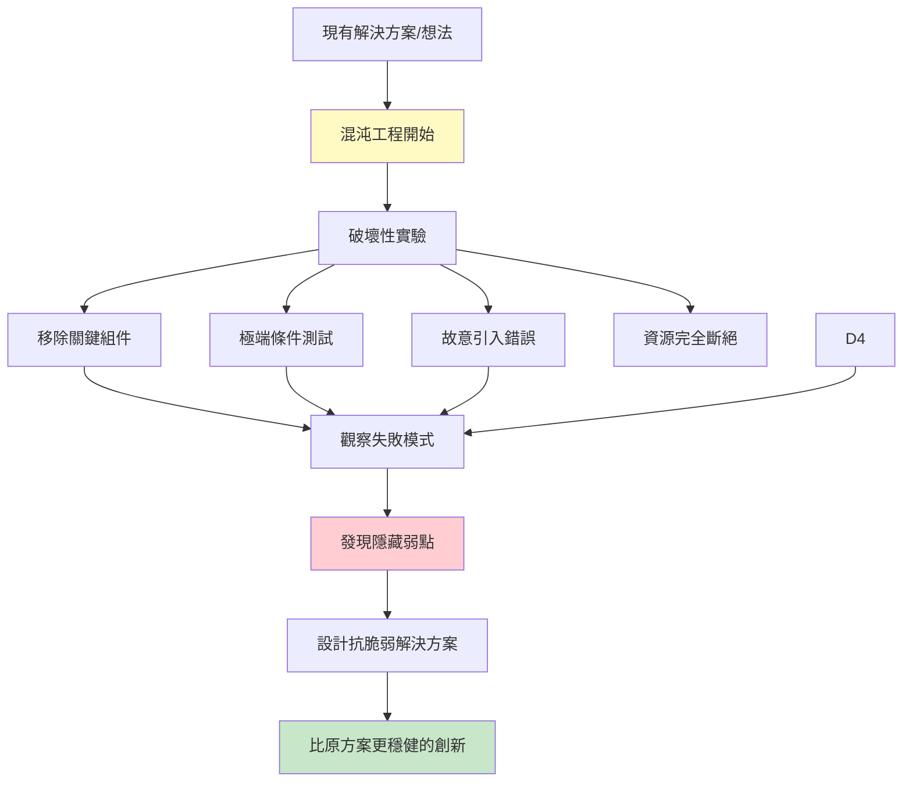
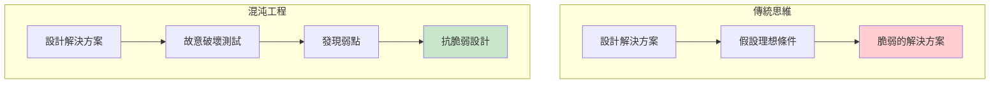
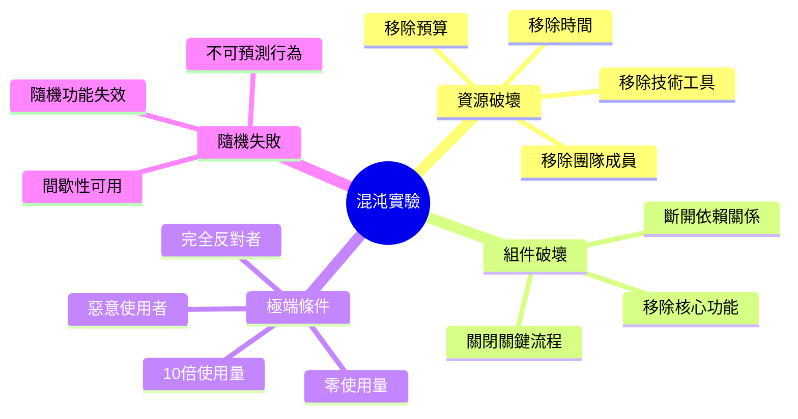
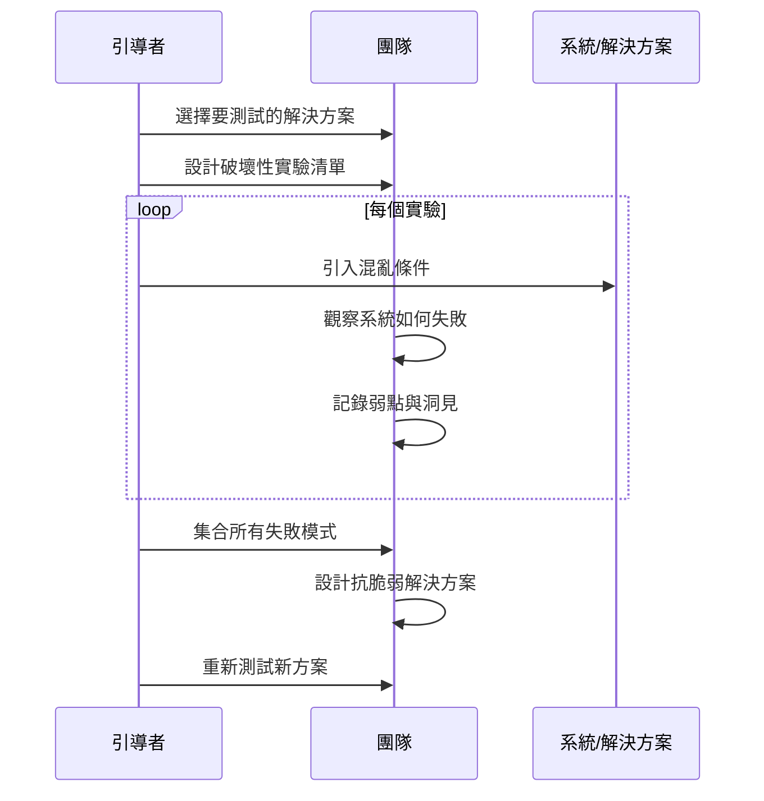
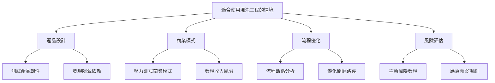
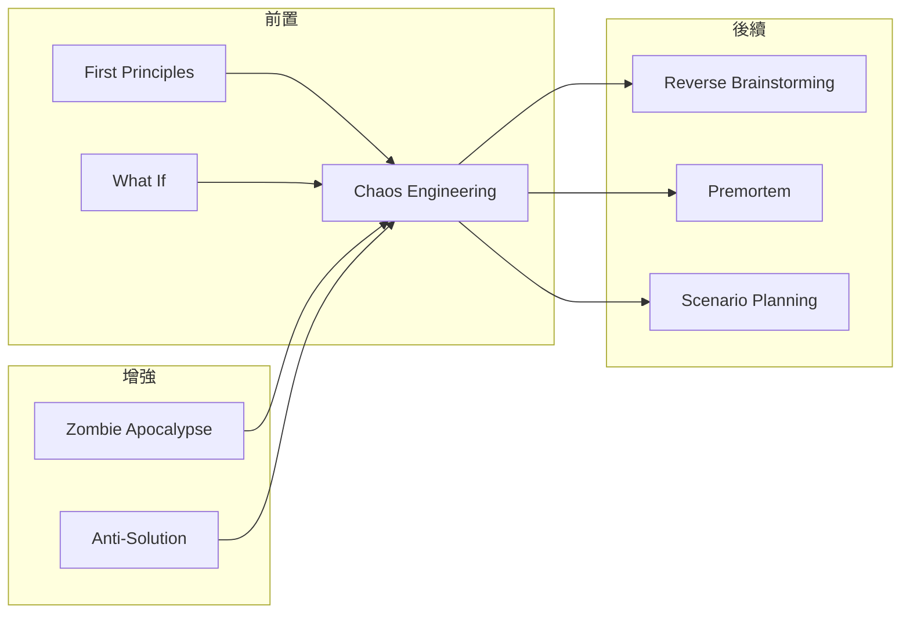

# Chaos Engineering

> 混沌工程 - 故意破壞系統來發現隱藏的穩健解決方案

## 基本資訊

| 屬性 | 值 |
|------|-----|
| 類別 | Wild |
| 能量等級 | 極高 |
| 建議時長 | 45-60 分鐘 |
| 參與人數 | 4-12 人 |
| 難度 | 高 |

## 技術概述

**Chaos Engineering**（混沌工程）是一種透過刻意引入失敗、破壞和極端條件來測試系統韌性的技術。在腦力激盪中，我們將這個概念應用於創意發想：透過故意破壞現有解決方案、假設最糟情境、製造混亂來發現真正穩健的創新想法。

## 歷史背景

混沌工程源自 Netflix 的「Chaos Monkey」工具，該工具會隨機關閉生產環境中的伺服器，迫使系統設計必須能容錯。這個概念被延伸到創新方法論：透過故意破壞來發現真正穩健的解決方案。

## 核心原理

### 為什麼故意破壞有效？

### 關鍵原則

1. **主動製造混亂**
   - 不等問題出現才反應
   - 主動尋找破壞點
   - 擁抱失敗作為學習工具

2. **極端條件測試**
   - 假設最糟情境
   - 推到崩潰邊緣
   - 測試極限承受度

3. **抗脆弱性優先**
   - 不只是穩健，而是從混亂中獲益
   - 設計能自我修復的系統
   - 擁抱不確定性

## 破壞性實驗類型

## 執行步驟

### 詳細步驟

#### 第一階段：準備實驗（10分鐘）

1. **選擇測試對象**
   - 現有產品/服務
   - 提議的解決方案
   - 商業模式

2. **定義穩定狀態**
   - 什麼是「正常運作」？
   - 關鍵指標是什麼？
   - 成功的樣子是什麼？

3. **設計混亂實驗**
   - 列出 5-10 種破壞方式
   - 從小範圍到大範圍
   - 從可能到極端

#### 第二階段：混沌實驗（30分鐘）

**實驗結構（每個實驗 5-8 分鐘）：**

1. **宣布混沌條件**
   - 例：「所有伺服器同時當機」
   - 例：「我們的核心功能被禁止」

2. **思考影響**
   - 系統會如何失敗？
   - 什麼會最先崩潰？
   - 用戶會經歷什麼？

3. **記錄弱點**
   - 單點失敗
   - 隱藏依賴
   - 假設的脆弱性

4. **發想應對方案**
   - 如何預防？
   - 如何偵測？
   - 如何快速恢復？

#### 第三階段：抗脆弱設計（15-20分鐘）

1. **整理失敗模式**
   - 哪些失敗最致命？
   - 哪些最常見？
   - 哪些最難預測？

2. **設計抗脆弱方案**
   - 冗余機制
   - 優雅降級
   - 自我修復能力
   - 從失敗中獲益

3. **重新測試**
   - 新方案能承受混沌嗎？
   - 還有什麼新弱點？

## 混沌實驗範例

### 資源消失實驗

| 實驗 | 混沌條件 | 探索問題 |
|------|----------|----------|
| 零預算 | 所有預算消失 | 核心價值是什麼？能用免費方式實現嗎？ |
| 零時間 | 明天必須上線 | 絕對必要的功能是什麼？MVP 是什麼？ |
| 零團隊 | 所有團隊成員離職 | 哪些知識沒有文件化？單點人才風險？ |
| 零技術 | 所有工具停止運作 | 能用紙筆完成嗎？核心流程是什麼？ |

### 組件破壞實驗

| 實驗 | 混沌條件 | 探索問題 |
|------|----------|----------|
| 移除登入 | 用戶無法登入 | 價值是否依賴身份？能否匿名提供價值？ |
| 移除搜尋 | 搜尋功能消失 | 用戶如何發現內容？導航足夠好嗎？ |
| 移除付款 | 無法收費 | 其他收入模式？免費也能運作嗎？ |
| 移除資料庫 | 無法儲存資料 | 能否無狀態運作？本地優先？ |

### 極端條件實驗

| 實驗 | 混沌條件 | 探索問題 |
|------|----------|----------|
| 1000倍流量 | 突然暴增用戶 | 瓶頸在哪？如何水平擴展？ |
| 零流量 | 完全沒有用戶 | 如何重新獲取？冷啟動策略？ |
| 100%惡意用戶 | 所有人都試圖破壞 | 安全漏洞在哪？如何防濫用？ |
| 全球禁令 | 主要市場禁止使用 | 其他市場機會？如何調整？ |

### 隨機失敗實驗

| 實驗 | 混沌條件 | 探索問題 |
|------|----------|----------|
| 間歇性故障 | 功能隨機失效 | 用戶體驗如何？錯誤處理是否優雅？ |
| 網路分區 | 部分用戶無法連接 | 離線模式？數據同步策略？ |
| 第三方失敗 | 依賴服務全掛 | 依賴有多深？替代方案？ |
| 數據損壞 | 隨機數據錯誤 | 驗證機制？能否偵測和修復？ |

## 引導提示與問題

### 引導開場

> 「今天我們要做一件瘋狂的事：故意破壞我們的解決方案。我們會假設各種災難情境，看看什麼會崩潰。這不是為了批評，而是為了發現隱藏的弱點，設計出更強大的方案。記住：在混沌中，我們找到真正的韌性。」

### 實驗引導問題

**引入混沌：**
- 「如果 [關鍵組件] 突然消失會怎樣？」
- 「想像最糟的情境是什麼？」
- 「什麼能讓整個系統崩潰？」

**觀察失敗：**
- 「這會如何失敗？」
- 「第一個崩潰的是什麼？」
- 「連鎖反應會是什麼？」
- 「用戶會經歷什麼？」

**發現洞見：**
- 「這揭示了什麼隱藏假設？」
- 「我們過度依賴什麼？」
- 「單點失敗在哪裡？」
- 「什麼是我們沒想到的？」

**設計韌性：**
- 「如何預防這種失敗？」
- 「如果無法預防，如何快速偵測？」
- 「如何優雅降級？」
- 「能否從這種失敗中獲益？」

## 適用場景

## 注意事項

### Do's（應該做）

- **建立心理安全感**
  - 強調這是實驗，不是批評
  - 失敗是學習的機會
  - 沒有「愚蠢」的破壞方式

- **從小混亂開始**
  - 先測試單一組件失敗
  - 再升級到系統性災難
  - 逐步提高混亂程度

- **記錄所有洞見**
  - 每個失敗模式
  - 隱藏的假設
  - 潛在的改進方向

- **專注於學習**
  - 不是為了證明方案糟糕
  - 而是為了讓它更好
  - 每個弱點都是機會

### Don'ts（不應該做）

- **不要真的破壞生產系統**
  - 這是思想實驗
  - 除非在安全環境

- **不要變成批鬥大會**
  - 不是找戰犯
  - 不是證明某人錯了

- **不要只破壞不建設**
  - 每個實驗要導向改進
  - 必須有解決方案輸出

- **不要忽略小失敗**
  - 小問題可能是大問題的徵兆
  - 邊緣案例很重要

## 變體技術

### 1. GameDay（演習日）
- 模擬真實災難情境
- 團隊實際演練應對
- 測試應急預案

### 2. 漸進式混沌
- 從 1% 失敗率開始
- 逐步增加到 100%
- 觀察臨界點

### 3. 混沌猴子輪盤
- 隨機抽取破壞項目
- 增加不可預測性
- 測試即時反應能力

### 4. 反向混沌（極端成功）
- 假設極度成功場景
- 「如果用戶成長 1000 倍？」
- 測試擴展能力

## 與其他技術的結合

## 案例研究

### 案例一：Netflix 原創

**背景：** Netflix 使用 Chaos Monkey 隨機關閉伺服器

**混沌實驗：**
- 隨機終止生產服務
- 模擬整個資料中心失敗
- 區域性網路中斷

**發現：**
- 單點失敗依賴
- 不夠優雅的降級
- 跨區域容錯不足

**結果：**
- 設計出全球分散式架構
- 微服務互相獨立
- 能承受整個 AWS 區域失敗

### 案例二：Airbnb 信任系統

**問題：** 如何設計穩健的信任機制？

**混沌實驗：**
- 「如果所有評價都是假的？」
- 「如果房東和房客串通詐騙？」
- 「如果身份驗證系統被破解？」

**發現：**
- 單一信任指標太脆弱
- 需要多重驗證機制
- 社交圖譜很重要

**結果：**
- 多層次信任系統
- 雙向評價
- 社交連結驗證
- 身份證驗證

## 工具推薦

### 混沌實驗卡片組

**資源類**
- 🔥 零預算卡
- ⏰ 零時間卡
- 👥 零團隊卡
- 🔧 零工具卡

**組件類**
- ❌ 核心功能移除卡
- 🔌 依賴服務斷線卡
- 🗄️ 資料庫失敗卡
- 🌐 網路中斷卡

**極端類**
- 📈 1000倍擴展卡
- 📉 零使用者卡
- 😈 惡意使用者卡
- 🚫 監管禁令卡

### 失敗模式記錄表

| 混沌實驗 | 失敗模式 | 影響程度 | 當前防禦 | 改進方向 |
|----------|----------|----------|----------|----------|
| ________ | ________ | 🔴🟡🟢 | ________ | ________ |

### 韌性評分卡

**維度：**
- 冗余性（有備份嗎？）
- 可觀察性（能偵測問題嗎？）
- 恢復能力（多快修復？）
- 降級優雅度（失敗時的體驗）
- 抗脆弱性（從失敗中獲益？）

## 研究支持

- **Nassim Taleb 的反脆弱理論**：系統應該從混亂中獲益
- **Netflix 混沌工程實踐**：主動引入失敗提高韌性
- **Google SRE 實踐**：預期失敗是設計的一部分
- **心理學研究**：預演災難（premortem）提高決策品質

## 參考資源

- [Principles of Chaos Engineering](https://principlesofchaos.org/)
- [Netflix Chaos Monkey](https://netflix.github.io/chaosmonkey/)
- [Antifragile by Nassim Taleb](https://www.penguinrandomhouse.com/books/176227/antifragile-by-nassim-nicholas-taleb/)
- [Google SRE Book](https://sre.google/sre-book/table-of-contents/)

---

*返回 [Wild 類別](./index.md) | [技術總覽](../index.md)*
