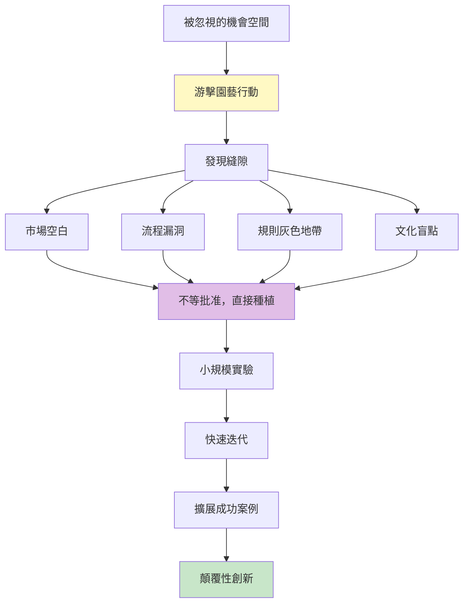
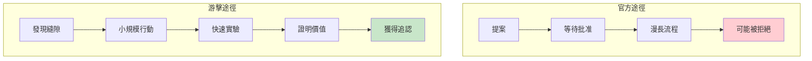
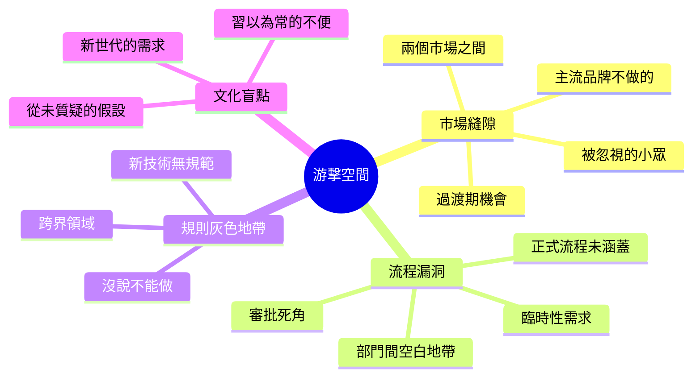
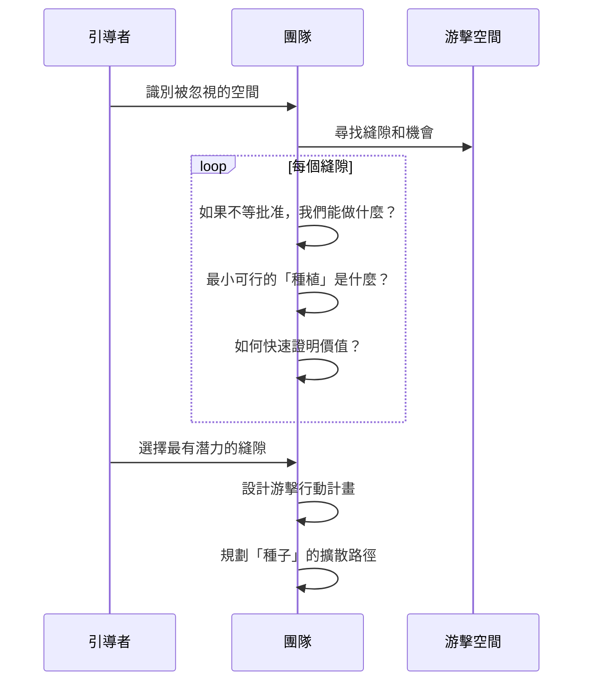
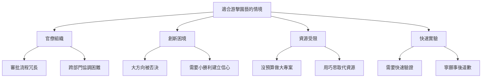
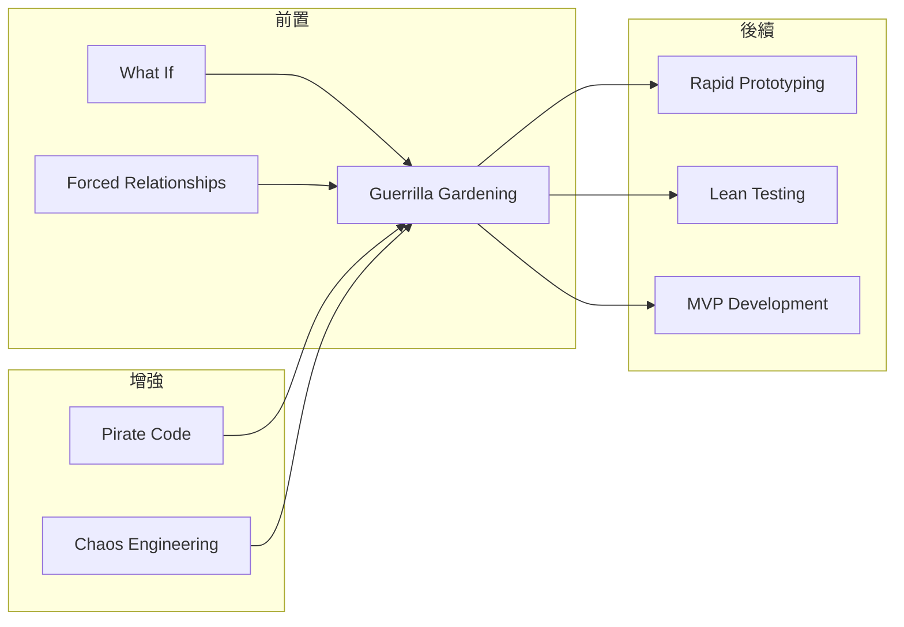

# Guerrilla Gardening Ideas

> 游擊園藝想法 - 在意想不到的地方種植解決方案的顛覆性創新

## 基本資訊

| 屬性 | 值 |
|------|-----|
| 類別 | Wild |
| 能量等級 | 高 |
| 建議時長 | 30-45 分鐘 |
| 參與人數 | 3-10 人 |
| 難度 | 中 |

## 技術概述

**Guerrilla Gardening Ideas**（游擊園藝想法）是一種受城市游擊園藝運動啟發的腦力激盪技術。游擊園丁在廢棄空地、路邊縫隙等意想不到的地方種植花草，不等批准、不走官方流程。這種精神應用到創新上，就是在「不被允許」、「被忽視」、「被認為不可能」的地方種下創意種子。



## 歷史背景

游擊園藝運動始於 1970 年代紐約，活動家在廢棄地塊種植花草，改善社區環境而不等待官方許可。這種「先做再說」、「在縫隙中創造」的精神，成為一種強大的創新隱喻：最好的創新往往出現在被忽視的角落。

## 核心原理

### 為什麼游擊方法有效？



### 關鍵原則

1. **發現被忽視的空間**
   - 大家都看不見的機會
   - 規則沒說不能做的事
   - 縫隙中的可能性

2. **先做再說**
   - 不等批准
   - 用行動證明
   - 快速原型優於完美計畫

3. **小而美的開始**
   - 不需要大資源
   - 從一個小角落開始
   - 證明概念後擴展

4. **顛覆性但友善**
   - 打破規則但不傷害人
   - 創造價值而非破壞
   - 讓人事後覺得「這真好」

## 游擊空間類型



## 執行步驟



### 詳細步驟

#### 第一階段：縫隙探索（15分鐘）

1. **繪製官方地圖**
   - 列出所有「官方」關注的領域
   - 標記主流玩家的位置
   - 畫出正式流程的範圍

2. **尋找縫隙**
   - 地圖上的空白是什麼？
   - 兩個領域之間的地帶？
   - 「不重要到沒人管」的角落？
   - 新出現但未被定義的空間？

3. **縫隙分類**
   - 市場縫隙
   - 流程縫隙
   - 規則縫隙
   - 文化縫隙

#### 第二階段：游擊構思（20-25分鐘）

**針對每個縫隙：**

1. **游擊問題**
   - 如果不等批准，我們能做什麼？
   - 用 1/10 的資源能實現什麼？
   - 最小的「種植」是什麼？
   - 誰會是第一個受益者？

2. **快速實驗設計**
   - 7 天內能做什麼？
   - 需要什麼最小資源？
   - 如何測量影響？
   - 成功的樣子是什麼？

3. **擴散路徑**
   - 如果成功，如何傳播？
   - 誰會成為傳教士？
   - 如何獲得追認？

#### 第三階段：行動規劃（10分鐘）

1. **選擇最佳縫隙**
   - 價值 vs 風險
   - 可行性 vs 影響力
   - 快速證明的可能性

2. **游擊行動計畫**
   - 第一週：種下第一顆種子
   - 第二週：觀察發芽
   - 第三週：分享成果
   - 第四週：規劃擴展

## 游擊策略範例

### 策略一：路邊縫隙（Sidewalk Cracks）

**情境：** 兩個部門都不管的小問題

**游擊行動：**
- 不等跨部門會議
- 直接解決問題
- 分享給兩邊團隊
- 讓他們事後爭相認領

**案例：** Gmail 最初是 Google 工程師的 20% 時間專案

### 策略二：廢棄空地（Abandoned Lots）

**情境：** 被放棄的產品/功能/市場

**游擊行動：**
- 撿起被丟棄的專案
- 用新方法重新詮釋
- 證明還有價值
- 獲得復活機會

**案例：** Instagram 原是失敗的 Burbn，簡化成照片分享

### 策略三：未被批准的美化（Unauthorized Beautification）

**情境：** 流程繁瑣到沒人改善的小事

**游擊行動：**
- 不走正式改進流程
- 直接讓體驗更好
- 讓人們習慣新體驗
- 變成新標準

**案例：** Slack 原本是遊戲公司的內部工具

### 策略四：種子炸彈（Seed Bombing）

**情境：** 需要在多處快速測試

**游擊行動：**
- 同時在多個縫隙種植
- 看哪裡發芽最快
- 專注在成功的地方
- 其他的自然淘汰

**案例：** Amazon 的「兩個披薩團隊」各自實驗

## 引導提示與問題

### 引導開場

> 「今天我們要成為游擊園丁。真實的游擊園丁不等市政府批准，就在路邊縫隙、廢棄空地種花。我們要用同樣的精神：在被忽視的角落、規則的縫隙、流程的盲點，種下創新的種子。記住：最好的機會往往在沒人看的地方。」

### 縫隙發現問題

- 「什麼是大家覺得『太小不重要』的問題？」
- 「有什麼是『沒說能做，但也沒說不能做』？」
- 「哪些空間是『兩個部門都以為對方在處理』？」
- 「有什麼新需求還沒有官方解決方案？」

### 游擊行動問題

- 「如果不需要批准，明天就能做什麼？」
- 「用 100 塊錢能證明什麼？」
- 「最小的『種子』是什麼？」
- 「一週內能看到什麼成果？」

### 擴散策略問題

- 「如果成功，誰會第一個注意到？」
- 「如何讓人們『發現』這個改善？」
- 「誰會成為自然的推廣者？」
- 「如何從『游擊』變成『官方』？」

## 適用場景



## 注意事項

### Do's（應該做）

- **選擇友善的游擊**
  - 創造價值，不是破壞
  - 讓人們事後感謝你
  - 解決真實問題

- **保持低調啟動**
  - 先做出成果
  - 再尋求關注
  - 用結果說話

- **記錄影響**
  - 誰受益了？
  - 問題如何改善？
  - 可量化的價值

- **準備擴散路徑**
  - 成功後如何正規化？
  - 誰會成為贊助者？
  - 如何獲得資源？

### Don'ts（不應該做）

- **不要真的違法**
  - 灰色地帶 ≠ 違法
  - 道德底線很重要
  - 不傷害他人利益

- **不要對抗權威**
  - 游擊不是戰爭
  - 目標是創造價值
  - 不是證明他們錯

- **不要忽視風險**
  - 評估最壞情況
  - 準備退出策略
  - 失敗時的影響

- **不要孤軍奮戰**
  - 找到共謀者
  - 建立小聯盟
  - 互相掩護

## 變體技術

### 1. 游擊原型（Guerrilla Prototyping）
- 不等完整需求
- 直接做出可用原型
- 讓用戶實際體驗
- 反向定義需求

### 2. 游擊測試（Guerrilla Testing）
- 不做正式用戶研究
- 直接找路人測試
- 咖啡店、街頭、辦公室
- 快速獲得反饋

### 3. 游擊行銷（Guerrilla Marketing）
- 不買廣告
- 創造話題性事件
- 病毒式傳播
- 以創意取代預算

### 4. 游擊整合（Guerrilla Integration）
- 不等官方 API
- 找到連接的方法
- 證明整合的價值
- 推動官方支持

## 與其他技術的結合



## 案例研究

### 案例一：Facebook「讚」按鈕

**背景：** 不在官方路線圖上

**游擊行動：**
- 工程師的 Hackathon 專案
- 未經批准就實作
- 內部測試反應熱烈
- 快速推向全球

**結果：** 成為 Facebook 最標誌性功能之一

### 案例二：3M 便利貼

**背景：** 「失敗」的膠水配方

**游擊行動：**
- 工程師自己找應用場景
- 不等公司指派方向
- 在公司內部推廣
- 證明市場需求

**結果：** 3M 最成功的產品之一

### 案例三：Gmail

**背景：** Google 的 20% 時間專案

**游擊行動：**
- 非官方郵件服務專案
- 小團隊自主開發
- 邀請制創造稀缺性
- 口碑傳播

**結果：** 顛覆整個郵件服務市場

## 工具推薦

### 縫隙探索畫布

```
官方版圖：
┌─────────────────────────────────┐
│                                 │
│  [主流市場] [官方流程] [規則]   │
│                                 │
│     空白 → 縫隙機會？            │
│                                 │
│  [部門A]      ?      [部門B]    │
│                                 │
└─────────────────────────────────┘

縫隙問題：
- 這裡為什麼是空白？
- 誰忽視了這個空間？
- 如果有解決方案會如何？
```

### 游擊行動計畫表

| 元素 | 內容 |
|------|------|
| 縫隙位置 | _________（被忽視的機會空間）|
| 種子想法 | _________（最小可行方案）|
| 第一步 | _________（明天就能做的事）|
| 成功指標 | _________（如何知道有效）|
| 擴散路徑 | _________（如何讓更多人受益）|
| 風險評估 | _________（最壞情況是什麼）|

### 游擊價值證明清單

**證明價值的方式：**
- [ ] 解決了真實用戶的問題
- [ ] 有可量化的影響
- [ ] 用戶主動要求更多
- [ ] 其他團隊想複製
- [ ] 上級事後認可
- [ ] 媒體/社群自然關注

## 研究支持

- **Clayton Christensen 破壞性創新理論**：最好的創新從邊緣開始
- **Skunkworks 模式**：小團隊在官僚體系外創新
- **精實創業**：先做出來，快速驗證，迭代改進
- **20% 時間**：Google、3M 的創新實踐

## 參考資源

- [Guerrilla Gardening: A Manualfesto](http://www.guerrillagardening.org/)
- [The Innovator's Dilemma by Clayton Christensen](https://www.hbs.edu/faculty/Pages/item.aspx?num=46)
- [Skunk Works by Ben Rich](https://www.littlebrown.com/titles/ben-r-rich/skunk-works/9780316743907/)
- [ReWork by Jason Fried](https://basecamp.com/books/rework)

---

*返回 [Wild 類別](./index.md) | [技術總覽](../index.md)*
