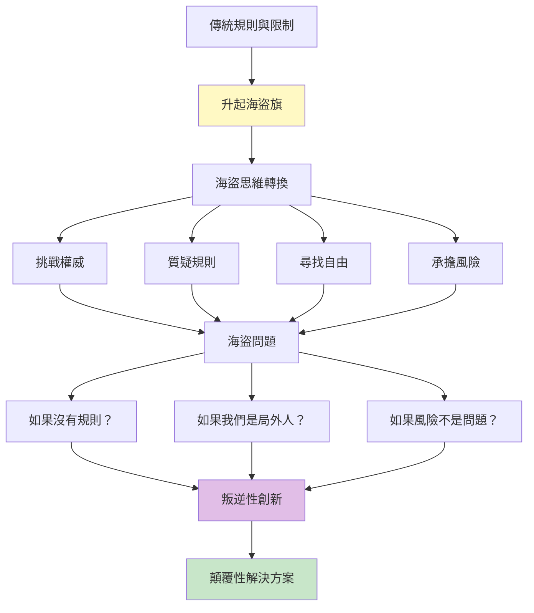
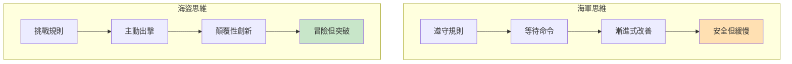
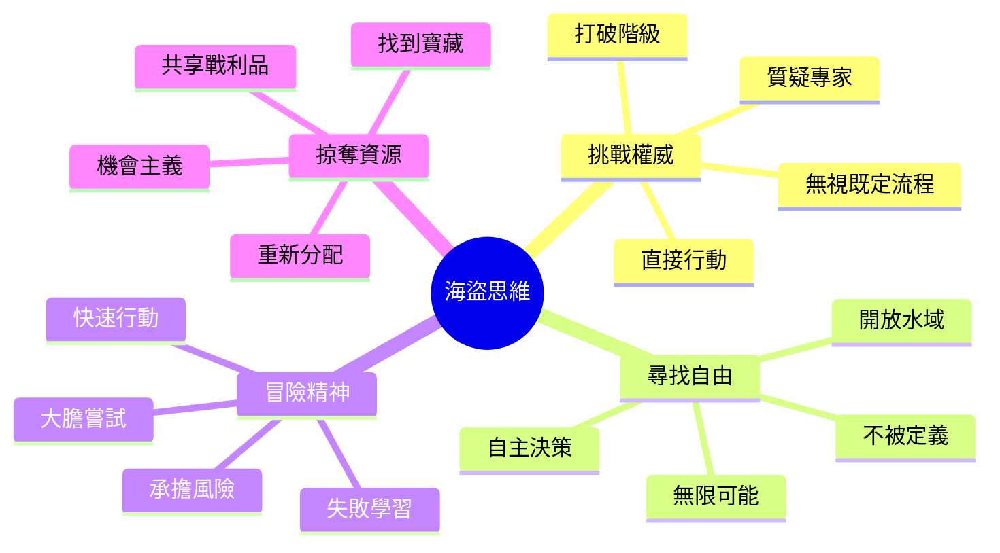
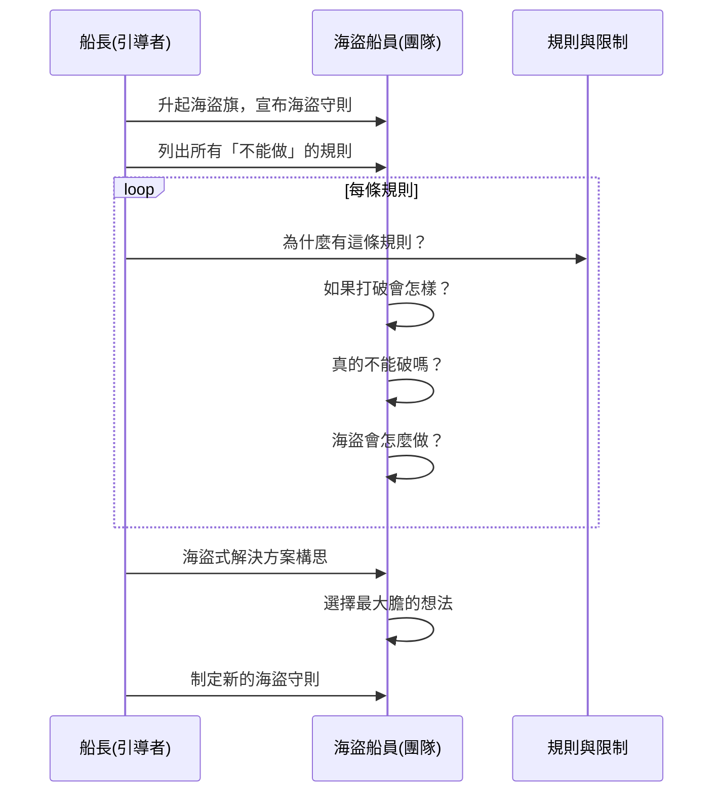
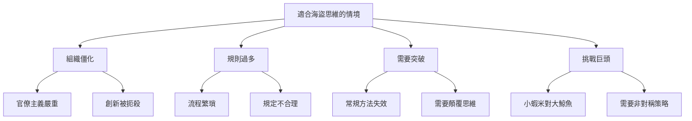
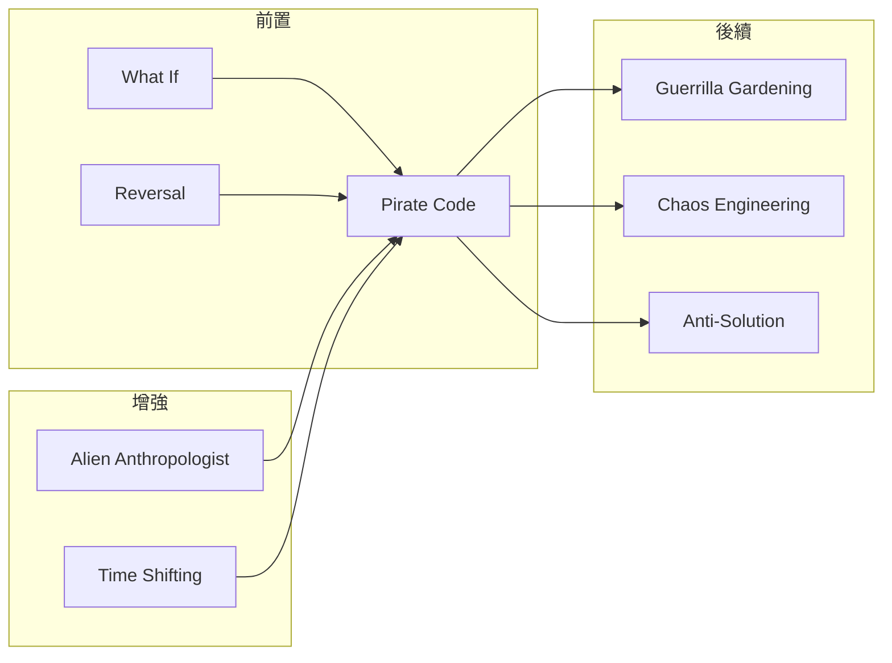

# Pirate Code Brainstorm

> 海盜守則腦力激盪 - 無視規則、挑戰權威、尋找自由的創意探索

## 基本資訊

| 屬性 | 值 |
|------|-----|
| 類別 | Wild |
| 能量等級 | 極高 |
| 建議時長 | 30-45 分鐘 |
| 參與人數 | 4-15 人 |
| 難度 | 中-高 |

## 技術概述

**Pirate Code Brainstorm**（海盜守則腦力激盪）是一種透過採用「海盜思維」來打破規則和既有假設的技術。參與者暫時成為「海盜」，挑戰所有「應該」、「不能」、「向來如此」的限制，用叛逆、自由、冒險的精神尋找被規則掩蓋的創新機會。

## 歷史背景

歷史上的海盜雖然不法，但他們的組織往往比當代的海軍更民主、更創新。海盜守則（Pirate Code）是海盜船上的自治規則，體現了挑戰權威但建立自己秩序的精神。在創新領域，「海盜精神」代表著挑戰既有規則、尋找新可能性的勇氣。

**Steve Jobs 名言：** "It's better to be a pirate than to join the navy."（當海盜比加入海軍更好）

## 核心原理

### 為什麼海盜思維有效？

### 關鍵原則

1. **質疑所有規則**
   - 為什麼一定要這樣？
   - 誰說不能那樣做？
   - 這規則還適用嗎？

2. **擁抱叛逆身份**
   - 局外人的優勢
   - 不需要被接受
   - 自由探索禁區

3. **承擔計算過的風險**
   - 高風險高回報
   - 快速行動
   - 寧願道歉不要批准

4. **建立新規則**
   - 不是無政府
   - 創造更好的秩序
   - 海盜也有守則

## 海盜思維維度

## 執行步驟

### 詳細步驟

#### 第一階段：升起海盜旗（10分鐘）

1. **情境設定**
   - 宣布進入「海盜模式」
   - 解釋海盜守則精神
   - 建立心理安全感：「這是安全的叛逆」

2. **列出規則清單**
   - 我們「不能」做什麼？
   - 什麼是「不可能」的？
   - 有什麼「紅線」不可踰越？
   - 什麼「向來如此」？

3. **分配海盜角色**
   - 船長（引導者）
   - 大副（記錄者）
   - 船員（全體參與者）
   - 每個人選擇海盜名號

#### 第二階段：海盜突襲（25-30分鐘）

**針對每條規則進行「海盜審問」：**

1. **質疑規則（5分鐘）**
   - 為什麼有這條規則？
   - 誰制定的？還適用嗎？
   - 目的是什麼？
   - 有沒有過時？

2. **海盜挑戰（5分鐘）**
   - 如果打破會怎樣？
   - 最壞情況是什麼？
   - 真的不能破嗎？
   - 有沒有灰色地帶？

3. **海盜方案（5分鐘）**
   - 海盜會怎麼做？
   - 局外人會如何看待？
   - 如果我們不在乎後果？
   - 最大膽的做法是什麼？

#### 第三階段：新海盜守則（10分鐘）

1. **評估戰利品**
   - 哪些海盜想法最有價值？
   - 哪些實際上可行？
   - 風險 vs 回報如何？

2. **制定新守則**
   - 保留哪些好規則？
   - 打破哪些壞規則？
   - 創造什麼新規則？
   - 我們的海盜守則是什麼？

## 海盜問題範例

### 挑戰權威類

| 海盜問題 | 探索方向 |
|----------|----------|
| 如果我們無視專家建議？ | 門外漢的優勢是什麼？ |
| 如果我們是競爭者會怎麼做？ | 局外人的視角 |
| 如果 CEO 不存在？ | 去中心化決策 |
| 如果我們被開除也無所謂？ | 最大膽的建議 |

### 質疑規則類

| 海盜問題 | 探索方向 |
|----------|----------|
| 為什麼一定要有這個流程？ | 流程的必要性 |
| 這規則還適用嗎？ | 過時假設 |
| 如果沒有這個限制？ | 理想狀態 |
| 誰說我們不能？ | 隱藏可能性 |

### 冒險精神類

| 海盜問題 | 探索方向 |
|----------|----------|
| 最瘋狂的做法是什麼？ | 極端可能性 |
| 如果失敗沒關係？ | 大膽實驗 |
| 如果我們只有一次機會？ | 孤注一擲 |
| 全押會押什麼？ | 最大信念 |

### 資源掠奪類

| 海盜問題 | 探索方向 |
|----------|----------|
| 如果可以「借用」任何資源？ | 資源重組 |
| 寶藏在哪裡？ | 隱藏價值 |
| 如何重新分配資源？ | 優先順序顛覆 |
| 什麼是我們的「掠奪目標」？ | 機會主義 |

## 引導提示與對話範例

### 開場引導

> 「各位海盜船員，歡迎登上『創新號』！今天我們要航行到危險但充滿寶藏的水域。我們不遵守傳統海軍的規則，我們有自己的海盜守則。記住海盜信條：挑戰權威、質疑規則、勇於冒險。但我們不是暴徒——我們要建立更好的秩序。準備好了嗎？升起黑旗，出航！」

### 角色扮演範例

**船長：** 「船員們，我們面前有一條規則：『所有功能都需要三個月的用戶研究』。海盜們，你們怎麼看？」

**船員 A（扮演海盜）：** 「船長，三個月？敵艦早就跑了！我們直接登船，問第一個乘客他們想要什麼，明天就開始做！」

**船員 B：** 「或者，我們先做出來，看看有誰使用。用戶的行為比他們說的更真實！」

**船長：** 「很好！海盜不等完美情報，我們邊做邊學。記下這個想法：快速原型勝過冗長研究。」

### 質疑引導

**對於規則：** 「這是誰的規則？他們是敵艦，不是我們的船長！」

**對於限制：** 「海盜不接受限制，我們找到繞過的方法！」

**對於風險：** 「沒有風險就沒有寶藏！我們計算風險，但不迴避它！」

## 適用場景

## 注意事項

### Do's（應該做）

- **建立安全的叛逆空間**
  - 明確這是思想實驗
  - 不會有真實後果
  - 鼓勵大膽表達

- **保持海盜精神的趣味性**
  - 用海盜語言
  - 角色扮演投入
  - 享受叛逆的感覺

- **質疑但不侮辱**
  - 挑戰規則不是攻擊制定者
  - 批判但保持尊重
  - 對事不對人

- **最後回到現實**
  - 評估可行性
  - 風險評估
  - 選擇可執行的想法

### Don'ts（不應該做）

- **不要真的違法或違反道德**
  - 海盜思維 ≠ 犯罪思維
  - 守住底線
  - 挑戰規則不是傷害人

- **不要變成抱怨大會**
  - 不只是批評現狀
  - 要提出替代方案
  - 建設性叛逆

- **不要忽視後果**
  - 大膽但不魯莽
  - 計算風險
  - 準備應對方案

- **不要在不安全的環境使用**
  - 需要高度心理安全
  - 如果組織文化保守，慎用
  - 評估政治風險

## 變體技術

### 1. 海盜 vs 海軍辯論

- 分成海盜組和海軍組
- 海盜挑戰規則
- 海軍辯護規則
- 從衝突中找到智慧

### 2. 海盜突襲計畫

- 選擇一個「目標」（競爭者、市場）
- 設計海盜式進攻策略
- 非常規、出其不意
- 小而快的攻擊

### 3. 海盜守則重寫

- 列出組織所有正式規則
- 逐條海盜式重寫
- 「正式」vs「海盜」版本對照
- 找出改進空間

### 4. 傳奇海盜顧問

- 邀請歷史海盜（角色扮演）
- 黑鬍子會怎麼做？
- 鄭一嫂會怎麼說？
- 從海盜歷史學習

## 與其他技術的結合

## 案例研究

### 案例一：蘋果電腦早期

**海盜精神：**
- Jobs 的名言：「當海盜比加入海軍更好」
- Macintosh 團隊升起海盜旗
- 挑戰 IBM 主導的 PC 市場

**海盜做法：**
- 無視「電腦必須複雜」的規則
- 挑戰「商業軟體必須昂貴」
- 不遵循行業標準

**結果：** 個人電腦革命

### 案例二：Netflix vs Blockbuster

**海盜挑戰：**
- 「為什麼要有逾期罰款？」
- 「為什麼要去店裡租片？」
- 「為什麼不能看到飽？」

**海盜方案：**
- 郵寄租賃（後來串流）
- 無逾期費
- 吃到飽訂閱

**結果：** 顛覆整個產業

### 案例三：Uber

**海盜質疑：**
- 「為什麼需要計程車執照？」
- 「為什麼不能用私家車？」
- 「為什麼要路邊招車？」

**海盜做法：**
- 在灰色地帶運作
- 先做再說
- 用成長對抗監管

**爭議：** 海盜精神的道德界限

## 海盜守則範本

### 真實海盜守則（改編自歷史）

1. **人人有發言權** - 民主決策
2. **公平分配戰利品** - 共享成果
3. **不拋棄受傷船員** - 照顧團隊
4. **在陸地上的爭執在海上解決** - 專注目標
5. **勇者得先選** - 獎勵勇氣

### 創新海盜守則（現代改編）

1. **質疑所有「不可能」**
2. **寧願道歉不要批准**
3. **快速行動打破常規**
4. **失敗是航行的一部分**
5. **分享所有發現的寶藏**
6. **挑戰權威但尊重人性**
7. **建立更好的新規則**

## 工具推薦

### 規則挑戰卡

製作一副卡片，每張有一個海盜問題：
- 🏴‍☠️ 為什麼規則卡：「為什麼一定要這樣？」
- ⚔️ 挑戰權威卡：「誰說的？」
- 💎 尋寶卡：「隱藏的機會在哪？」
- 🚢 冒險卡：「最大膽的做法是什麼？」

### 海盜會議工具箱

- 海盜旗（實體或虛擬）
- 海盜名號生成器
- 「規則清單」白板
- 「戰利品」記錄表

## 研究支持

- **Steve Jobs 的海盜文化**：Macintosh 團隊的創新實踐
- **破壞性創新理論**：挑戰既有規則的重要性
- **心理學安全感研究**：「安全的叛逆」促進創新
- **歷史研究**：真實海盜組織的民主創新

## 參考資源

- [Pirates of the Caribbean: Pirate Code](https://pirates.fandom.com/wiki/Code_of_the_Pirate_Brethren)
- [Steve Jobs: Pirate vs Navy](https://www.folklore.org/StoryView.py?project=Macintosh&story=Pirate_Flag.txt)
- [The Innovator's Dilemma](https://www.hbs.edu/faculty/Pages/item.aspx?num=46)
- [Radical Candor by Kim Scott](https://www.radicalcandor.com/)

---

*返回 [Wild 類別](./index.md) | [技術總覽](../index.md)*
