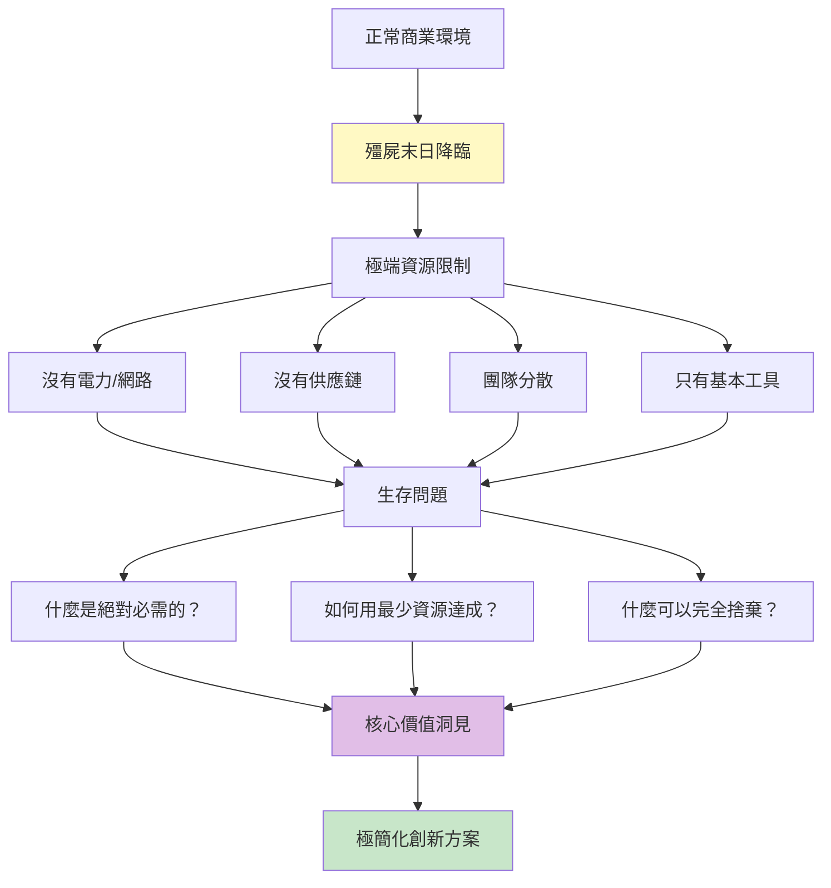
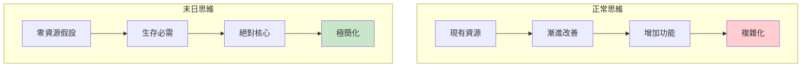
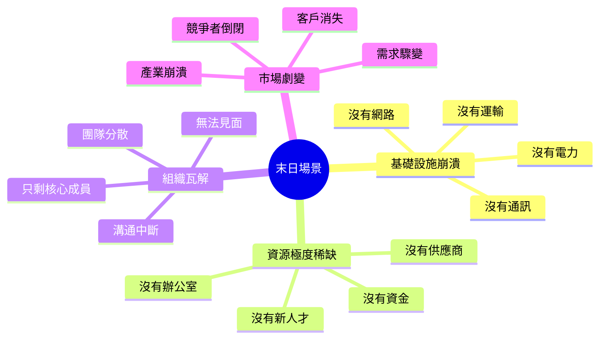
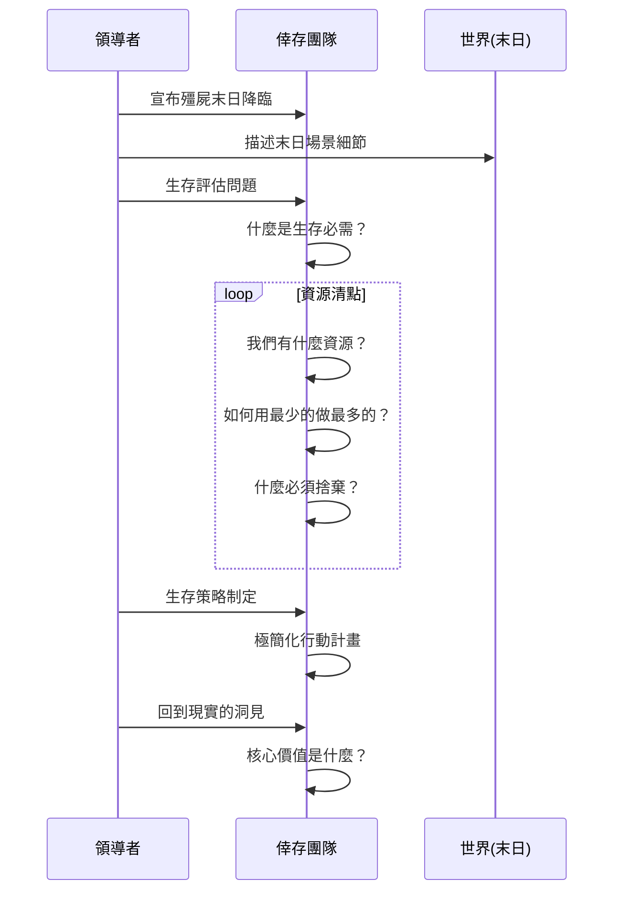
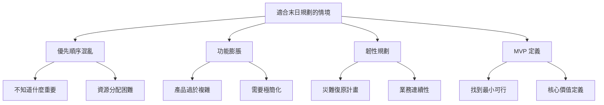
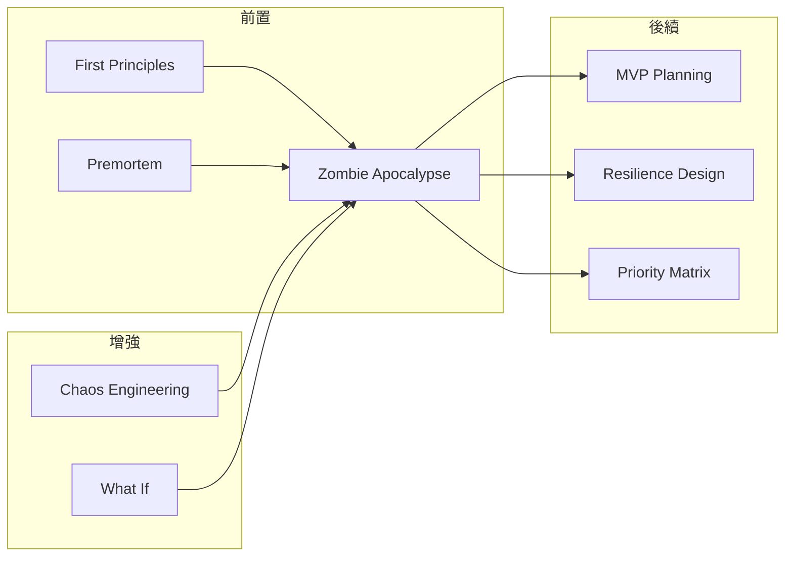

# Zombie Apocalypse Planning

> 殭屍末日規劃 - 極端生存情境下的本質思考與優先順序

## 基本資訊

| 屬性 | 值 |
|------|-----|
| 類別 | Wild |
| 能量等級 | 極高 |
| 建議時長 | 40-60 分鐘 |
| 參與人數 | 4-12 人 |
| 難度 | 中 |

## 技術概述

**Zombie Apocalypse Planning**（殭屍末日規劃）是一種透過假設極端生存情境來釐清核心價值和絕對優先順序的技術。當面對「殭屍末日」時，所有奢侈、裝飾、「好有的」功能都消失了，只剩下「生存必需」。這種極端思考幫助團隊識別真正重要的事物。



## 歷史背景

美國疾病控制中心（CDC）曾經發布「殭屍末日生存指南」作為緊急應變的教育工具。這個看似荒謬的情境實際上是強大的思考工具：如果能在殭屍末日中生存，就能應對大部分真實災難。這個概念被延伸到商業策略：極端情境暴露核心價值。

## 核心原理

### 為什麼末日情境有效？



### 關鍵原則

1. **極端稀缺假設**
   - 所有資源都消失
   - 基礎設施崩潰
   - 只有手邊的東西

2. **生存優先思維**
   - 什麼是活下去的必需？
   - 絕對不能沒有什麼？
   - 其他都是奢侈

3. **韌性設計**
   - 如何在最糟情況下運作？
   - 降級但不停擺
   - 簡單但穩健

4. **本質回歸**
   - 剝除所有裝飾
   - 回到核心目的
   - 發現真正的價值

## 殭屍末日場景類型



## 執行步驟



### 詳細步驟

#### 第一階段：末日降臨（10分鐘）

1. **場景設定**
   - 選擇末日類型（無電力、無網路、無團隊等）
   - 描述具體情境
   - 建立緊迫感

2. **資源盤點**
   - 現在有什麼資源？
   - 末日後還剩什麼？
   - 什麼會完全消失？

3. **威脅識別**
   - 最大的威脅是什麼？
   - 什麼會導致完全失敗？
   - 如何定義「生存」？

#### 第二階段：生存計畫（30-40分鐘）

**生存三問（每問 10-15 分鐘）：**

1. **絕對必需問題**
   - 「沒有什麼就完全無法運作？」
   - 「用戶真正需要的核心是什麼？」
   - 「如果只能保留一個功能？」
   - 「生存的最低標準是什麼？」

2. **資源極簡問題**
   - 「如何用 1/10 的資源達成核心功能？」
   - 「什麼可以手動完成？」
   - 「有什麼免費替代方案？」
   - 「社群能幫助什麼？」

3. **韌性設計問題**
   - 「如何在斷網狀態下運作？」
   - 「如果供應商消失怎麼辦？」
   - 「如何本地優先？」
   - 「單點失敗如何消除？」

#### 第三階段：重建計畫（10分鐘）

1. **核心洞見**
   - 什麼被證明是必需的？
   - 什麼被證明是奢侈的？
   - 優先順序如何改變？

2. **回到現實**
   - 這些洞見如何應用？
   - 現在應該簡化什麼？
   - 應該強化什麼韌性？

## 末日問題範例

### 基礎設施崩潰類

| 末日場景 | 生存問題 | 洞見方向 |
|----------|----------|----------|
| 全球斷網 | 產品如何運作？ | 離線優先、本地存儲 |
| 電力消失 | 最低耗能方案？ | 極簡化介面、節能設計 |
| 雲端服務全掛 | 數據如何保存？ | 自主託管、數據主權 |
| 金流系統崩潰 | 如何收費/交易？ | 替代交易方式、信任系統 |

### 資源稀缺類

| 末日場景 | 生存問題 | 洞見方向 |
|----------|----------|----------|
| 零預算 | 免費能做什麼？ | 開源工具、社群力量 |
| 供應鏈中斷 | 如何自給自足？ | 垂直整合、簡化依賴 |
| 沒有員工 | 什麼可以自動化？ | AI、自動化、簡化流程 |
| 沒有辦公室 | 遠距如何運作？ | 異步協作、文件化 |

### 組織瓦解類

| 末日場景 | 生存問題 | 洞見方向 |
|----------|----------|----------|
| 團隊分散各地 | 如何協調？ | 去中心化、自主團隊 |
| 只剩創辦人 | 核心知識是什麼？ | 文件化、簡化、傳承 |
| 無法開會 | 異步如何決策？ | 書面決策、透明度 |
| 溝通中斷 | 如何對齊？ | 明確原則、自主判斷 |

### 市場劇變類

| 末日場景 | 生存問題 | 洞見方向 |
|----------|----------|----------|
| 主要客戶消失 | 核心價值給誰？ | 多元化、基本需求 |
| 付費用戶歸零 | 免費也有價值嗎？ | 本質價值、社會影響 |
| 產業崩潰 | 技能如何轉移？ | 可遷移能力、根本價值 |
| 全球經濟衰退 | 什麼是必需品？ | 基本需求、防禦性產品 |

## 引導提示與情境

### 開場引導

> 「各位，我有個壞消息：殭屍末日降臨了。就在今天，全球網路中斷、電力系統崩潰、供應鏈瓦解。我們只有手邊的資源。我們的產品/服務在這種情況下還有意義嗎？如果有，如何用最原始的方法實現核心價值？如果沒有，什麼才是真正重要的？這不是玩笑——這是找出核心的最快方法。」

### 情境描述範例

**末日場景一：全球斷網**
> 「所有網路基礎設施崩潰。沒有雲端、沒有 API、沒有線上服務。你的手機能用但只能打電話和發簡訊。你的筆電有電但沒網路。你的產品如何提供價值？」

**末日場景二：團隊瓦解**
> 「只剩下你和一個工程師。其他人都在處理自己的生存問題。沒有設計師、沒有行銷、沒有客服。你們兩個人如何維持核心服務？什麼是你們絕對不能停止的？」

**末日場景三：資源歸零**
> 「所有外部服務都停止計費，因為沒人付款。AWS、Stripe、所有 SaaS 都停了。你只有一台筆電和免費的開源軟體。你能重建什麼？」

### 生存問題引導

- 「如果世界末日，用戶真正需要我們什麼？」
- 「什麼是我們生存的最低標準？」
- 「如何用石器時代的工具提供核心價值？」
- 「什麼功能是裝飾，什麼是生存必需？」

## 適用場景



## 注意事項

### Do's（應該做）

- **營造真實緊迫感**
  - 讓場景具體且可信
  - 建立情境投入感
  - 但保持適當幽默

- **強迫艱難選擇**
  - 不允許「全部都要」
  - 必須排優先順序
  - 面對取捨

- **記錄核心洞見**
  - 什麼被保留？
  - 什麼被捨棄？
  - 為什麼？

- **連結回現實**
  - 極簡化的啟發
  - 韌性設計原則
  - 優先順序調整

### Don'ts（不應該做）

- **不要太恐怖**
  - 保持專業和幽默
  - 不要引起真實焦慮
  - 這是思想工具

- **不要停在負面**
  - 不只是找問題
  - 要設計解決方案
  - 積極建設性

- **不要忽視情感**
  - 有人可能不舒服
  - 觀察團隊反應
  - 適時調整

- **不要照單全收**
  - 末日方案太極端
  - 需要平衡現實
  - 提取原則而非照搬

## 變體技術

### 1. 特定災難場景

- **網路末日**：全球斷網
- **金融末日**：貨幣系統崩潰
- **能源末日**：沒有電力
- **物流末日**：無法運輸

### 2. 漸進式末日

- 第一週：小問題
- 第一月：系統性問題
- 第一年：完全崩潰
- 觀察臨界點

### 3. 重建挑戰

- 從末日倖存
- 如何重建文明
- 優先重建什麼
- 新世界的規則

### 4. 部門末日

- 如果行銷消失
- 如果工程消失
- 如果銷售消失
- 發現跨功能依賴

## 與其他技術的結合



## 案例研究

### 案例一：Basecamp 的簡化

**問題：** 產品功能過於複雜

**末日問題：**
- 如果只能保留 3 個功能？
- 如果用戶沒有訓練就要使用？
- 如果我們只有一個工程師？

**洞見：**
- 90% 功能很少被使用
- 核心是溝通和任務管理
- 簡單勝過功能豐富

**行動：** 大幅簡化產品，專注核心

### 案例二：WhatsApp 的極簡

**末日思考：**
- 如果在網路不穩定的環境？
- 如果設備性能很差？
- 如何用最少資源連接世界？

**設計原則：**
- 極簡介面
- 低頻寬優化
- 可靠的訊息傳遞
- 沒有廣告干擾

**結果：** 全球最成功的通訊應用

### 案例三：COVID-19 現實末日

**真實場景：**
- 突然全面遠距
- 供應鏈中斷
- 商業模式崩潰

**倖存者特徵：**
- 已有遠距能力
- 數位化程度高
- 商業模式靈活
- 韌性設計

**教訓：** 末日規劃不是玩笑

## 工具推薦

### 生存必需評估矩陣

|項目|生存必需？|替代方案|簡化版本|
|----|----------|--------|--------|
|功能 A| 🔴/🟡/🟢 | _____ | _____ |
|服務 B| 🔴/🟡/🟢 | _____ | _____ |

**標準：**
- 🔴 絕對必需（沒有就死）
- 🟡 重要（影響生存品質）
- 🟢 奢侈（可以完全捨棄）

### 末日場景卡

製作情境卡片：
- 💥 斷網卡：所有網路中斷
- ⚡ 斷電卡：沒有電力
- 💰 破產卡：沒有資金
- 👥 孤獨卡：只剩你一人
- 📦 斷鏈卡：供應鏈崩潰

### 三層生存模型

```
第一層：絕對必需
- 沒有就立刻失敗
- 核心中的核心

第二層：重要但可降級
- 影響品質但可運作
- 簡化版本

第三層：增強但非必要
- 錦上添花
- 末日時完全捨棄
```

## 研究支持

- **CDC 殭屍末日準備指南**：用極端情境教育應急準備
- **Nassim Taleb 黑天鵝理論**：為極端事件做準備
- **精實創業 MVP 概念**：最小可行產品思維
- **災難復原規劃**：業務連續性的重要性

## 參考資源

- [CDC Zombie Preparedness](https://www.cdc.gov/cpr/zombie/index.htm)
- [The Black Swan by Nassim Taleb](https://www.penguinrandomhouse.com/books/176226/the-black-swan-second-edition-by-nassim-nicholas-taleb/)
- [The Lean Startup by Eric Ries](http://theleanstartup.com/)
- [Antifragile: Things That Gain from Disorder](https://www.penguinrandomhouse.com/books/176227/antifragile-by-nassim-nicholas-taleb/)

---

*返回 [Wild 類別](./index.md) | [技術總覽](../index.md)*
