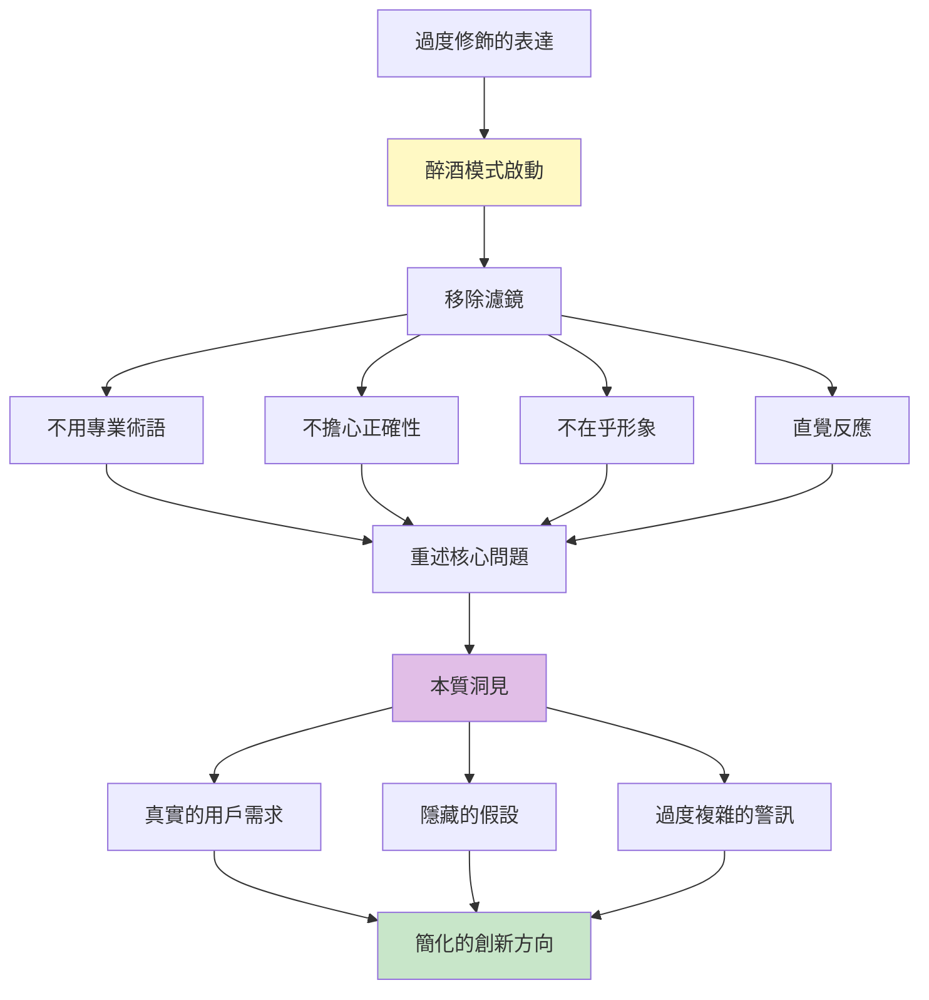
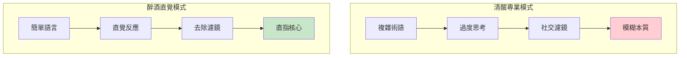
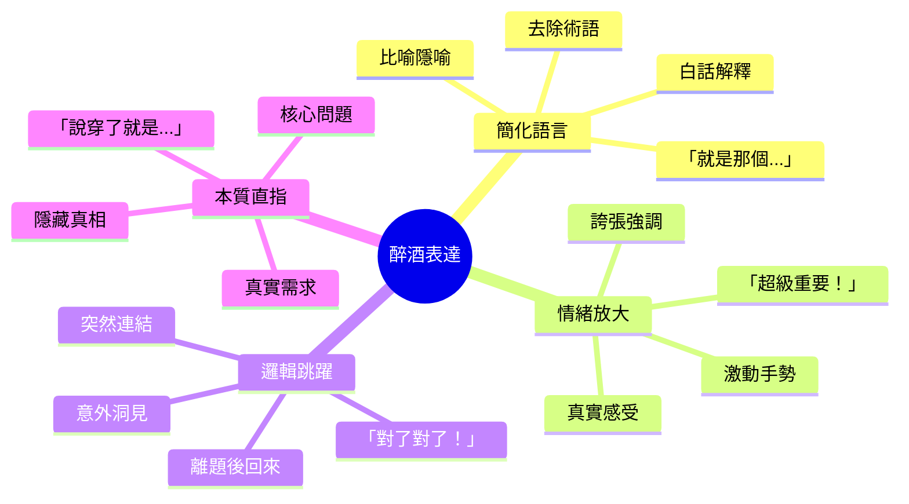
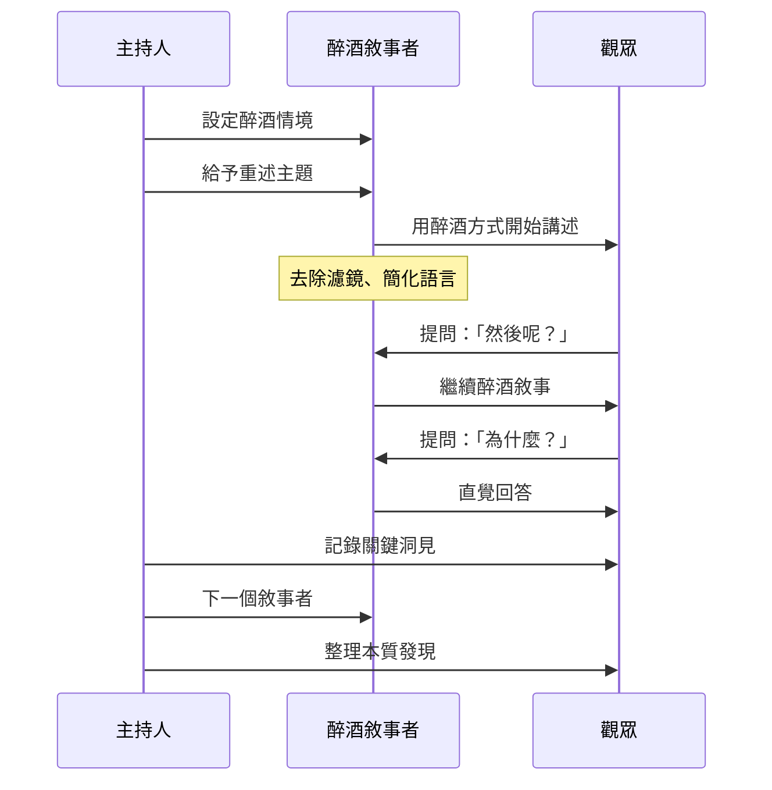
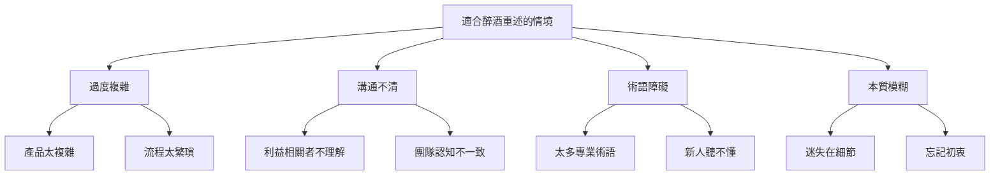
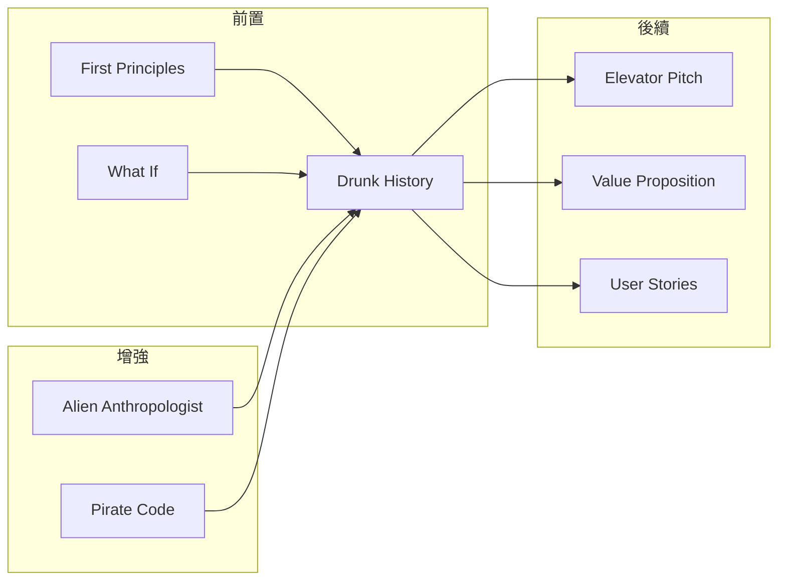

# Drunk History Retelling

> 醉酒歷史重述 - 去除濾鏡、簡化本質、釋放直覺的表達方式

## 基本資訊

| 屬性 | 值 |
|------|-----|
| 類別 | Wild |
| 能量等級 | 高 |
| 建議時長 | 30-45 分鐘 |
| 參與人數 | 3-10 人 |
| 難度 | 中 |

## 技術概述

**Drunk History Retelling**（醉酒歷史重述）靈感來自同名喜劇節目，參與者用「醉酒」式的自由、不修飾、直覺性的方式重新講述問題、產品或情境。這種技術透過「假裝喝醉」來移除社交濾鏡、專業術語、和過度思考，直接表達本質想法和真實感受。

**注意：** 這是「扮演」醉酒的表達方式，不涉及真實飲酒。

## 歷史背景

Comedy Central 的《Drunk History》節目中，敘事者在微醺狀態下講述歷史事件，去除了學術語言的包袱，用最直白、情緒化的方式呈現故事核心。這種「不完美但真實」的表達方式，反而讓觀眾更容易理解和記住。這個概念可以應用於商業創新：去除專業包裝，看見本質。

## 核心原理

### 為什麼「醉酒」模式有效？

### 關鍵原則

1. **去除專業術語**
   - 用最簡單的話
   - 像對不懂的朋友解釋
   - 不追求精確，追求清晰

2. **釋放直覺反應**
   - 第一反應是什麼？
   - 真實感受是什麼？
   - 不修飾的觀察

3. **擁抱不完美**
   - 可以語無倫次
   - 可以跳躍思考
   - 可以突然頓悟

4. **情緒化表達**
   - 誇張的手勢
   - 強烈的用詞
   - 真實的感受

## 醉酒表達特徵

## 執行步驟

### 詳細步驟

#### 第一階段：情境建立（5-10分鐘）

1. **醉酒情境設定**
   - 解釋這是「扮演」醉酒
   - 目的是去除濾鏡
   - 建立安全空間

2. **醉酒規則**
   - 不用專業術語
   - 用最簡單的話
   - 可以誇張、比喻
   - 說真話，不包裝
   - 可以語無倫次

3. **選擇重述主題**
   - 產品功能
   - 用戶問題
   - 商業模式
   - 專案歷史

#### 第二階段：醉酒重述（20-30分鐘）

**每個敘事者（5-7分鐘）：**

1. **醉酒開場**
   - 「好，聽我說...」
   - 用誇張的手勢和表情
   - 開始用白話講述

2. **觀眾互動**
   - 觀眾問：「然後呢？」
   - 觀眾問：「為什麼？」
   - 觀眾問：「真的嗎？」

3. **本質挖掘**
   - 去掉術語後是什麼？
   - 真實的問題是什麼？
   - 為什麼重要？

4. **記錄關鍵語句**
   - 特別真實的表達
   - 意外的洞見
   - 簡化的本質

#### 第三階段：清醒整理（10分鐘）

1. **回顧醉酒洞見**
   - 哪些表達特別真實？
   - 哪些簡化很有力？
   - 發現了什麼本質？

2. **翻譯成行動**
   - 如何保持簡單？
   - 真實需求是什麼？
   - 如何去除複雜性？

## 醉酒重述範例

### 範例一：解釋複雜產品

**清醒專業版：**
> 「我們的產品是一個基於雲端的企業級資源規劃系統，整合了多渠道數據流，提供即時分析儀表板和可自訂的工作流程自動化引擎。」

**醉酒重述版：**
> 「好啦，聽我說...就是...你知道公司有一堆東西很亂對吧？這個那個都不知道在哪。然後我們就做了一個...呃...像是一個超級大的整理箱！對！你把東西丟進去，它就幫你排好，然後告訴你『欸你這個快沒了』或『那個賣超好』這樣。就...整理箱啦，但是聰明的整理箱！」

**洞見：**
- 核心價值是「整理」和「提醒」
- 「聰明的整理箱」比「企業級 ERP」更清楚
- 用戶要的是簡單解決混亂

### 範例二：產品開發歷史

**清醒專業版：**
> 「我們進行了為期六個月的市場研究，訪談了200位利益相關者，分析了競品格局，最終確定了產品市場契合度，並制定了三階段上市策略。」

**醉酒重述版：**
> 「等等等等...我們一開始根本不知道要做啥對吧？就是...欸大家想做個酷東西！然後就跑去問一堆人『你們要什麼？』，結果每個人說的都不一樣，超崩潰。後來...對了！有個客戶就直接說『我就是要這個！』我們就『好！做這個！』然後就...就做出來了啊。其他什麼策略啊分析啊，都是後來掰的啦。」

**洞見：**
- 真實的決策比正式流程更隨機
- 關鍵是那個「我就是要這個」的客戶
- 很多「策略」是事後合理化

### 範例三：用戶問題

**清醒專業版：**
> 「目標用戶群體面臨的核心痛點在於跨平台數據同步的一致性問題，導致工作流程中斷和認知負荷增加。」

**醉酒重述版：**
> 「喔天啊，就是...你知道嗎？他們要在這個 app 弄一下，然後跳到那個 app 又要重新弄，然後資料還不一樣！他們就『蛤？剛剛不是這樣？』整個人就爆炸了！就像...就像你把東西放在桌上，結果到另一個房間它就不見了，你就一直在找東西，找東西，找東西...煩死了！」

**洞見：**
- 問題不是「數據同步」，是「一直在找東西的挫折」
- 情緒是「爆炸」、「煩死」
- 比喻「東西突然不見」很貼切

## 引導提示與問題

### 開場引導

> 「好，現在我們要玩一個遊戲。假裝我們剛喝了幾杯啤酒，現在要跟完全不懂我們行業的朋友解釋我們在做什麼。不要用任何專業術語，用最簡單、最直白的話。可以誇張、可以比喻、可以語無倫次。重點是：真實，不包裝。準備好了嗎？誰先來醉酒講述？」

### 引導問題

**鼓勵簡化：**
- 「用 5 歲小孩都能懂的話解釋」
- 「如果不能用術語，怎麼說？」
- 「說穿了，就是什麼？」

**挖掘真實：**
- 「真正的問題是什麼？」
- 「你真正的感覺是什麼？」
- 「說實話，你覺得如何？」

**鼓勵繼續：**
- 「然後呢？然後呢？」
- 「為什麼？為什麼？」
- 「真的嗎？」

**回到本質：**
- 「所以核心是什麼？」
- 「最重要的是哪一點？」
- 「如果只能說一句話？」

## 適用場景

## 注意事項

### Do's（應該做）

- **建立安全感**
  - 這是安全的玩笑
  - 不會被批評
  - 鼓勵放鬆

- **真的簡化**
  - 真的不用術語
  - 真的用白話
  - 真的可以誇張

- **記錄金句**
  - 特別真實的表達
  - 意外的比喻
  - 簡化的洞見

- **保持幽默**
  - 這是有趣的
  - 不是侮辱性的
  - 享受過程

### Don'ts（不應該做）

- **不要真的喝酒**
  - 這是「扮演」
  - 保持專業邊界
  - 職場適當性

- **不要批判**
  - 不批評表達方式
  - 不糾正「錯誤」
  - 接受不完美

- **不要忘記目的**
  - 不是搞笑而已
  - 是挖掘本質
  - 要有洞見輸出

- **不要在保守環境使用**
  - 評估組織文化
  - 不適合正式場合
  - 需要開放心態

## 變體技術

### 1. 5歲小孩解釋

- 假裝對象是 5 歲小孩
- 不能用複雜字詞
- 用比喻和故事
- 測試真正的理解

### 2. 電梯簡報（醉酒版）

- 30 秒醉酒電梯簡報
- 最簡化的核心
- 直覺的價值主張
- 去除所有包裝

### 3. 外星人解釋

- 對象是外星人
- 不能預設任何知識
- 從零開始解釋
- 發現隱藏假設

### 4. 清醒翻譯挑戰

- 一人醉酒講述
- 另一人「清醒翻譯」
- 對照兩個版本
- 找出本質差異

## 與其他技術的結合

## 案例研究

### 案例一：Dropbox 的簡化描述

**複雜版：**
> 「雲端檔案同步與協作平台，提供多設備無縫整合...」

**醉酒版：**
> 「就是...魔法資料夾啦！你丟東西進去，它就出現在你所有電腦上。就這樣，超簡單！」

**影響：** Dropbox 的成功來自極簡的價值主張

### 案例二：Instagram 的核心

**複雜版：**
> 「社交媒體照片分享平台，整合濾鏡處理與社群互動功能...」

**醉酒版：**
> 「你拍爛照片，我們幫你變好看，然後你朋友按讚，你爽。就這樣。」

**洞見：** 核心是「讓普通照片變好看 + 社交認可」

### 案例三：Slack 的本質

**複雜版：**
> 「企業級團隊協作通訊平台，整合第三方工具生態系統...」

**醉酒版：**
> 「就是...公司的聊天室啦！但是不會被 email 淹沒，而且所有工作東西都能丟進來。你的收件匣終於乾淨了！」

**洞見：** 真實價值是「逃離 email 地獄」

## 工具推薦

### 醉酒語言轉換指南

| 專業術語 | 醉酒翻譯 |
|----------|----------|
| 利益相關者 | 相關的人 |
| 核心競爭力 | 我們最強的 |
| 價值主張 | 為什麼要用我們 |
| 痛點 | 煩死人的問題 |
| 整合 | 接在一起 |
| 優化 | 讓它更好 |
| 槓桿 | 用這個來做那個 |
| 觸及 | 找到這些人 |

### 醉酒表達檢查清單

- [ ] 完全不用專業術語
- [ ] 用了比喻或隱喻
- [ ] 表達了真實感受
- [ ] 有情緒性用詞
- [ ] 可以對外行人說
- [ ] 直指核心本質
- [ ] 有誇張但不失真

### 本質提取表

| 醉酒說法 | 本質洞見 | 應用方向 |
|----------|----------|----------|
| ________ | ________ | ________ |

## 研究支持

- **語言簡化研究**：簡單語言提高理解和記憶
- **認知負荷理論**：減少術語降低認知負擔
- **直覺決策**：去除過度思考，接觸直覺智慧
- **真實性心理學**：去除濾鏡建立真實連結

## 設計模式與方法論對照

| 相關模式/方法論 | 連結點 | 應用價值 |
|----------------|--------|----------|
| **Plain Language Principles** | 政府簡明語言運動 | 去除術語，用白話溝通 |
| **Cognitive Load Theory** | 認知負荷理論 | 減少術語降低理解負擔 |
| **The Mom Test** | Rob Fitzpatrick | 用媽媽能懂的話測試想法 |
| **Made to Stick** | Heath兄弟 | 簡單、意外、具體、可信、情感、故事 |
| **Elevator Pitch** | 創業簡報 | 30秒內傳達核心價值 |
| **Explain Like I'm 5** | Reddit風格解釋 | 對5歲小孩解釋複雜概念 |

**核心洞察**：Drunk History Retelling的力量在於「去濾鏡化」。我們的專業訓練教會我們用術語包裝想法，這些術語成為保護層，但也成為溝通障礙。「假裝喝醉」是一個巧妙的技巧，它給我們「許可」去放下專業形象、去說真話。當你用「就是那個...呃...聰明的整理箱！」來描述企業級ERP系統時，你發現了核心價值是什麼。真正的洞察：如果你不能用白話解釋，可能你自己也沒真正理解。Dropbox的「魔法資料夾」、Instagram的「讓爛照片變好看」——這些「醉酒」描述比任何專業文案更清楚地傳達了產品本質。

## 參考資源

- [Drunk History (TV Show)](https://www.cc.com/shows/drunk-history)
- [Made to Stick by Chip & Dan Heath](https://heathbrothers.com/books/made-to-stick/)
- [The Mom Test by Rob Fitzpatrick](http://momtestbook.com/)
- [Plain Language Guidelines](https://www.plainlanguage.gov/)

---

*返回 [Wild 類別](./index.md) | [技術總覽](../index.md)*
