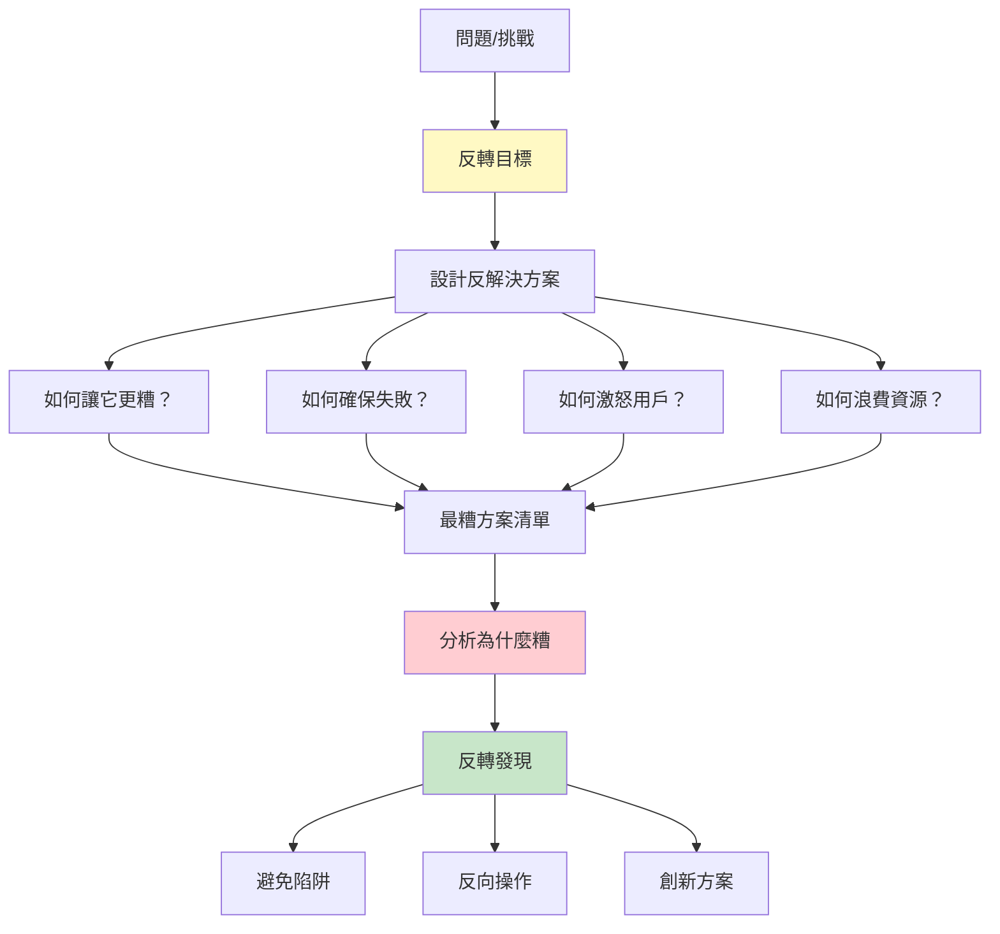
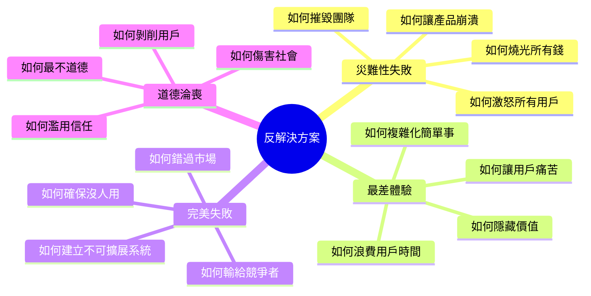
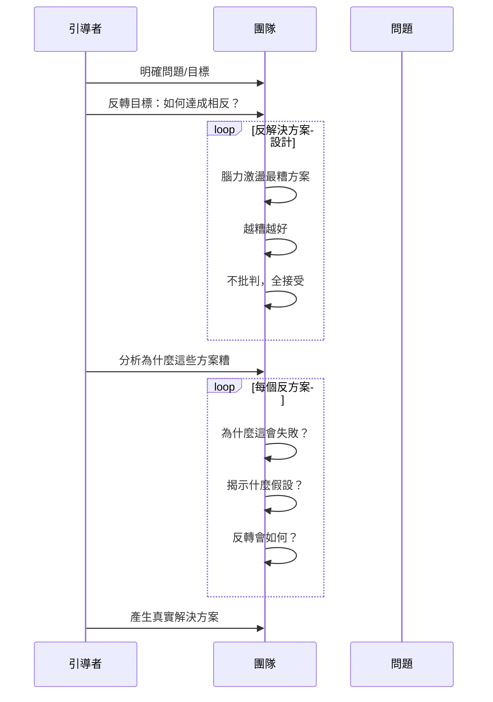
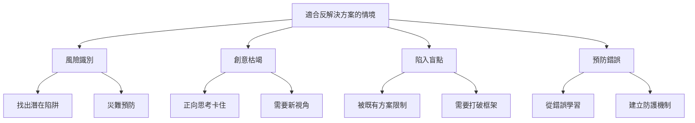
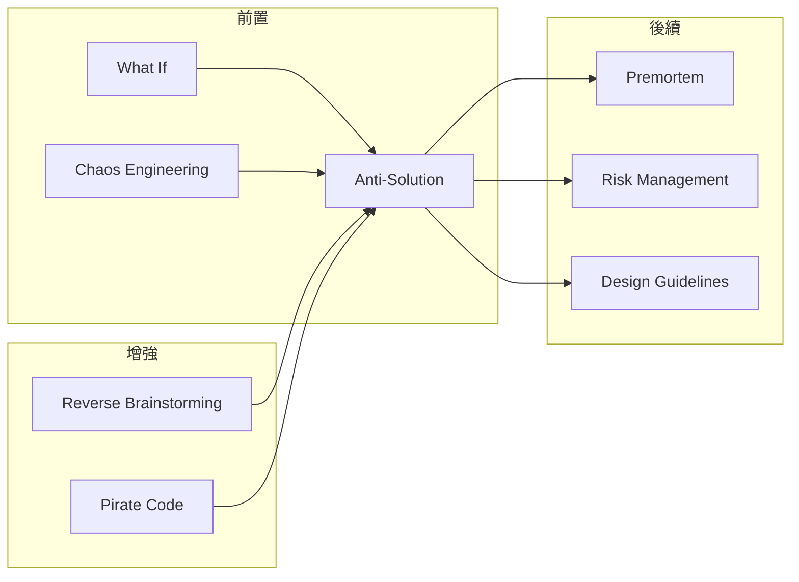

# Anti-Solution

> 反解決方案 - 透過設計最糟方案來發現最佳方案的破壞性創意技術

## 基本資訊

| 屬性 | 值 |
|------|-----|
| 類別 | Wild |
| 能量等級 | 極高 |
| 建議時長 | 35-50 分鐘 |
| 參與人數 | 4-15 人 |
| 難度 | 中-高 |

## 技術概述

**Anti-Solution**（反解決方案）是一種刻意設計「如何讓問題更糟」的技術。與其直接尋找解決方案,參與者專注於創造最糟糕、最災難性的結果。這種反向思考能揭示隱藏的假設、發現潛在陷阱,並通過「反轉」產生創新的真實解決方案。



## 歷史背景

反向思考源自「反轉腦力激盪」（Reverse Brainstorming），由 Charlie Munger（巴菲特的合夥人）推廣的「反向思考」哲學：「告訴我我會死在哪裡，這樣我就不會去那裡。」這種方法在創新領域被證明特別有效，因為人們更容易識別錯誤而非創造完美。

## 核心原理

### 為什麼反解決方案有效？

```mermaid
graph TD
    subgraph 正向思考（困難）
    P1[空白畫布] --> P2[創造完美]
    P2 --> P3[不知從何開始]
    P3 --> P4[創意枯竭]
    end

    subgraph 反向思考（容易）
    N1[現有情境] --> N2[識別錯誤]
    N2 --> N3[放大問題]
    N3 --> N4[反轉洞見]
    end

    style P4 fill:#ffcdd2
    style N4 fill:#c8e6c9
```

### 關鍵原則

1. **負面思考更容易**
   - 批評比創造容易
   - 識別錯誤比設計完美簡單
   - 恐懼比希望具體

2. **暴露隱藏假設**
   - 「如何搞砸」揭示真正重視什麼
   - 恐懼顯示真正的價值
   - 反面清單比正面清單完整

3. **避免陷阱**
   - 看見別人犯的錯
   - 預防勝於治療
   - 「不要清單」很重要

4. **反轉產生創新**
   - 做相反的事
   - 避免錯誤就是方向
   - 負負得正

## 反解決方案類型



## 執行步驟



### 詳細步驟

#### 第一階段：目標反轉（5分鐘）

1. **明確正向目標**
   - 例：「改善用戶體驗」
   - 例：「增加用戶留存」
   - 例：「提高團隊效率」

2. **完全反轉**
   - 反轉：「如何讓用戶體驗最糟？」
   - 反轉：「如何讓用戶全部流失？」
   - 反轉：「如何讓團隊效率最低？」

3. **設定反規則**
   - 越糟越好
   - 不批判
   - 放肆思考
   - 享受破壞

#### 第二階段：反方案設計（20-30分鐘）

**反向腦力激盪：**

1. **自由發想（15分鐘）**
   - 如何達成最糟結果？
   - 最災難性的做法是什麼？
   - 如何確保完全失敗？
   - 記錄所有想法

2. **分類整理（5-10分鐘）**
   - 產品災難
   - 用戶體驗災難
   - 商業災難
   - 技術災難
   - 組織災難

#### 第三階段：反轉與洞見（15-20分鐘）

**針對每個反方案：**

1. **分析為什麼糟（5分鐘）**
   - 這為什麼會失敗？
   - 傷害了什麼價值？
   - 揭示什麼假設？

2. **反轉操作（5分鐘）**
   - 做完全相反的事
   - 避免這個陷阱
   - 轉為正面方案

3. **提取洞見（5-10分鐘）**
   - 「不要做」清單
   - 核心價值是什麼
   - 創新解決方向

## 反解決方案範例

### 範例一：如何讓產品註冊率降到零

**反方案：**
- 註冊需要 50 個欄位
- 密碼規則超級複雜（至少 32 字元，包含表情符號）
- 需要上傳身份證正反面
- 驗證碼超難辨識
- 註冊後沒有任何引導，直接丟到空白頁面
- Email 確認連結 5 分鐘就過期
- 不解釋為什麼需要這些資訊
- 註冊失敗不說明原因，只顯示「錯誤」

**為什麼糟：**
- 製造摩擦力
- 不尊重用戶時間
- 沒有清楚的價值交換
- 技術障礙

**反轉洞見：**
- ✅ 註冊欄位最小化（只要必需）
- ✅ 清楚解釋為什麼需要資訊
- ✅ 密碼要求合理但安全
- ✅ 允許社交登入
- ✅ 註冊後立即展示價值
- ✅ 錯誤訊息要有幫助

### 範例二：如何讓團隊效率最低

**反方案：**
- 每天開 8 小時會議
- 所有決策都需要全員同意
- 沒有任何文件化，全靠口頭傳達
- 工具分散在 50 個不同系統
- 每個小改動都需要 CEO 批准
- 不設定優先順序，所有事都很緊急
- 晚上和週末隨時打斷工作
- 從不慶祝成功，只討論失敗

**為什麼糟：**
- 浪費時間在非生產活動
- 決策癱瘓
- 知識流失
- 工具混亂
- 微觀管理
- 焦慮和倦怠

**反轉洞見：**
- ✅ 會議最小化，設定明確議程
- ✅ 授權決策，設定決策框架
- ✅ 文件化所有關鍵知識
- ✅ 整合工具生態系統
- ✅ 信任團隊自主
- ✅ 明確優先順序
- ✅ 保護專注時間
- ✅ 慶祝成功建立士氣

### 範例三：如何讓客戶永遠不回來

**反方案：**
- 客服回應時間：永遠不回
- 產品問題都說是「用戶操作錯誤」
- 退款流程超級複雜，需要寄掛號信
- 隱藏費用，結帳時才出現
- 取消訂閱需要打電話等 3 小時
- 垃圾郵件轟炸
- 賣用戶資料給第三方
- 產品品質越來越差，價格越來越貴

**為什麼糟：**
- 不尊重客戶
- 背叛信任
- 短視近利
- 缺乏透明度

**反轉洞見：**
- ✅ 快速回應的客服
- ✅ 承擔責任，協助解決
- ✅ 簡單透明的退款
- ✅ 定價透明，沒有隱藏費用
- ✅ 輕鬆取消訂閱（反而能建立信任）
- ✅ 尊重用戶收件匣
- ✅ 保護用戶隱私
- ✅ 持續改善產品

## 引導提示與問題

### 開場引導

> 「今天我們要做一件有趣的事：設計最糟糕的解決方案。忘掉『如何做好』，專注於『如何搞砸』。我們要創造災難性的結果。為什麼？因為識別錯誤比創造完美容易，而避免錯誤就是通往成功的路徑。準備好釋放你內心的破壞衝動了嗎？」

### 反向問題

**產品設計：**
- 如何讓產品最難用？
- 如何確保沒人理解產品？
- 如何讓用戶最痛苦？
- 如何隱藏所有價值？

**用戶獲取：**
- 如何讓沒人知道我們的產品？
- 如何讓所有廣告都無效？
- 如何激怒潛在客戶？
- 如何浪費所有行銷預算？

**團隊管理：**
- 如何讓所有優秀人才離職？
- 如何製造最多衝突？
- 如何破壞團隊信任？
- 如何讓大家都倦怠？

**商業模式：**
- 如何確保永遠不賺錢？
- 如何最快燒光資金？
- 如何輸給所有競爭者？
- 如何錯過所有機會？

### 反轉引導

- 「這為什麼會失敗？」
- 「這傷害了什麼價值？」
- 「做相反的事會如何？」
- 「如何確保這永遠不發生？」

## 適用場景



## 注意事項

### Do's（應該做）

- **全力放肆**
  - 越糟越好
  - 不自我審查
  - 享受破壞性思考

- **保持幽默**
  - 這是有趣的
  - 不是真的要做
  - 輕鬆玩耍心態

- **深入分析「為什麼糟」**
  - 不只列出反方案
  - 要理解失敗機制
  - 這是洞見來源

- **認真反轉**
  - 不只是「不要做」
  - 要設計積極方案
  - 轉換為行動

### Don'ts（不應該做）

- **不要太早批判**
  - 反方案階段全接受
  - 越荒謬越好
  - 之後再分析

- **不要停在負面**
  - 必須完成反轉
  - 要有正面輸出
  - 建設性結論

- **不要傷害感情**
  - 攻擊想法不攻擊人
  - 不針對現有做法（除非安全）
  - 保持尊重

- **不要混淆玩笑與現實**
  - 這是思想實驗
  - 不是行動建議
  - 清楚標記

## 變體技術

### 1. Premortem（事前驗屍）

- 假設專案已經慘敗
- 寫「驗屍報告」
- 分析失敗原因
- 預防性設計

### 2. 競爭者反方案

- 「如何讓競爭者成功？」
- 反轉：我們不該做什麼
- 差異化策略

### 3. 用戶流失分析

- 「如何讓用戶流失？」
- 反轉：留存策略
- 價值強化

### 4. 道德反轉

- 「最不道德的做法？」
- 反轉：道德準則
- 價值觀澄清

## 與其他技術的結合



## 案例研究

### 案例一：亞馬遜的客戶至上

**反方案思考：**
- Bezos 要求團隊思考「如何讓客戶最不滿？」
- 複雜退貨、隱藏費用、慢速配送

**反轉策略：**
- 簡單退貨（甚至不需要理由）
- 透明定價
- Prime 快速配送
- 客戶評價（即使負面）

**結果：** 客戶信任成為核心競爭力

### 案例二：Spotify 的付費轉換

**反方案：**
- 如何讓免費用戶永遠不付費？
- 讓免費版太好用
- 付費版沒差異
- 轉換流程複雜

**反轉設計：**
- 免費版有廣告但可用
- 付費版明顯更好（離線、高音質、無廣告）
- 一鍵升級
- 試用期體驗付費價值

### 案例三：Netflix 無罰金政策

**反方案思考：**
- Blockbuster 的失敗：逾期罰金激怒客戶

**反轉策略：**
- 無逾期費
- 想借多久借多久
- 後來：無限觀看訂閱

**結果：** 顛覆產業

## 工具推薦

### 反方案激盪卡

製作卡片，每張有反向問題：
- 💣 災難卡：如何製造最大災難？
- 😤 激怒卡：如何激怒所有人？
- 💸 浪費卡：如何浪費最多資源？
- ⛔ 失敗卡：如何確保失敗？
- 🚫 阻礙卡：如何創造最多障礙？

### 反轉矩陣

| 反方案 | 為什麼糟 | 揭示的價值 | 反轉方案 |
|--------|----------|------------|----------|
| ______ | ________ | __________ | ________ |

### 不要做清單模板

**絕對不要：**
1. _______________
2. _______________
3. _______________

**為什麼：**
1. _______________
2. _______________
3. _______________

**應該做：**
1. _______________
2. _______________
3. _______________

## 研究支持

- **Charlie Munger 反向思考**：「反過來想，永遠反過來想」
- **Premortem 研究**：Gary Klein 的研究顯示事前驗屍能發現 30% 更多風險
- **負面視角的認知優勢**：人類更善於識別危險和錯誤
- **Via Negativa**：透過消除錯誤來改善，而非增加複雜性

## 設計模式與方法論對照

| 相關模式/方法論 | 連結點 | 應用價值 |
|----------------|--------|----------|
| **Inversion (Munger)** | 反向思考哲學 | 「告訴我會死在哪裡，我就不去那裡」 |
| **Reverse Brainstorming** | 反向腦力激盪 | 思考如何造成問題而非解決問題 |
| **Premortem Analysis** | Gary Klein | 假設專案已慘敗，寫驗屍報告 |
| **Via Negativa** | 消除法哲學 | 透過排除錯誤而非增加複雜來改善 |
| **Red Team Thinking** | 軍事策略 | 假扮敵方來發現自己的弱點 |
| **Failure Mode Analysis** | 失效模式分析 | 系統化識別可能的失敗方式 |

**核心洞察**：Anti-Solution的深層智慧來自Charlie Munger的「反向思考」哲學——人類更善於識別錯誤而非創造完美。從空白畫布創造傑作很難，但指出一幅畫哪裡不對很容易。這種不對稱是Anti-Solution的槓桿：當你問「如何確保失敗」，想法源源不絕；當你問「如何確保成功」，卻常常卡住。更深的洞見是：避免愚蠢比追求聰明更可靠。Bezos要團隊思考「如何讓客戶最不滿」，然後做相反的事，這就是亞馬遜客戶至上文化的來源。「不要做」清單往往比「要做」清單更有價值。

## 參考資源

- [Inversion: The Power of Avoiding Stupidity](https://fs.blog/inversion/)
- [Premortem: Gary Klein](https://hbr.org/2007/09/performing-a-project-premortem)
- [Charlie Munger on Inversion](https://fs.blog/great-talks/psychology-human-misjudgment/)
- [Reverse Brainstorming Technique](https://www.mindtools.com/a8nkcr7/reverse-brainstorming)

---

*返回 [Wild 類別](./index.md) | [技術總覽](../index.md)*
