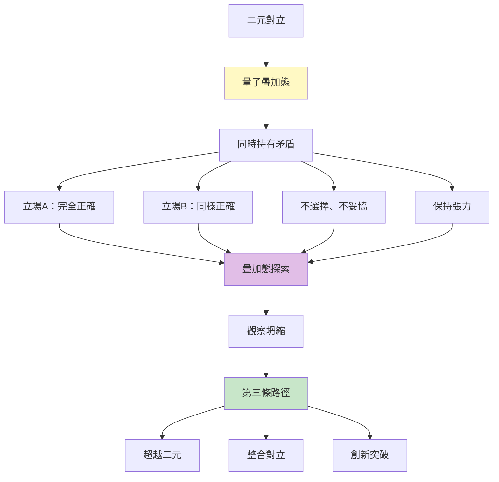
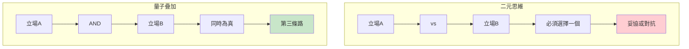
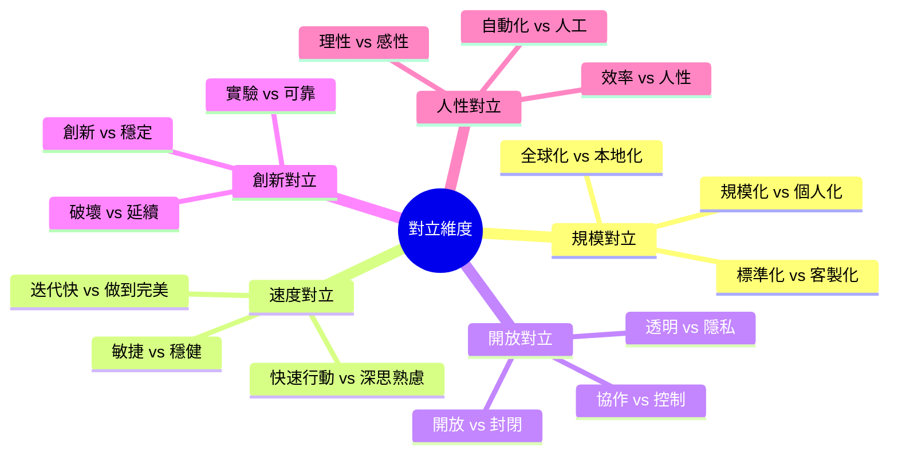
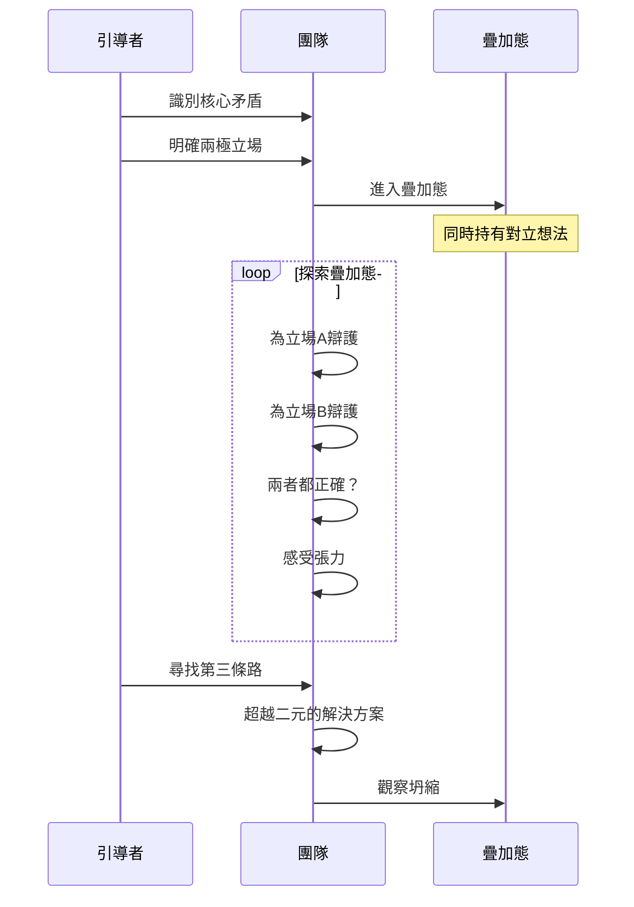
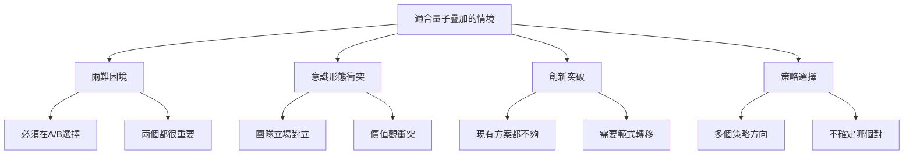
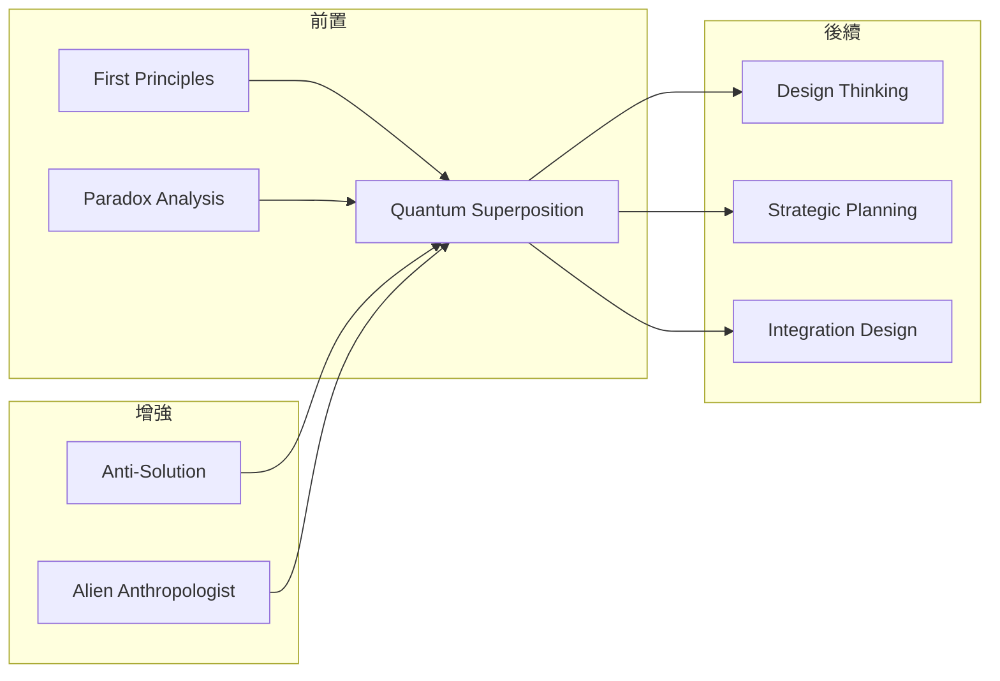

# Quantum Superposition

> 量子疊加 - 同時持有矛盾想法來發現第三條路徑的哲學思維

## 基本資訊

| 屬性 | 值 |
|------|-----|
| 類別 | Wild |
| 能量等級 | 高 |
| 建議時長 | 40-60 分鐘 |
| 參與人數 | 4-12 人 |
| 難度 | 高 |

## 技術概述

**Quantum Superposition**（量子疊加）借用量子力學中粒子可以同時處於多個狀態的概念，應用於創新思維。參與者被要求同時持有兩個（或多個）看似矛盾的想法，不急於選擇或妥協，而是在這種「疊加態」中探索，直到找到超越二元對立的第三條路徑。



## 歷史背景

量子疊加（Quantum Superposition）是量子力學的核心概念，著名的「薛丁格的貓」思想實驗說明了這個概念：貓可以同時處於生與死的疊加態。在創新思維中，F. Scott Fitzgerald 說過：「檢驗一流智慧的標準，是能在頭腦中同時持有兩種對立的想法，還能正常行事。」這種能力被證明是突破性創新的關鍵。

## 核心原理

### 為什麼量子疊加有效？



### 關鍵原則

1. **接受矛盾**
   - 矛盾不需要立即解決
   - 對立可以共存
   - 張力是創造力來源

2. **延遲坍縮**
   - 不急於選擇
   - 保持多種可能性
   - 探索疊加態

3. **超越二元**
   - 不是 A 或 B
   - 不是 A 和 B 的妥協
   - 是包含兩者的 C

4. **整合對立**
   - 兩極都有真理
   - 綜合而非選擇
   - 辯證思維

## 對立維度類型



## 執行步驟



### 詳細步驟

#### 第一階段：對立識別（10分鐘）

1. **找出核心矛盾**
   - 團隊面臨什麼兩難？
   - 什麼對立讓人困擾？
   - 例：「快速 vs 品質」

2. **明確兩極**
   - 立場A：極端一方
   - 立場B：極端另一方
   - 不要中庸，要極端

3. **設定疊加規則**
   - 兩個都是對的
   - 不選擇、不妥協
   - 保持張力
   - 探索可能

#### 第二階段：疊加態探索（30-40分鐘）

**輪流為兩極辯護：**

1. **立場A辯護（10分鐘）**
   - 全力支持A
   - A為什麼完全正確？
   - A的最佳論據
   - A實現會怎樣？

2. **立場B辯護（10分鐘）**
   - 全力支持B
   - B為什麼完全正確？
   - B的最佳論據
   - B實現會怎樣？

3. **疊加態保持（10-20分鐘）**
   - 同時相信A和B
   - 感受認知失調
   - 不急於解決
   - 在矛盾中探索

**關鍵問題：**
- 「如果兩個都是對的呢？」
- 「如何讓矛盾共存？」
- 「有沒有超越兩者的可能？」

#### 第三階段：第三條路（10-15分鐘）

1. **觀察坍縮**
   - 什麼新想法出現？
   - 第三條路是什麼？
   - 如何整合對立？

2. **驗證解決方案**
   - 真的包含A嗎？
   - 真的包含B嗎？
   - 超越了兩者嗎？

## 量子疊加範例

### 範例一：快速 vs 品質

**立場A（快速）：**
- 市場機會稍縱即逝
- 完美是優秀的敵人
- 快速迭代學習更快
- 晚了就輸了

**立場B（品質）：**
- 品質建立信譽
- 爛產品毀掉品牌
- 一次做對省時間
- 用戶不會原諒垃圾

**疊加態問題：**
> 「如果快速和品質同時都是絕對必需的？」

**第三條路：**
- ✨ **分層發布**：核心功能高品質，邊緣功能快速迭代
- ✨ **品質門檻**：定義最低品質標準，在此之上快速
- ✨ **內部快速，外部穩定**：內部快速實驗，對外保持品質
- ✨ **不同產品不同策略**：MVP 快速，旗艦品質

### 範例二：開放 vs 隱私

**立場A（開放）：**
- 透明建立信任
- 開放資料創造價值
- 協作需要分享
- 封閉導致孤立

**立場B（隱私）：**
- 隱私是基本權利
- 資料外洩有危險
- 用戶有選擇權
- 不是所有都該開放

**疊加態問題：**
> 「如果開放和隱私都不能妥協？」

**第三條路：**
- ✨ **選擇性開放**：用戶選擇分享什麼
- ✨ **匿名化開放**：開放數據但去識別化
- ✨ **本地優先**：資料留在用戶端，處理在本地
- ✨ **漸進式信任**：證明值得信任後才要求更多

### 範例三：全球化 vs 本地化

**立場A（全球化）：**
- 規模經濟
- 統一體驗
- 降低成本
- 擴展更快

**立場B（本地化）：**
- 文化適應
- 在地連結
- 相關性
- 深度而非廣度

**疊加態問題：**
> 「如何同時做到全球規模和本地深度？」

**第三條路：**
- ✨ **全球平台，本地內容**（YouTube, Netflix）
- ✨ **標準核心，彈性外圍**
- ✨ **本地團隊，全球工具**
- ✨ **文化模組化**

### 範例四：自動化 vs 人性化

**立場A（自動化）：**
- 效率提升
- 成本降低
- 可擴展性
- 一致性

**立場B（人性化）：**
- 人際連結
- 情感需求
- 彈性判斷
- 溫暖體驗

**疊加態問題：**
> 「如何讓自動化更有人性？」

**第三條路：**
- ✨ **AI + 人類協作**：AI 處理例行，人類處理例外
- ✨ **個人化自動化**：自動但感覺客製
- ✨ **溫暖的機器人**：對話式 AI，友善語氣
- ✨ **隨時可找到人**：自動優先，但人類隨時待命

## 引導提示與問題

### 開場引導

> 「今天我們要進入量子態。在量子力學中，粒子可以同時處於多個狀態——薛丁格的貓同時是生的也是死的。我們也要這樣思考：同時相信兩個矛盾的想法。這會很不舒服，我們的大腦想要解決矛盾。但請抵抗這個衝動。在矛盾的張力中，創新會出現。」

### 疊加態引導問題

**進入疊加態：**
- 「如果兩個都是對的呢？」
- 「能不能同時相信A和B？」
- 「如果不能選擇會怎樣？」
- 「矛盾本身告訴我們什麼？」

**探索張力：**
- 「這個矛盾為什麼存在？」
- 「兩極各自保護什麼價值？」
- 「緊張感在哪裡？」
- 「什麼讓我們無法選擇？」

**尋找第三路：**
- 「有沒有既A又B的可能？」
- 「更高維度的解決方案是什麼？」
- 「如何整合而非妥協？」
- 「超越兩者的智慧是什麼？」

### 驗證問題

- 這個方案真的包含A嗎？
- 這個方案真的包含B嗎？
- 還是只是一個妥協？
- 有沒有超越兩者？

## 適用場景



## 注意事項

### Do's（應該做）

- **真的保持疊加態**
  - 不要太快選擇
  - 延遲決策
  - 探索矛盾

- **全力為兩極辯護**
  - 輪流支持雙方
  - 找出最強論據
  - 理解每一方

- **擁抱不適**
  - 認知失調是正常的
  - 矛盾帶來創造力
  - 不要急於解決

- **驗證第三路**
  - 確認真的整合
  - 不只是妥協
  - 超越原有框架

### Don'ts（不應該做）

- **不要太快妥協**
  - 「各退一步」不是答案
  - 中間地帶常常平庸
  - 追求真正整合

- **不要假裝沒矛盾**
  - 承認張力
  - 不粉飾太平
  - 直面對立

- **不要無限期懸置**
  - 疊加態是過程
  - 最終要「坍縮」
  - 找到方向

- **不要強迫一致**
  - 有些矛盾可以共存
  - 不是所有都需要解決
  - 動態平衡

## 變體技術

### 1. 三極疊加

- 不只兩極，三個對立
- 更複雜的張力
- 更高維度的解決方案

### 2. 時間疊加

- 不同時間不同立場
- 白天A，晚上B
- 週期性切換

### 3. 情境疊加

- 不同情境不同選擇
- 情境A用方案A
- 情境B用方案B
- 不追求單一答案

### 4. 個人疊加

- 不同人不同選擇
- 讓用戶選擇A或B
- 個人化解決矛盾

## 與其他技術的結合



## 案例研究

### 案例一：Netflix 的全球本地化

**矛盾：**
- 全球統一平台 vs 本地文化內容

**疊加態：**
- 同時需要規模和相關性

**第三條路：**
- 全球技術平台
- 本地內容製作
- 演算法推薦結合文化
- 「在地思考，全球行動」

### 案例二：Spotify 的規模個人化

**矛盾：**
- 服務億萬用戶（規模）vs 個人化體驗

**疊加態：**
- 不妥協於「夠好就好」

**第三條路：**
- AI 驅動的超個人化
- 每個用戶獨特體驗
- 規模化個人化

### 案例三：Patagonia 的商業環保

**矛盾：**
- 營利企業 vs 環境保護

**疊加態：**
- 拒絕「或」，堅持「且」

**第三條路：**
- 「不要買這件夾克」廣告
- 修復計畫延長產品壽命
- 環保即品牌即利潤
- 證明商業和環保可以共生

## 工具推薦

### 對立光譜圖

```
極端A ←────────────────→ 極端B
   │                        │
   │    [疊加態探索區]      │
   │                        │
   └────── 第三路 ──────────┘
```

### 疊加態工作表

| 維度 | 立場A | 立場B | 張力點 | 第三路可能 |
|------|-------|-------|--------|------------|
| ___ | _____ | _____ | ______ | __________ |

### 辯證三段式

1. **正題（Thesis）**：立場A
2. **反題（Antithesis）**：立場B
3. **合題（Synthesis）**：第三條路

### 整合驗證清單

新方案是否：
- [ ] 包含A的核心價值
- [ ] 包含B的核心價值
- [ ] 不是簡單平均或妥協
- [ ] 創造新的可能性
- [ ] 超越原有框架

## 研究支持

- **F. Scott Fitzgerald**：「一流智慧能同時持有對立想法」
- **辯證法**：黑格爾的正反合思維
- **Paradox Theory**：組織研究中的矛盾管理
- **Both/And Thinking**：Jim Collins 的「卓越基因」
- **極性管理**：Barry Johnson 的極性地圖

## 參考資源

- [Quantum Superposition (Physics)](https://en.wikipedia.org/wiki/Quantum_superposition)
- [Polarity Management by Barry Johnson](https://www.polaritypartnerships.com/)
- [Both/And Thinking: Embracing Creative Tensions](https://hbr.org/2016/06/both-and-thinking)
- [The Opposable Mind by Roger Martin](https://rogerlmartin.com/lets-read/the-opposable-mind)
- [Paradox Theory in Organization Studies](https://journals.sagepub.com/doi/10.1177/0170840617707018)

---

*返回 [Wild 類別](./index.md) | [技術總覽](../index.md)*
