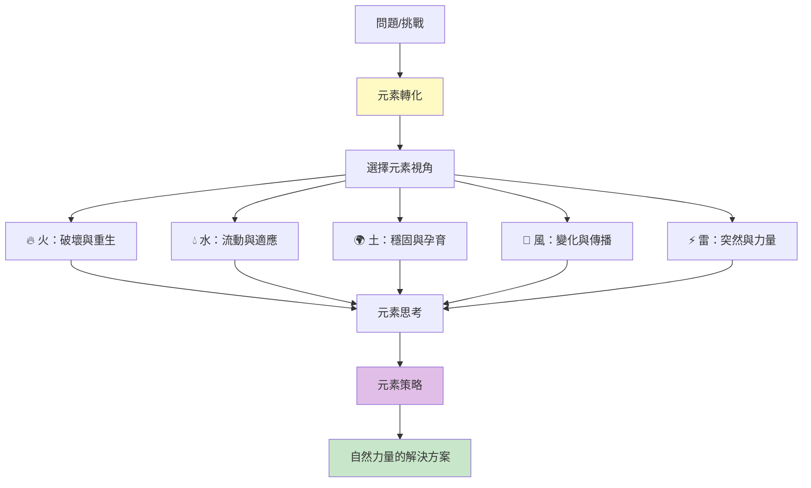
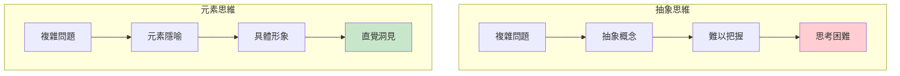
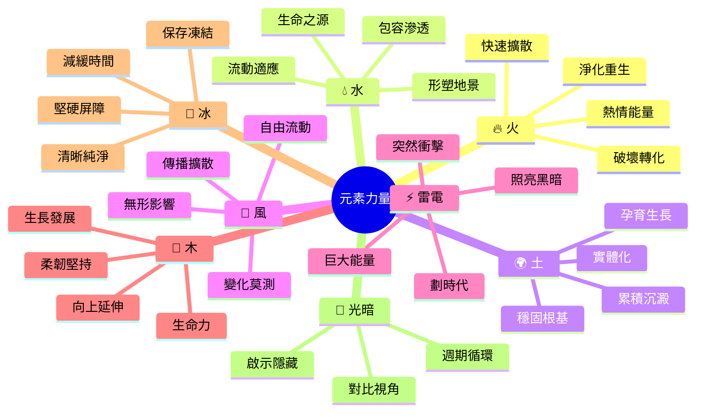
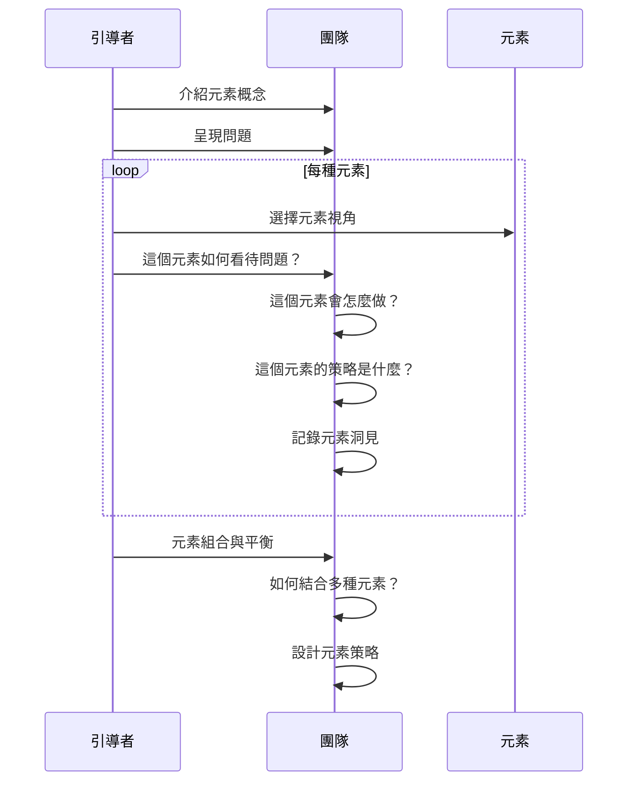
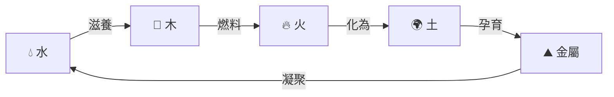
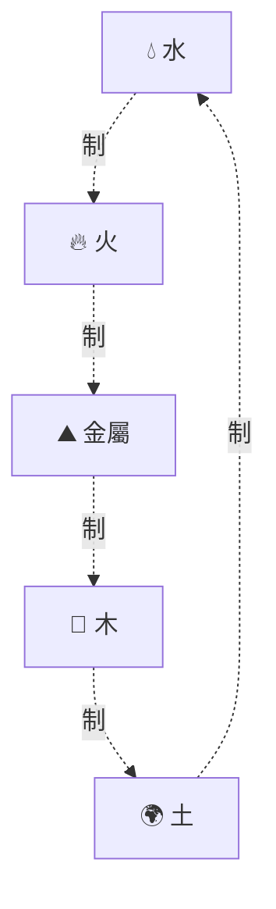
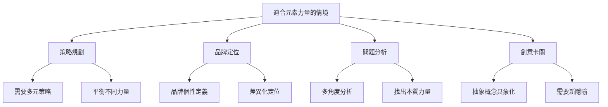
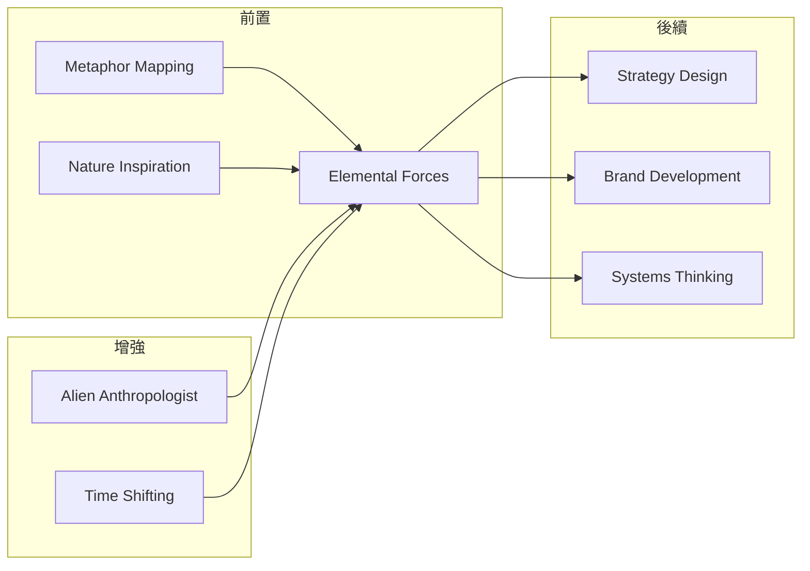

# Elemental Forces

> 元素力量 - 用自然元素的原始力量作為隱喻來思考和解決問題

## 基本資訊

| 屬性 | 值 |
|------|-----|
| 類別 | Wild |
| 能量等級 | 高 |
| 建議時長 | 35-50 分鐘 |
| 參與人數 | 3-12 人 |
| 難度 | 中 |

## 技術概述

**Elemental Forces**（元素力量）是一種使用自然元素（火、水、土、風、以及其他如雷電、冰、木等）作為思維框架和隱喻工具的技術。每種元素代表不同的力量、特性和策略。透過將問題「元素化」，團隊能從自然界最原始、最強大的力量中獲得洞見和靈感。



## 歷史背景

元素理論橫跨多個文化：希臘的四元素（火、水、土、風）、中國的五行（金、木、水、火、土）、印度的五大元素。這些古老智慧將複雜現象簡化為基本力量的互動。在現代，這種隱喻思維被應用於創新、策略和設計，因為自然元素提供了直覺且強大的思考框架。

## 核心原理

### 為什麼元素隱喻有效？



### 關鍵原則

1. **自然力量的原型**
   - 每種元素是原型力量
   - 直覺理解其特性
   - 跨文化共通

2. **互動與平衡**
   - 元素相生相剋
   - 沒有絕對好壞
   - 需要平衡組合

3. **隱喻性思考**
   - 具象化抽象概念
   - 啟發新視角
   - 打破慣性思維

4. **原始力量**
   - 回到基本
   - 強大且純粹
   - 不可忽視的力量

## 元素類型與特性



## 執行步驟



### 詳細步驟

#### 第一階段：元素介紹（10分鐘）

1. **介紹核心元素**
   - 解釋每種元素特性
   - 舉例元素在現實中的表現
   - 建立元素認知

2. **元素卡片準備**
   - 準備元素卡片或視覺
   - 每種元素的關鍵詞
   - 元素的力量描述

3. **問題呈現**
   - 明確要解決的問題
   - 當前困境
   - 期望結果

#### 第二階段：元素探索（25-35分鐘）

**每種元素（5-7分鐘）：**

1. **元素選擇**
   - 抽取或選擇一個元素
   - 進入該元素的視角

2. **元素提問**
   - 「火元素如何看這個問題？」
   - 「水元素會怎麼解決？」
   - 「風元素的策略是什麼？」

3. **元素策略發想**
   - 用元素特性思考
   - 借用元素力量
   - 記錄元素方案

4. **元素洞見**
   - 這個元素給什麼啟示？
   - 元素的智慧是什麼？

#### 第三階段：元素融合（10分鐘）

1. **元素組合**
   - 哪些元素可以結合？
   - 元素之間如何平衡？
   - 相生相剋如何應用？

2. **策略整合**
   - 綜合不同元素智慧
   - 設計多元素策略
   - 平衡各種力量

## 元素特性與策略

### 🔥 火元素

**特性：**
- 破壞性創造
- 快速擴散
- 熱情激發
- 淨化重生

**策略應用：**
- 破壞舊有體系
- 快速實驗迭代
- 激發團隊熱情
- 燃燒問題，從灰燼重生

**提問：**
- 「什麼需要被燃燒淨化？」
- 「如何快速點燃變革？」
- 「熱情的火花在哪？」

**案例：** 破壞性創新、快速增長策略、重新啟動專案

---

### 💧 水元素

**特性：**
- 流動適應
- 柔能克剛
- 滲透無孔不入
- 形塑地景

**策略應用：**
- 適應變化環境
- 繞過障礙
- 持續滲透市場
- 長期形塑改變

**提問：**
- 「如何繞過而非對抗？」
- 「水滴石穿的策略是什麼？」
- 「如何流動到每個角落？」

**案例：** 適應性策略、漸進式改變、無所不在的滲透

---

### 🌍 土元素

**特性：**
- 穩固根基
- 孕育生長
- 累積沉澱
- 實體化具象

**策略應用：**
- 建立穩固基礎
- 培育長期成長
- 累積資源優勢
- 將想法落地實現

**提問：**
- 「根基在哪裡？」
- 「如何孕育成長？」
- 「需要累積什麼？」

**案例：** 長期建設、基礎設施、累積型優勢

---

### 💨 風元素

**特性：**
- 無形影響
- 快速傳播
- 變化莫測
- 自由流動

**策略應用：**
- 口碑傳播
- 改變氛圍文化
- 保持靈活性
- 無形的影響力

**提問：**
- 「如何讓想法隨風傳播？」
- 「無形的影響力是什麼？」
- 「如何改變風向？」

**案例：** 病毒式行銷、文化變革、靈活策略

---

### ⚡ 雷電元素

**特性：**
- 突然衝擊
- 巨大能量
- 照亮黑暗
- 劃時代時刻

**策略應用：**
- 突破性發布
- 震撼市場
- 照亮盲點
- 集中巨大能量

**提問：**
- 「如何製造雷霆一擊？」
- 「什麼能照亮黑暗？」
- 「時機在哪？」

**案例：** 重大發布、市場衝擊、突破性創新

---

### 🌲 木元素

**特性：**
- 持續生長
- 柔韌堅持
- 向上延伸
- 生命力

**策略應用：**
- 有機成長
- 柔性堅持
- 向上發展
- 生態系統

**提問：**
- 「如何持續生長？」
- 「柔韌的力量在哪？」
- 「生態系統是什麼？」

**案例：** 有機增長、生態系建立、持續發展

---

### 🧊 冰元素

**特性：**
- 凍結保存
- 清晰純淨
- 堅硬屏障
- 減緩時間

**策略應用：**
- 凍結現狀分析
- 保持清晰冷靜
- 建立保護機制
- 減緩快速變化

**提問：**
- 「什麼需要凍結保存？」
- 「如何保持清晰？」
- 「防護在哪裡？」

**案例：** 暫停重整、清晰分析、保護機制

## 元素組合策略

### 相生策略（協同）



**應用：**
- 水滋養木：資源培育成長
- 木燃為火：成長轉為能量
- 火化為土：能量沉澱為基礎
- 順勢而為的策略

### 相剋策略（制衡）



**應用：**
- 用水滅火：冷靜對抗衝動
- 用火融金：熱情突破僵化
- 平衡的力量

### 融合策略

| 組合 | 效果 | 應用 |
|------|------|------|
| 🔥火 + 💧水 | 蒸汽 | 爆發性但可控的能量 |
| 🌍土 + 💧水 | 泥土 | 可塑性、成型 |
| 💨風 + 🔥火 | 野火 | 快速擴散 |
| ⚡雷 + 💧水 | 暴風雨 | 淨化與重生 |
| 🌲木 + 🌍土 | 森林 | 生態系統 |

## 引導提示與問題

### 開場引導

> 「今天我們要回到自然界最原始的力量。火、水、土、風——這些元素塑造了我們的世界，它們也能塑造我們的策略。每種元素都有獨特的智慧：火的激情、水的適應、土的穩固、風的傳播。我們要用這些元素的眼睛看問題，用它們的力量解決問題。」

### 元素引導問題

**火元素視角：**
- 「如果這是一場火，它會如何燃燒？」
- 「什麼需要被火焰淨化？」
- 「火的熱情在哪裡？」
- 「如何從灰燼中重生？」

**水元素視角：**
- 「如果這是一條河，它會如何流動？」
- 「水會如何繞過障礙？」
- 「如何滲透到每個角落？」
- 「水滴石穿的耐心是什麼？」

**土元素視角：**
- 「如果這是土地,它會孕育什麼？」
- 「根基在哪裡？」
- 「如何累積沉澱？」
- 「什麼需要穩固的基礎？」

**風元素視角：**
- 「如果這是風,它會吹向何方？」
- 「無形的影響力是什麼？」
- 「如何隨風傳播？」
- 「風向改變意味什麼？」

## 適用場景



## 注意事項

### Do's（應該做）

- **深入元素特性**
  - 真正理解元素
  - 不只是表面隱喻
  - 探索深層意義

- **視覺化元素**
  - 用圖像、符號
  - 幫助沉浸
  - 增強體驗

- **平衡組合**
  - 不只用一種元素
  - 尋找平衡
  - 相生相剋應用

- **連結現實**
  - 隱喻要轉為行動
  - 元素洞見要落地
  - 不只是玩文字

### Don'ts（不應該做）

- **不要過度簡化**
  - 元素不是標籤
  - 深入特性
  - 避免膚淺

- **不要強加元素**
  - 自然湧現
  - 不硬套
  - 感覺對才用

- **不要迷失隱喻**
  - 記住實際問題
  - 隱喻是工具
  - 不是目的

- **不要忽視文化差異**
  - 元素意義可能不同
  - 尊重文化解讀
  - 解釋清楚

## 變體技術

### 1. 五行相生相剋

- 使用中國五行系統
- 金木水火土的互動
- 平衡與循環

### 2. 四季元素

- 春（生發）
- 夏（成長）
- 秋（收穫）
- 冬（沉潛）

### 3. 元素人格

- 團隊成員的元素屬性
- 元素互補
- 平衡團隊元素

### 4. 元素故事

- 用元素講故事
- 元素的旅程
- 寓言化問題

## 與其他技術的結合



## 案例研究

### 案例一：Amazon 的元素策略

**分析：**
- 🔥 火：快速創新、燃燒舊零售
- 💧 水：流入每個市場、適應各種需求
- 🌍 土：穩固的物流基礎設施
- 💨 風：Prime 的病毒式傳播

**整合：** 多元素平衡成就霸業

### 案例二：Tesla 的雷電策略

**元素：** ⚡ 雷電為主

**表現：**
- 突然衝擊傳統汽車業
- 集中巨大能量（技術、願景）
- 劃時代的電動車
- 照亮永續未來

**補充：** 🔥 火元素的激情與破壞

### 案例三：Netflix 的水元素

**元素：** 💧 水為主

**表現：**
- 適應市場變化（DVD → 串流）
- 流入全球市場
- 包容各種內容
- 持續形塑娛樂產業

**補充：** ⚡ 雷電的突破時刻

## 工具推薦

### 元素卡片組

製作卡片，每張代表一個元素：
- 🔥 火卡：破壞、激情、快速
- 💧 水卡：適應、流動、滲透
- 🌍 土卡：穩固、孕育、累積
- 💨 風卡：傳播、變化、無形
- ⚡ 雷卡：衝擊、能量、照亮
- 🌲 木卡：生長、柔韌、生態

### 元素策略畫布

```
問題：_______________

🔥 火策略：_______________
💧 水策略：_______________
🌍 土策略：_______________
💨 風策略：_______________

組合策略：_______________
元素平衡：_______________
```

### 元素輪盤

```
        🔥 火
         |
💨 風 -------- 💧 水
         |
        🌍 土
```

**使用：**
- 轉動指針
- 落在哪個元素
- 用該元素思考

## 研究支持

- **跨文化元素理論**：希臘四元素、中國五行、印度五大
- **隱喻認知**：Lakoff & Johnson 的概念隱喻理論
- **原型心理學**：Jung 的原型理論
- **自然啟發創新**：仿生學的思維方式

## 參考資源

- [Classical Elements (Philosophy)](https://en.wikipedia.org/wiki/Classical_element)
- [Wu Xing (Chinese Five Elements)](https://en.wikipedia.org/wiki/Wuxing_(Chinese_philosophy))
- [Metaphors We Live By - Lakoff & Johnson](https://press.uchicago.edu/ucp/books/book/chicago/M/bo3637992.html)
- [Biomimicry Institute](https://biomimicry.org/)

---

*返回 [Wild 類別](./index.md) | [技術總覽](../index.md)*
