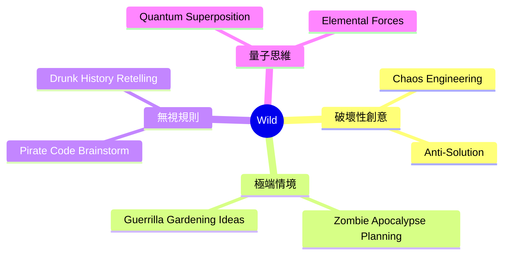
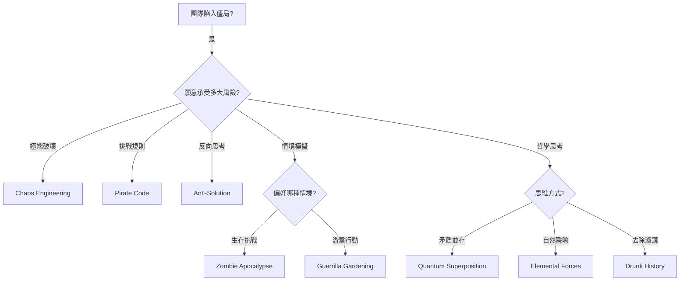
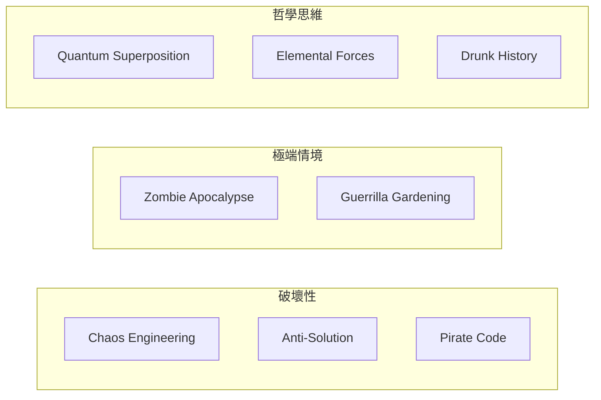
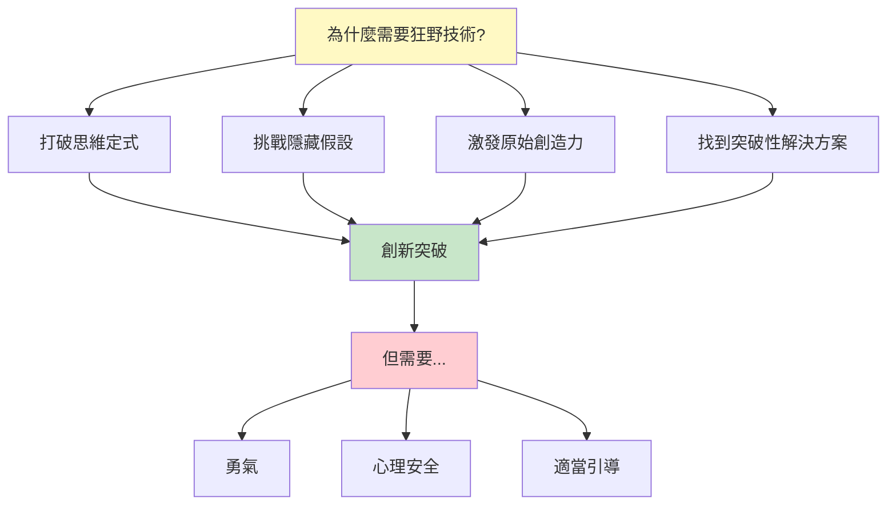

# Wild Brainstorming Techniques

> 狂野類腦力激盪技術 - 打破界限、挑戰舒適區、釋放原始創造力

## 類別概述

狂野類技術包含 8 種技術，透過極端、破壞性、甚至荒謬的方法來激發創意。這些技術特別適合當團隊陷入僵局、需要突破性思維、或願意挑戰所有既有假設的情境。

## 核心特性

| 特性 | 說明 |
|------|------|
| 挑戰舒適區 | 刻意製造不適感以激發突破 |
| 高能量需求 | 需要參與者全情投入與勇氣 |
| 破壞性思維 | 透過破壞來發現新可能 |
| 適合僵局 | 當常規方法無效時的終極武器 |

## 技術列表

| # | 技術名稱 | 核心概念 | 適用情境 |
|---|----------|----------|----------|
| 1 | [Chaos Engineering](./01-chaos-engineering.md) | 混沌工程 | 故意破壞來發現穩健解決方案 |
| 2 | [Guerrilla Gardening Ideas](./02-guerrilla-gardening-ideas.md) | 游擊園藝想法 | 在意想不到的地方種植解決方案 |
| 3 | [Pirate Code Brainstorm](./03-pirate-code-brainstorm.md) | 海盜守則 | 無視規則的創意探索 |
| 4 | [Zombie Apocalypse Planning](./04-zombie-apocalypse-planning.md) | 殭屍末日規劃 | 極端生存情境思考 |
| 5 | [Drunk History Retelling](./05-drunk-history-retelling.md) | 醉酒歷史重述 | 去除濾鏡的簡化表達 |
| 6 | [Anti-Solution](./06-anti-solution.md) | 反解決方案 | 破壞性創意思考 |
| 7 | [Quantum Superposition](./07-quantum-superposition.md) | 量子疊加 | 同時持有矛盾想法 |
| 8 | [Elemental Forces](./08-elemental-forces.md) | 元素力量 | 用自然元素隱喻 |

## 技術選擇流程

## 能量等級與風險

| 能量等級 | 風險等級 | 技術 |
|---------|---------|------|
| 極高 | 高 | Chaos Engineering, Anti-Solution |
| 極高 | 中-高 | Pirate Code, Zombie Apocalypse |
| 高 | 中 | Guerrilla Gardening, Drunk History |
| 高 | 低-中 | Quantum Superposition, Elemental Forces |

## 思維模式對照

## 與其他類別的搭配

| 狂野技術 | 搭配類別 | 搭配效果 |
|----------|----------|----------|
| Chaos Engineering | Structured (SCAMPER) | 有序破壞 |
| Anti-Solution | Creative (Reversal) | 雙重反轉 |
| Quantum Superposition | Deep (First Principles) | 根本性矛盾 |
| Zombie Apocalypse | Collaborative | 團隊生存挑戰 |

## 使用建議

### 最適合的情境
- 團隊陷入嚴重僵局
- 需要突破性創新
- 常規方法完全失效
- 願意承擔高風險高回報
- 團隊心理安全感高

### 引導者準備
- **建立心理安全感** - 這些技術可能讓人不舒服
- **設定明確界限** - 知道何時停止
- **準備收斂機制** - 不要讓混亂失控
- **保持幽默感** - 狂野不等於危險
- **事後解壓** - 高能量活動後需要緩衝

### 警告標誌

以下情況**不適合**使用狂野技術：
- 團隊心理安全感不足
- 時間壓力極大
- 利益相關者保守
- 團隊疲憊或士氣低落
- 組織文化極度保守

## 狂野技術的價值

---

*返回 [技術總覽](../index.md)*
