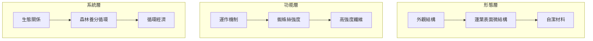
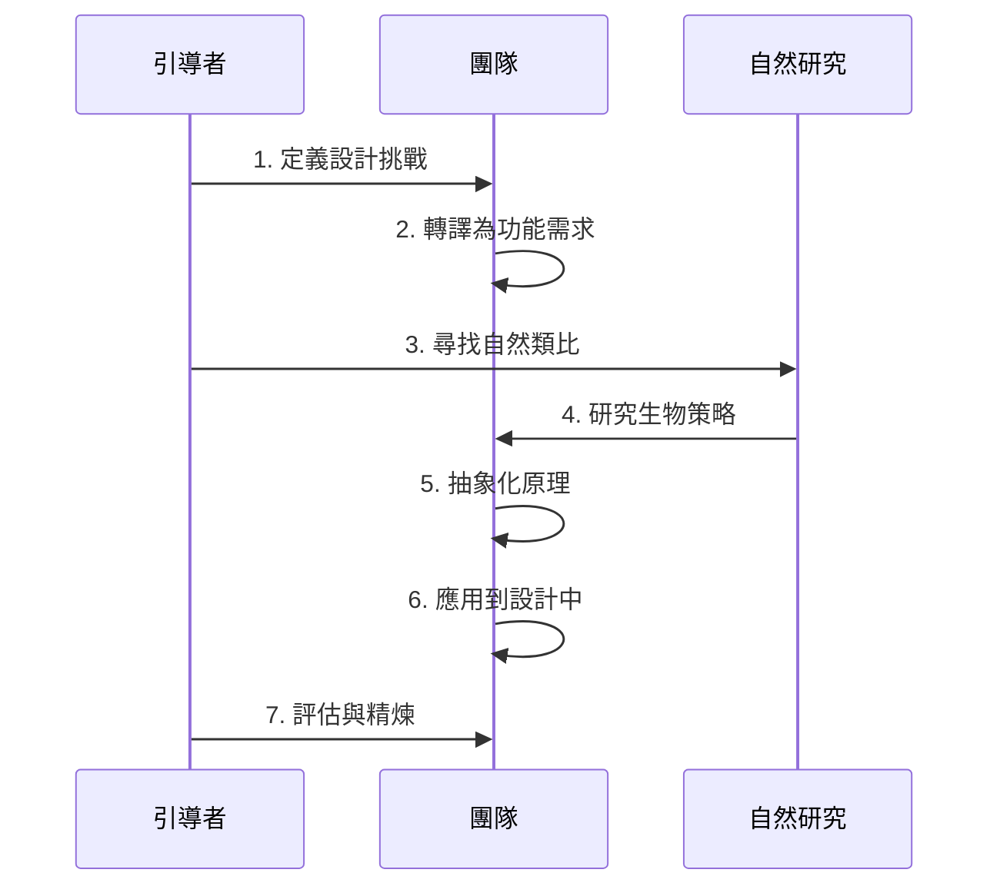
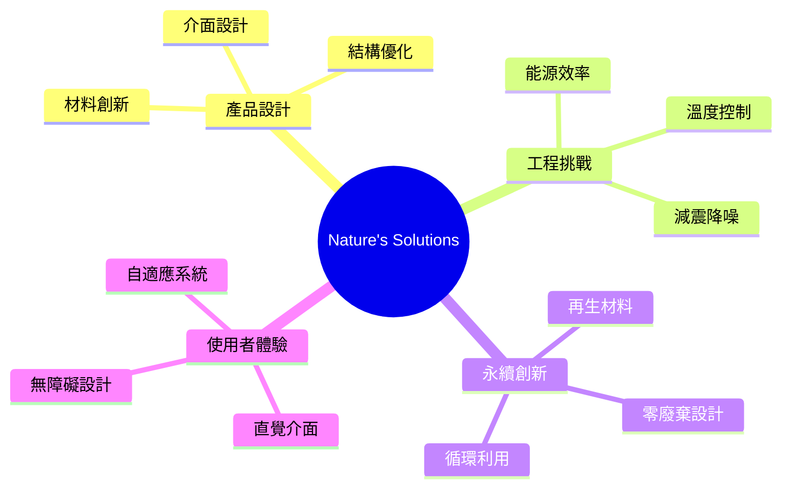
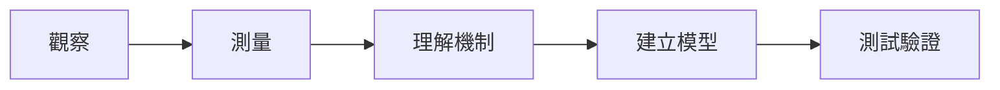
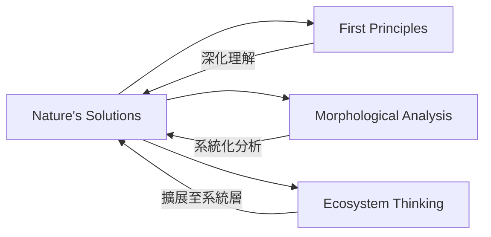

# Nature's Solutions

> 自然解決方案 - 向自然學習，尋找經億萬年驗證的設計智慧

## 基本資訊

| 屬性 | 值 |
|------|-----|
| 類別 | Biomimetic |
| 能量等級 | 中 |
| 建議時長 | 45-90 分鐘 |
| 參與人數 | 3-8 人 |
| 難度 | 中 |

## 技術概述

**Nature's Solutions** 是一種仿生學（Biomimicry）思維方法，透過觀察自然界如何解決類似問題，來啟發人類的創新設計。自然界經過數十億年的演化，已經解決了無數關於能源、結構、材料、資訊處理等挑戰，這些解決方案往往比人類設計更優雅、更高效、更永續。

## 歷史背景

仿生學由 Janine Benyus 在 1997 年的著作《Biomimicry: Innovation Inspired by Nature》中系統化。從古代人類模仿鳥類飛行，到現代的高速列車模仿翠鳥、魔鬼氈模仿蒼耳種子，自然一直是人類創新的靈感來源。

## 核心原理

### 自然的三大智慧層級

### 關鍵原則

1. **功能優先於形式**
   - 先理解生物「要解決什麼問題」
   - 再研究「如何解決」

2. **適應當地條件**
   - 自然解決方案總是針對特定環境
   - 考慮材料、能源、氣候等限制

3. **多功能整合**
   - 自然結構常同時解決多個問題
   - 如鯊魚皮既減阻又防菌

## 執行步驟

### 詳細步驟

1. **定義挑戰（10分鐘）**
   - 清楚描述要解決的問題
   - 例：「如何減少建築物的冷氣能耗？」

2. **功能轉譯（10分鐘）**
   - 將問題轉化為功能性問題
   - 例：「如何在高溫下保持內部涼爽？」

3. **尋找自然類比（15分鐘）**
   - 問：「自然界的哪些生物也面對類似挑戰？」
   - 使用 AskNature.org 等資料庫
   - 腦力激盪多個生物案例

4. **深入研究（20分鐘）**
   - 選擇 2-3 個最有潛力的案例
   - 研究其運作機制
   - 例：白蟻塔的自然通風系統

5. **抽象原理（15分鐘）**
   - 提取核心設計原則
   - 例：「利用溫差驅動的對流循環」
   - 「多孔道結構促進空氣流動」

6. **應用轉化（20分鐘）**
   - 將原理轉化為具體設計
   - 快速草圖或原型
   - 考慮材料和技術可行性

7. **評估（10分鐘）**
   - 檢視是否真正解決原問題
   - 是否符合永續原則
   - 技術可行性評估

## 引導提示

使用以下提示句引導思考：

| 提示句 | 用途 |
|--------|------|
| "自然界的哪些生物也需要...?" | 尋找類比 |
| "這個生物如何達成這個功能?" | 研究機制 |
| "背後的核心原理是什麼?" | 抽象化 |
| "如果用我們的材料和技術，可以如何實現?" | 應用轉化 |
| "這個解決方案是否也符合自然的永續原則?" | 評估檢視 |

## 適用場景

### 經典成功案例

1. **新幹線列車** - 模仿翠鳥喙部，降低噪音與能耗
2. **魔鬼氈** - 模仿蒼耳種子的鉤刺結構
3. **自潔玻璃** - 模仿蓮葉表面的疏水微結構
4. **Eastgate 大樓** - 模仿白蟻塔的自然通風系統

## 注意事項

### 適合情境
- 面對複雜的工程或設計挑戰
- 尋求永續、環保的解決方案
- 有足夠時間進行研究
- 團隊具有跨領域背景

### 不適合情境
- 時間極度緊迫
- 問題太過抽象，難以找到自然類比
- 技術限制太大，無法實現仿生設計

### 常見陷阱

1. **表面模仿**
   - 只模仿外觀，未理解功能原理
   - 應深入研究運作機制

2. **忽略環境差異**
   - 未考慮應用環境與自然環境的差異
   - 需要適當調整

3. **技術可行性**
   - 自然的解決方案可能難以用現有技術實現
   - 需在理想與現實間平衡

## 工具與資源

### 線上資料庫
- **AskNature.org** - 生物策略資料庫
- **Biomimicry Institute** - 仿生學教育資源
- **DANE** - 仿生設計案例庫

### 研究方法

## 與其他技術的結合

## 設計模式與方法論對照

| 相關模式/方法論 | 連結點 | 應用價值 |
|----------------|--------|----------|
| **Biomimicry (Janine Benyus)** | 向自然學習設計 | 仿生學的系統化方法框架 |
| **Life's Principles** | Biomimicry Institute 的設計原則 | 評估解決方案是否符合自然的運作模式 |
| **Cradle to Cradle** | McDonough & Braungart 的循環設計 | 將「廢棄物等於養分」的自然原則應用於產品 |
| **TRIZ 矛盾矩陣** | 40 個發明原則 | 許多 TRIZ 原則源自自然界的解決方案 |
| **First Principles Thinking** | 回到基本功能需求 | 在功能層面思考問題，再尋找自然類比 |

**核心洞察**：Nature's Solutions 的智慧在於承認自然是最資深的研發部門——擁有 38 億年的演化經驗。與其重新發明輪子，不如詢問自然如何解決同樣的問題。這種方法的力量不僅在於找到答案，更在於重新框架問題：從「我要如何做到？」轉變為「誰已經做到了？」這種謙遜的態度，往往能帶來既優雅又永續的解決方案。

## 參考資源

- Janine Benyus (1997): *Biomimicry: Innovation Inspired by Nature*
- [AskNature](https://asknature.org/) - 生物策略資料庫
- [Biomimicry Institute](https://biomimicry.org/)
- [Wikipedia: Biomimetics](https://en.wikipedia.org/wiki/Biomimetics)

---

*返回 [Biomimetic 類別](./index.md) | [技術總覽](../index.md)*
