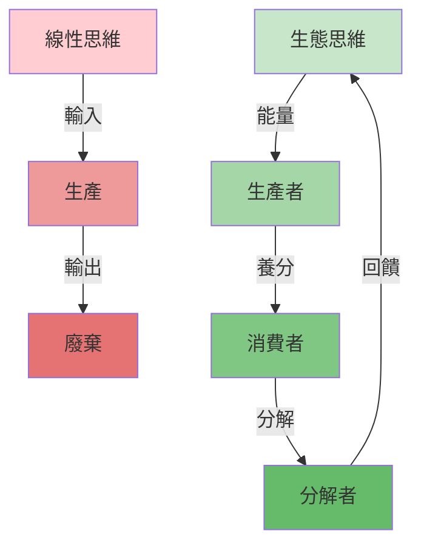
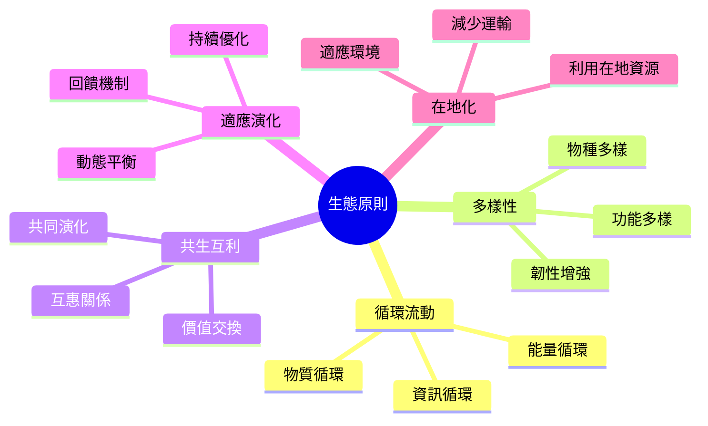
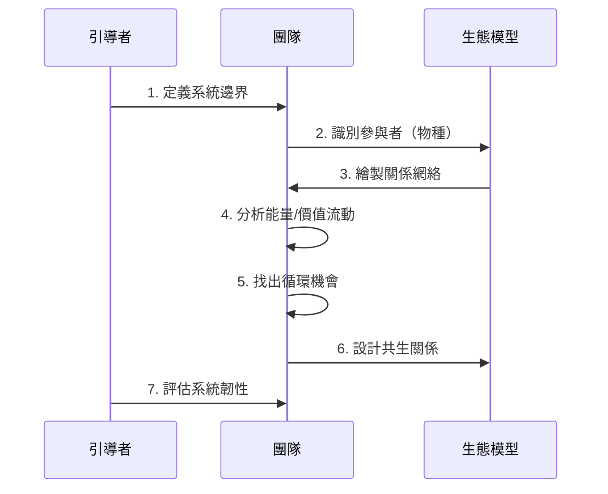
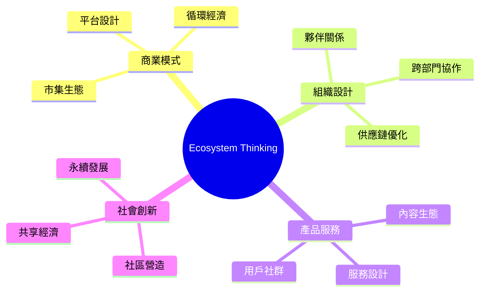
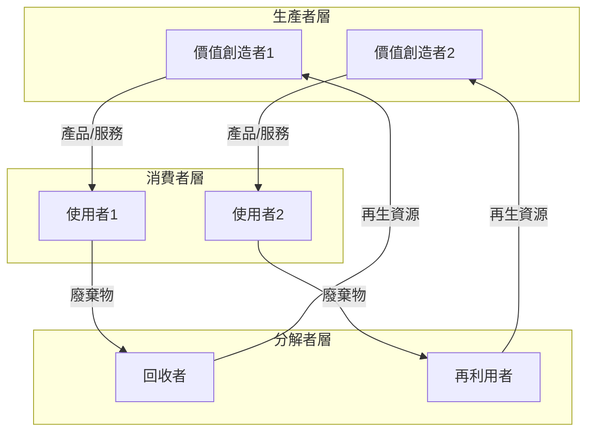
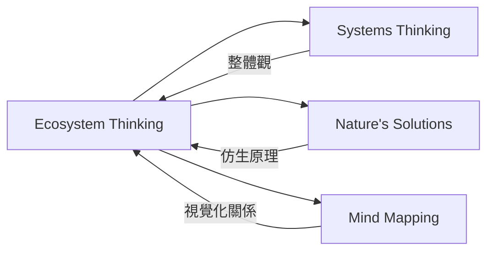

# Ecosystem Thinking

> 生態系統思維 - 從系統關係中尋找商業與設計的永續模式

## 基本資訊

| 屬性 | 值 |
|------|-----|
| 類別 | Biomimetic |
| 能量等級 | 中 |
| 建議時長 | 60-90 分鐘 |
| 參與人數 | 4-10 人 |
| 難度 | 中高 |

## 技術概述

**Ecosystem Thinking** 將自然生態系統的運作原理應用於商業、產品和服務設計。不同於線性思維，生態系統思維強調循環、共生、多樣性和韌性。這種方法特別適合設計平台、商業模式、組織架構和服務生態。

## 歷史背景

生態系統思維源自生態學，特別是 Eugene Odum 的生態系統理論。近年來被應用於商業策略（James Moore 的商業生態系統）、平台經濟（如 Uber、Airbnb）、循環經濟（Ellen MacArthur Foundation）等領域。

## 核心原理

### 生態系統的五大原則

### 關鍵概念

1. **共生關係（Symbiosis）**
   - 互利共生：雙贏關係
   - 片利共生：一方受益，另一方不受影響
   - 寄生：需要避免的不平衡

2. **養分循環（Nutrient Cycling）**
   - 一個系統的廢棄物是另一個的資源
   - 零廢棄設計

3. **生態位（Niche）**
   - 每個參與者有獨特角色
   - 避免過度競爭

4. **邊緣效應（Edge Effect）**
   - 交界處創新最豐富
   - 跨界合作的價值

## 執行步驟

### 詳細步驟

1. **定義系統（10分鐘）**
   - 確定要設計的生態系統範圍
   - 例：「我們的客戶服務生態」
   - 確定系統邊界

2. **識別參與者（15分鐘）**
   - 列出所有利害關係人（相當於物種）
   - 用便利貼寫下：
     - 生產者（價值創造者）
     - 消費者（價值使用者）
     - 分解者（回收再利用者）
     - 其他角色

3. **繪製關係網絡（20分鐘）**
   - 在白板上排列參與者
   - 用箭頭標示關係：
     - 實線 = 能量/價值流動
     - 虛線 = 資訊流動
     - 雙向箭頭 = 互利關係

4. **分析流動（15分鐘）**
   - 追蹤價值如何在系統中流動
   - 找出：
     - 瓶頸在哪？
     - 哪裡有浪費？
     - 哪裡缺乏連結？

5. **設計循環（15分鐘）**
   - 問：「如何讓廢棄物變成資源？」
   - 設計閉環系統
   - 減少對外部輸入的依賴

6. **建立共生（15分鐘）**
   - 識別潛在的互利關係
   - 設計價值交換機制
   - 確保每個參與者都受益

7. **評估韌性（10分鐘）**
   - 問：「如果某個參與者消失會怎樣？」
   - 增加多樣性和備援
   - 設計自我修復機制

## 引導提示

使用以下提示句引導思考：

| 提示句 | 用途 |
|--------|------|
| "這個系統的生產者、消費者、分解者分別是誰？" | 識別角色 |
| "能量（價值）如何在系統中流動？" | 追蹤流動 |
| "哪些廢棄物可以成為其他人的資源？" | 設計循環 |
| "誰可以和誰形成互利關係？" | 建立共生 |
| "如果移除某個元素，系統還能運作嗎？" | 評估韌性 |
| "大自然中有類似的生態系統嗎？" | 尋找靈感 |

## 適用場景

### 經典成功案例

1. **Airbnb / Uber** - 平台生態系統
   - 房東/司機（生產者）
   - 旅客/乘客（消費者）
   - 平台（連結者）

2. **Apple App Store** - 開發者生態
   - 開發者創造價值
   - 用戶消費應用
   - Apple 提供平台與工具

3. **Kalundborg Symbiosis** - 工業共生
   - 八家工廠共享能源與物質
   - 一家的廢棄物是另一家的原料

## 注意事項

### 適合情境
- 設計平台或市集
- 規劃複雜的商業模式
- 優化供應鏈或組織結構
- 追求循環經濟或永續發展

### 不適合情境
- 簡單的單一產品設計
- 時間緊迫的決策
- 參與者無法改變系統結構

### 常見陷阱

1. **過度複雜化**
   - 不是所有問題都需要生態系統思維
   - 簡單問題用簡單方法

2. **忽略人性**
   - 自然生態沒有自由意志
   - 人類系統需要考慮動機和行為

3. **靜態設計**
   - 生態系統是動態的
   - 需要持續觀察和調整

## 視覺化工具

### 生態系統畫布

## 與其他技術的結合

## 練習：咖啡店生態系統

以一家咖啡店為例，設計其生態系統：

**生產者**
- 咖啡農
- 烘豆師
- 咖啡師

**消費者**
- 顧客
- 在地社群

**分解者**
- 咖啡渣 → 堆肥 → 菜園
- 舊家具 → 翻新 → 店內裝潢

**共生關係**
- 咖啡店提供空間 ↔ 在地藝術家展覽
- 咖啡渣免費 ↔ 社區菜園供應食材

## 設計模式與方法論對照

| 相關模式/方法論 | 連結點 | 應用價值 |
|----------------|--------|----------|
| **Platform Ecosystem (James Moore)** | 商業生態系統理論 | 理解平台經濟中的角色與價值流動 |
| **Circular Economy (Ellen MacArthur)** | 廢棄物即養分 | 設計閉環系統、零廢棄商業模式 |
| **Systems Thinking (Peter Senge)** | 整體觀與回饋迴路 | 理解系統動態與非線性影響 |
| **Industrial Symbiosis (Kalundborg)** | 工業生態學實踐 | 跨組織的資源共享與廢棄物再利用 |
| **Business Model Canvas** | 價值主張與關係 | 延伸為生態系統畫布，繪製多方關係 |

**核心洞察**：Ecosystem Thinking 的革命性在於從「競爭」思維轉向「共生」思維。傳統商業邏輯問「如何打敗對手？」，生態系統思維問「如何讓整個系統更繁榮？」一個系統的「廢棄物」正是另一個系統的「養分」——這個洞見挑戰了線性經濟的根本假設，打開了循環經濟和平台策略的全新可能。

## 參考資源

- James Moore (1993): "Predators and Prey: A New Ecology of Competition"
- [Ellen MacArthur Foundation](https://ellenmacarthurfoundation.org/) - 循環經濟
- Fritjof Capra (1996): *The Web of Life*
- [Biomimicry Toolbox: Ecosystem Principles](https://toolbox.biomimicry.org/)

---

*返回 [Biomimetic 類別](./index.md) | [技術總覽](../index.md)*
