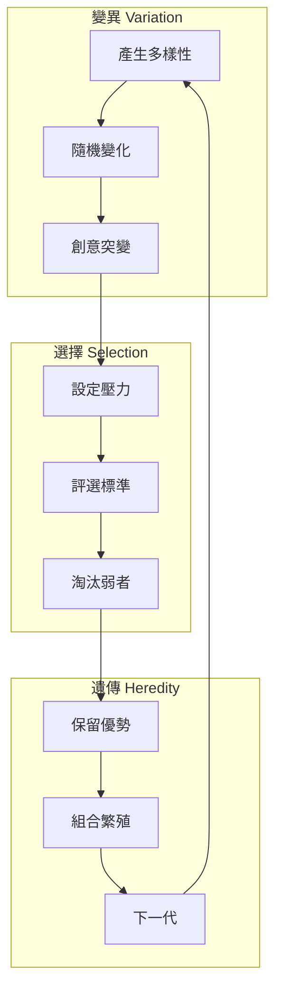
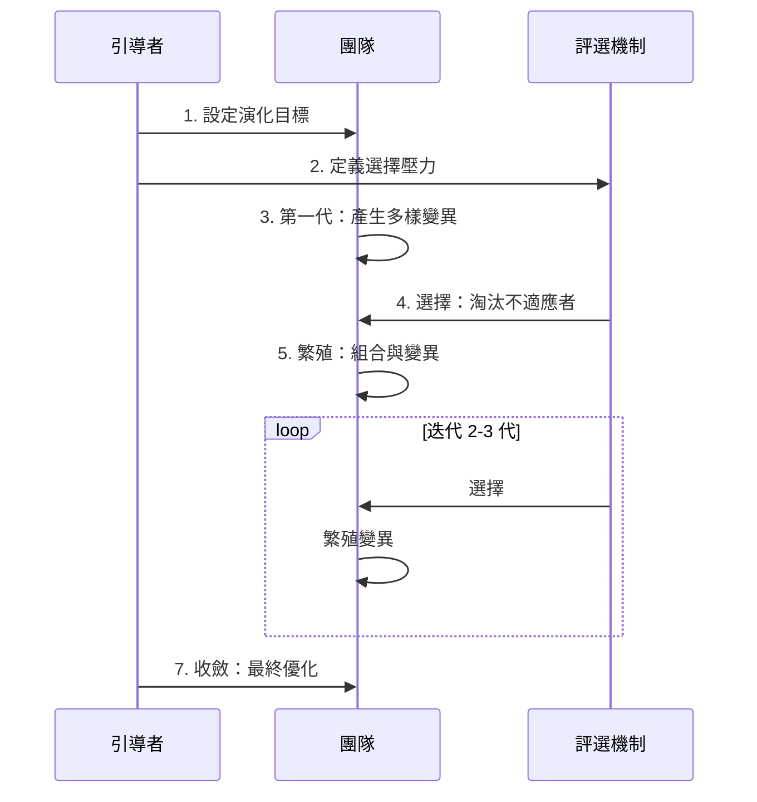
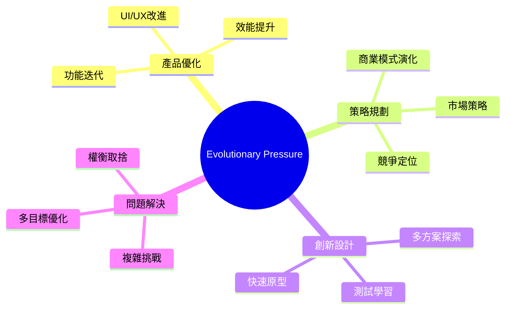
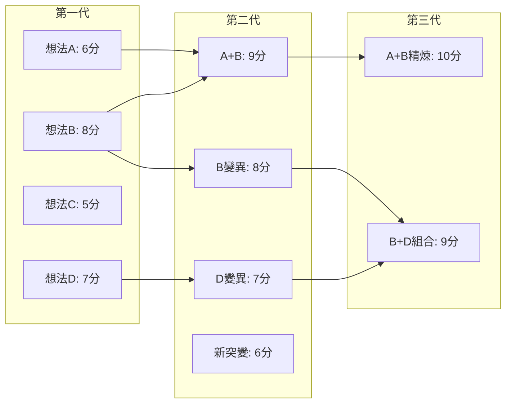
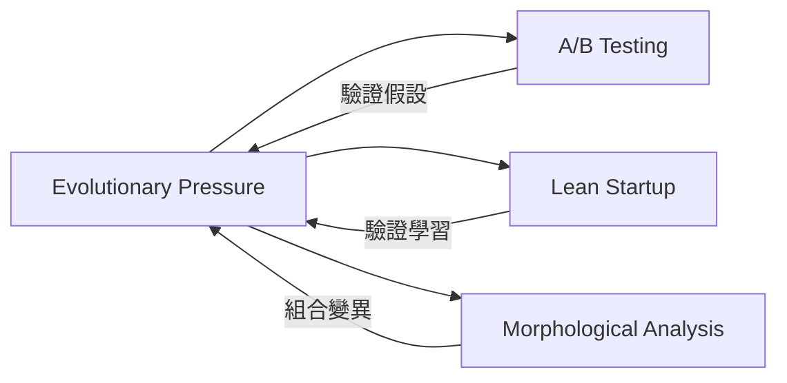

# Evolutionary Pressure

> 演化壓力 - 運用自然選擇機制快速迭代優化設計

## 基本資訊

| 屬性 | 值 |
|------|-----|
| 類別 | Biomimetic |
| 能量等級 | 高 |
| 建議時長 | 90-120 分鐘（含多輪迭代）|
| 參與人數 | 5-15 人 |
| 難度 | 中高 |

## 技術概述

**Evolutionary Pressure** 模擬自然界的演化機制，透過設定「選擇壓力」來快速迭代和優化創意。如同自然選擇會淘汰不適應環境的生物，這個技術透過明確的評選標準，讓好的創意「存活」並「繁殖」（變異、組合），逐代演化出更優秀的解決方案。

## 歷史背景

這個技術靈感來自達爾文的自然選擇理論和遺傳演算法（Genetic Algorithm）。在商業領域，類似概念被應用於 A/B 測試、精實創業的「驗證學習」等方法。設計思維中的快速原型與測試也體現了演化思維。

## 核心原理

### 演化的三大要素

### 關鍵原則

1. **多樣性是創新之母**
   - 第一代需要高度多樣性
   - 鼓勵「突變」（激進想法）

2. **明確的選擇壓力**
   - 清楚定義什麼是「適應」
   - 可以有多重壓力（如成本、時間、用戶滿意度）

3. **快速迭代**
   - 每一代都要快速評選
   - 不追求完美，追求進步

4. **組合繁殖**
   - 好的想法可以「交配」
   - 產生混種創意

## 執行步驟

### 詳細步驟

#### 準備階段（10分鐘）

1. **定義演化目標**
   - 清楚描述要優化的問題
   - 例：「設計一個讓使用者願意每天使用的健身 App」

2. **設定選擇壓力（2-4 個）**
   - 每個壓力有明確評分標準（1-5 分）
   - 例：
     - 使用便利性（易用）
     - 動機維持（有趣）
     - 時間投入（省時）
     - 技術可行性（可做）

#### 第一代：變異（20分鐘）

3. **產生初始多樣性**
   - 每人或小組產生 1-2 個創意
   - 鼓勵激進、多元的想法
   - 用便利貼或草圖快速記錄
   - 目標：產生 10-20 個不同想法

#### 第一次選擇（15分鐘）

4. **評選與淘汰**
   - 每個想法按選擇壓力評分
   - 計算總分或加權分數
   - 保留前 40-50%（適者生存）
   - 淘汰後 50-60%

#### 第二代：繁殖（20分鐘）

5. **組合與變異**
   - **直接繁殖**：保留最優的 1-2 個
   - **交配組合**：結合兩個好想法的優點
   - **突變**：在好想法上加入隨機變化
   - 產生新一代想法（數量同第一代）

#### 第二次選擇（10分鐘）

6. **再次評選**
   - 用同樣標準評分
   - 應該看到平均分數提升
   - 保留前 40-50%

#### 第三代：精煉（20分鐘）

7. **最終優化**
   - 聚焦於前 3-5 個最優方案
   - 細化細節
   - 可能做小型原型或草圖

#### 收斂（15分鐘）

8. **選擇最終方案**
   - 從最後一代選出 1-3 個最優解
   - 評估是否比第一代顯著進步
   - 規劃下一步行動

## 引導提示

使用以下提示句引導思考：

| 階段 | 提示句 |
|------|--------|
| 設定壓力 | "什麼條件下，這個想法才算『適應環境』？" |
| 產生變異 | "如果這個想法發生突變，可以怎麼改變？" |
| 評選 | "在這個環境（標準）下，哪些想法能存活？" |
| 組合 | "如果把這兩個想法的優點結合，會產生什麼？" |
| 迭代 | "這一代比上一代更適應環境了嗎？" |

## 適用場景

### 經典成功案例

1. **Spotify 的播放列表演算法**
   - 不斷測試不同推薦邏輯
   - 用戶參與度作為選擇壓力
   - 演化出高精準推薦系統

2. **Tesla 的自動駕駛**
   - 透過大量真實駕駛數據
   - 持續優化模型
   - 每次更新都是一次「演化」

3. **Google 搜尋演算法**
   - 持續測試數百個變體
   - 用戶點擊和滿意度為壓力
   - 每年數百次小型演化

## 注意事項

### 適合情境
- 需要在多個限制條件間權衡
- 有明確可衡量的成功標準
- 可以進行多輪迭代
- 團隊能接受部分想法被「淘汰」

### 不適合情境
- 只需要單一最佳解
- 無法定義清楚的評選標準
- 時間不足以進行 2-3 輪迭代
- 團隊對想法被淘汰很敏感

### 常見陷阱

1. **選擇壓力不明確**
   - 導致評選變成主觀偏好
   - 解決：事先定義清楚的評分標準

2. **過早收斂**
   - 第一代就淘汰太多
   - 導致後續缺乏多樣性
   - 解決：保持足夠的變異數

3. **忽略突變**
   - 只做組合，不做創新
   - 陷入局部最優
   - 解決：每一代都加入 10-20% 全新想法

4. **壓力過於單一**
   - 只優化一個面向
   - 忽略其他重要因素
   - 解決：設定 3-4 個平衡的壓力

## 視覺化追蹤

### 演化追蹤表

## 與其他技術的結合

## 線上工具建議

- **Miro / Mural** - 視覺化演化過程
- **投票外掛** - 快速評分
- **Excel / Google Sheets** - 追蹤每代分數

## 參考資源

- Charles Darwin (1859): *On the Origin of Species*
- John Holland (1992): *Adaptation in Natural and Artificial Systems*
- [Genetic Algorithm (Wikipedia)](https://en.wikipedia.org/wiki/Genetic_algorithm)
- Eric Ries (2011): *The Lean Startup* - 驗證學習概念

---

*返回 [Biomimetic 類別](./index.md) | [技術總覽](../index.md)*
