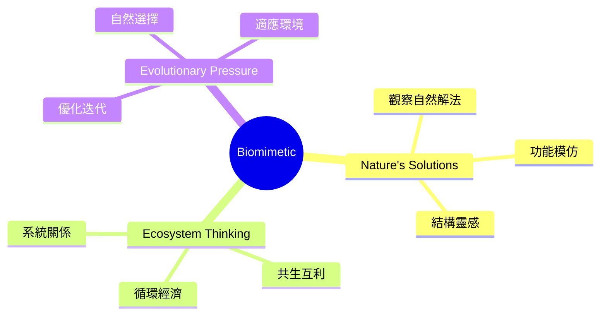
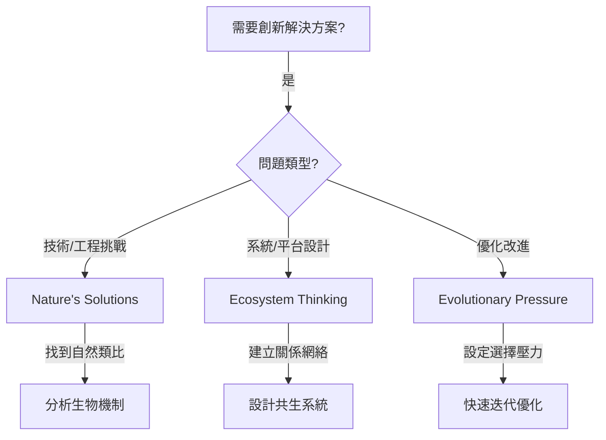

# Biomimetic Brainstorming Techniques

> 仿生類腦力激盪技術 - 向自然學習，運用經億萬年驗證的智慧

## 類別概述

仿生類技術從自然界汲取靈感，將生物系統、生態關係和演化機制應用於創新思維。自然界經過數十億年的演化，已經解決了無數設計挑戰，這些解決方案往往比人類設計更優雅、更高效、更永續。

## 核心特性

| 特性 | 說明 |
|------|------|
| 自然智慧 | 借鑑經億萬年驗證的自然解決方案 |
| 系統思維 | 從整體生態系統角度思考問題 |
| 永續導向 | 自然界的解決方案通常更環保永續 |
| 跨領域 | 連結生物學與產品設計、工程等領域 |

## 技術列表

| # | 技術名稱 | 核心概念 | 適用情境 |
|---|----------|----------|----------|
| 1 | [Nature's Solutions](./01-natures-solutions.md) | 自然解決方案 | 產品設計、工程問題 |
| 2 | [Ecosystem Thinking](./02-ecosystem-thinking.md) | 生態系統思維 | 商業模式、平台設計 |
| 3 | [Evolutionary Pressure](./03-evolutionary-pressure.md) | 演化壓力 | 產品優化、迭代策略 |

## 使用時機

## 能量等級

- **高能量**: Evolutionary Pressure
- **中等能量**: Nature's Solutions, Ecosystem Thinking

## 適合領域

- **產品設計**: 從自然結構和功能中汲取靈感
- **永續創新**: 設計環保、循環經濟的解決方案
- **系統設計**: 建立複雜的互聯系統
- **材料科學**: 開發新型仿生材料
- **工程挑戰**: 解決複雜的技術問題

---

## 設計模式與方法論對照

| 技術 | 相關模式/方法論 | 核心價值 |
|------|-----------------|----------|
| **Nature's Solutions** | Biomimicry, Janine Benyus Method | 38億年研發的解決方案 |
| **Ecosystem Thinking** | Systems Ecology, Circular Economy | 自然界沒有垃圾的設計 |
| **Evolutionary Pressure** | Natural Selection, Iterative Design | 讓環境選擇最適解 |

**核心洞察**：大自然是人類可以使用的最大「研發實驗室」——38億年的演化實驗，數百萬種「產品」，零研發成本。Velcro 來自植物刺、高速列車頭來自翠鳥嘴、節能建築來自白蟻丘。仿生思維的關鍵是「功能抽象」：不是問「什麼動物很酷」，而是問「什麼生物解決過類似的問題」。

---

*返回 [技術總覽](../index.md)*
