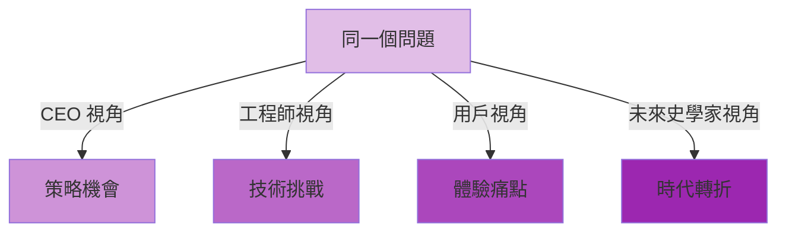
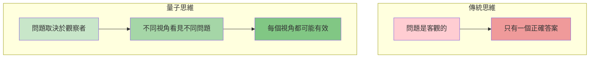
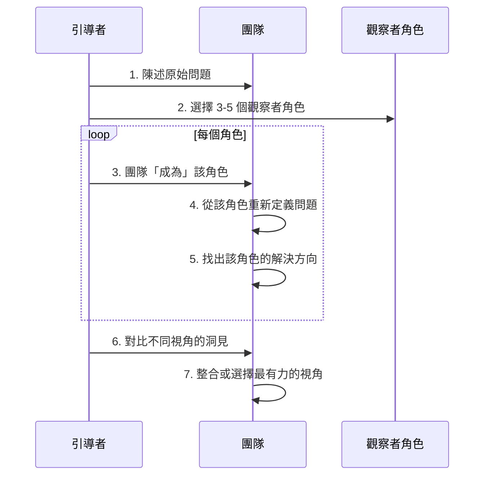
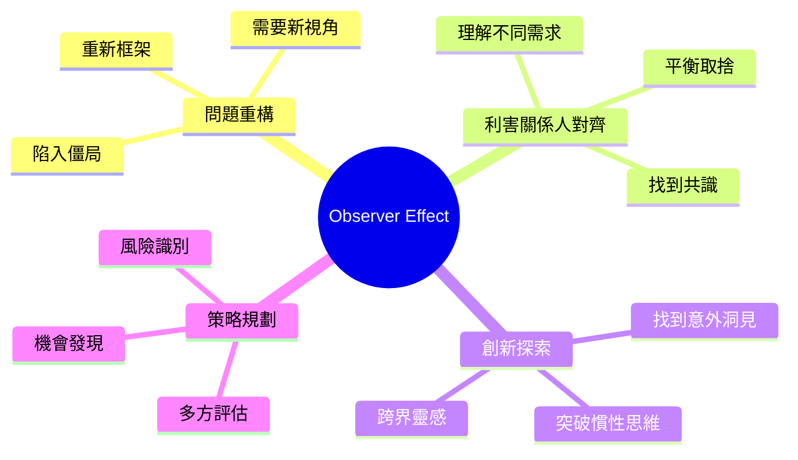
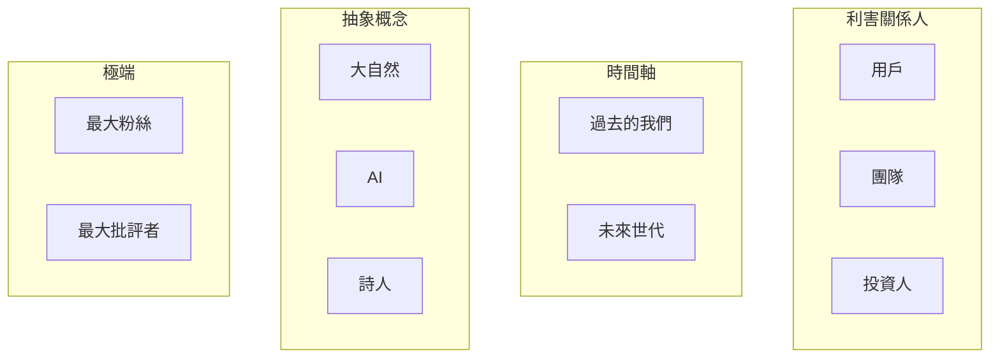
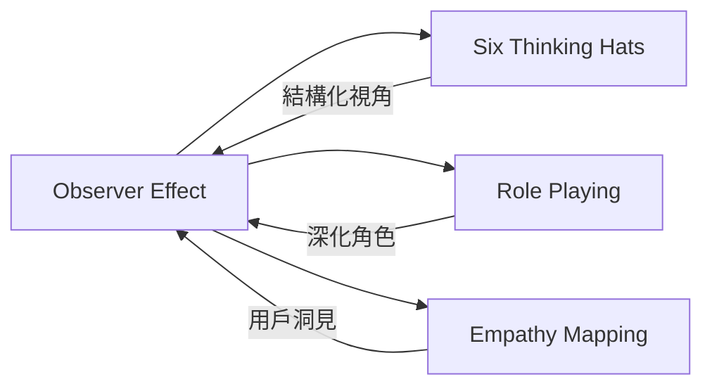

# Observer Effect

> 觀察者效應 - 改變觀察視角，重新定義現實

## 基本資訊

| 屬性 | 值 |
|------|-----|
| 類別 | Quantum |
| 能量等級 | 高 |
| 建議時長 | 30-45 分鐘 |
| 參與人數 | 3-10 人 |
| 難度 | 中 |

## 技術概述

**Observer Effect** 受量子物理中「觀察會改變被觀察對象」的概念啟發。在腦力激盪中，這意味著：觀察者的角色、視角和意圖會根本性地改變我們對問題的理解。透過刻意切換「觀察者身份」，我們可以看見同一個問題的完全不同面貌。

## 歷史背景

量子物理中的觀察者效應由海森堡測不準原理等概念發展而來。在創意思維領域，愛德華·德·波諾（Edward de Bono）的「六頂思考帽」、設計思維中的「同理心」練習，都體現了類似的視角轉換概念。

## 核心原理

### 觀察者決定現實

### 關鍵原則

1. **視角即現實**
   - 問題的定義取決於誰在觀察
   - 不同角色看見不同的優先順序

2. **刻意切換身份**
   - 不是問「我們怎麼看」
   - 而是問「如果我是 X，我會怎麼看」

3. **暫停評判**
   - 每個視角都先完整表達
   - 不急於判斷對錯

4. **整合多重現實**
   - 最終可能整合多個視角
   - 或選擇最有洞見的視角

## 執行步驟

### 詳細步驟

1. **陳述原始問題（5分鐘）**
   - 清楚描述當前面對的挑戰
   - 例：「我們的 App 用戶留存率太低」

2. **選擇觀察者角色（5分鐘）**
   - 選擇 3-5 個差異大的角色
   - 可以是：
     - **利害關係人**：客戶、CEO、工程師、投資人
     - **時間視角**：過去的自己、未來的後代
     - **抽象角色**：大自然、演算法、詩人
     - **極端角色**：最熱情的粉絲、最嚴厲的批評者

3. **第一個角色（7分鐘）**
   - 團隊「成為」該角色
   - 引導者提問：「從這個角色看，問題是什麼？」
   - 快速記錄洞見

4. **重複其他角色（每個 7 分鐘）**
   - 清楚切換身份
   - 每次都重新定義問題
   - 注意每個角色看重的不同面向

5. **對比視角（10分鐘）**
   - 並列所有視角的問題定義
   - 找出：
     - 哪些視角有驚人洞見？
     - 哪些衝突最有張力？
     - 哪些被忽略的面向？

6. **整合或選擇（10分鐘）**
   - **選項 A**：選擇最有洞見的單一視角
   - **選項 B**：整合多個視角成新問題陳述
   - **選項 C**：為不同視角設計不同解決方案

## 引導提示

使用以下提示句引導思考：

| 提示句 | 用途 |
|--------|------|
| "如果你是 [角色]，你會如何定義這個問題？" | 切換視角 |
| "從 [角色] 的立場，什麼是最重要的？" | 找出優先順序 |
| "[角色] 會用什麼語言描述這個情況？" | 改變詞彙 |
| "對 [角色] 來說，成功是什麼樣子？" | 重新定義目標 |
| "如果只有 [角色] 的意見算數，我們會怎麼做？" | 極端測試 |

## 適用場景

### 經典應用範例

**範例：電商網站改版**

| 觀察者 | 問題定義 | 解決方向 |
|--------|----------|----------|
| 新用戶 | 「我不知道這網站賣什麼」 | 首頁需要更清楚的價值主張 |
| 回頭客 | 「找不到我之前買過的東西」 | 強化個人化推薦 |
| 物流人員 | 「訂單資訊常常不完整」 | 優化結帳流程驗證 |
| CEO | 「轉換率太低，影響營收」 | 聚焦於高價值用戶旅程 |
| 網站本身（擬人化）| 「我的載入速度拖累了體驗」 | 效能優化 |

## 注意事項

### 適合情境
- 團隊陷入單一視角
- 需要重新定義問題
- 利害關係人需求衝突
- 尋求突破性洞見

### 不適合情境
- 問題已經非常明確
- 時間極度緊迫
- 團隊難以進行角色扮演
- 只需要執行而非思考

### 常見陷阱

1. **表面扮演**
   - 沒有真正進入角色
   - 仍用自己的視角思考
   - 解決：用角色的語言和價值觀說話

2. **過多角色**
   - 選擇太多角色導致疲勞
   - 解決：3-5 個就足夠

3. **忽略衝突**
   - 試圖過早和諧不同視角
   - 解決：先讓衝突浮現，再處理

4. **選擇安全角色**
   - 只選擇熟悉的角色
   - 解決：至少包含一個「極端」或「意外」角色

## 角色選擇工具

### 四類觀察者

### 觀察者角色範例庫

- **商業**: CEO、CFO、客服、新進員工、離職員工
- **用戶**: 新手、專家、極端用戶、非用戶、未來用戶
- **時間**: 5 年前的團隊、10 年後回看、100 年後的歷史學家
- **抽象**: 演算法、城市、森林、病毒、浪潮
- **文化**: 不同國家的用戶、不同世代、不同專業背景

## 與其他技術的結合

## 深化練習：觀察者鏈

嘗試這個進階玩法：
1. 從觀察者 A 的視角看問題
2. 再從「觀察著觀察者 A 的觀察者 B」視角看
3. 層層遞進，看見更深的結構

例：
- 用戶看見「產品難用」
- 設計師看見「用戶不理解概念模型」
- 心理學家看見「設計師假設了錯誤的心智模型」

## 設計模式與方法論對照

| 相關模式/方法論 | 連結點 | 應用價值 |
|----------------|--------|----------|
| **Six Thinking Hats** | Edward de Bono 的結構化視角切換 | 系統性地從不同角度審視問題 |
| **Empathy Mapping** | d.school 的用戶洞察工具 | 從用戶視角重新定義問題 |
| **Stakeholder Analysis** | 利害關係人分析 | 識別不同觀察者及其優先順序 |
| **Jobs to Be Done** | Clayton Christensen 的需求框架 | 從「用戶想完成什麼」的視角觀察 |
| **Reframing** | 問題重構技術 | 透過改變觀察角度發現新解決方案 |

**核心洞察**：Observer Effect 的深刻洞見是：問題不存在於「客觀現實」，而存在於「誰在觀察」。同一個狀況，CEO 看到策略機會，工程師看到技術挑戰，用戶看到體驗痛點——這些都是「真實的」。刻意切換觀察者身份，不是玩角色扮演遊戲，而是承認現實是多面向的，每個視角都可能揭示被忽略的真相。

## 參考資源

- Werner Heisenberg: 測不準原理
- Edward de Bono (1985): *Six Thinking Hats*
- [Stanford d.school: Empathy](https://dschool.stanford.edu/)
- 量子物理科普：《Quantum Enigma》by Rosenblum & Kuttner

---

*返回 [Quantum 類別](./index.md) | [技術總覽](../index.md)*
