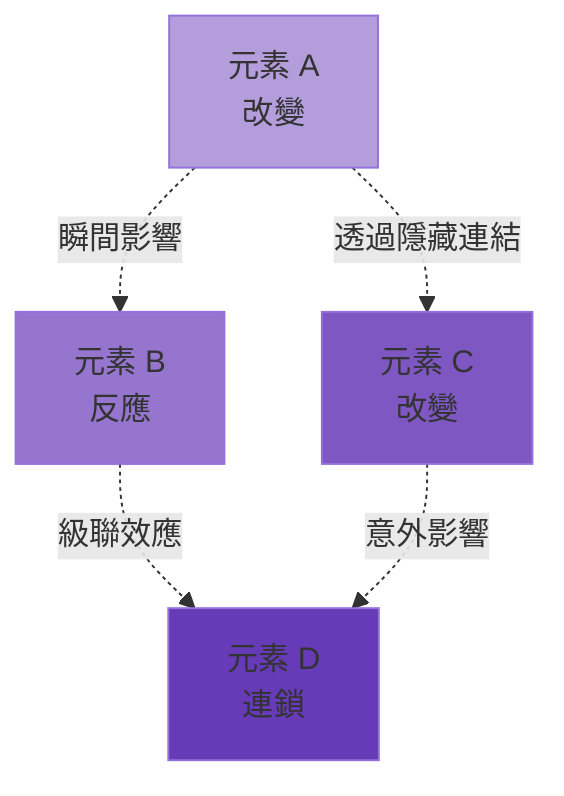
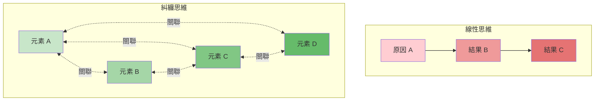
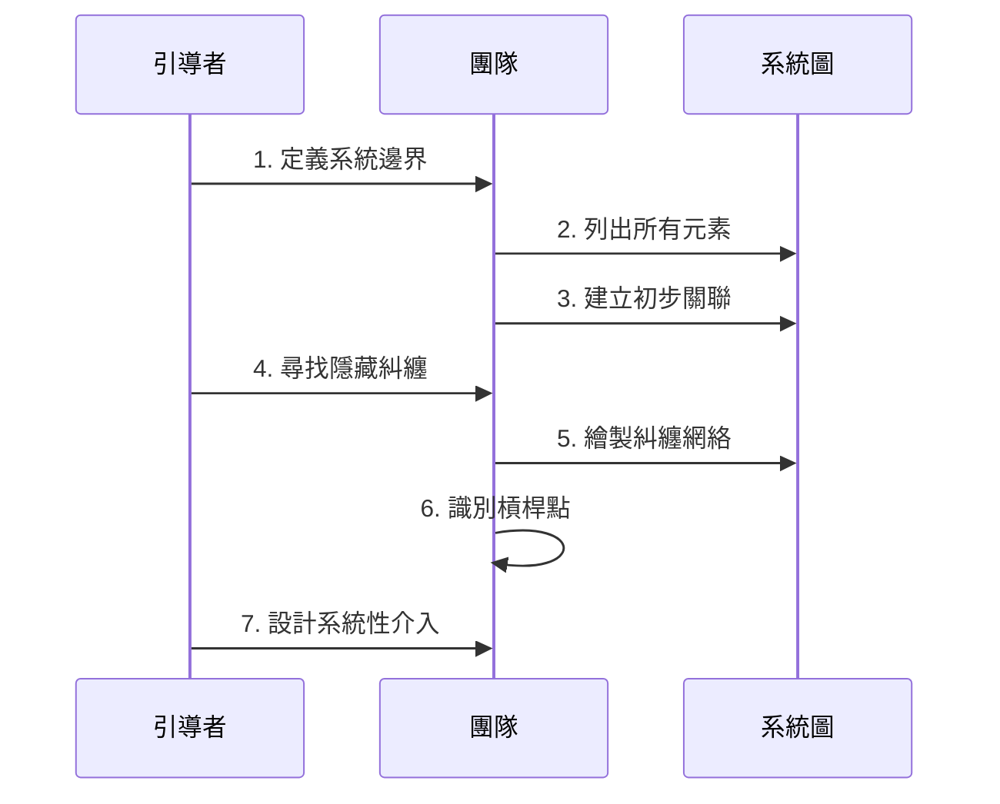
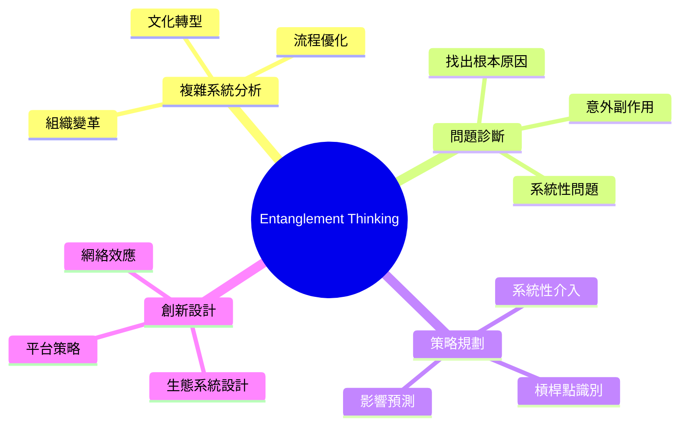
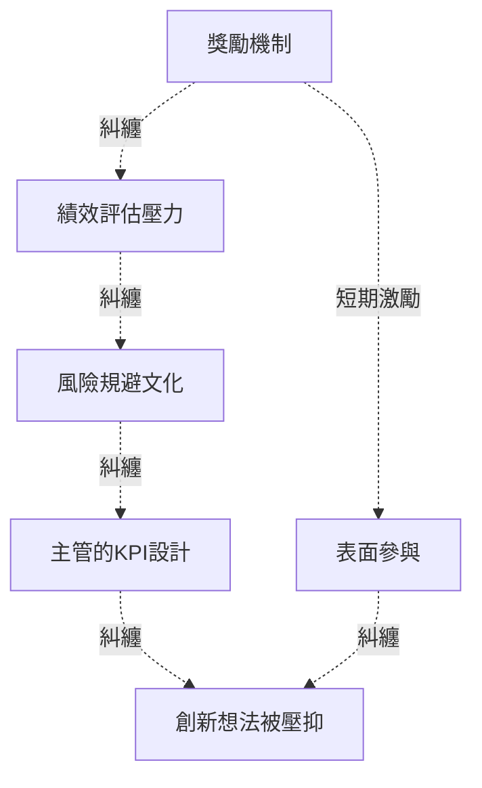
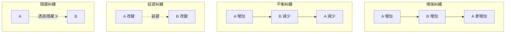
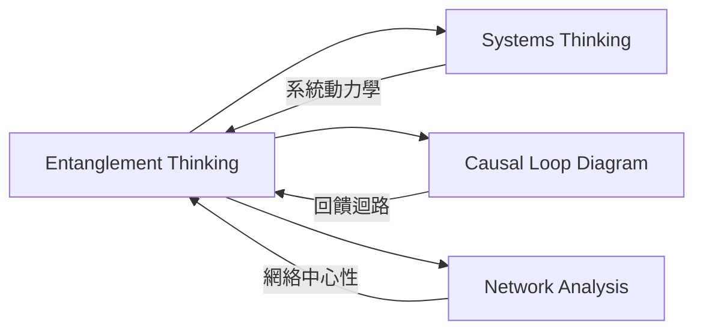
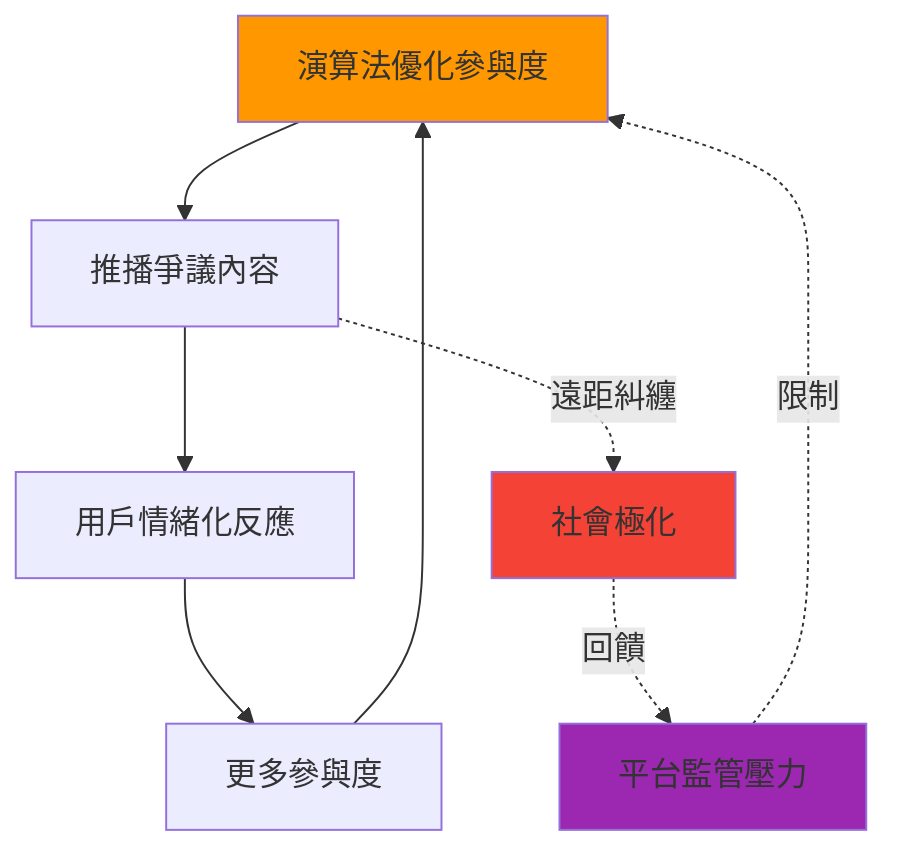

# Entanglement Thinking

> 糾纏思維 - 發現遠距關聯，理解系統性影響

## 基本資訊

| 屬性 | 值 |
|------|-----|
| 類別 | Quantum |
| 能量等級 | 中 |
| 建議時長 | 45-60 分鐘 |
| 參與人數 | 4-12 人 |
| 難度 | 中高 |

## 技術概述

**Entanglement Thinking** 受量子糾纏（Quantum Entanglement）啟發——兩個粒子無論距離多遠，都能瞬間影響彼此。這個技術幫助團隊發現看似無關的元素間的隱藏連結，理解複雜系統中的遠距影響和意外關聯。

## 歷史背景

量子糾纏由愛因斯坦稱為「鬼魅般的遠距作用」，挑戰了局部因果的直覺。在系統思維中，類似概念出現在蝴蝶效應、網絡理論、複雜適應系統等領域。這個技術將物理隱喻轉化為發現隱藏關聯的創意工具。

## 核心原理

### 超越線性因果

### 關鍵原則

1. **遠距影響**
   - 改變系統一端，可能影響遠處的另一端
   - 影響路徑可能非直接

2. **非局部性**
   - 問題不一定在問題發生處
   - 解決方案可能在意想不到的地方

3. **關聯網絡**
   - 一切都相互連結
   - 改變一處會產生漣漪效應

4. **測量改變狀態**
   - 觀察某個元素可能改變整個系統
   - 介入本身就是一種干預

## 執行步驟

### 詳細步驟

1. **定義系統（10分鐘）**
   - 確定要分析的系統範圍
   - 例：「我們公司的創新文化」
   - 設定系統邊界

2. **列出元素（10分鐘）**
   - 腦力激盪系統中的所有元素
   - 用便利貼寫下：
     - 人（角色、團隊）
     - 流程（會議、決策流程）
     - 資源（時間、預算）
     - 文化（價值觀、規範）
     - 產出（產品、服務）
   - 每個元素一張便利貼

3. **初步關聯（10分鐘）**
   - 在白板上排列元素
   - 用箭頭標示明顯的因果關係
   - 例：「預算限制」→「創新項目數量」

4. **尋找隱藏糾纏（15分鐘）**
   - 關鍵問題：
     - 「哪些看似無關的元素，其實會相互影響？」
     - 「改變 A 會不會意外影響 Z？」
     - 「有哪些間接的、多步驟的關聯？」
   - 用虛線或不同顏色標示糾纏關係

5. **繪製糾纏網絡（10分鐘）**
   - 視覺化所有關聯
   - 注意：
     - 哪些元素是「樞紐」（連結很多其他元素）
     - 哪些元素形成「循環」（互相增強或削弱）
     - 哪些關聯最出人意料

6. **識別槓桿點（10分鐘）**
   - 找出「高槓桿點」：
     - 影響最多其他元素的元素
     - 處於關鍵循環中的元素
     - 最意外的糾纏關係
   - 圈選出 2-3 個最有潛力的介入點

7. **設計介入（10分鐘）**
   - 問：「如果我們改變這個元素，整個系統會如何反應？」
   - 預測級聯效應
   - 設計系統性的解決方案

## 引導提示

使用以下提示句引導思考：

| 提示句 | 用途 |
|--------|------|
| "如果我們改變 A，哪些遠處的元素會受影響？" | 追蹤遠距影響 |
| "這兩個看似無關的元素，有沒有隱藏連結？" | 發現糾纏 |
| "這個問題的真正原因，會不會在完全不同的地方？" | 非局部思考 |
| "改變哪一個元素，會產生最大的漣漪效應？" | 找槓桿點 |
| "這個系統中有哪些互相增強的循環？" | 識別回饋迴路 |

## 適用場景

### 經典應用範例

**範例：提升員工創新積極性**

傳統線性思維：
- 問題：員工不願提創新想法
- 解法：設立獎勵機制

糾纏思維發現的隱藏關聯：

發現：獎勵機制反而可能強化績效壓力，真正的槓桿點在「主管的 KPI 設計」。

## 注意事項

### 適合情境
- 面對複雜的系統性問題
- 單點解決方案屢次失敗
- 需要理解意外後果
- 設計平台或生態系統

### 不適合情境
- 問題簡單明確
- 時間緊迫需快速決策
- 團隊不熟悉系統思維
- 系統邊界難以定義

### 常見陷阱

1. **過度複雜化**
   - 看到太多關聯，無法行動
   - 解決：聚焦於最強的 3-5 個糾纏關係

2. **忽略時間延遲**
   - 糾纏效應可能有時間差
   - 解決：標註影響的時間尺度

3. **靜態分析**
   - 系統是動態的，關聯會改變
   - 解決：定期更新糾纏圖

4. **分析癱瘓**
   - 分析太久，不敢介入
   - 解決：接受不確定性，小範圍測試

## 糾纏類型

### 四種糾纏模式

## 視覺化工具

### 糾纏強度標示

- **實線粗箭頭** = 強糾纏（直接、明顯）
- **虛線箭頭** = 弱糾纏（間接、微妙）
- **雙向箭頭** = 互相糾纏（互相影響）
- **紅色** = 增強循環（正回饋）
- **藍色** = 平衡循環（負回饋）

## 與其他技術的結合

## 進階：量化糾纏強度

如果團隊具有分析能力，可以嘗試：

1. **影響矩陣**
   - 列出所有元素
   - 評估每對元素的影響強度（0-5 分）
   - 識別最強的糾纏

2. **網絡分析指標**
   - 中心性（Centrality）：哪些元素最關鍵
   - 聚類（Clustering）：哪些元素形成群組
   - 路徑長度：影響需要幾步傳遞

## 實際案例：社交媒體演算法

這個例子展示了看似獨立的「演算法設計」和「社會極化」之間的糾纏關係。

## 設計模式與方法論對照

| 相關模式/方法論 | 連結點 | 應用價值 |
|----------------|--------|----------|
| **Systems Thinking (Donella Meadows)** | 系統動力學與槓桿點 | 識別系統中最有影響力的介入點 |
| **Causal Loop Diagram** | 因果迴路圖 | 視覺化增強迴路與平衡迴路 |
| **Network Analysis** | 網絡中心性分析 | 找出最具連結性的「樞紐」元素 |
| **Iceberg Model** | 冰山模型 | 從事件到模式到結構到心智模型 |
| **Leverage Points** | Donella Meadows 的 12 個槓桿點 | 系統性地評估介入點的有效性 |
| **Butterfly Effect** | 蝴蝶效應與非線性 | 認識小變化可能產生巨大遠距影響 |

**核心洞察**：Entanglement Thinking 挑戰了「局部因果」的直覺。我們習慣性地認為問題在問題發生的地方，解決方案也應該在那裡。但糾纏思維揭示：系統中看似無關的元素可能有隱藏連結，改變一端會在遠處產生漣漪。最有力的介入點，往往不在問題表面，而在意想不到的「糾纏樞紐」。

## 參考資源

- Donella Meadows (2008): *Thinking in Systems: A Primer*
- Peter Senge (1990): *The Fifth Discipline*
- [Systems Innovation](https://www.systemsinnovation.network/)
- Albert-László Barabási: *Network Science*
- 量子糾纏科普：Brian Greene 的《The Fabric of the Cosmos》

---

*返回 [Quantum 類別](./index.md) | [技術總覽](../index.md)*
