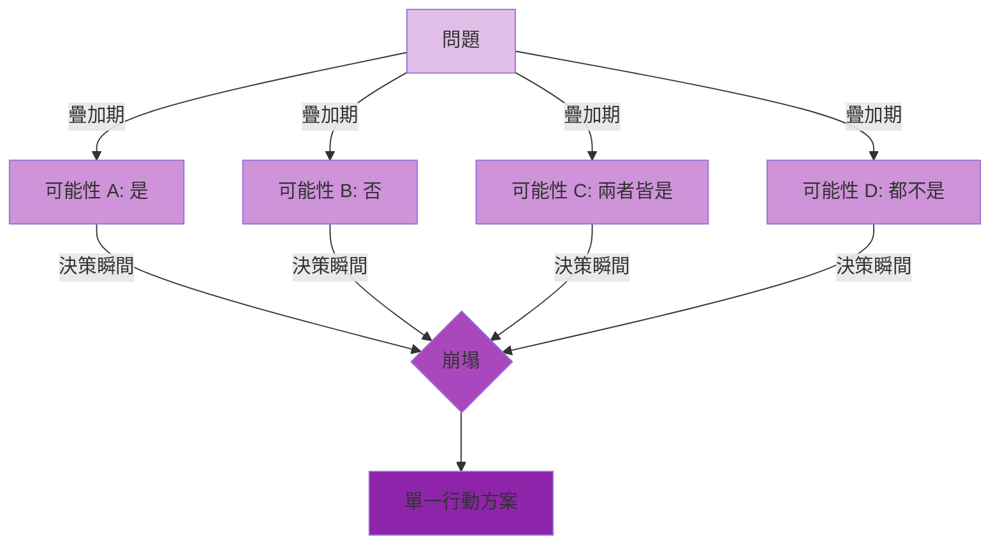
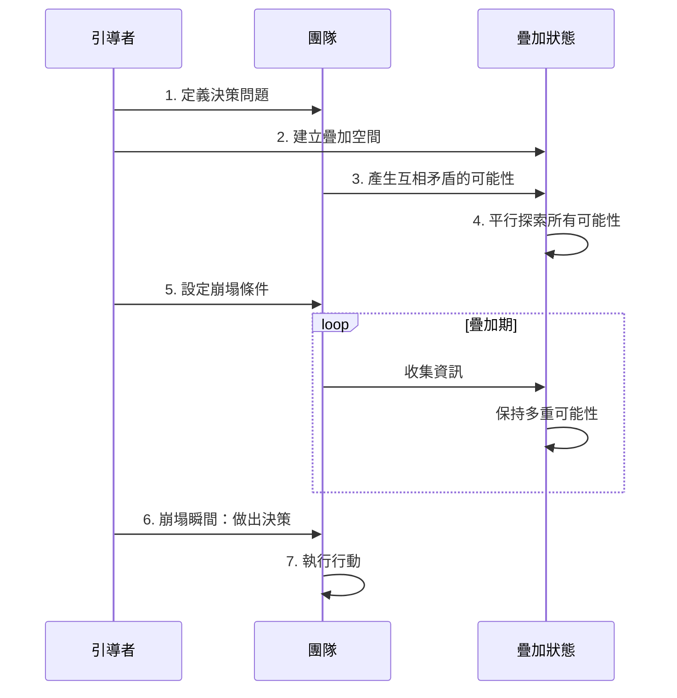
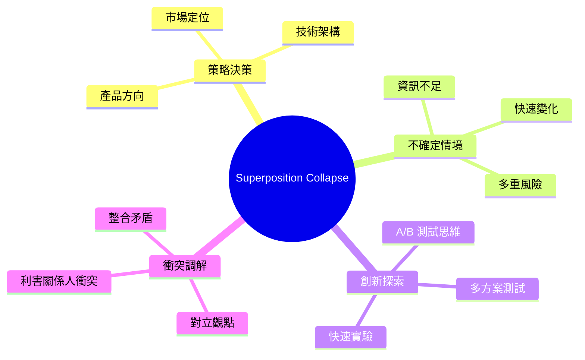
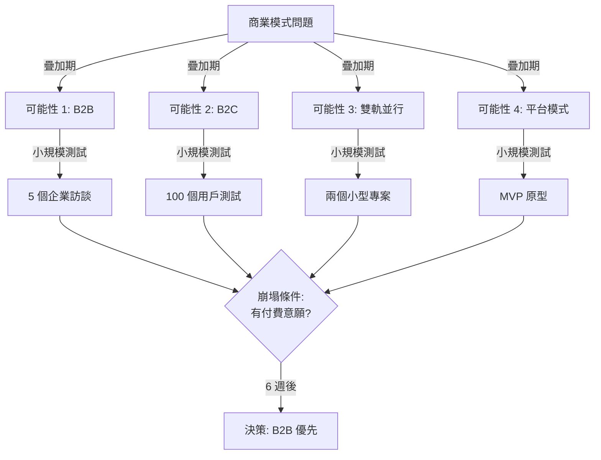
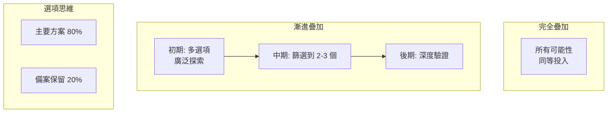
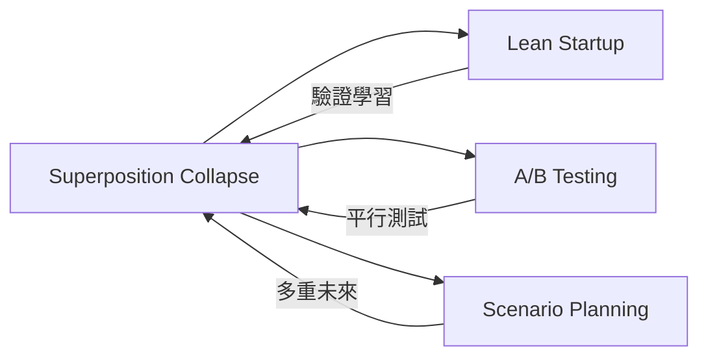

# Superposition Collapse

> 疊加崩塌 - 讓多重可能性並存，直到決策時刻

## 基本資訊

| 屬性 | 值 |
|------|-----|
| 類別 | Quantum |
| 能量等級 | 高 |
| 建議時長 | 60-90 分鐘 |
| 參與人數 | 3-10 人 |
| 難度 | 中 |

## 技術概述

**Superposition Collapse** 受量子疊加（Quantum Superposition）啟發——粒子在觀測前可同時處於多種狀態，觀測瞬間「崩塌」為單一狀態。這個技術鼓勵團隊刻意延遲決策，讓多種互相矛盾的可能性並存，直到獲得足夠資訊才「崩塌」為具體行動。



## 歷史背景

量子疊加是量子力學的核心概念，最著名的思想實驗是「薛丁格的貓」——貓同時處於生與死的疊加態。在決策理論中，類似概念出現在「延遲決策」（Defer Commitment）、「選擇權思維」等策略中。

## 核心原理

### 延遲崩塌的智慧

```mermaid
graph TD
    subgraph 過早崩塌（傳統）
    A1[遇到問題] --> A2[快速選擇一個方案]
    A2 --> A3[發現資訊不足]
    A3 --> A4[推翻重來]
    end

    subgraph 刻意疊加（量子）
    B1[遇到問題] --> B2[同時探索多個方案]
    B2 --> B3[保持開放，收集資訊]
    B3 --> B4[在最佳時機崩塌]
    B4 --> B5[明智決策]
    end

    style A1 fill:#ffcdd2
    style A2 fill:#ef9a9a
    style A3 fill:#e57373
    style A4 fill:#ef5350

    style B1 fill:#c8e6c9
    style B2 fill:#a5d6a7
    style B3 fill:#81c784
    style B4 fill:#66bb6a
    style B5 fill:#4caf50
```

### 關鍵原則

1. **擁抱矛盾**
   - 允許相反的選項同時存在
   - 例：「我們既要快速也要品質」在疊加期都成立

2. **延遲承諾**
   - 盡可能延後不可逆的決策
   - 保持彈性空間

3. **平行探索**
   - 同時推進多個可能性
   - 小成本探索，而非全力投入單一選項

4. **主動崩塌**
   - 不是永遠不決策
   - 設定明確的「崩塌觸發條件」

## 執行步驟



### 詳細步驟

1. **定義決策問題（10分鐘）**
   - 清楚描述需要決策的問題
   - 例：「我們應該優先開發功能 A 還是功能 B？」
   - 確認這是值得疊加的問題（非瑣碎決策）

2. **建立疊加空間（10分鐘）**
   - 宣告進入「疊加期」
   - 規則：
     - 不急於做決定
     - 允許矛盾並存
     - 暫停「是或否」的二元思維

3. **產生可能性（15分鐘）**
   - 腦力激盪至少 4-6 個可能性
   - 刻意包含：
     - 相反的選項（A vs B）
     - 折衷方案（A + B）
     - 第三條路（既非 A 也非 B）
     - 激進選項（完全不同的方向）
   - 所有選項暫時「等價」

4. **平行探索（20分鐘）**
   - 為每個可能性做快速探索：
     - **優勢**：如果選這個，會帶來什麼？
     - **風險**：可能的問題是什麼？
     - **資訊需求**：需要知道什麼才能確定？
   - 分組或個人認領不同可能性
   - 避免辯論，只是探索

5. **設定崩塌條件（10分鐘）**
   - 定義何時必須做決策
   - 條件可以是：
     - **時間觸發**：「兩週後必須決定」
     - **資訊觸發**：「當我們收到客戶回饋」
     - **門檻觸發**：「當某個選項明顯優於其他」
   - 在此之前，保持疊加

6. **崩塌瞬間（15分鐘）**
   - 當條件滿足，召集團隊
   - 回顧所有可能性的探索結果
   - 做出決策：
     - **選擇單一方案**
     - **整合多個方案**
     - **延後崩塌**（如資訊仍不足）

7. **執行行動（10分鐘）**
   - 一旦崩塌，全力執行
   - 不再猜測「如果選另一個會怎樣」
   - 設定下一個檢查點

## 引導提示

使用以下提示句引導思考：

| 提示句 | 用途 |
|--------|------|
| "如果我們不急著決定，還有哪些可能性？" | 進入疊加 |
| "這兩個相反的選項，能否同時為真？" | 擁抱矛盾 |
| "我們需要什麼資訊才能安心做決策？" | 設定崩塌條件 |
| "現在就決定，會錯過什麼？" | 延遲承諾 |
| "這個問題有沒有『第三條路』？" | 擴展可能性 |
| "崩塌的時機到了嗎？" | 檢視條件 |

## 適用場景



### 經典應用範例

**範例：新創公司的商業模式**

傳統做法：
- 第一週就決定 B2B 還是 B2C
- 全力投入一個方向
- 三個月後發現市場不如預期

疊加做法：


## 注意事項

### 適合情境
- 重大、不可逆的決策
- 資訊不足、環境不確定
- 有時間空間做探索
- 需要整合多元觀點

### 不適合情境
- 緊急決策（如危機處理）
- 瑣碎選擇（如午餐吃什麼）
- 已有明確最佳解
- 團隊無法容忍不確定性

### 常見陷阱

1. **永不崩塌**
   - 一直拖延決策，變成決策癱瘓
   - 解決：明確設定崩塌條件和截止日期

2. **假裝疊加**
   - 其實已經有偏好，只是假裝開放
   - 解決：真誠探索每個可能性的優點

3. **過多選項**
   - 疊加太多可能性，無法有效探索
   - 解決：限制在 3-6 個核心選項

4. **疊加錯誤問題**
   - 不是所有問題都適合疊加
   - 解決：評估決策的重要性和可逆性

## 疊加期的管理

### 三種疊加模式



### 疊加期的實驗設計

- **時間盒限制**：每個可能性分配固定時間（如 1 週）
- **資源上限**：每個探索的成本不超過 X
- **可逆性測試**：優先測試容易撤回的選項
- **並行團隊**：不同小組探索不同可能性

## 與其他技術的結合



## 崩塌決策工具

當崩塌時機到來，使用這個框架：

### 崩塌決策矩陣

| 可能性 | 探索結果 | 信心程度 | 風險 | 機會 | 建議 |
|--------|----------|----------|------|------|------|
| A | ... | ⭐⭐⭐⭐ | 低 | 高 | ✅ 選擇 |
| B | ... | ⭐⭐ | 高 | 中 | ❌ 放棄 |
| C | ... | ⭐⭐⭐ | 中 | 中 | ⏸️ 保留為備案 |

### 崩塌的三種結果

1. **單一崩塌**：選擇一個方案，放棄其他
2. **部分崩塌**：整合多個方案的元素
3. **延遲崩塌**：資訊仍不足，延長疊加期

## 實際案例：亞馬遜的雙軌策略

亞馬遜在早期同時疊加多個可能性：
- 可能性 1：只賣書
- 可能性 2：賣所有東西
- 可能性 3：成為零售平台

他們採用「漸進崩塌」：
1. 先聚焦書籍證明模式
2. 逐步擴展到其他品類
3. 最終演化為平台模式

關鍵是他們延遲了「只能選一個」的崩塌，保持了彈性。

## 參考資源

- Schrödinger's Cat (思想實驗)
- Eric Ries (2011): *The Lean Startup* - 驗證學習
- [Real Options Valuation](https://en.wikipedia.org/wiki/Real_options_valuation)
- Mary Poppendieck: *Lean Software Development* - Defer Commitment
- 量子物理科普：Chad Orzel 的《How to Teach Quantum Physics to Your Dog》

---

*返回 [Quantum 類別](./index.md) | [技術總覽](../index.md)*
