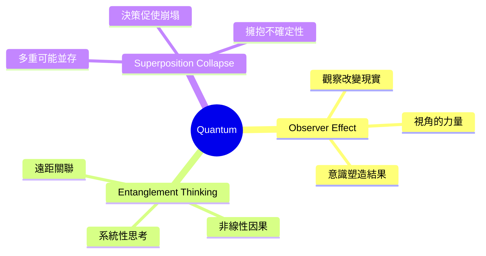
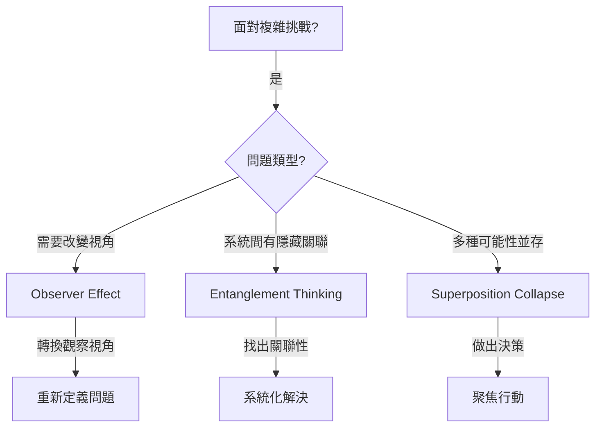

# Quantum Brainstorming Techniques

> 量子類腦力激盪技術 - 從量子物理汲取靈感，處理複雜與矛盾

## 類別概述

量子類技術借用量子物理的反直覺概念，幫助團隊跳脫二元思維，接納矛盾與不確定性。量子世界中的疊加、糾纏、觀察者效應等現象，提供了處理複雜系統和模糊情境的創新思維模式。

## 核心特性

| 特性 | 說明 |
|------|------|
| 矛盾接納 | 允許相反概念同時為真 |
| 非線性思維 | 超越傳統因果關係 |
| 視角敏感 | 觀察者角度會改變結果 |
| 抽象轉化 | 將物理概念轉化為思維工具 |

## 技術列表

| # | 技術名稱 | 核心概念 | 適用情境 |
|---|----------|----------|----------|
| 1 | [Observer Effect](./01-observer-effect.md) | 觀察者效應 | 視角轉換、重新框架 |
| 2 | [Entanglement Thinking](./02-entanglement-thinking.md) | 糾纏思維 | 複雜系統、遠距影響 |
| 3 | [Superposition Collapse](./03-superposition-collapse.md) | 疊加崩塌 | 多重方案、決策制定 |

## 使用時機

## 能量等級

- **高能量**: Observer Effect, Superposition Collapse
- **中等能量**: Entanglement Thinking

## 適合領域

- **策略規劃**: 處理多重未來可能性
- **系統設計**: 理解複雜的交互關係
- **創新思維**: 跳脫傳統二元思考
- **決策制定**: 在不確定性中做選擇
- **問題重構**: 從不同視角重新定義問題

## 使用注意

這些技術使用抽象的量子物理概念作為思維隱喻。重點不在於物理精確性，而在於這些概念能否啟發新的思考方式。使用時應：

1. **強調隱喻性質** - 這是思維工具，不是物理課
2. **避免過度複雜** - 保持概念清晰易懂
3. **聚焦實用性** - 關注能否產生實際洞見
4. **容許詮釋彈性** - 不同人可能有不同理解

---

*返回 [技術總覽](../index.md)*
