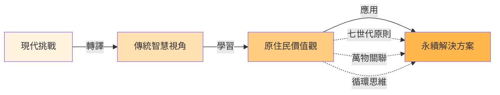
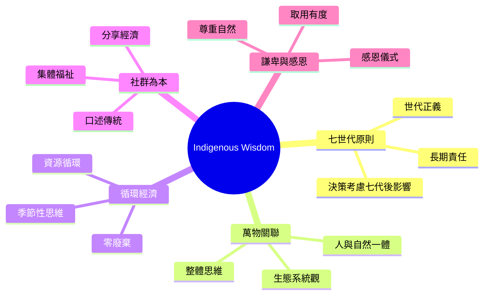
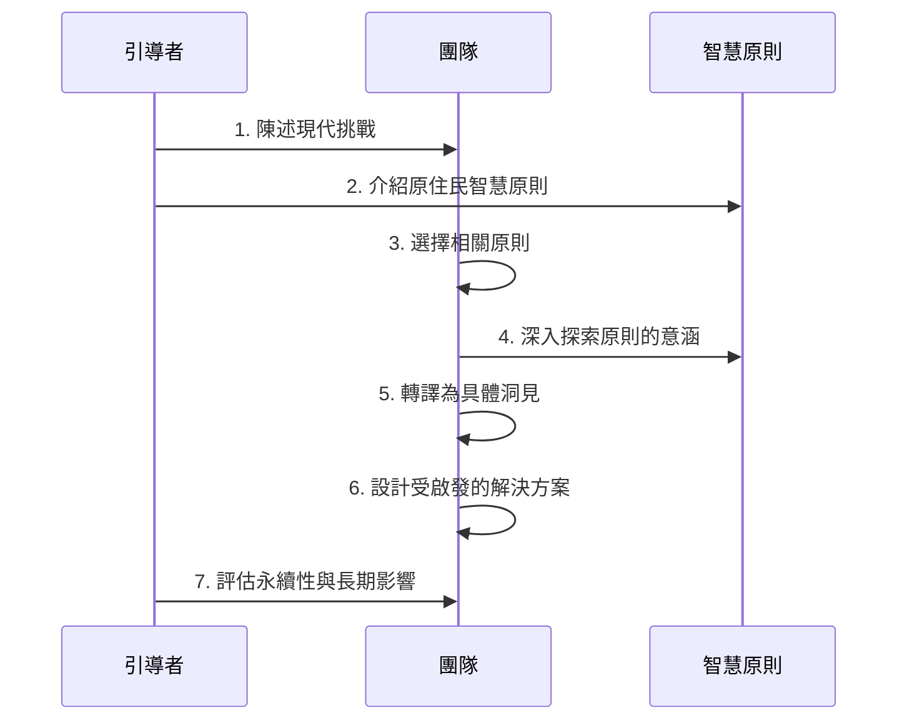
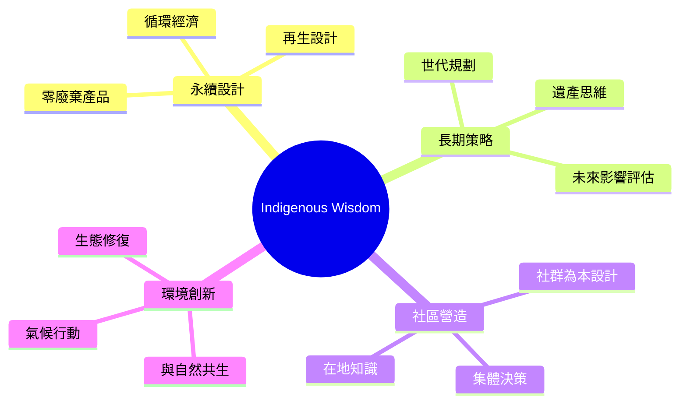
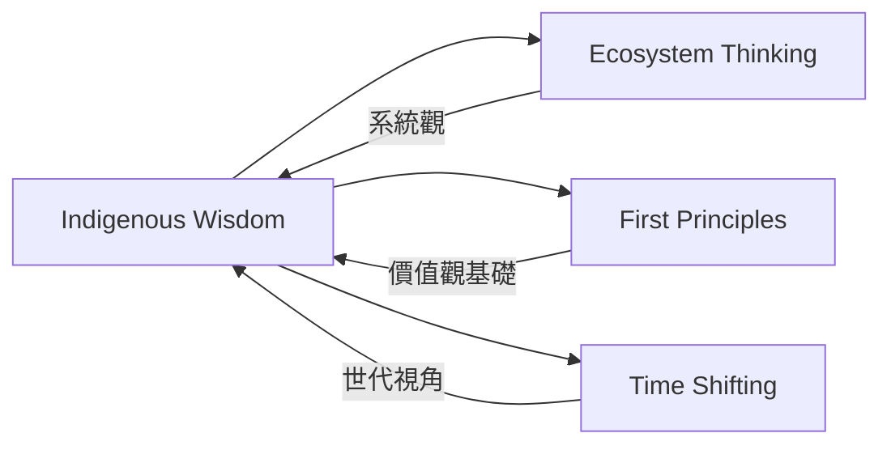

# Indigenous Wisdom

> 原住民智慧 - 從傳統知識學習永續與長期思維

## 基本資訊

| 屬性 | 值 |
|------|-----|
| 類別 | Cultural |
| 能量等級 | 中 |
| 建議時長 | 60-90 分鐘 |
| 參與人數 | 4-12 人 |
| 難度 | 中 |

## 技術概述

**Indigenous Wisdom** 從原住民文化和傳統知識中汲取智慧，應用於現代創新挑戰。原住民文化經常體現長期思維、與自然共生、社群為本等價值觀，這些視角能幫助我們超越短期利益，設計更永續、更全面的解決方案。

## 歷史背景

原住民知識系統已經存在數千年，代表人類與環境長期互動的累積智慧。近年來，永續發展、環境保護、社會創新等領域越來越重視傳統生態知識（Traditional Ecological Knowledge, TEK）的價值。

## 核心原理

### 原住民思維的核心價值

### 關鍵原則

1. **七世代原則（Seven Generation Principle）**
   - 易洛魁聯盟的傳統
   - 每個決策要考慮對七代後子孫的影響
   - 應用：長期影響評估

2. **萬物關聯（All My Relations）**
   - 所有生命相互連結
   - 沒有「廢棄物」的概念
   - 應用：系統思維、循環經濟

3. **取用有度（Take Only What You Need）**
   - 尊重資源有限性
   - 永續使用
   - 應用：簡約設計、資源效率

4. **口述與體驗傳承**
   - 知識透過故事和實踐傳遞
   - 重視體驗式學習
   - 應用：敘事設計、體驗式創新

## 執行步驟

### 詳細步驟

1. **陳述挑戰（10分鐘）**
   - 描述要解決的問題
   - 例：「如何設計更永續的包裝？」

2. **介紹智慧原則（15分鐘）**
   - 簡介 3-5 個原住民智慧原則
   - 可以聚焦特定文化（如北美原住民、毛利人、台灣原住民等）
   - 或整合多文化的共通智慧

3. **選擇相關原則（10分鐘）**
   - 團隊討論：哪些原則與我們的挑戰最相關？
   - 選擇 1-2 個深入探索

4. **深入探索（20分鐘）**
   - 問：「這個原則背後的世界觀是什麼？」
   - 例：七世代原則 → 我們對未來有責任
   - 萬物關聯 → 沒有真正的「廢棄」

5. **轉譯洞見（20分鐘）**
   - 將原則轉化為具體設計洞見
   - 例：
     - 七世代 → 評估 50 年後的影響
     - 萬物關聯 → 包裝材料成為另一個產品的原料
     - 取用有度 → 最小化材料使用

6. **設計方案（20分鐘）**
   - 基於洞見，設計解決方案
   - 快速草圖或原型

7. **永續評估（10分鐘）**
   - 用原住民智慧原則評估方案
   - 問：「這個方案符合長期思維嗎？」
   - 「是否尊重生態系統？」

## 引導提示

使用以下提示句引導思考：

| 提示句 | 用途 |
|--------|------|
| "如果我們為七代後的子孫設計，會有什麼不同？" | 長期思維 |
| "在這個系統中，什麼是真正的『廢棄物』？" | 循環思維 |
| "如果我們把自然當作夥伴而非資源，會怎麼做？" | 生態關係 |
| "傳統社群如何解決類似問題？" | 歷史智慧 |
| "這個方案對整個生態系統的影響是什麼？" | 系統影響 |

## 適用場景

### 經典應用範例

1. **Patagonia「地球稅」**
   - 受原住民「取用有度」啟發
   - 將 1% 營收捐給環境保護
   - 長期承諾而非短期利潤

2. **毛利人的 Kaitiakitanga（守護者）概念**
   - 紐西蘭給予河流法律人格
   - 從「擁有」轉為「守護」
   - 世代責任思維

3. **Interface 地毯的「Climate Take Back」**
   - 受循環經濟啟發
   - 目標是「逆轉」氣候變遷
   - 產品設計考慮完整生命週期

## 注意事項

### 適合情境
- 設計永續解決方案
- 長期策略規劃
- 環境與社會創新
- 需要超越短期利益

### 不適合情境
- 緊急短期問題
- 純技術優化（無永續考量）
- 團隊對文化敏感度不足

### 文化敏感性

**重要提醒：避免文化挪用**

1. **學習而非挪用**
   - 深入理解，而非表面模仿
   - 致敬原創文化

2. **諮詢在地社群**
   - 如可能，邀請原住民顧問
   - 尊重知識產權

3. **適當轉譯**
   - 不直接聲稱「使用原住民方法」
   - 而是「受...啟發」

4. **回饋與致謝**
   - 明確致謝知識來源
   - 考慮如何回饋社群

## 原住民智慧原則庫

### 北美原住民

- **七世代原則**（易洛魁聯盟）
- **萬物關聯**（Mitakuye Oyasin）
- **給予的精神**（Potlatch 儀式）

### 毛利人（紐西蘭）

- **Kaitiakitanga**（守護者責任）
- **Whakapapa**（世代連結）
- **Manaakitanga**（款待與照顧）

### 澳洲原住民

- **Dreamtime**（創世紀敘事）
- **Country**（與土地的深刻連結）
- **Songlines**（歌之路徑）

### 台灣原住民

- **Sbalay**（泰雅族的和解與共享）
- **Pakalungay**（阿美族的年齡階級與傳承）
- **與土地共生**（各族普遍價值）

### 安地斯文化

- **Sumak Kawsay**（美好生活）
- **Ayni**（互惠原則）
- **Pachamama**（大地之母）

## 與其他技術的結合

## 實踐練習：七世代評估

對任何方案進行七世代影響評估：

| 世代 | 時間 | 問題 | 影響評估 |
|------|------|------|----------|
| 當代 | 現在 | 立即影響？ | ... |
| 子女 | 25 年 | 下一代影響？ | ... |
| 孫子 | 50 年 | 環境遺產？ | ... |
| 第四代 | 75 年 | 資源狀況？ | ... |
| 第五代 | 100 年 | 系統穩定性？ | ... |
| 第六代 | 125 年 | 文化傳承？ | ... |
| 第七代 | 150 年 | 整體福祉？ | ... |

## 深化問題

- 如果這個產品要使用 150 年，會如何設計？
- 我們的後代會感謝還是詛咒這個決定？
- 這個方案是從生態系統「提取」還是「貢獻」？
- 我們可以從大自然「借用」什麼，並完整歸還？

## 參考資源

- Robin Wall Kimmerer (2013): *Braiding Sweetgrass: Indigenous Wisdom, Scientific Knowledge, and the Teachings of Plants*
- Janine Benyus (1997): *Biomimicry* - 連結原住民智慧與仿生學
- [Indigenous Knowledge and Climate Change](https://www.un.org/development/desa/indigenouspeoples/)
- Oren Lyons: 易洛魁聯盟的 Faithkeeper，七世代原則倡導者
- Tyson Yunkaporta (2019): *Sand Talk: How Indigenous Thinking Can Save the World*

---

*返回 [Cultural 類別](./index.md) | [技術總覽](../index.md)*
