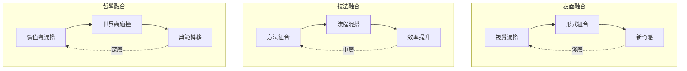
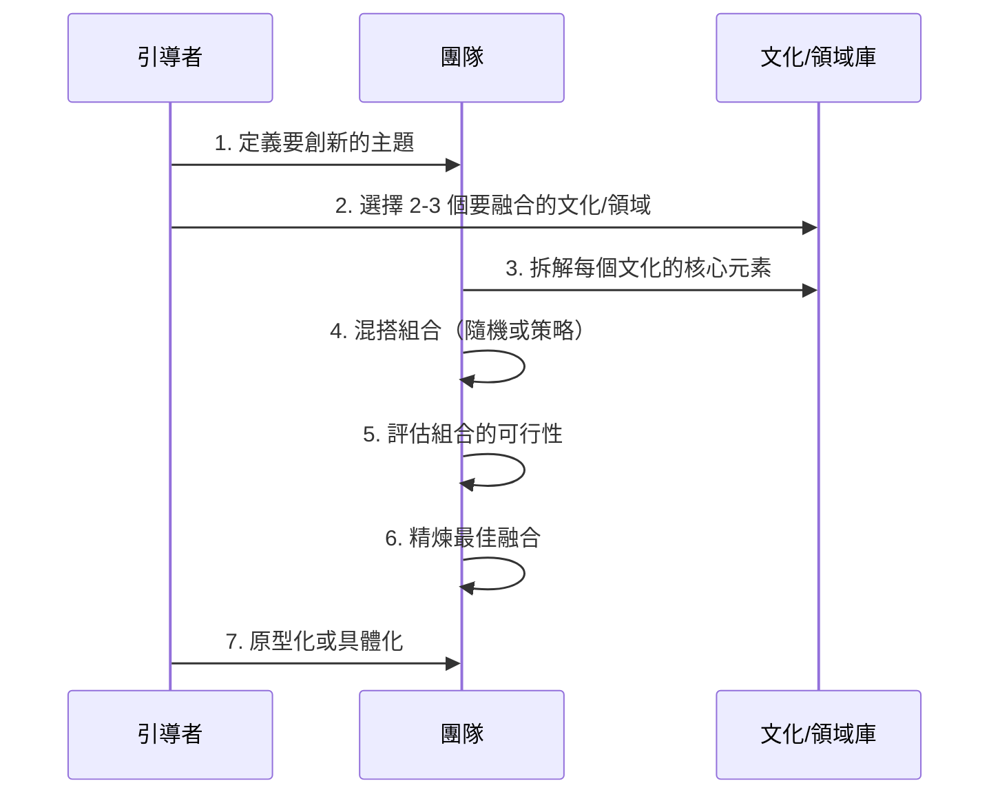
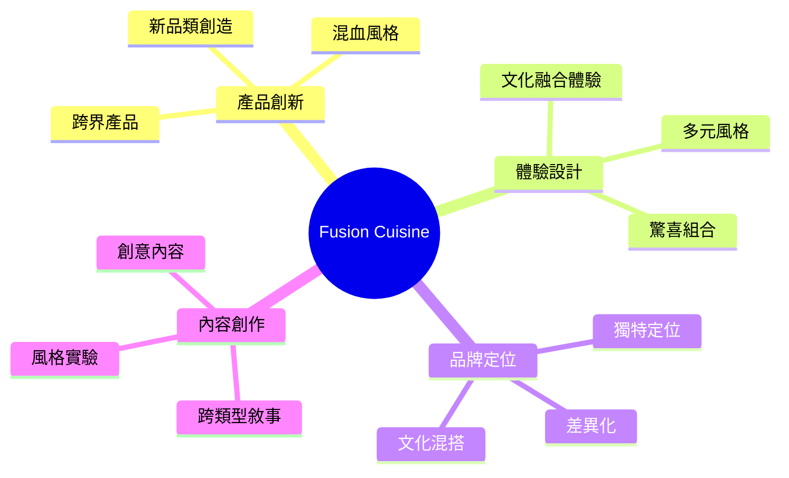
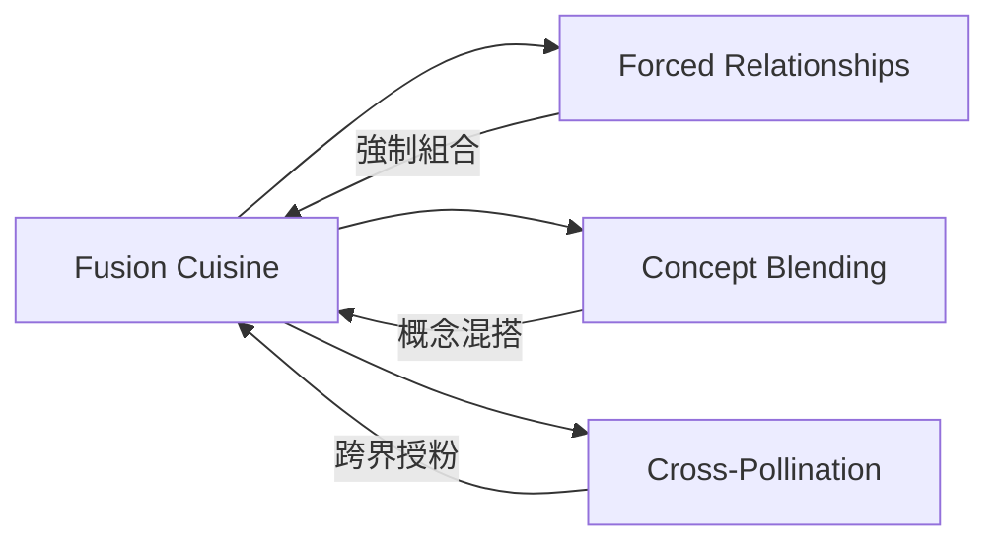

# Fusion Cuisine

> 融合料理 - 跨文化混搭創造意外的美味組合

## 基本資訊

| 屬性 | 值 |
|------|-----|
| 類別 | Cultural |
| 能量等級 | 高 |
| 建議時長 | 45-60 分鐘 |
| 參與人數 | 3-10 人 |
| 難度 | 中 |

## 技術概述

**Fusion Cuisine** 受美食界「融合料理」啟發——將不同文化的烹飪傳統、食材和技法創意結合，產生意外的美味。這個技術將此概念應用於創新思維：刻意混搭不同領域、文化、風格的元素，創造全新的組合。

```mermaid
flowchart LR
    A[文化 A<br/>壽司] +++ B[文化 B<br/>墨西哥捲餅]
    A --> C[Fusion!<br/>壽司捲餅]
    B --> C

    C -->|意外美味| D[全新體驗]

    style A fill:#ffccbc
    style B fill:#c5e1a5
    style C fill:#fff59d
    style D fill:#ffab91
```

## 歷史背景

融合料理在 1970 年代興起，代表廚師如 Roy Yamaguchi（夏威夷融合料理）、Wolfgang Puck（加州融合料理）等。在創新領域，類似概念出現在「跨界創新」、「概念混搭」等方法中。

## 核心原理

### 融合的三個層次



### 關鍵原則

1. **尊重原味**
   - 理解每個「食材」（元素）的本質
   - 不是隨機混合，而是有意識的組合

2. **對比與和諧**
   - 好的融合既有張力又有平衡
   - 如甜與鹹、脆與軟

3. **意外組合**
   - 刻意選擇「不應該」搭配的元素
   - 打破慣例

4. **可執行性**
   - 融合的結果必須實際可行
   - 不只是概念遊戲

## 執行步驟



### 詳細步驟

1. **定義主題（10分鐘）**
   - 確定要創新的領域
   - 例：「設計一個新的線上學習體驗」

2. **選擇融合對象（10分鐘）**
   - 選擇 2-3 個要混搭的文化、領域或風格
   - 建議選擇差異大的組合
   - 例：
     - 日本茶道 + 電玩遊戲
     - 北歐簡約 + 印度色彩
     - 爵士樂即興 + 精實製造

3. **拆解元素（15分鐘）**
   - 為每個選定的文化/領域列出核心元素
   - 例：日本茶道
     - 元素：儀式感、專注當下、極簡美學、師徒傳承
   - 例：電玩遊戲
     - 元素：即時回饋、等級系統、挑戰與獎勵、社交互動

4. **混搭組合（15分鐘）**
   - **方法 A：隨機配對**
     - 將元素寫在便利貼上
     - 隨機抽取組合
   - **方法 B：策略配對**
     - 刻意選擇對比強烈的元素
     - 例：「儀式感」+ 「即時回饋」
   - 產生 5-10 個融合概念

5. **評估可行性（10分鐘）**
   - 快速篩選融合組合：
     - 是否有意義（不只是怪異）？
     - 是否可執行？
     - 是否有獨特價值？
   - 保留 2-3 個最有潛力的

6. **精煉融合（15分鐘）**
   - 深化選定的融合概念
   - 問：
     - 如何保留兩種文化的優點？
     - 融合後產生什麼新價值？
     - 實際如何運作？

7. **原型化（10分鐘）**
   - 快速草圖、故事板或角色扮演
   - 展示融合的效果

## 引導提示

使用以下提示句引導思考：

| 提示句 | 用途 |
|--------|------|
| "如果我們把 [A文化] 的 [元素] 應用到 [B領域]？" | 跨界思考 |
| "這兩個看似衝突的元素，能否創造張力美？" | 對比組合 |
| "[文化A] 最重視什麼？[文化B] 呢？" | 提取核心 |
| "這個融合會創造什麼全新體驗？" | 評估價值 |
| "哪些元素必須保留，哪些可以捨棄？" | 精煉融合 |

## 適用場景



### 經典應用範例

**美食界**
- **壽司捲餅**（日本 + 墨西哥）
- **韓式炸雞披薩**（韓國 + 義大利）
- **抹茶提拉米蘇**（日本 + 義大利）

**產品設計**
- **Muji（無印良品）**（日本禪意 + 北歐簡約）
- **Airbnb**（旅館 + 在地生活）
- **Nintendo Switch**（家機 + 掌機）

**音樂**
- **Hip Hop**（非洲鼓點 + 電子音樂 + 詩歌）
- **Bossa Nova**（巴西森巴 + 美國爵士）

**商業模式**
- **Spotify**（音樂電台 + Netflix 訂閱）
- **Uber**（計程車 + 共享經濟）

## 注意事項

### 適合情境
- 需要差異化創新
- 尋找新品類機會
- 打破產業慣例
- 跨文化團隊

### 不適合情境
- 需要保持傳統純粹性
- 目標受眾保守
- 缺乏文化敏感度

### 常見陷阱

1. **表面混搭**
   - 只是視覺拼貼，沒有深層融合
   - 解決：理解每個元素的「為什麼」

2. **過度混亂**
   - 混太多元素，失去焦點
   - 解決：限制在 2-3 個主要元素

3. **文化不敬**
   - 不尊重原始文化
   - 解決：以致敬和學習的態度

4. **可行性不足**
   - 概念很炫，但無法執行
   - 解決：早期評估技術和商業可行性

## 融合配方工具

### 融合矩陣

|  | 日本茶道 | 電玩遊戲 | 北歐設計 |
|---|---------|----------|----------|
| **線上學習** | 儀式化學習體驗 | 遊戲化課程 | 極簡介面學習 |
| **健身 App** | 專注正念健身 | 健身遊戲化 | 簡約追蹤 |
| **餐廳體驗** | 慢食儀式 | 互動點餐遊戲 | 極簡空間 |

### 對比配對表

刻意配對對比元素：

| 對比維度 | 元素 A | 元素 B | 融合潛力 |
|----------|--------|--------|----------|
| 節奏 | 慢（茶道）| 快（電玩）| ⭐⭐⭐ |
| 風格 | 華麗（巴洛克）| 極簡（北歐）| ⭐⭐⭐⭐ |
| 文化 | 東方（禪）| 西方（搖滾）| ⭐⭐⭐⭐⭐ |

## 與其他技術的結合



## 融合範例庫

### 文化融合範例

| 文化 A | 文化 B | 融合概念 | 應用 |
|--------|--------|----------|------|
| 日本茶道 | 矽谷科技 | 正念科技 | Calm, Headspace App |
| 非洲部落 | 電子音樂 | Afrobeats | 全球音樂潮流 |
| 中國風水 | 現代建築 | 生態建築 | 永續設計 |

### 領域融合範例

| 領域 A | 領域 B | 融合概念 | 產品 |
|--------|--------|----------|------|
| 教育 | 遊戲 | 遊戲化學習 | Duolingo |
| 金融 | 社交 | 社交支付 | Venmo |
| 健康 | 穿戴 | 健康追蹤 | Apple Watch |

## 實踐練習：融合餐廳

假設要設計一家融合餐廳：

1. **選擇兩種料理**（如義大利 + 泰國）
2. **拆解元素**
   - 義大利：麵食、番茄、起司、家庭氛圍
   - 泰國：香茅、辣椒、椰奶、街頭小吃
3. **混搭菜單**
   - 椰奶青醬義大利麵
   - 打拋豬肉披薩
   - 冬蔭功燉飯
4. **體驗設計**
   - 家庭式分享（義大利）+ 開放式廚房（泰國街頭）

## 深化問題

- 如果 [文化 A] 和 [文化 B] 相遇，會產生什麼？
- 這個產品能從完全不同的產業借鑑什麼？
- 我們的競爭對手絕對不會混搭的組合是什麼？
- 如果這個體驗是一道融合料理，配方是什麼？

## 設計模式與方法論對照

| 相關模式/方法論 | 連結點 | 應用價值 |
|----------------|--------|----------|
| **Cross-Pollination (IDEO)** | 跨領域授粉 | 系統性地從其他產業借鑑靈感 |
| **Forced Connections (SCAMPER)** | 強制聯想技術 | 刻意組合不相關元素產生新想法 |
| **Conceptual Blending (Fauconnier)** | 概念整合理論 | 認知科學對混搭創意的解釋 |
| **The Medici Effect (Frans Johansson)** | 交叉點創新 | 跨界交會處產生突破性創新 |
| **Bisociation (Arthur Koestler)** | 雙重聯想 | 結合兩個原本獨立的參照框架 |

**核心洞察**：Fusion Cuisine 的洞見是：真正的創新往往發生在「邊界」——不同文化、領域、風格的交會處。表面的混搭只是新奇，深層的融合才是創新。關鍵不是隨機組合，而是理解每個元素的「為什麼」，然後找到意外的和諧。當壽司遇見墨西哥捲餅，產生的不只是壽司捲餅，而是全新的飲食體驗類別。

## 參考資源

- Roy Yamaguchi: 夏威夷融合料理先驅
- Wolfgang Puck: 加州融合料理
- [Fusion Cuisine History](https://en.wikipedia.org/wiki/Fusion_cuisine)
- Frans Johansson (2004): *The Medici Effect* - 跨界創新
- 跨文化創新案例：*Cultural Intelligence for Leaders* by David Livermore

---

*返回 [Cultural 類別](./index.md) | [技術總覽](../index.md)*
