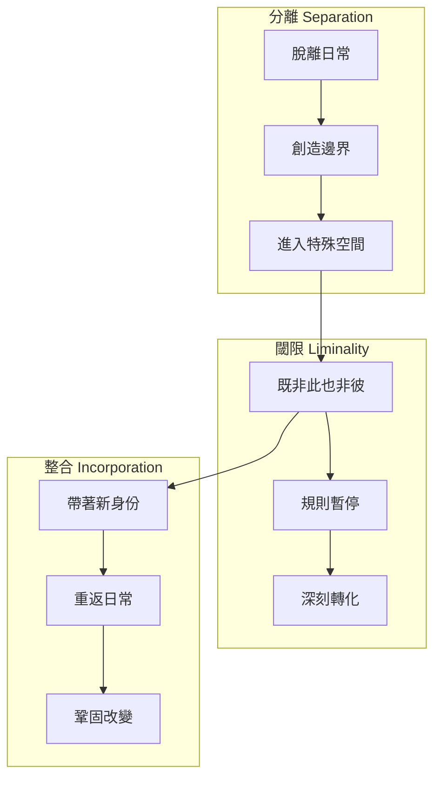
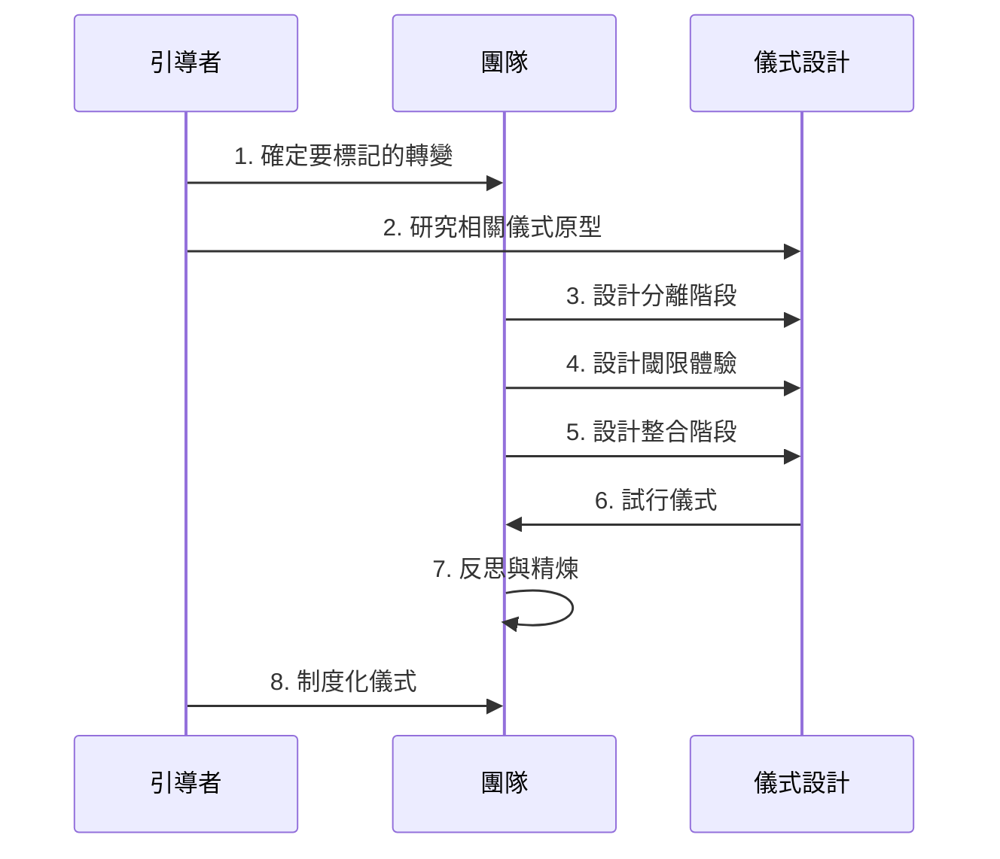
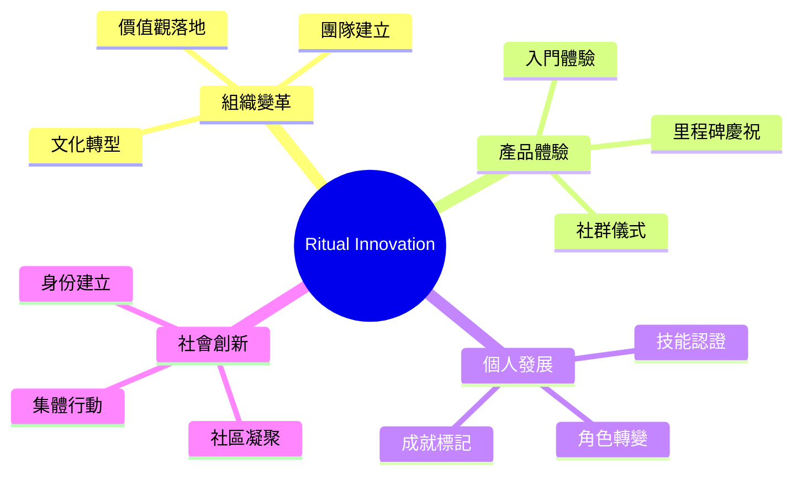
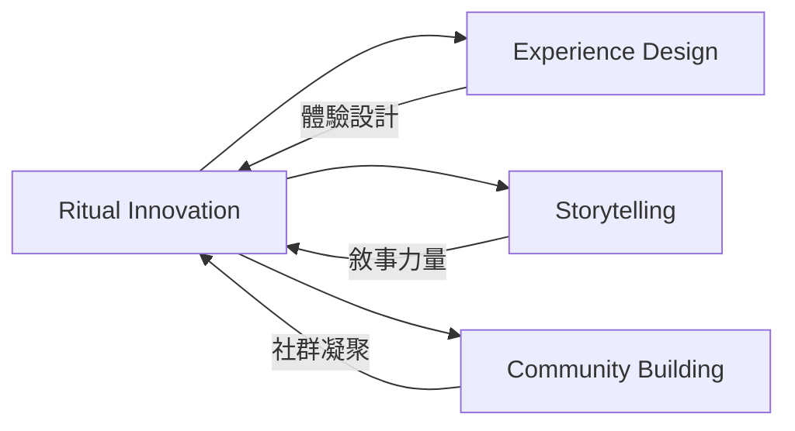

# Ritual Innovation

> 儀式創新 - 運用儀式力量創造深刻的轉型體驗

## 基本資訊

| 屬性 | 值 |
|------|-----|
| 類別 | Cultural |
| 能量等級 | 高 |
| 建議時長 | 60-120 分鐘 |
| 參與人數 | 5-20 人 |
| 難度 | 中高 |

## 技術概述

**Ritual Innovation** 借鑑人類學中對儀式（Ritual）的研究，將儀式的結構和力量應用於設計創新體驗。儀式不只是宗教活動，而是一種有意識的、結構化的行為模式，能夠標記轉變、建立認同、創造共同記憶。這個技術幫助團隊設計有意義的轉型時刻。

## 歷史背景

人類學家 Arnold van Gennep（1909）提出「通過儀式」（Rites of Passage）理論，Victor Turner（1969）進一步發展「liminality」（閾限性）概念。近年來，這些概念被應用於體驗設計、組織變革、品牌體驗等領域。

## 核心原理

### 儀式的三階段結構

### 關鍵原則

1. **神聖空間（Sacred Space）**
   - 創造與日常不同的時空
   - 可以是物理空間或心理狀態
   - 「這裡的規則不同」

2. **象徵行為（Symbolic Action）**
   - 行為承載意義
   - 超越功能性目的
   - 如：握手、剪綵、點燃火焰

3. **集體見證（Collective Witnessing）**
   - 共同參與強化效果
   - 創造共享記憶
   - 社群認同

4. **可重複性（Repeatability）**
   - 儀式可以被重複
   - 每次重複強化意義
   - 建立傳統

## 執行步驟

### 詳細步驟

1. **確定轉變（15分鐘）**
   - 識別要標記或促成的轉變
   - 例：
     - 個人：從新手到專家
     - 團隊：從分散到凝聚
     - 組織：從舊文化到新文化
     - 產品：從陌生到熟悉

2. **研究儀式原型（15分鐘）**
   - 探索不同文化如何標記類似轉變
   - 例：成年禮、畢業典禮、入職儀式
   - 提取可借鑑的元素

3. **設計分離階段（20分鐘）**
   - 如何創造「脫離日常」的感覺？
   - 可能元素：
     - **空間**：特殊場所
     - **時間**：特定時刻
     - **服裝**：特殊穿著
     - **行為**：開場儀式（如敲鐘、點蠟燭）
   - 目標：「我們正在進入特殊時刻」

4. **設計閾限體驗（30分鐘）**
   - 核心轉化如何發生？
   - 可能元素：
     - **挑戰**：測試或考驗
     - **學習**：新知識或技能
     - **象徵**：象徵性行為（如燃燒舊物、種植新苗）
     - **見證**：重要他人見證
   - 目標：創造深刻、難忘的經驗

5. **設計整合階段（20分鐘）**
   - 如何帶著新身份重返日常？
   - 可能元素：
     - **宣告**：公開宣布轉變
     - **信物**：象徵性物品（如證書、徽章）
     - **慶祝**：共同慶祝
     - **承諾**：對未來的承諾
   - 目標：鞏固改變，回歸日常

6. **試行儀式（30分鐘）**
   - 實際演練設計的儀式
   - 觀察參與者反應
   - 注意情緒高點和低點

7. **反思與精煉（15分鐘）**
   - 參與者分享感受
   - 哪些元素有力量？
   - 哪些需要調整？

8. **制度化（10分鐘）**
   - 確定儀式的執行頻率
   - 指定儀式守護者
   - 記錄儀式腳本

## 引導提示

使用以下提示句引導思考：

| 提示句 | 用途 |
|--------|------|
| "什麼行為能象徵這個轉變？" | 設計象徵 |
| "如何讓參與者感覺『這不是普通時刻』？" | 創造神聖感 |
| "這個儀式會創造什麼共同記憶？" | 評估影響 |
| "不同文化如何標記類似的轉變？" | 尋找靈感 |
| "如果這是一個成年禮，會有什麼元素？" | 原型借鑑 |

## 適用場景

### 經典應用範例

**企業**
1. **Airbnb 的「首次房東」儀式**
   - 房東首次成功出租後
   - 收到象徵性的歡迎包和證書
   - 標記從「嘗試者」到「房東」的轉變

2. **Salesforce 的「Ohana」文化儀式**
   - 新員工入職第一天的歡迎儀式
   - 創造歸屬感

3. **Nike 的「Breaking2」計畫**
   - 嘗試在 2 小時內跑完馬拉松
   - 創造集體見證的歷史時刻

**教育**
1. **畢業典禮**
   - 分離：穿學士服
   - 閾限：走過舞台
   - 整合：接受文憑，拋學士帽

**產品**
1. **Duolingo 的連續打卡儀式**
   - 每日學習後的慶祝動畫
   - 連續天數的里程碑獎勵
   - 創造學習習慣的儀式感

## 注意事項

### 適合情境
- 重要的轉變或里程碑
- 需要團隊凝聚和認同
- 文化塑造或變革
- 創造深刻記憶

### 不適合情境
- 瑣碎日常活動
- 時間極度緊迫
- 參與者對儀式感反感
- 文化背景不適合（過於理性的環境）

### 常見陷阱

1. **過度形式化**
   - 變成空洞的儀式
   - 失去真實意義
   - 解決：確保每個元素都有真實目的

2. **強制參與**
   - 讓人感到尷尬或抗拒
   - 解決：創造邀請而非強迫

3. **文化不敏感**
   - 挪用宗教或文化儀式
   - 解決：尊重原始文化，適當轉譯

4. **缺乏真誠**
   - 只是表面作秀
   - 解決：確保儀式反映真實價值觀

## 儀式設計畫布

使用這個框架設計儀式：

| 階段 | 元素 | 具體設計 |
|------|------|----------|
| **分離** | 空間 | ... |
|  | 時間 | ... |
|  | 開場行為 | ... |
| **閾限** | 核心體驗 | ... |
|  | 象徵行為 | ... |
|  | 見證者 | ... |
| **整合** | 宣告/認證 | ... |
|  | 信物 | ... |
|  | 慶祝 | ... |

## 儀式元素庫

### 分離元素
- **空間標記**：特殊場所、門、拱門
- **時間標記**：特定時刻、鐘聲、倒數
- **服裝**：特殊穿著、顏色、配飾
- **音樂**：開場音樂、鼓聲

### 閾限元素
- **挑戰**：測試、任務、考驗
- **象徵行為**：點火、種植、破除舊物
- **沉默**：靜默時刻、冥想
- **故事**：講述傳說、分享經驗

### 整合元素
- **信物**：證書、徽章、紀念品
- **宣告**：公開承諾、宣誓
- **慶祝**：歡呼、擁抱、乾杯
- **分享**：共餐、贈禮

## 與其他技術的結合

## 實踐案例：團隊轉型儀式

**情境**：團隊從「個人主義」轉向「協作文化」

**儀式設計**：

1. **分離階段**
   - 時間：週五下午，離開辦公室
   - 空間：戶外營地
   - 開場：團隊圍成圓圈，傳遞發言權杖

2. **閾限階段**
   - 挑戰：需要協作才能完成的任務（如搭帳篷、煮飯）
   - 象徵行為：每人寫下一個「孤島習慣」，共同燃燒
   - 見證：互相分享「我需要你的...」

3. **整合階段**
   - 信物：團隊手環（每人親手為另一人戴上）
   - 宣告：「我承諾...」（公開承諾）
   - 慶祝：共進晚餐，分享故事

## 深化問題

- 這個轉變的「前」與「後」有什麼不同？
- 如何讓這個時刻感覺「特殊」而非「普通」？
- 什麼象徵性行為能體現這個轉變？
- 如何創造集體見證，而非個人經驗？
- 這個儀式會創造什麼共同記憶？

## 參考資源

- Arnold van Gennep (1909): *The Rites of Passage*
- Victor Turner (1969): *The Ritual Process: Structure and Anti-Structure*
- Brené Brown: 關於脆弱和歸屬感的研究
- Casper ter Kuile (2020): *The Power of Ritual: Turning Everyday Activities into Soulful Practices*
- [IDEO: Designing Rituals](https://www.ideou.com/blogs/inspiration/how-to-design-a-ritual)

---

*返回 [Cultural 類別](./index.md) | [技術總覽](../index.md)*
