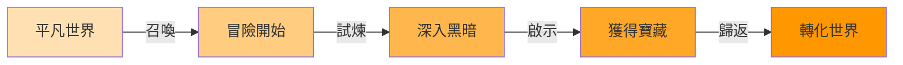
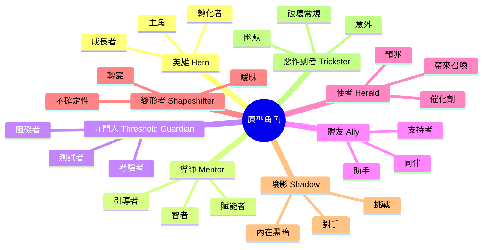
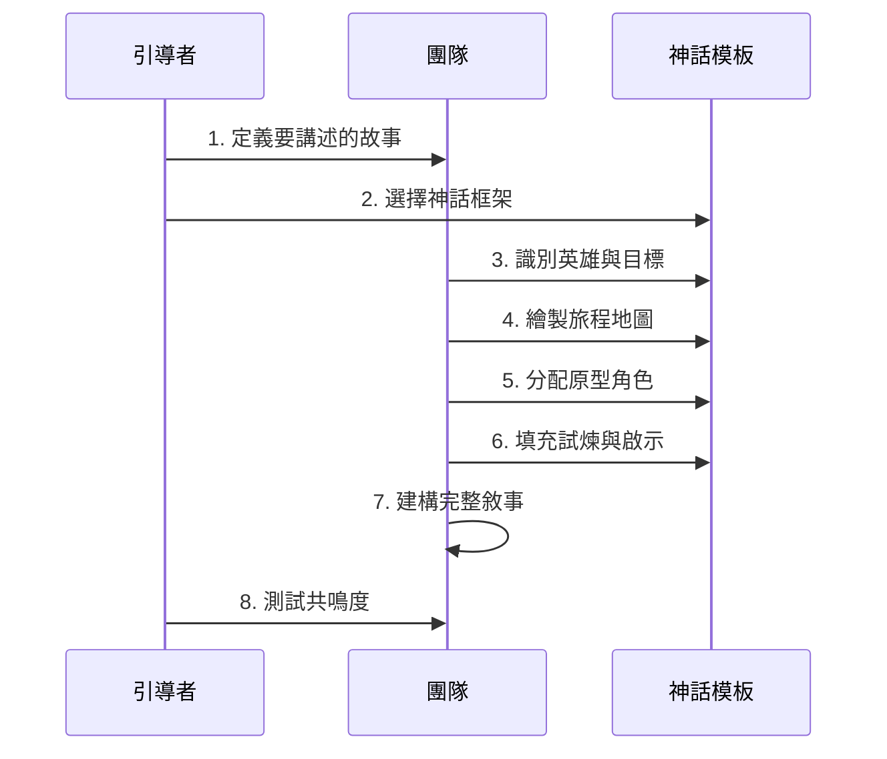
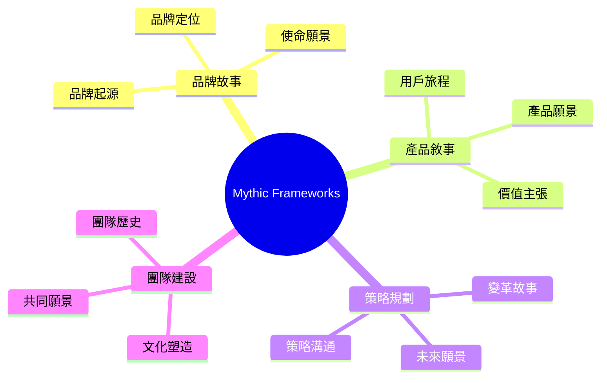
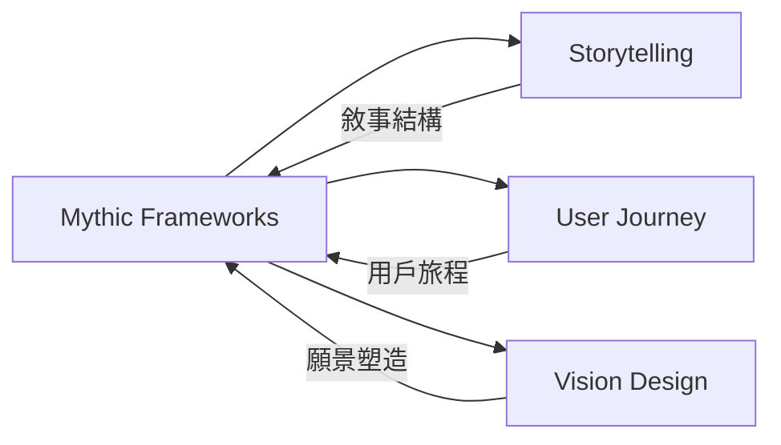

# Mythic Frameworks

> 神話框架 - 運用神話原型建構有力的敘事與願景

## 基本資訊

| 屬性 | 值 |
|------|-----|
| 類別 | Cultural |
| 能量等級 | 中 |
| 建議時長 | 60-90 分鐘 |
| 參與人數 | 3-12 人 |
| 難度 | 中 |

## 技術概述

**Mythic Frameworks** 借鑑神話學研究，特別是 Joseph Campbell 的「英雄之旅」（Hero's Journey）和 Carl Jung 的原型理論。神話是人類跨文化的共通語言,蘊含深層的心理真相。這個技術幫助團隊運用神話結構,建構有力的品牌敘事、產品願景或策略故事。



## 歷史背景

Joseph Campbell（1949）在《千面英雄》中提出英雄之旅的普世模式。Carl Jung 發展原型心理學。這些概念被廣泛應用於電影（如星際大戰）、文學、品牌故事（如 Nike、Apple）等領域。

## 核心原理

### 英雄之旅的十二階段

```mermaid
graph TD
    subgraph 第一幕：啟程
    A1[平凡世界] --> A2[歷險召喚]
    A2 --> A3[拒絕召喚]
    A3 --> A4[遇見導師]
    A4 --> A5[跨越第一道門檻]
    end

    subgraph 第二幕：啟蒙
    B1[試煉、盟友、敵人] --> B2[進入最深的洞穴]
    B2 --> B3[磨難煎熬]
    B3 --> B4[獎賞]
    end

    subgraph 第三幕：歸返
    C1[返回之路] --> C2[復活]
    C2 --> C3[帶著仙丹妙藥歸返]
    end

    A5 --> B1
    B4 --> C1
```

### 核心原型角色



### 關鍵原則

1. **普世共鳴**
   - 神話模式跨越文化
   - 觸動深層心理結構
   - 容易產生共鳴

2. **轉化之旅**
   - 故事的核心是改變
   - 英雄帶著不同的自己歸來
   - 不只是外在冒險，更是內在成長

3. **象徵意義**
   - 每個元素都有象徵意涵
   - 如：洞穴 = 內心深處、寶藏 = 洞見

4. **敘事張力**
   - 召喚與拒絕
   - 試煉與成長
   - 死亡與重生

## 執行步驟



### 詳細步驟

1. **定義故事主題（10分鐘）**
   - 確定要講述什麼故事
   - 可能是：
     - **品牌故事**：我們的使命之旅
     - **產品願景**：用戶的轉化之旅
     - **團隊故事**：我們如何走到這裡
     - **策略敘事**：未來的可能性

2. **選擇神話框架（10分鐘）**
   - **英雄之旅**：最常用，強調轉化
   - **創世神話**：強調起源和誕生
   - **再生神話**：強調死亡與重生
   - **尋寶神話**：強調追尋與發現

3. **識別英雄（15分鐘）**
   - 誰是故事的英雄？
     - 品牌故事：創辦人或品牌本身
     - 產品故事：用戶
     - 策略故事：團隊
   - 英雄的目標是什麼？
   - 英雄的起點（平凡世界）是什麼？

4. **繪製旅程地圖（20分鐘）**
   - 套用英雄之旅的階段：
     - **召喚**：什麼觸發了行動？
     - **拒絕**：有什麼恐懼或阻礙？
     - **導師**：誰或什麼提供指引？
     - **試煉**：面對什麼挑戰？
     - **啟示**：獲得什麼洞見？
     - **歸返**：如何改變世界？

5. **分配原型角色（15分鐘）**
   - 為故事中的關鍵角色分配原型：
     - 導師是誰？（智者、前輩、工具）
     - 盟友是誰？（團隊、社群、技術）
     - 守門人是誰？（挑戰、懷疑、限制）
     - 陰影是誰？（競爭者、恐懼、舊習）

6. **填充細節（20分鐘）**
   - 為每個階段添加具體細節
   - 使用象徵和隱喻
   - 創造情感高低點

7. **建構敘事（15分鐘）**
   - 將框架轉化為流暢的故事
   - 注意節奏和張力
   - 確保轉化清晰可見

8. **測試共鳴（10分鐘）**
   - 講給他人聽
   - 是否產生情感連結？
   - 是否激勵行動？

## 引導提示

使用以下提示句引導思考：

| 提示句 | 用途 |
|--------|------|
| "我們的英雄在旅程開始前是誰？結束後又是誰？" | 定義轉化 |
| "什麼召喚觸發了這趟旅程？" | 找到起點 |
| "英雄必須面對的最大試煉是什麼？" | 識別衝突 |
| "在最黑暗的時刻，英雄發現了什麼真相？" | 找到啟示 |
| "英雄帶回什麼『仙丹妙藥』改變世界？" | 定義價值 |

## 適用場景



### 經典應用範例

**品牌故事**

1. **Apple「1984」廣告**
   - 英雄：反叛者（用戶）
   - 陰影：老大哥（IBM）
   - 寶藏：個人自由
   - 導師：Apple

2. **Nike "Just Do It"**
   - 英雄：運動員（每個人）
   - 召喚：突破極限
   - 試煉：自我懷疑、身體限制
   - 寶藏：個人勝利
   - 導師：Nike（賦能者）

**電影**

1. **星際大戰**
   - 完美的英雄之旅範例
   - Luke Skywalker 的轉化
   - 原型角色清晰：Obi-Wan（導師）、Darth Vader（陰影）

2. **駭客任務**
   - Neo 從平凡到救世主
   - Morpheus 為導師
   - 紅藍藥丸為召喚

**產品**

1. **Airbnb「Belong Anywhere」**
   - 英雄：旅行者
   - 召喚：渴望真實體驗
   - 試煉：旅館的疏離感
   - 寶藏：歸屬感
   - 仙丹：分享經濟

## 注意事項

### 適合情境
- 需要建構有力敘事
- 品牌或產品定位
- 策略溝通
- 激勵和動員團隊

### 不適合情境
- 需要純理性分析
- 技術文檔
- 數據報告
- 目標受眾對敘事不感興趣

### 常見陷阱

1. **過度複雜**
   - 試圖包含所有 12 個階段
   - 解決：簡化為核心要素

2. **英雄錯置**
   - 品牌把自己當英雄
   - 正確：用戶是英雄，品牌是導師

3. **缺乏真實性**
   - 強行套用神話，不符實際
   - 解決：從真實經驗出發

4. **忽略轉化**
   - 只有外在冒險，沒有內在成長
   - 解決：強調英雄的改變

## 神話敘事畫布

| 階段 | 問題 | 我們的故事 |
|------|------|------------|
| **平凡世界** | 英雄的起點是什麼？ | ... |
| **召喚** | 什麼觸發了改變？ | ... |
| **拒絕** | 有什麼恐懼或阻礙？ | ... |
| **導師** | 誰/什麼提供指引？ | ... |
| **跨越門檻** | 如何展開行動？ | ... |
| **試煉** | 面對什麼挑戰？ | ... |
| **深淵** | 最黑暗時刻是什麼？ | ... |
| **啟示** | 獲得什麼洞見？ | ... |
| **轉化** | 英雄如何改變？ | ... |
| **歸返** | 如何改變世界？ | ... |

## 原型角色分配表

| 原型 | 在我們故事中 | 象徵意義 |
|------|--------------|----------|
| 英雄 | ... | ... |
| 導師 | ... | ... |
| 盟友 | ... | ... |
| 守門人 | ... | ... |
| 陰影 | ... | ... |
| 使者 | ... | ... |
| 變形者 | ... | ... |
| 惡作劇者 | ... | ... |

## 與其他技術的結合



## 實踐案例：新創團隊的故事

**情境**：新創團隊要向投資人講述品牌故事

**神話框架應用**：

- **平凡世界**：創辦人在大公司工作，看見問題
- **召喚**：客戶的痛苦呼喚
- **拒絕**：穩定工作 vs 創業風險
- **導師**：第一個客戶的深刻洞見
- **跨越門檻**：辭職創業
- **試煉**：資金短缺、產品失敗、團隊衝突
- **深淵**：瀕臨倒閉的至暗時刻
- **啟示**：發現真正的價值主張
- **轉化**：從產品思維到使命驅動
- **歸返**：創造影響，改變產業

**原型角色**：
- 英雄：創辦團隊
- 導師：早期客戶、顧問
- 盟友：團隊、社群
- 守門人：監管、技術限制
- 陰影：大型競爭者、自我懷疑

## 神話母題範例

### 創世神話
- 從混沌到秩序
- 從無到有
- 適合：品牌起源故事

### 再生神話
- 死亡與重生
- 鳳凰涅槃
- 適合：轉型變革故事

### 尋寶神話
- 追尋聖杯
- 發現寶藏
- 適合：創新探索故事

### 征服神話
- 屠龍
- 戰勝惡魔
- 適合：克服挑戰故事

## 深化問題

- 我們的英雄從哪裡來，要去哪裡？
- 這趟旅程的真正意義是什麼（不只是表面目標）？
- 英雄在最黑暗時刻學到什麼？
- 英雄歸來後，世界如何不同？
- 這個故事觸動人心的哪個原型渴望？

## 參考資源

- Joseph Campbell (1949): *The Hero with a Thousand Faces*
- Christopher Vogler (1992): *The Writer's Journey: Mythic Structure for Writers*
- Carl Jung: 原型心理學
- Donald Miller (2017): *Building a StoryBrand*
- Nancy Duarte (2010): *Resonate: Present Visual Stories that Transform Audiences*

---

*返回 [Cultural 類別](./index.md) | [技術總覽](../index.md)*
