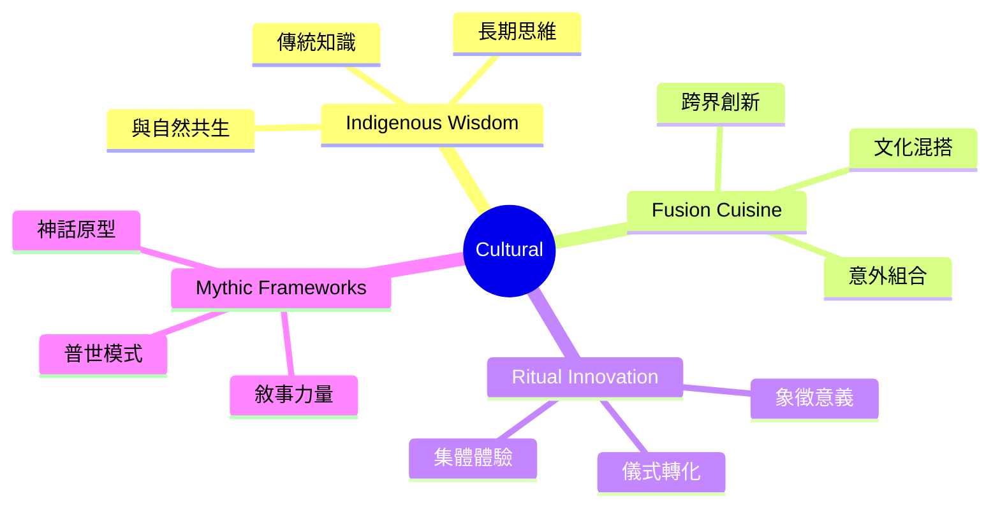
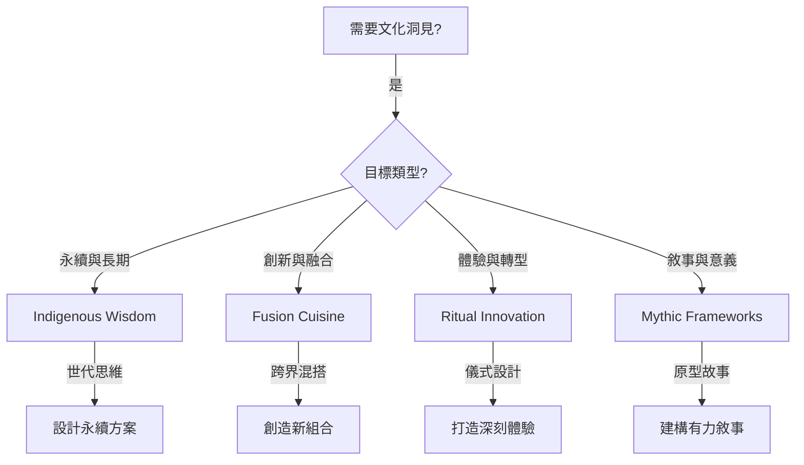
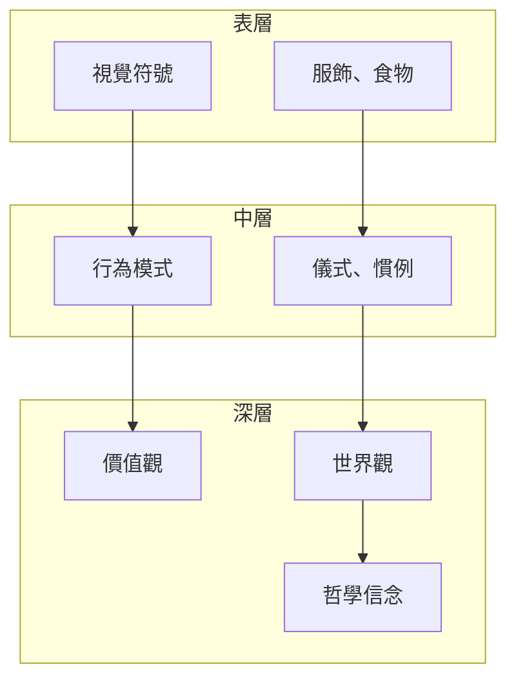

# Cultural Brainstorming Techniques

> 文化類腦力激盪技術 - 從多元文化汲取智慧，擴展創意視野

## 類別概述

文化類技術從人類學、民族誌和跨文化研究中汲取靈感，透過文化多元性、傳統智慧和跨界融合，激發創新思維。這些技術幫助團隊超越單一文化框架，發現人類集體智慧中的普世洞見與獨特視角。

## 核心特性

| 特性 | 說明 |
|------|------|
| 文化多元性 | 從不同文化傳統中汲取智慧 |
| 人類學視角 | 用民族誌方法觀察與理解 |
| 時間深度 | 連結過去、現在與未來 |
| 象徵思維 | 運用隱喻、儀式和敘事的力量 |

## 技術列表

| # | 技術名稱 | 核心概念 | 適用情境 |
|---|----------|----------|----------|
| 1 | [Indigenous Wisdom](./01-indigenous-wisdom.md) | 原住民智慧 | 永續設計、長期思維 |
| 2 | [Fusion Cuisine](./02-fusion-cuisine.md) | 融合料理 | 跨界創新、產品設計 |
| 3 | [Ritual Innovation](./03-ritual-innovation.md) | 儀式創新 | 體驗設計、文化轉型 |
| 4 | [Mythic Frameworks](./04-mythic-frameworks.md) | 神話框架 | 品牌故事、願景塑造 |

## 使用時機

## 能量等級

- **高能量**: Fusion Cuisine, Ritual Innovation
- **中等能量**: Indigenous Wisdom, Mythic Frameworks

## 適合領域

- **體驗設計**: 創造有意義的用戶體驗
- **品牌策略**: 建構深刻的品牌故事
- **永續創新**: 設計長期永續的解決方案
- **產品創新**: 跨文化融合產生新組合
- **組織文化**: 設計轉型儀式和文化變革
- **社會創新**: 從傳統智慧中尋找現代解答

## 使用注意

這些技術涉及文化元素，使用時應：

1. **尊重文化** - 避免文化挪用，以學習和致敬的態度
2. **深入理解** - 不只表面模仿，要理解背後的智慧
3. **在地調適** - 將文化洞見轉化為在地適用的形式
4. **多元包容** - 歡迎不同文化背景的團隊成員貢獻
5. **避免刻板印象** - 認識到每個文化內部的多樣性

## 文化智慧的層次

有效的文化借鑑應該深入到價值觀和世界觀層次，而非僅停留在表面符號。

---

## 設計模式與方法論對照

| 技術 | 相關模式/方法論 | 核心價值 |
|------|-----------------|----------|
| **Indigenous Wisdom** | Seventh Generation, Traditional Ecological Knowledge | 長期思維與自然共生 |
| **Fusion Cuisine** | Cultural Recombination, Cross-Pollination | 跨文化的創意混搭 |
| **Ritual Innovation** | Experience Design, Rites of Passage | 儀式創造意義與轉化 |
| **Mythic Frameworks** | Campbell's Monomyth, Archetypal Psychology | 普世敘事的力量 |

**核心洞察**：文化類技術提醒我們：我們不是從零開始創新，而是站在人類數千年累積的智慧之上。原住民的「七代思維」（做決定時考慮七代後的影響）比任何現代永續框架都更有深度；Joseph Campbell 的「英雄之旅」被用於《星際大戰》和無數品牌故事。有效的文化借鑑不是複製表面符號，而是理解背後的深層智慧。

---

*返回 [技術總覽](../index.md)*
