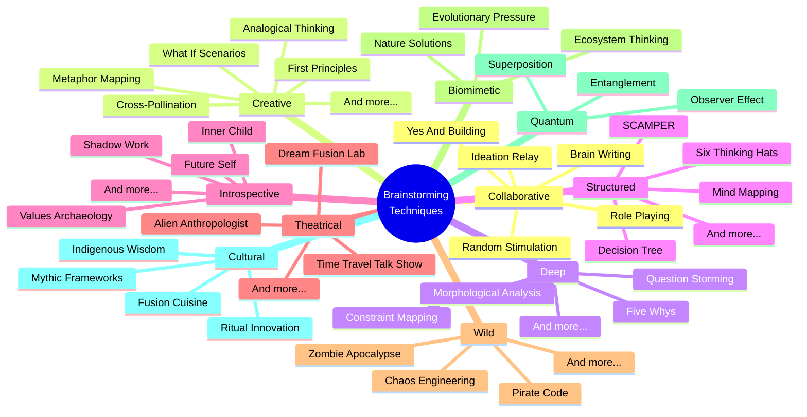
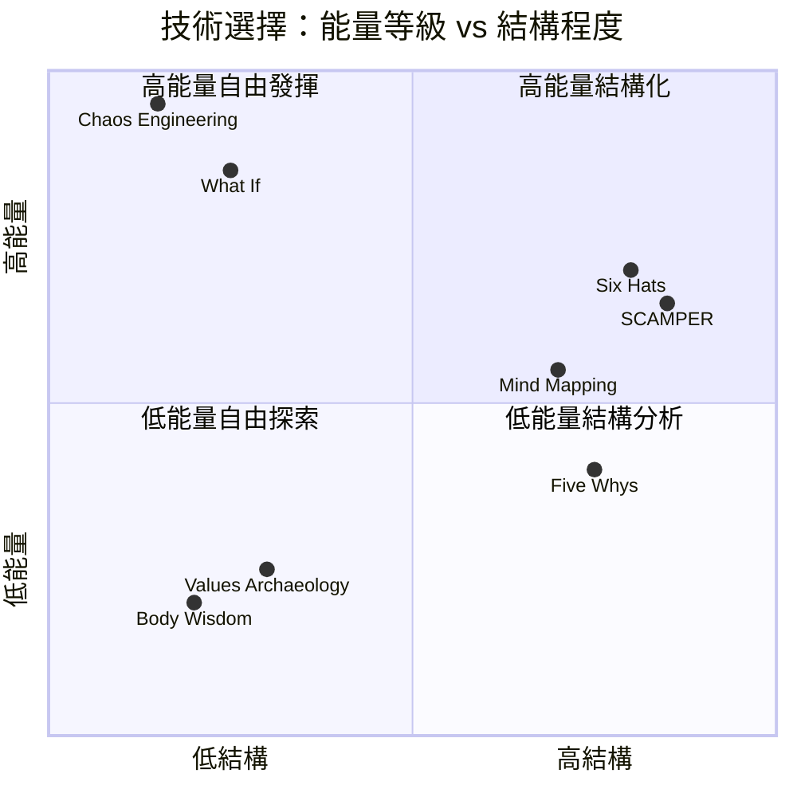
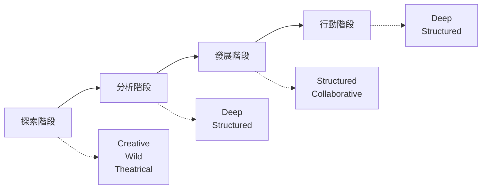
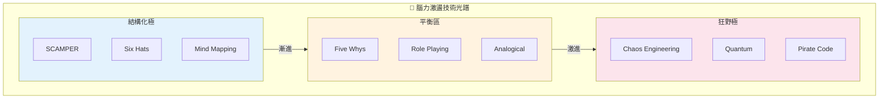

# Brainstorming Techniques Library

> 腦力激盪技術資料庫 - 62種創意思維技術的深度分析

## 概述

本資料庫收錄了62種腦力激盪技術，分為10個類別，涵蓋從結構化方法到狂野創意、從個人內省到團隊協作的完整創意工具箱。

## 類別索引

| 類別 | 技術數量 | 說明 | 連結 |
|------|----------|------|------|
| [01-Collaborative](./01-collaborative/) | 5 | 團隊協作、多元觀點 | [→](./01-collaborative/index.md) |
| [02-Creative](./02-creative/) | 11 | 創新思維、突破框架 | [→](./02-creative/index.md) |
| [03-Deep](./03-deep/) | 8 | 深度分析、根因探索 | [→](./03-deep/index.md) |
| [04-Introspective Delight](./04-introspective-delight/) | 6 | 內在探索、價值澄清 | [→](./04-introspective-delight/index.md) |
| [05-Structured](./05-structured/) | 7 | 系統化、結構分析 | [→](./05-structured/index.md) |
| [06-Theatrical](./06-theatrical/) | 6 | 角色扮演、換位思考 | [→](./06-theatrical/index.md) |
| [07-Wild](./07-wild/) | 8 | 極端思維、打破邊界 | [→](./07-wild/index.md) |
| [08-Biomimetic](./08-biomimetic/) | 3 | 仿生設計、自然智慧 | [→](./08-biomimetic/index.md) |
| [09-Quantum](./09-quantum/) | 3 | 量子啟發思維 | [→](./09-quantum/index.md) |
| [10-Cultural](./10-cultural/) | 4 | 文化跨界、傳統智慧 | [→](./10-cultural/index.md) |

## 技術選擇矩陣

## 使用指南

### 按情境選擇

| 情境 | 推薦技術 |
|------|----------|
| 產品創新 | SCAMPER, Cross-Pollination, Nature's Solutions |
| 問題解決 | Five Whys, Constraint Mapping, Reversal Inversion |
| 團隊建設 | Yes And Building, Role Playing, Six Thinking Hats |
| 個人發展 | Values Archaeology, Future Self Interview |
| 策略規劃 | Decision Tree, Morphological Analysis |
| 打破僵局 | Chaos Engineering, Pirate Code, What If Scenarios |

### 按階段選擇

## 統計概覽

- **總技術數**: 62
- **類別數**: 10
- **最大類別**: Creative (11 技術)
- **最小類別**: Biomimetic, Quantum (各 3 技術)

---

## 設計模式與方法論對照

| 技術類別 | 相關設計模式/方法論 | 核心價值 |
|----------|---------------------|----------|
| **Collaborative** | Psychological Safety, Mob Programming | 團隊智慧湧現 |
| **Creative** | Lateral Thinking, Design Thinking | 突破線性限制 |
| **Deep** | Root Cause Analysis, Systems Thinking | 挖掘真正問題 |
| **Structured** | Framework Pattern, Decision Tree | 系統化分析 |
| **Introspective** | Reflective Practice, Mindfulness | 內在覺察 |
| **Theatrical** | Role-Based Design, Persona Method | 換位思考 |
| **Wild** | Chaos Engineering, Anti-Pattern Analysis | 打破常規 |
| **Biomimetic** | Biomimicry, Nature-Inspired Design | 自然智慧 |
| **Quantum** | Paradox Thinking, Multi-State Analysis | 超越二元 |
| **Cultural** | Cross-Cultural Design, Tradition Mining | 文化融合 |

### 創意思維的光譜視覺化

**核心洞察**：62 種腦力激盪技術形成了一個完整的創意工具箱，從高度結構化的 SCAMPER 到狂野不羈的 Chaos Engineering。關鍵不在於哪種技術「最好」，而在於根據情境選擇正確的工具——就像木匠不會只用錘子一樣。團隊的創意能力不是單一技術的熟練度，而是在技術光譜上靈活移動的能力。成功的創意流程往往是：先用 Wild 技術打開可能性邊界，再用 Deep 技術挖掘真正問題，最後用 Structured 技術收斂到可執行方案。

---

*本資料庫為 BMAD Brainstorming Workflow 的技術參考文件*
