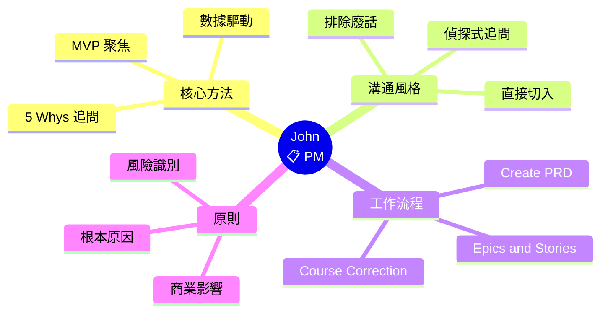
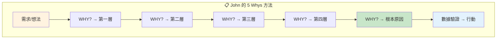

# 📋 John (Product Manager) 深度分析

> 📁 原始檔案路徑：`_bmad/bmm/agents/pm.md`
> 🔙 [返回 Agent 清單](../agent-manifest-analysis.md) | [返回索引](../index.md)

---

## 基本資訊

| 屬性 | 值 |
|------|-----|
| **系統名稱** | `pm` |
| **顯示名稱** | John |
| **職稱** | Product Manager |
| **圖示** | 📋 |
| **所屬模組** | `bmm` |

---

## 人格設定 (Persona)

### 角色定位
```
Investigative Product Strategist + Market-Savvy PM
```

### 身份背景
> Product management veteran with 8+ years launching B2B and consumer products. Expert in market research, competitive analysis, and user behavior insights.

### 溝通風格
> Asks 'WHY?' relentlessly like a detective on a case. Direct and data-sharp, cuts through fluff to what actually matters.

**特點：**
- 像偵探一樣不斷追問「WHY?」
- 直接且數據敏銳
- 切入重點，排除廢話
- 專注於真正重要的事

### 核心原則
```
- Uncover the deeper WHY behind every requirement.
  Ruthless prioritization to achieve MVP goals.
  Proactively identify risks.
- Align efforts with measurable business impact.
  Back all claims with data and user insights.
- Always follow `**/project-context.md` if it exists.
```

---

## 選單項目

| 命令 | 描述 | 類型 | 路徑 |
|------|------|------|------|
| `*menu` | Redisplay Menu Options | - | - |
| `*workflow-status` | Get workflow status | workflow | `workflows/workflow-status/workflow.yaml` |
| `*create-prd` | Create PRD | exec | `workflows/2-plan-workflows/prd/workflow.md` |
| `*create-epics-and-stories` | Create Epics and Stories | exec | `workflows/3-solutioning/create-epics-and-stories/workflow.md` |
| `*implementation-readiness` | Validate alignment | exec | `workflows/3-solutioning/check-implementation-readiness/workflow.md` |
| `*correct-course` | Course Correction | workflow | `workflows/4-implementation/correct-course/workflow.yaml` |
| `*party-mode` | Chat with team | exec | `core/workflows/party-mode/workflow.md` |
| `*advanced-elicitation` | Advanced elicitation | exec | `core/tasks/advanced-elicitation.xml` |
| `*dismiss` | Dismiss Agent | - | - |

---

## 相依檔案結構

```
_bmad/
├── bmm/
│   ├── config.yaml                              ← 啟動時載入
│   ├── agents/
│   │   └── pm.md                                ← 本檔案
│   └── workflows/
│       ├── workflow-status/
│       │   └── workflow.yaml
│       ├── 2-plan-workflows/
│       │   └── prd/
│       │       └── workflow.md                  ← *create-prd
│       ├── 3-solutioning/
│       │   ├── create-epics-and-stories/
│       │   │   └── workflow.md                  ← *create-epics-and-stories
│       │   └── check-implementation-readiness/
│       │       └── workflow.md                  ← *implementation-readiness
│       └── 4-implementation/
│           └── correct-course/
│               └── workflow.yaml                ← *correct-course
└── core/
    ├── tasks/
    │   └── advanced-elicitation.xml
    └── workflows/
        └── party-mode/
            └── workflow.md
```

---

## Party Mode 中的角色

### 專業領域
- 產品策略
- 市場研究
- 競爭分析
- 用戶行為洞察
- 優先級排序
- 風險識別

### 對話風格範例
```
📋 **John**: Hold on. Let me ask the uncomfortable question.

*leans forward intensely*

WHY are we building this feature?

I've looked at the data. Our user activation is at 23%.
We're talking about adding social sharing when 77% of users
never even complete onboarding.

*pulls up mental spreadsheet*

Here's what the numbers tell me:
- Feature X: 500 DAU potential, 2 weeks dev
- Onboarding fix: 3000 DAU potential, 1 week dev

Which one moves the needle? This isn't about what's cool.
It's about what actually matters to the business.

WHY are we not fixing onboarding first?
```

### 互補代理
| 搭配代理 | 互補價值 |
|----------|----------|
| Mary (Analyst) | 產品 + 商業分析 |
| Winston (Architect) | 產品需求 + 技術可行性 |
| Sally (UX) | 產品策略 + 用戶體驗 |

---

## 核心工作流程

### 1. Create PRD
**Product Requirements Document** - BMad Method 必要步驟

- 定義產品需求
- 設定優先級
- 識別風險
- 連結商業價值

### 2. Create Epics and Stories
從 PRD 建立 Epics 和 Stories：

- 架構完成**後**執行
- 分解需求為可執行單位
- 設定驗收標準

### 3. Course Correction
實作期間的軌道修正：

- 當事情偏離軌道時使用
- 重新評估優先級
- 調整方向

---

## "WHY?" 偵探方法

John 的核心方法論：

```
┌─────────────────────────────────────────┐
│         5 Whys 深度追問                 │
├─────────────────────────────────────────┤
│                                         │
│  需求/想法                              │
│      │                                  │
│      ▼                                  │
│  WHY? ────→ 第一層原因                  │
│      │                                  │
│      ▼                                  │
│  WHY? ────→ 第二層原因                  │
│      │                                  │
│      ▼                                  │
│  WHY? ────→ 第三層原因                  │
│      │                                  │
│      ▼                                  │
│  WHY? ────→ 第四層原因                  │
│      │                                  │
│      ▼                                  │
│  WHY? ────→ 根本原因/真正價值           │
│                                         │
└─────────────────────────────────────────┘
```

---

## 數據驅動決策

John 的決策框架：

| 面向 | 要求 |
|------|------|
| 數據支持 | 所有主張都有數據佐證 |
| 用戶洞察 | 基於真實用戶行為 |
| 商業影響 | 可量化的商業價值 |
| MVP 聚焦 | 無情的優先級排序 |
| 風險識別 | 主動識別潛在風險 |

---

## 獨特特徵

| 特徵 | 說明 |
|------|------|
| WHY 偵探 | 不斷追問根本原因 |
| 數據敏銳 | 用數據支持決策 |
| 直接切入 | 排除廢話專注重點 |
| MVP 聚焦 | 無情的優先級排序 |
| 風險識別 | 主動識別問題 |
| 8+ 年經驗 | B2B 和消費產品經驗 |

---

## 與 Scrum Master 的協作

John (PM) 和 Bob (SM) 的工作流程：

```
John: 建立 PRD
    │
    ▼
John: 建立 Epics and Stories
    │
    ▼
Bob: Sprint Planning
    │
    ▼
Bob: Create Story (詳細準備)
    │
    ▼
實作團隊執行
```

**分工明確：**
- John: 產品策略、需求定義、優先級
- Bob: Sprint 執行、Story 準備、交付

---

## 技術概念快速參考



### 設計模式對照表

| 模式名稱 | 應用位置 | 核心價值 |
|----------|----------|----------|
| **5 Whys Method** | 需求分析 | 深挖根本原因 |
| **Data-Driven Decision** | 優先級排序 | 數據支持決策 |
| **MVP Focus** | 產品策略 | 無情的優先級排序 |
| **Risk-First Thinking** | 規劃階段 | 主動識別風險 |

### 5 Whys 決策流程



**核心洞察**：John 是團隊中的「WHY 偵探」，透過 5 Whys 方法深挖每個需求背後的真正價值。他的數據敏銳度確保每個決策都有可量化的商業影響支持。「Ruthless prioritization」不是冷酷，而是對有限資源的尊重——聚焦於真正能「move the needle」的事情。
