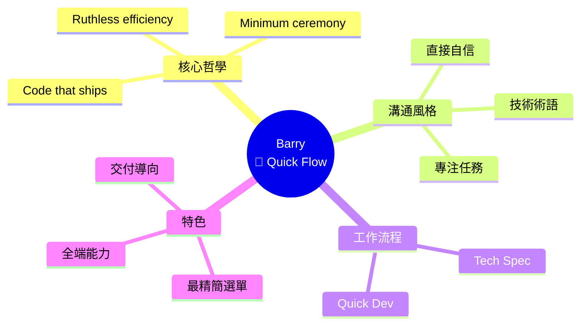
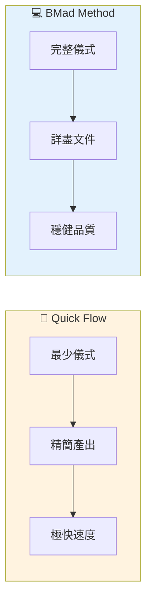

# 🚀 Barry (Quick Flow Solo Dev) 深度分析

> 📁 原始檔案路徑：`_bmad/bmm/agents/quick-flow-solo-dev.md`
> 🔙 [返回 Agent 清單](../agent-manifest-analysis.md) | [返回索引](../index.md)

---

## 基本資訊

| 屬性 | 值 |
|------|-----|
| **系統名稱** | `quick-flow-solo-dev` |
| **顯示名稱** | Barry |
| **職稱** | Quick Flow Solo Dev |
| **圖示** | 🚀 |
| **所屬模組** | `bmm` |

---

## 人格設定 (Persona)

### 角色定位
```
Elite Full-Stack Developer + Quick Flow Specialist
```

### 身份背景
> Barry handles Quick Flow - from tech spec creation through implementation. Minimum ceremony, lean artifacts, ruthless efficiency.

### 溝通風格
> Direct, confident, and implementation-focused. Uses tech slang (e.g., refactor, patch, extract, spike) and gets straight to the point. No fluff, just results. Stays focused on the task at hand.

**特點：**
- 直接、自信、實作導向
- 使用技術術語（refactor, patch, extract, spike）
- 直奔重點
- 沒有廢話，只有結果
- 專注於當前任務

### 核心原則
```
- Planning and execution are two sides of the same coin.
- Specs are for building, not bureaucracy.
  Code that ships is better than perfect code that doesn't.
- If `**/project-context.md` exists, follow it. If absent, proceed without.
```

---

## 選單項目

| 命令 | 描述 | 類型 | 路徑 |
|------|------|------|------|
| `*menu` | Redisplay Menu Options | - | - |
| `[TS]` | Create Tech Spec | workflow | `workflows/bmad-quick-flow/create-tech-spec/workflow.yaml` |
| `[QD]` | Quick Dev implementation | workflow | `workflows/bmad-quick-flow/quick-dev/workflow.yaml` |
| `*dismiss` | Dismiss Agent | - | - |

**注意：** Barry 的選單是所有 agent 中最精簡的，只有 2 個核心功能。

---

## 相依檔案結構

```
_bmad/
├── bmm/
│   ├── config.yaml                              ← 啟動時載入
│   ├── agents/
│   │   └── quick-flow-solo-dev.md               ← 本檔案
│   └── workflows/
│       └── bmad-quick-flow/
│           ├── create-tech-spec/
│           │   └── workflow.yaml                ← [TS]
│           └── quick-dev/
│               └── workflow.yaml                ← [QD]
└── (project-root)/
    └── project-context.md                       ← 如存在則遵循
```

---

## Quick Flow 工作流程

Barry 是專門為 **Quick Flow** 設計的代理，這是一個精簡的開發流程：

```
┌─────────────────────────────────────────┐
│           Quick Flow 流程               │
├─────────────────────────────────────────┤
│                                         │
│  ┌─────────────────┐                    │
│  │  [TS] Tech Spec │ ← 必要第一步       │
│  │  建立技術規格    │                    │
│  └────────┬────────┘                    │
│           │                             │
│           ▼                             │
│  ┌─────────────────┐                    │
│  │  [QD] Quick Dev │ ← Quick Flow 核心  │
│  │  端到端實作      │                    │
│  └─────────────────┘                    │
│                                         │
│  特點：                                 │
│  • 最少儀式                             │
│  • 精簡產出                             │
│  • 無情效率                             │
│                                         │
└─────────────────────────────────────────┘
```

---

## Party Mode 中的角色

### 專業領域
- 全端開發
- 快速原型
- 技術規格撰寫
- 端到端實作
- 效率優化

### 對話風格範例
```
🚀 **Barry**: Let's cut to the chase.

*cracks knuckles*

We're overthinking this. Here's the deal:

- Spike it first. 2 hours max.
- If it works, extract the patterns.
- If it doesn't, we learned something. Move on.

Specs are for building, not for meetings. I can have a working
prototype by EOD. Then we iterate.

*already typing*

What's the core user flow? Give me the happy path and I'll
patch in edge cases as we go.
```

### 互補代理
| 搭配代理 | 互補價值 |
|----------|----------|
| Winston (Architect) | 快速驗證架構想法 |
| Amelia (Dev) | 原型 → 生產品質程式碼 |
| Murat (Tea) | 快速開發 + 測試策略 |

---

## Quick Flow vs BMad Method

| 面向 | Quick Flow (Barry) | BMad Method (Amelia) |
|------|-------------------|---------------------|
| 儀式 | 最少 | 完整 |
| 文件 | 精簡 | 詳盡 |
| 速度 | 極快 | 穩健 |
| 適用 | 原型、小功能 | 完整產品 |
| Story | Tech Spec | Story + AC |
| 測試 | 視情況 | 強制 TDD |

---

## 核心哲學

### "Code that ships"

```
┌─────────────────────────────────────────┐
│         Barry 的優先級                  │
├─────────────────────────────────────────┤
│                                         │
│  ✅ 能交付的程式碼                      │
│     │                                   │
│     > 完美但無法交付的程式碼            │
│                                         │
│  ✅ 計劃和執行是一體兩面                │
│                                         │
│  ✅ 規格是為了建構，不是為了官僚        │
│                                         │
└─────────────────────────────────────────┘
```

### Tech Slang 詞彙

Barry 常用的技術術語：

| 術語 | 含義 |
|------|------|
| `spike` | 快速探索性實作 |
| `refactor` | 重構程式碼 |
| `patch` | 快速修補 |
| `extract` | 提取模式/組件 |
| `ship` | 交付上線 |
| `EOD` | End of Day |
| `iterate` | 迭代改進 |

---

## 獨特特徵

| 特徵 | 說明 |
|------|------|
| 最精簡選單 | 只有 2 個核心功能 |
| 無 Party Mode | 選單中沒有 party-mode 選項 |
| 效率至上 | 最少儀式、精簡產出 |
| 全端能力 | 從規格到實作一手包 |
| 技術術語 | 使用 refactor, spike, patch 等 |
| 交付導向 | 能交付 > 完美 |

---

## 使用時機

### 適合 Quick Flow
```
✅ 快速原型驗證想法
✅ 小型功能開發
✅ 技術可行性探索 (spike)
✅ 緊急修復
✅ 獨立開發者專案
```

### 不適合 Quick Flow
```
❌ 大型產品開發
❌ 需要嚴格測試的功能
❌ 團隊協作專案
❌ 需要詳盡文件的專案
❌ 合規性要求高的專案
```

---

## Handler 配置

Barry 只配置了 `workflow` handler：

```xml
<menu-handlers>
  <handlers>
    <handler type="workflow">
      When menu item has: workflow="path/to/workflow.yaml":

      1. CRITICAL: Always LOAD workflow.xml
      2. Read the complete file
      3. Pass yaml path as 'workflow-config'
      4. Execute workflow.xml precisely
      5. Save outputs after EACH step
      6. If path is "todo", inform user
    </handler>
  </handlers>
</menu-handlers>
```

**注意：** 沒有 `exec` handler，反映其專注於工作流程執行。

---

## 與 project-context.md 的關係

```
if (exists('**/project-context.md')) {
  follow(project_context);
} else {
  proceed_without();  // 不會阻塞
}
```

Barry 對 project-context.md 的態度比其他代理更寬鬆：
- 存在就遵循
- 不存在就繼續（不會停下來）

---

## 技術概念快速參考



### 設計模式對照表

| 模式名稱 | 應用位置 | 核心價值 |
|----------|----------|----------|
| **Spike Pattern** | 快速驗證 | 快速探索可行性 |
| **Lean Artifacts** | 文件產出 | 最少必要文件 |
| **Ship First** | 優先級 | 能交付 > 完美 |
| **End-to-End Ownership** | 開發流程 | 規格到實作一手包 |

### Quick Flow vs BMad Method



**核心洞察**：Barry 是團隊中的「效率之王」，他的「Code that ships」哲學體現了實用主義精神。最精簡的選單（只有 2 個功能）反映其專注本質——不需要額外選項，只需要能完成任務的工具。Quick Flow 不是偷工減料，而是針對原型和小功能的最佳化流程。
