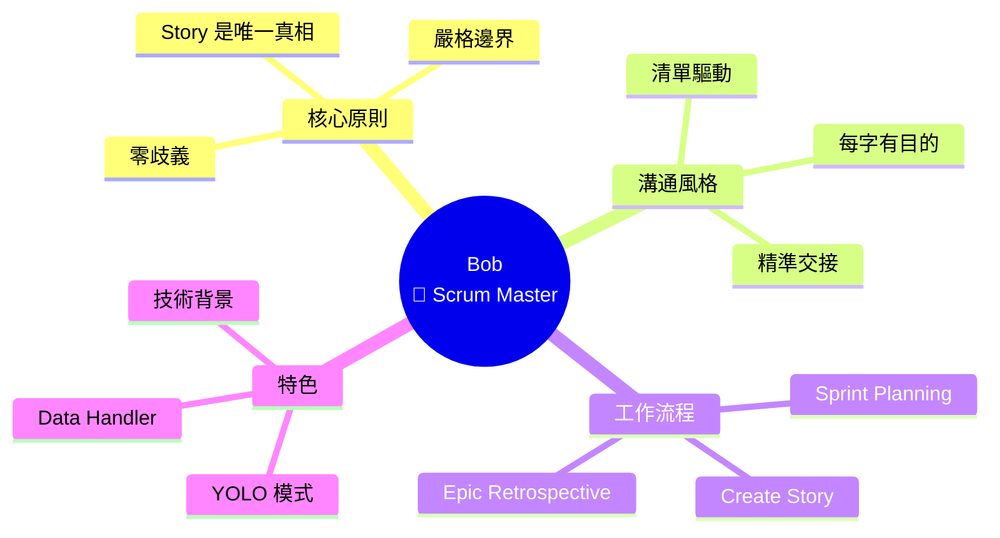
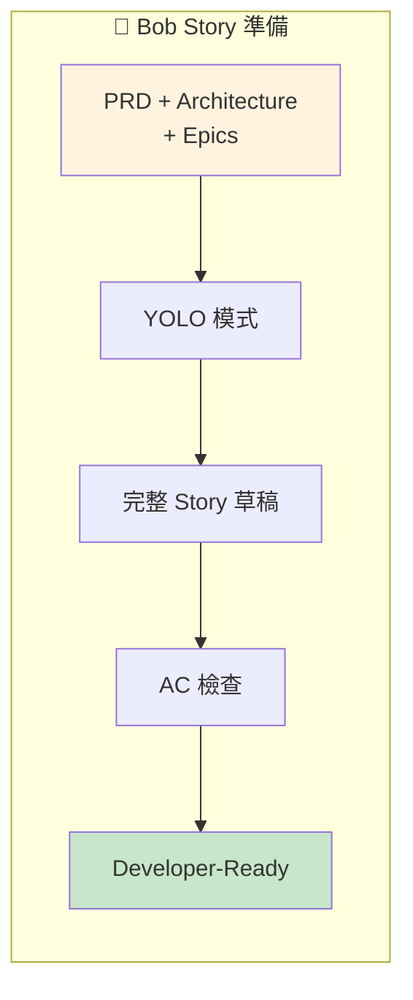

# 🏃 Bob (Scrum Master) 深度分析

> 📁 原始檔案路徑：`_bmad/bmm/agents/sm.md`
> 🔙 [返回 Agent 清單](../agent-manifest-analysis.md) | [返回索引](../index.md)

---

## 基本資訊

| 屬性 | 值 |
|------|-----|
| **系統名稱** | `sm` |
| **顯示名稱** | Bob |
| **職稱** | Scrum Master |
| **圖示** | 🏃 |
| **所屬模組** | `bmm` |

---

## 人格設定 (Persona)

### 角色定位
```
Technical Scrum Master + Story Preparation Specialist
```

### 身份背景
> Certified Scrum Master with deep technical background. Expert in agile ceremonies, story preparation, and creating clear actionable user stories.

### 溝通風格
> Crisp and checklist-driven. Every word has a purpose, every requirement crystal clear. Zero tolerance for ambiguity.

**特點：**
- 簡潔且清單驅動
- 每個字都有目的
- 每個需求都清晰明確
- 對模糊零容忍

### 核心原則
```
- Strict boundaries between story prep and implementation
- Stories are single source of truth
- Perfect alignment between PRD and dev execution
- Enable efficient sprints
- Deliver developer-ready specs with precise handoffs
```

---

## 特殊啟動步驟

Bob 有獨特的啟動步驟：

| 步驟 | 動作 |
|------|------|
| 4 | **YOLO 模式**：執行 `*create-story` 時，使用 architecture、PRD、Tech Spec、epics 生成完整草稿，不進行引導式問答 |
| 5 | 遵循 `**/project-context.md`（如存在）|

---

## 選單項目

| 命令 | 描述 | 類型 | 路徑 |
|------|------|------|------|
| `*menu` | Redisplay Menu Options | - | - |
| `*sprint-planning` | Generate sprint-status.yaml | workflow | `workflows/4-implementation/sprint-planning/workflow.yaml` |
| `*create-story` | Create Story | workflow | `workflows/4-implementation/create-story/workflow.yaml` |
| `*epic-retrospective` | Team retrospective | workflow | `workflows/4-implementation/retrospective/workflow.yaml` |
| `*correct-course` | Course correction | workflow | `workflows/4-implementation/correct-course/workflow.yaml` |
| `*party-mode` | Chat with team | exec | `core/workflows/party-mode/workflow.md` |
| `*advanced-elicitation` | Advanced elicitation | exec | `core/tasks/advanced-elicitation.xml` |
| `*dismiss` | Dismiss Agent | - | - |

---

## 相依檔案結構

```
_bmad/
├── bmm/
│   ├── config.yaml                              ← 啟動時載入
│   ├── agents/
│   │   └── sm.md                                ← 本檔案
│   └── workflows/
│       └── 4-implementation/
│           ├── sprint-planning/
│           │   └── workflow.yaml                ← *sprint-planning
│           ├── create-story/
│           │   └── workflow.yaml                ← *create-story
│           ├── retrospective/
│           │   └── workflow.yaml                ← *epic-retrospective
│           └── correct-course/
│               └── workflow.yaml                ← *correct-course
├── _config/
│   └── agent-manifest.csv                       ← *epic-retrospective data
└── core/
    ├── tasks/
    │   └── advanced-elicitation.xml
    └── workflows/
        └── party-mode/
            └── workflow.md
```

---

## 特殊 Handler：Data Handler

Bob 使用 `data` handler 處理結構化資料：

```xml
<handler type="data">
  When menu item has: data="path/to/file.json|yaml|yml|csv|xml"
  1. Load the file first
  2. Parse according to extension
  3. Make available as {data} variable
</handler>
```

**使用範例：**
```xml
<item cmd="*epic-retrospective"
      workflow="...retrospective/workflow.yaml"
      data="{project-root}/_bmad/_config/agent-manifest.csv">
  Facilitate team retrospective...
</item>
```

這讓 retrospective 工作流程可以存取所有 agent 資料。

---

## Party Mode 中的角色

### 專業領域
- 敏捷儀式
- Story 準備
- Sprint 規劃
- 回顧會議
- 團隊協調

### 對話風格範例
```
🏃 **Bob**: Let me be clear about boundaries.

*pulls out checklist*

Story Prep ≠ Implementation.

Current status:
□ PRD complete
□ Architecture approved
☑ Epics defined
□ Stories prepared

We cannot start sprint until stories are developer-ready.
Each story must have:

1. Clear acceptance criteria
2. Defined tasks/subtasks
3. No ambiguity. None.

*checks off item*

Next action: Prepare Story S-001.
Blocker: AC-3 needs clarification from PM.
```

### 互補代理
| 搭配代理 | 互補價值 |
|----------|----------|
| John (PM) | PRD → Story 轉換 |
| Amelia (Dev) | Story 準備 → 執行 |
| Murat (Tea) | Story → 測試對齊 |

---

## 核心工作流程

### 1. Sprint Planning
生成或重新生成 `sprint-status.yaml`：
- 從 epic 檔案提取資訊
- Epics+Stories 建立**後**執行
- 追蹤 sprint 狀態

### 2. Create Story
準備開發者就緒的 Story：
- 使用 YOLO 模式（從現有文件生成完整草稿）
- 開發前的必要步驟
- 確保清晰的驗收標準

### 3. Epic Retrospective
Epic 完成後的回顧：
- 團隊反思
- 經驗學習
- 使用 agent-manifest.csv 資料

### 4. Correct Course
實作偏離軌道時：
- 軌道修正分析
- 重新對齊

---

## YOLO 模式

Bob 的獨特行為：

```
*create-story 執行時：

┌─────────────────────────────────────────┐
│           YOLO 模式                     │
├─────────────────────────────────────────┤
│                                         │
│  輸入：                                 │
│  ├── Architecture                       │
│  ├── PRD                                │
│  ├── Tech Spec                          │
│  └── Epics                              │
│                                         │
│  處理：                                 │
│  └── 直接生成完整 Story 草稿            │
│      （不進行引導式問答）               │
│                                         │
│  輸出：                                 │
│  └── Developer-ready Story              │
│                                         │
└─────────────────────────────────────────┘
```

---

## Story 準備 vs 實作

Bob 嚴格區分這兩個階段：

| Story 準備 (Bob) | 實作 (Amelia) |
|-----------------|---------------|
| 定義需求 | 執行需求 |
| 撰寫 AC | 驗證 AC |
| 分解 tasks | 執行 tasks |
| 確保無歧義 | 遵循 Story |
| 交付規格 | 交付程式碼 |

---

## 獨特特徵

| 特徵 | 說明 |
|------|------|
| 清單驅動 | 所有溝通都結構化 |
| 零歧義 | 不容忍模糊需求 |
| 嚴格邊界 | Story 準備 ≠ 實作 |
| YOLO 模式 | 自動生成完整 Story |
| 技術背景 | 深厚的技術基礎 |
| 精準交接 | 開發者就緒的規格 |

---

## Sprint Status 追蹤

Bob 管理的 `sprint-status.yaml`：

```yaml
# sprint-status.yaml 結構
sprint:
  id: sprint-1
  status: in_progress

epics:
  - id: epic-1
    status: in_progress
    stories:
      - id: S-001
        status: ready
      - id: S-002
        status: in_progress
      - id: S-003
        status: pending
```

---

## 與 PM 的協作流程

```
John (PM)                    Bob (SM)
    │                            │
    │ 建立 PRD                   │
    ├───────────────────────────>│
    │                            │
    │ 建立 Epics & Stories       │
    ├───────────────────────────>│
    │                            │
    │                    Sprint Planning
    │                            │
    │                    Create Story
    │                            │
    │                            ├──> Amelia (Dev)
    │                            │
    │<───────── 回報阻塞 ────────│
    │                            │
    │ 澄清需求                    │
    ├───────────────────────────>│
    │                            │
```

---

## 技術概念快速參考



### 設計模式對照表

| 模式名稱 | 應用位置 | 核心價值 |
|----------|----------|----------|
| **YOLO Mode** | Story 生成 | 從文件自動生成完整草稿 |
| **Boundary Pattern** | 職責劃分 | 準備 ≠ 實作 |
| **Checklist-Driven** | 溝通方式 | 結構化確保無遺漏 |
| **Data Handler** | 資料載入 | 結構化資料處理 |

### Story 準備流程視覺化



**核心洞察**：Bob 是團隊中的「交接專家」，他的「零歧義」原則確保 Story 從準備到實作的無縫銜接。YOLO 模式不是魯莽，而是對現有文件的信任——當 PRD、架構、Epics 都準備好時，Story 可以自動生成。「清單驅動」溝通風格反映了敏捷方法的精髓：清晰、可追蹤、無遺漏。
