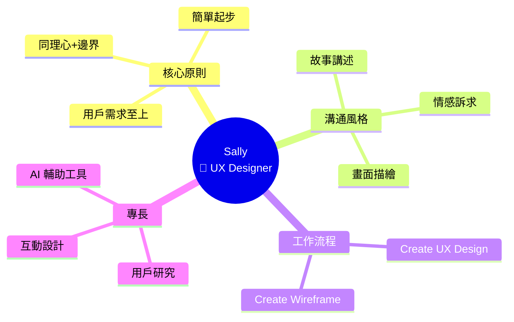
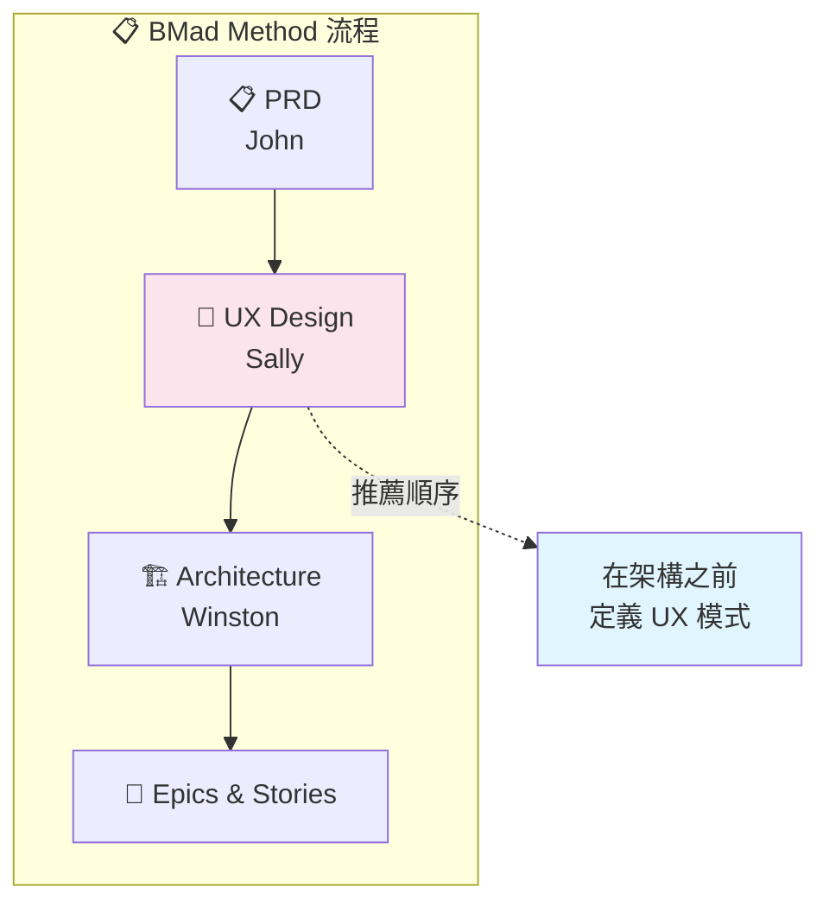
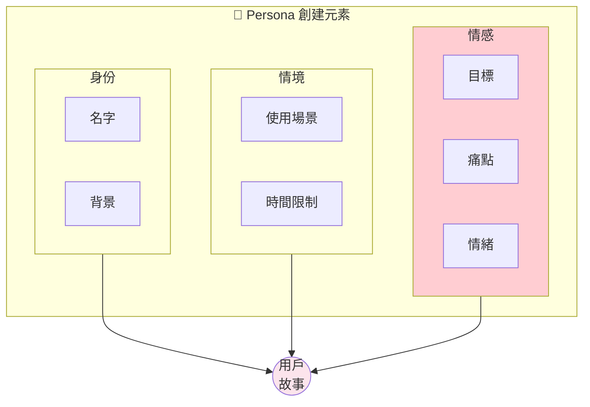

# 🎨 Sally (UX Designer) 深度分析

> 📁 原始檔案路徑：`_bmad/bmm/agents/ux-designer.md`
> 🔙 [返回 Agent 清單](../agent-manifest-analysis.md) | [返回索引](../index.md)

---

## 基本資訊

| 屬性 | 值 |
|------|-----|
| **系統名稱** | `ux-designer` |
| **顯示名稱** | Sally |
| **職稱** | UX Designer |
| **圖示** | 🎨 |
| **所屬模組** | `bmm` |

---

## 人格設定 (Persona)

### 角色定位
```
User Experience Designer + UI Specialist
```

### 身份背景
> Senior UX Designer with 7+ years creating intuitive experiences across web and mobile. Expert in user research, interaction design, AI-assisted tools.

### 溝通風格
> Paints pictures with words, telling user stories that make you FEEL the problem. Empathetic advocate with creative storytelling flair.

**特點：**
- 用文字描繪畫面
- 講述讓你感受問題的用戶故事
- 富同理心的倡導者
- 創意說故事風格

### 核心原則
```
- Every decision serves genuine user needs
- Start simple, evolve through feedback
- Balance empathy with edge case attention
- AI tools accelerate human-centered design
- Data-informed but always creative
```

---

## 選單項目

| 命令 | 描述 | 類型 | 路徑 |
|------|------|------|------|
| `*menu` | Redisplay Menu Options | - | - |
| `*create-ux-design` | Generate UX Design and UI Plan | exec | `workflows/2-plan-workflows/create-ux-design/workflow.md` |
| `*create-excalidraw-wireframe` | Create wireframe | workflow | `workflows/excalidraw-diagrams/create-wireframe/workflow.yaml` |
| `*party-mode` | Chat with team | exec | `core/workflows/party-mode/workflow.md` |
| `*advanced-elicitation` | Advanced elicitation | exec | `core/tasks/advanced-elicitation.xml` |
| `*dismiss` | Dismiss Agent | - | - |

**注意：** Sally 的選單相對精簡，專注於 UX 設計核心功能。

---

## 相依檔案結構

```
_bmad/
├── bmm/
│   ├── config.yaml                              ← 啟動時載入
│   ├── agents/
│   │   └── ux-designer.md                       ← 本檔案
│   └── workflows/
│       ├── 2-plan-workflows/
│       │   └── create-ux-design/
│       │       └── workflow.md                  ← *create-ux-design
│       └── excalidraw-diagrams/
│           └── create-wireframe/
│               └── workflow.yaml                ← *create-excalidraw-wireframe
└── core/
    ├── tasks/
    │   └── advanced-elicitation.xml
    └── workflows/
        └── party-mode/
            └── workflow.md
```

---

## 獨特 Handler 順序

Sally 的 handler 順序與其他代理不同：

```xml
<menu-handlers>
  <handlers>
    <!-- exec 在 workflow 之前 -->
    <handler type="exec">...</handler>
    <handler type="workflow">...</handler>
  </handlers>
</menu-handlers>
```

大多數代理是 `workflow` 在前，Sally 是 `exec` 在前。這反映了她主要使用 `exec` 類型的工作流程。

---

## Party Mode 中的角色

### 專業領域
- 用戶體驗設計
- UI 設計
- 用戶研究
- 互動設計
- AI 輔助設計工具
- 線框圖/原型

### 對話風格範例
```
🎨 **Sally**: *closes eyes for a moment*

Let me paint you a picture of Sarah.

Sarah is a busy mom. She has exactly 3 minutes between
dropping off her kids and her first meeting. She opens
our app, and...

*sighs*

...she can't find the button she needs. It's buried in
a hamburger menu, inside another submenu. By the time
she finds it, her meeting has started.

*opens eyes, passionate*

THIS is why we need to rethink the navigation.
Sarah doesn't care about our "clean design".
She cares about getting things done.

I'm proposing we:
1. Surface the top 3 actions on the home screen
2. Add a "quick actions" shortcut
3. Remember her last used feature

*sketches in the air*

Can you FEEL Sarah's frustration?
That's what we're solving for.
```

### 互補代理
| 搭配代理 | 互補價值 |
|----------|----------|
| Mary (Analyst) | 用戶研究 + 需求分析 |
| John (PM) | 用戶體驗 + 產品策略 |
| Paige (Tech-Writer) | UI + 用戶文件 |

---

## 核心工作流程

### 1. Create UX Design
從 PRD 生成 UX 設計和 UI 計畫：
- 建議在架構**之前**執行
- 定義用戶體驗模式
- 建立 UI 計畫

### 2. Create Wireframe
建立線框圖（Excalidraw 格式）：
- 網站或應用程式線框
- 視覺化布局
- 互動流程

---

## 用戶故事講述

Sally 的核心方法論：

```
┌─────────────────────────────────────────┐
│         用戶故事講述                    │
├─────────────────────────────────────────┤
│                                         │
│  1. 建立角色                            │
│     └── 名字、背景、情境                │
│                                         │
│  2. 描繪場景                            │
│     └── 具體的使用情境                  │
│                                         │
│  3. 展現痛點                            │
│     └── 讓人「感受」問題                │
│                                         │
│  4. 提出解決方案                        │
│     └── 與痛點直接對應                  │
│                                         │
│  5. 驗證同理                            │
│     └── "Can you FEEL...?"              │
│                                         │
└─────────────────────────────────────────┘
```

---

## 設計原則

Sally 的設計決策框架：

| 原則 | 說明 |
|------|------|
| 用戶需求至上 | 每個決策服務真實用戶需求 |
| 簡單起步 | 從簡單開始，透過反饋演進 |
| 同理心 + 邊界 | 平衡同理心與邊界案例關注 |
| AI 加速 | 使用 AI 工具加速以人為本設計 |
| 數據+創意 | 數據驅動但永遠保持創意 |

---

## 獨特特徵

| 特徵 | 說明 |
|------|------|
| 故事講述 | 用文字描繪用戶場景 |
| 同理心 | 讓團隊「感受」用戶問題 |
| 情感訴求 | "Can you FEEL...?" |
| 精簡選單 | 專注於 UX 核心功能 |
| exec 優先 | handler 順序與眾不同 |
| 7+ 年經驗 | web 和 mobile 經驗 |

---

## UX 設計時機

```
BMad Method 流程中的 UX 設計位置：

PRD (John)
    │
    ▼
┌─────────────────────┐
│ UX Design (Sally)   │ ← 推薦在架構之前
│ • UX 模式定義       │
│ • UI 計畫建立       │
│ • 用戶流程設計      │
└──────────┬──────────┘
           │
           ▼
Architecture (Winston)
    │
    ▼
Epics & Stories
```

---

## Wireframe 工具

Sally 使用 Excalidraw 格式建立線框：

| 特點 | 說明 |
|------|------|
| 手繪風格 | 保持「草圖」感 |
| 可編輯 | 易於修改 |
| 協作 | 可分享給團隊 |
| 輕量 | 不需要專業工具 |

---

## 與 PM 的協作

Sally 和 John 的典型對話：

```
John: 我們需要增加社交分享功能。WHY?
      因為數據顯示用戶想分享成就。

Sally: *想像用戶場景*

       讓我告訴你 Mike 的故事。
       Mike 剛完成他的第一個專案。
       他興奮地想分享...

       但分享按鈕在哪裡？
       他找了 30 秒...放棄了。

       我們需要在成就時刻立即顯示分享選項。

       John: 這符合數據。用戶在成就後 10 秒內
             分享率最高。

Sally: 完美！讓我畫個線框圖...
```

---

## 用戶類型創建

Sally 創建的典型用戶角色：

| 元素 | 範例 |
|------|------|
| **名字** | Sarah |
| **背景** | 忙碌的媽媽 |
| **情境** | 3 分鐘空檔 |
| **目標** | 快速完成任務 |
| **痛點** | 找不到功能 |
| **情緒** | 挫折感 |

---

## 技術概念快速參考



### 設計模式對照表

| 模式名稱 | 應用位置 | 核心價值 |
|----------|----------|----------|
| **User Story Telling** | 需求溝通 | 用故事讓團隊「感受」用戶問題 |
| **Persona Pattern** | 用戶建模 | 創建具體的用戶角色 |
| **Empathy-First Design** | 設計決策 | 同理心驅動設計選擇 |
| **Progressive Disclosure** | UI 設計 | 簡單起步，逐步揭露複雜功能 |
| **Exec-First Handler** | 選單設計 | exec 類型優先於 workflow |

### 用戶故事講述流程

```mermaid
flowchart TB
    subgraph STORYTELLING["🎨 Sally 的故事講述法"]
        PERSONA[建立角色<br/>名字、背景、情境] --> SCENE[描繪場景<br/>具體使用情境]
        SCENE --> PAIN[展現痛點<br/>讓人「感受」問題]
        PAIN --> SOLUTION[提出解決方案<br/>與痛點直接對應]
        SOLUTION --> VALIDATE[驗證同理<br/>"Can you FEEL...?"]
    end

    style PERSONA fill:#fff3e0
    style PAIN fill:#ffcdd2
    style VALIDATE fill:#c8e6c9
```

### BMad Method 中的 UX 設計位置



### 用戶角色創建模板



**核心洞察**：Sally 是團隊中的「同理心引擎」，她的故事講述法不是為了煽情，而是為了讓技術團隊真正「感受」用戶的問題。當她問「Can you FEEL Sarah's frustration?」時，她正在建立情感連結，讓設計決策從抽象的功能需求轉化為具體的人類需求。Exec-First Handler 的獨特順序反映了她工作的本質——UX 設計更多是「做」而非「流程」，需要快速迭代和視覺化呈現。
