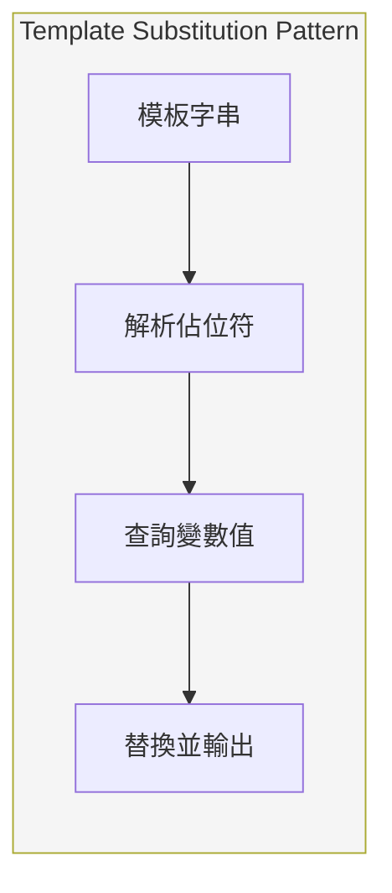
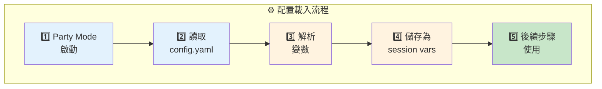
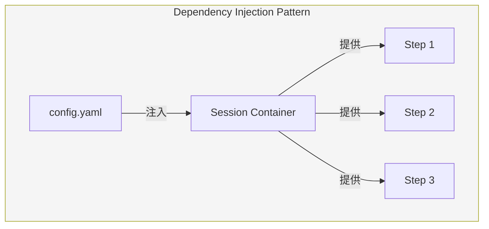
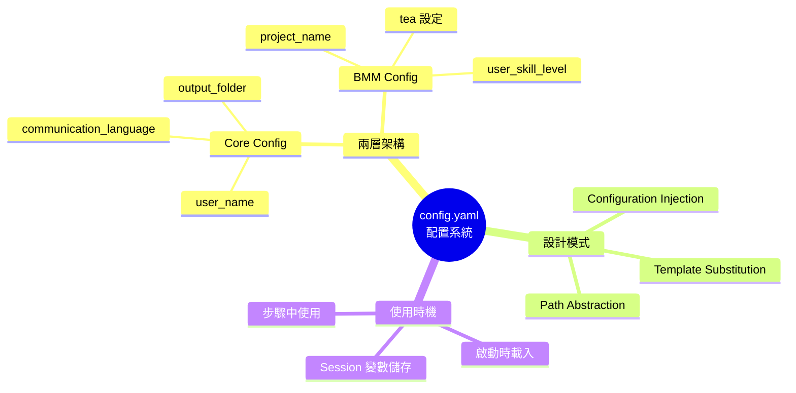
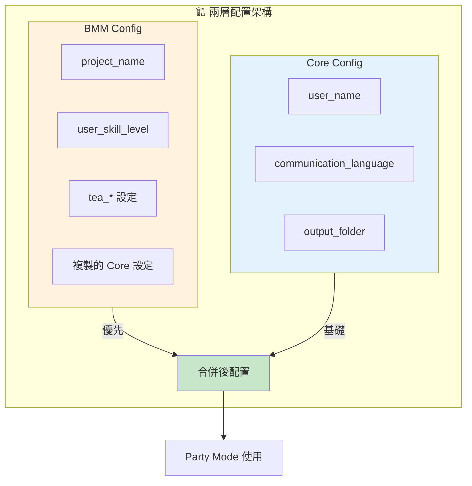

# config.yaml 深度分析

> 📁 原始檔案路徑：`_bmad/core/config.yaml` 及 `_bmad/bmm/config.yaml`
> 🔙 [返回索引](./index.md)

---

## 檔案概述

BMAD 框架使用兩層配置系統：
- **Core config** (`_bmad/core/config.yaml`) - 核心平台配置
- **BMM config** (`_bmad/bmm/config.yaml`) - BMM 模組配置

Party Mode 主要讀取這些配置來取得用戶設定與系統變數。

---

## Core Config (`_bmad/core/config.yaml`)

```yaml
# CORE Module Configuration
# Generated by BMAD installer
# Version: 6.0.0-alpha.20
# Date: 2025-12-24T02:48:01.894Z

user_name: Pi
communication_language: Mandarin zhTW
document_output_language: Mandarin zhTW
output_folder: "{project-root}/_bmad-output"
```

### 欄位說明

| 欄位 | 值 | Party Mode 用途 |
|------|-----|-----------------|
| `user_name` | `Pi` | 歡迎訊息、個人化稱呼 |
| `communication_language` | `Mandarin zhTW` | 對話語言 |
| `document_output_language` | `Mandarin zhTW` | 文件輸出語言 |
| `output_folder` | `{project-root}/_bmad-output` | 輸出目錄（Party Mode 較少使用）|

---

## BMM Config (`_bmad/bmm/config.yaml`)

```yaml
# BMM Module Configuration
# Generated by BMAD installer
# Version: 6.0.0-alpha.20
# Date: 2025-12-24T02:48:01.893Z

project_name: slinky-console
user_skill_level: intermediate
planning_artifacts: "{project-root}/_bmad-output/project-planning-artifacts"
implementation_artifacts: "{project-root}/_bmad-output/implementation-artifacts"
project_knowledge: "{project-root}/refs"
tea_use_mcp_enhancements: false
tea_use_playwright_utils: false

# Core Configuration Values
user_name: Pi
communication_language: Mandarin zhTW
document_output_language: Mandarin zhTW
output_folder: "{project-root}/_bmad-output"
```

### 欄位說明

| 欄位 | 值 | 用途 |
|------|-----|------|
| `project_name` | `slinky-console` | 專案識別名稱 |
| `user_skill_level` | `intermediate` | 用戶技術水平 |
| `planning_artifacts` | 路徑 | 規劃文件輸出位置 |
| `implementation_artifacts` | 路徑 | 實作文件輸出位置 |
| `project_knowledge` | `{project-root}/refs` | 專案知識庫路徑 |
| `tea_use_mcp_enhancements` | `false` | Tea 代理 MCP 增強 |
| `tea_use_playwright_utils` | `false` | Tea 代理 Playwright 工具 |

---

## Party Mode 中的配置使用

### 變數替換流程

```mermaid
flowchart TD
    subgraph CONFIG["📄 配置來源"]
        YAML["config.yaml<br/>user_name: Pi"]
    end

    subgraph SESSION["💾 Session 變數"]
        VARS["變數儲存為<br/>session variables"]
    end

    subgraph TEMPLATE["📝 模板替換"]
        BEFORE["Welcome &#123;&#123;user_name&#125;&#125;"]
        AFTER["Welcome Pi"]
        BEFORE -->|替換| AFTER
    end

    YAML -->|讀取| VARS
    VARS -->|替換| BEFORE

    style CONFIG fill:#e3f2fd
    style SESSION fill:#fff3e0
    style TEMPLATE fill:#c8e6c9
```



**技術概念說明：Template Variable Substitution（模板變數替換）**

這是一種常見的動態內容生成模式，將佔位符替換為實際值：



| 階段 | 輸入 | 輸出 |
|------|------|------|
| 解析 | `Welcome {{user_name}}` | 變數名 `user_name` |
| 查詢 | `user_name` | 值 `Pi` |
| 替換 | 模板 + 值 | `Welcome Pi` |

### Party Mode 使用的變數

| 變數 | 使用位置 | 範例 |
|------|----------|------|
| `{{user_name}}` | Step 1 歡迎訊息 | "Welcome Pi!" |
| `{{user_name}}` | Step 3 感謝訊息 | "Thank you Pi..." |
| `{{date}}` | Frontmatter | 系統生成的日期 |
| `communication_language` | 對話語言選擇 | Mandarin zhTW |

---

## 配置載入時機

### workflow.md 定義

```markdown
## INITIALIZATION

### Configuration Loading

Load config from `{project-root}/_bmad/core/config.yaml` and resolve:

- `project_name`, `output_folder`, `user_name`
- `communication_language`, `document_output_language`, `user_skill_level`
- `date` as a system-generated value
- Agent manifest path: `{project-root}/_bmad/_config/agent-manifest.csv`
```

### 載入順序



**技術概念說明：Configuration Injection（配置注入）**

配置在啟動時一次性載入，後續步驟透過 session variables 存取：



---

## 路徑解析

### `{project-root}` 變數

`{project-root}` 是一個特殊的路徑變數，會在執行時解析為專案根目錄的絕對路徑。

**範例：**
```
{project-root}/_bmad/core/config.yaml
        ↓
/mnt/d/projects/slurm/slinky-console/_bmad/core/config.yaml
```

### 路徑使用

| 配置值 | 解析後 |
|--------|--------|
| `{project-root}/_bmad-output` | `/mnt/d/projects/.../slinky-console/_bmad-output` |
| `{project-root}/_bmad/_config/agent-manifest.csv` | `/mnt/d/projects/.../slinky-console/_bmad/_config/agent-manifest.csv` |

---

## 語言配置

### 支援的語言設定

| 設定 | 影響範圍 |
|------|----------|
| `communication_language` | 對話中的溝通語言 |
| `document_output_language` | 生成文件的語言 |

### 當前配置

```yaml
communication_language: Mandarin zhTW
document_output_language: Mandarin zhTW
```

**影響：**
- 代理會以繁體中文進行對話
- 生成的摘要、重點會是繁體中文

---

## 版本資訊

```yaml
# Version: 6.0.0-alpha.20
# Date: 2025-12-24T02:48:01.894Z
```

**說明：**
- 這些註解由 BMAD installer 自動生成
- 記錄安裝時的版本與時間
- 用於除錯與追蹤

---

## 配置驗證

### Step 1 中的驗證邏輯

根據代理定義（如 tech-writer.md）：

```xml
<step n="2">🚨 IMMEDIATE ACTION REQUIRED - BEFORE ANY OUTPUT:
    - Load and read {project-root}/_bmad/bmm/config.yaml NOW
    - Store ALL fields as session variables: {user_name}, {communication_language}, {output_folder}
    - VERIFY: If config not loaded, STOP and report error to user
    - DO NOT PROCEED to step 3 until config is successfully loaded and variables stored
</step>
```

**驗證項目：**
- ✅ 配置檔案存在
- ✅ YAML 格式正確
- ✅ 必要欄位完整
- ✅ 路徑變數可解析

---

## 與 Party Mode 的關係

### 直接影響

| 配置項 | Party Mode 影響 |
|--------|-----------------|
| `user_name` | 歡迎/告別訊息個人化 |
| `communication_language` | 對話語言 |
| `user_skill_level` | 回應複雜度調整 |

### 間接影響

| 配置項 | Party Mode 影響 |
|--------|-----------------|
| `project_name` | 上下文參考 |
| `project_knowledge` | 專案相關知識來源 |

---

## 相依檔案

| 檔案 | 關係 | 用途 |
|------|------|------|
| [workflow.md](./workflow-analysis.md) | 定義載入邏輯 | 配置載入流程 |
| [step-01-agent-loading.md](./step-01-analysis.md) | 使用 | 歡迎訊息變數 |
| [step-03-graceful-exit.md](./step-03-analysis.md) | 使用 | 告別訊息變數 |
| [agent-manifest.csv](./agent-manifest-analysis.md) | 相關路徑 | manifest 路徑定義 |

---

## 設計考量

### 為何分成兩個 config？

1. **模組化** - Core 與 BMM 模組獨立配置
2. **擴展性** - 未來可添加更多模組
3. **覆蓋機制** - BMM 可覆蓋 Core 的共用設定

### 共用設定冗餘

注意 `user_name`、`communication_language` 等在兩個 config 中都有：
- 這是為了確保各模組可獨立運作
- BMM config 中的值會優先於 Core config
- Party Mode 應優先讀取 BMM config

---

## 配置最佳實踐

| 實踐 | 說明 |
|------|------|
| 保持同步 | Core 與 BMM 的共用設定應一致 |
| 使用變數 | 路徑使用 `{project-root}` 而非硬編碼 |
| 驗證存在 | 使用前驗證配置檔案存在 |
| 處理預設值 | 缺失項目應有合理預設值 |

---

## 技術概念快速參考



### 設計模式對照表

| 模式名稱 | 應用位置 | 核心價值 |
|----------|----------|----------|
| **Template Variable Substitution** | 訊息模板 | 動態個人化內容 |
| **Configuration Injection** | 啟動流程 | 集中配置，統一注入 |
| **Path Abstraction** | 路徑變數 | 支援不同部署環境 |
| **Layered Configuration** | Core/BMM | 模組化配置，支援覆蓋 |
| **Validation Guard** | Step 1 | 確保配置完整性 |

### 兩層配置架構視覺化



**核心洞察**：BMAD 的兩層配置系統體現了**關注點分離**原則——Core 負責平台級共用設定，BMM 負責模組特定配置。這種設計支援模組獨立運作，同時透過配置覆蓋機制實現靈活的客製化。`{project-root}` 路徑抽象使配置在不同環境中保持可移植性。
