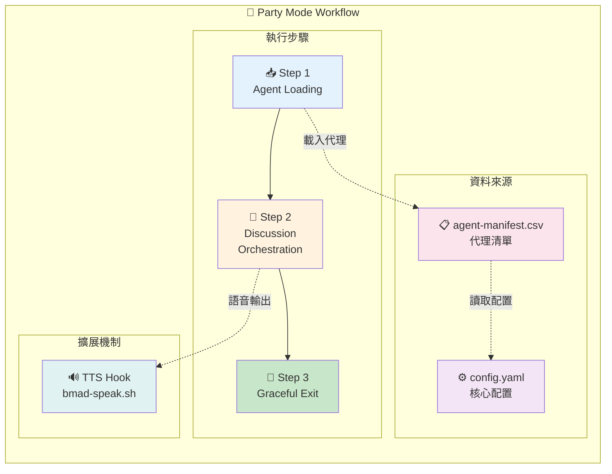
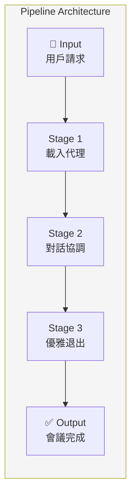
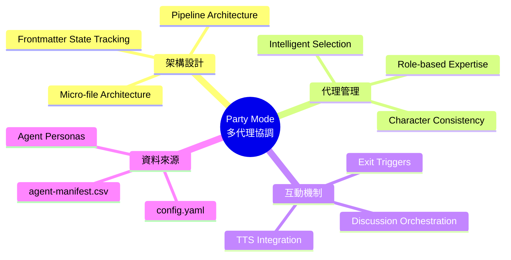
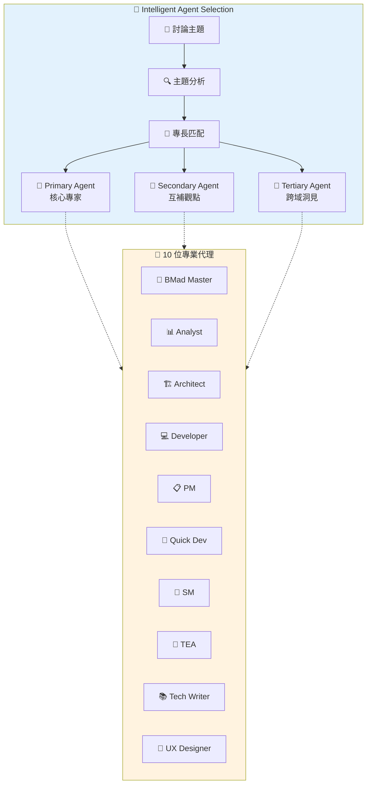

# Party Mode Workflow 完整分析

> 📅 分析日期：2025-12-29
> 📦 專案：bmad-docs
> 👤 分析者：Paige (Technical Writer)

## 概述

Party Mode 是 BMAD 框架中的一個獨特互動式工作流程，能夠協調多個 AI 代理進行自然對話。它允許用戶與整個 BMAD 團隊進行動態討論，每個代理都以其獨特的人格特質和專業知識參與對話。

---

## 檔案結構總覽

```
_bmad/
├── core/
│   ├── config.yaml                              # [核心配置]
│   └── workflows/party-mode/
│       ├── workflow.md                          # [主工作流程定義]
│       └── steps/
│           ├── step-01-agent-loading.md         # [步驟1: 代理載入]
│           ├── step-02-discussion-orchestration.md  # [步驟2: 討論協調]
│           └── step-03-graceful-exit.md         # [步驟3: 優雅退出]
└── _config/
    └── agent-manifest.csv                       # [代理清單資料]
```

---

## 深度分析文件索引

| 文件 | 職責 | 深度分析連結 |
|------|------|--------------|
| `workflow.md` | 主工作流程定義與架構 | [→ workflow-analysis.md](./workflow-analysis.md) |
| `step-01-agent-loading.md` | 代理載入與初始化 | [→ step-01-analysis.md](./step-01-analysis.md) |
| `step-02-discussion-orchestration.md` | 多代理對話協調引擎 | [→ step-02-analysis.md](./step-02-analysis.md) |
| `step-03-graceful-exit.md` | 優雅退出與狀態清理 | [→ step-03-analysis.md](./step-03-analysis.md) |
| `agent-manifest.csv` | 代理清單與人格定義 | [→ agent-manifest-analysis.md](./agent-manifest-analysis.md) |
| `config.yaml` | 核心配置與用戶設定 | [→ config-analysis.md](./config-analysis.md) |

---

## 整體流程圖



**技術概念說明：Pipeline Architecture（管道架構）**

Party Mode 採用三階段管道設計，每個階段職責明確：



| 階段 | 職責 | 輸入 | 輸出 |
|------|------|------|------|
| Stage 1 | 代理載入 | 用戶請求 + CSV | 已載入代理列表 |
| Stage 2 | 對話協調 | 代理 + 用戶訊息 | 多代理回應 |
| Stage 3 | 優雅退出 | 退出訊號 | 清理完成 |

---

## 關鍵設計模式

### 1. Micro-file Architecture
每個步驟獨立成檔，遵循單一職責原則，易於維護與擴展。

### 2. Frontmatter State Tracking
使用 YAML frontmatter 追蹤工作流程狀態，包含：
- `stepsCompleted`: 已完成步驟列表
- `agents_loaded`: 代理載入狀態
- `party_active`: Party 模式啟用狀態

### 3. Intelligent Agent Selection
根據主題分析自動選擇 2-3 個最相關的代理：
- **Primary Agent**: 核心專家
- **Secondary Agent**: 互補觀點
- **Tertiary Agent**: 跨域洞見

### 4. Character Consistency
嚴格遵循每個代理的：
- `communicationStyle`: 溝通風格
- `principles`: 決策原則
- `identity`: 背景專業

### 5. TTS Integration
每個代理回應後觸發語音合成，透過 `bmad-speak.sh` hook。

### 6. Exit Triggers
支援多種退出方式：
- 指令觸發：`*exit`, `goodbye`, `end party`, `quit`
- 自然結束偵測
- 用戶選擇 `[E]` Exit

---

## 代理總覽

| Icon | 代號 | 顯示名稱 | 職稱 | 專長領域 | 深度分析 |
|------|------|----------|------|----------|----------|
| 🧙 | bmad-master | BMad Master | Master Executor | 平台專家/協調者 | [→ 分析](./agents/bmad-master.md) |
| 📊 | analyst | Mary | Business Analyst | 商業分析/需求 | [→ 分析](./agents/analyst.md) |
| 🏗️ | architect | Winston | Architect | 系統架構/技術設計 | [→ 分析](./agents/architect.md) |
| 💻 | dev | Amelia | Developer | 軟體工程/實作 | [→ 分析](./agents/dev.md) |
| 📋 | pm | John | Product Manager | 產品策略/市場 | [→ 分析](./agents/pm.md) |
| 🚀 | quick-flow-solo-dev | Barry | Quick Flow Solo Dev | 快速開發/全端 | [→ 分析](./agents/quick-flow-solo-dev.md) |
| 🏃 | sm | Bob | Scrum Master | 敏捷/Story 準備 | [→ 分析](./agents/sm.md) |
| 🧪 | tea | Murat | Test Architect | 測試架構/CI/CD | [→ 分析](./agents/tea.md) |
| 📚 | tech-writer | Paige | Technical Writer | 技術文件/知識 | [→ 分析](./agents/tech-writer.md) |
| 🎨 | ux-designer | Sally | UX Designer | 使用者體驗/UI | [→ 分析](./agents/ux-designer.md) |

---

## 原始檔案路徑對照

### 工作流程檔案

| 分析文件 | 原始檔案相對路徑 |
|----------|------------------|
| workflow-analysis.md | `_bmad/core/workflows/party-mode/workflow.md` |
| step-01-analysis.md | `_bmad/core/workflows/party-mode/steps/step-01-agent-loading.md` |
| step-02-analysis.md | `_bmad/core/workflows/party-mode/steps/step-02-discussion-orchestration.md` |
| step-03-analysis.md | `_bmad/core/workflows/party-mode/steps/step-03-graceful-exit.md` |
| agent-manifest-analysis.md | `_bmad/_config/agent-manifest.csv` |
| config-analysis.md | `_bmad/core/config.yaml` |

### Agent 定義檔案

| 分析文件 | 原始檔案相對路徑 |
|----------|------------------|
| [agents/bmad-master.md](./agents/bmad-master.md) | `_bmad/core/agents/bmad-master.md` |
| [agents/analyst.md](./agents/analyst.md) | `_bmad/bmm/agents/analyst.md` |
| [agents/architect.md](./agents/architect.md) | `_bmad/bmm/agents/architect.md` |
| [agents/dev.md](./agents/dev.md) | `_bmad/bmm/agents/dev.md` |
| [agents/pm.md](./agents/pm.md) | `_bmad/bmm/agents/pm.md` |
| [agents/quick-flow-solo-dev.md](./agents/quick-flow-solo-dev.md) | `_bmad/bmm/agents/quick-flow-solo-dev.md` |
| [agents/sm.md](./agents/sm.md) | `_bmad/bmm/agents/sm.md` |
| [agents/tea.md](./agents/tea.md) | `_bmad/bmm/agents/tea.md` |
| [agents/tech-writer.md](./agents/tech-writer.md) | `_bmad/bmm/agents/tech-writer.md` |
| [agents/ux-designer.md](./agents/ux-designer.md) | `_bmad/bmm/agents/ux-designer.md` |

---

## 下一步

點擊上方的深度分析連結，深入了解每個檔案的詳細運作機制。

---

## 技術概念快速參考



### 設計模式對照表

| 模式名稱 | 應用位置 | 核心價值 |
|----------|----------|----------|
| **Pipeline Architecture** | 三步驟流程 | 清晰的階段劃分與資料流 |
| **Micro-file Architecture** | 步驟檔案 | 單一職責，易於維護 |
| **Frontmatter State Tracking** | YAML 狀態 | 結構化狀態管理 |
| **Intelligent Agent Selection** | Step 1 | 基於主題的智慧代理選擇 |
| **Character Consistency** | Step 2 | 維持代理人格一致性 |
| **Observer Pattern** | TTS Hook | 回應事件觸發語音輸出 |
| **Graceful Degradation** | Step 3 | 優雅處理退出與清理 |

### 代理選擇機制視覺化



**核心洞察**：Party Mode 是 BMAD 框架中最具互動性的工作流程，透過智慧代理選擇與角色一致性機制，實現多專家協作的自然對話體驗。它展示了如何將複雜的多代理協調簡化為三個明確的管道階段，同時保持每個代理的獨特人格與專業價值。
