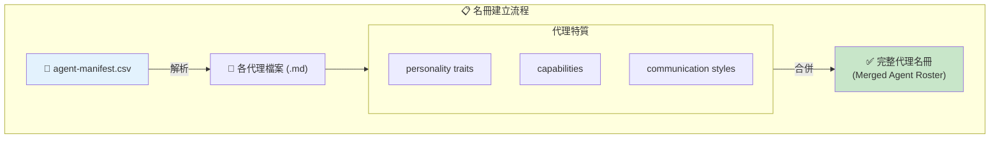
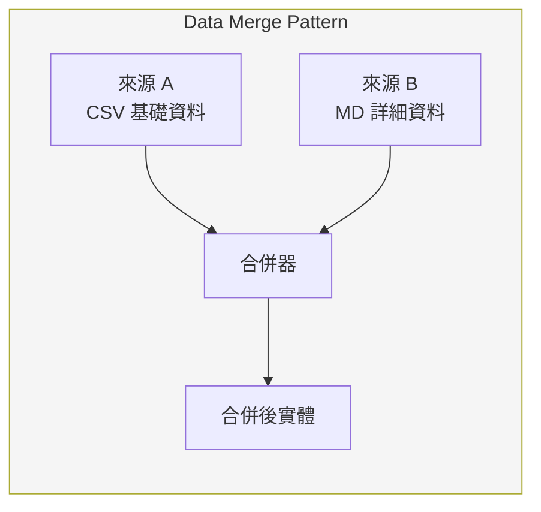
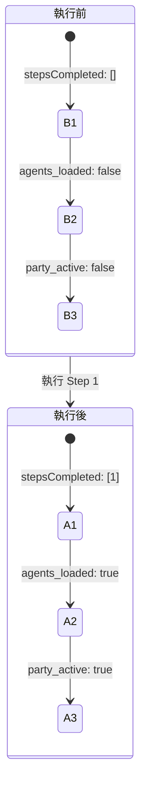
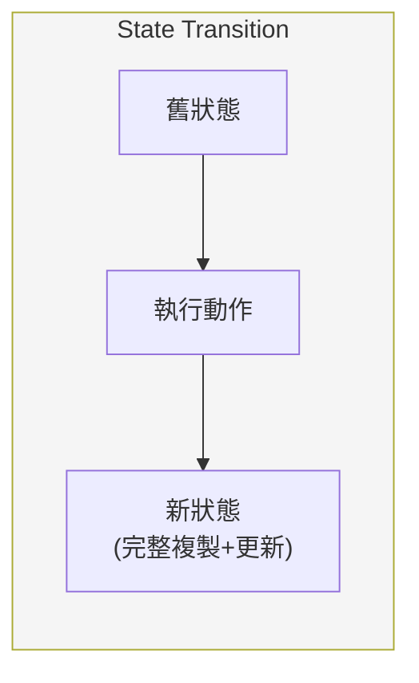
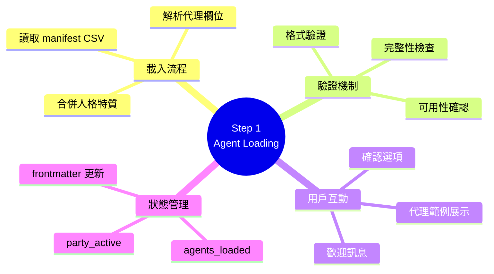
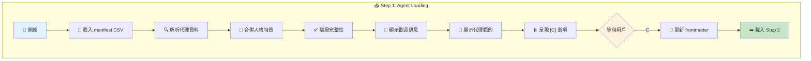

# step-01-agent-loading.md 深度分析

> 📁 原始檔案路徑：`_bmad/core/workflows/party-mode/steps/step-01-agent-loading.md`
> 🔙 [返回索引](./index.md)

---

## 檔案概述

`step-01-agent-loading.md` 是 Party Mode 的**初始化步驟**，負責載入所有代理資料並啟動 Party 模式環境。這是進入多代理對話前的關鍵準備階段。

---

## 核心職責

| 職責 | 描述 |
|------|------|
| 代理清單載入 | 從 agent-manifest.csv 讀取所有代理資料 |
| 資料解析 | 提取 10 個代理屬性欄位 |
| 名冊建立 | 合併人格特質與能力配置 |
| 啟動訊息 | 顯示歡迎訊息與代理範例 |
| 狀態更新 | 更新 frontmatter 並進入下一步驟 |

---

## 強制執行規則 (MANDATORY EXECUTION RULES)

```
✅ 你是 PARTY MODE FACILITATOR，不只是工作流程執行器
🎯 創造引人入勝的多代理協作氛圍
📋 從 manifest 載入完整代理名冊並合併人格
🔍 解析代理資料以供對話協調使用
💬 介紹多樣化的代理範例來開啟討論
```

---

## 執行協議 (EXECUTION PROTOCOLS)

| 協議 | 說明 |
|------|------|
| 🎯 | 先顯示代理載入過程，再呈現 party 啟動畫面 |
| ⚠️ | 代理名冊載入後呈現 [C] 繼續選項 |
| 💾 | 只在用戶選擇 C (Continue) 時儲存 |
| 📖 | 載入下一步驟前更新 frontmatter `stepsCompleted: [1]` |
| 🚫 | **禁止**在選擇 C 之前開始對話 |

---

## 執行流程詳解

### 階段 1: 載入代理清單

**執行動作：**
```
讀取：{project-root}/_bmad/_config/agent-manifest.csv
```

**顯示訊息：**
```
Now initializing **Party Mode** with our complete BMAD agent roster!
Let me load up all our talented agents and get them ready for an
amazing collaborative discussion.

**Agent Manifest Loading:**
```

---

### 階段 2: 提取代理資料

**CSV 解析欄位對照：**

| 欄位名 | 用途 | 對話中使用 |
|--------|------|------------|
| `name` | 系統呼叫識別碼 | 內部路由 |
| `displayName` | 對話顯示名稱 | ✅ 顯示 |
| `title` | 正式職稱 | ✅ 介紹 |
| `icon` | Emoji 視覺識別 | ✅ 顯示 |
| `role` | 能力與專業摘要 | ✅ 選擇依據 |
| `identity` | 背景與專業細節 | 回應生成 |
| `communicationStyle` | 表達方式 | 回應風格 |
| `principles` | 決策哲學與價值觀 | 回應邏輯 |
| `module` | 來源模組 | 系統管理 |
| `path` | 檔案位置參考 | 系統管理 |

---

### 階段 3: 建立代理名冊

**名冊建立流程：**



**技術概念說明：Data Merge Pattern（資料合併模式）**

這是一種將多個資料來源合併為單一完整實體的設計模式：



| 資料來源 | 提供內容 | 優先順序 |
|----------|----------|----------|
| CSV | 基礎識別、角色摘要 | 結構化索引 |
| MD 檔案 | 詳細人格、完整配置 | 豐富細節 |

**驗證項目：**
- ✅ 代理可用性
- ✅ 配置完整性
- ✅ 依專業領域組織

---

### 階段 4: Party Mode 啟動

**啟動訊息模板：**
```
🎉 PARTY MODE ACTIVATED! 🎉

Welcome {{user_name}}! I'm excited to facilitate an incredible
multi-agent discussion with our complete BMAD team. All our
specialized agents are online and ready to collaborate...

**Our Collaborating Agents Include:**

- [Icon] **[Agent Name]** ([Title]): [Brief role description]
- [Icon] **[Agent Name]** ([Title]): [Brief role description]
- [Icon] **[Agent Name]** ([Title]): [Brief role description]

**[Total Count] agents** are ready to contribute their expertise!

**What would you like to discuss with the team today?**
```

**範例輸出：**
```
🎉 PARTY MODE ACTIVATED! 🎉

Welcome Pi! ...

**Our Collaborating Agents Include:**

- 🏗️ **Winston** (Architect): System Architect + Technical Design Leader
- 📊 **Mary** (Business Analyst): Strategic Business Analyst + Requirements Expert
- 💻 **Amelia** (Developer): Senior Software Engineer

**10 agents** are ready to contribute their expertise!
```

---

### 階段 5: 呈現繼續選項

**選項呈現：**
```
**Agent roster loaded successfully!** All our BMAD experts
are excited to collaborate with you.

**Ready to start the discussion?**
[C] Continue - Begin multi-agent conversation
```

---

### 階段 6: 處理繼續選擇

**當用戶選擇 'C' (Continue)：**

```yaml
# 更新 frontmatter
stepsCompleted: [1]
agents_loaded: true
party_active: true
```

**下一步：**
```
載入：./step-02-discussion-orchestration.md
```

---

## 成功指標

| 指標 | 檢查項目 |
|------|----------|
| ✅ | Agent manifest 成功載入並解析 |
| ✅ | 完整代理名冊建立，包含合併人格 |
| ✅ | 創造引人入勝的 party mode 介紹 |
| ✅ | 展示多樣化的代理範例 |
| ✅ | [C] 繼續選項正確呈現與處理 |
| ✅ | Frontmatter 更新代理載入狀態 |
| ✅ | 正確路由到討論協調步驟 |

---

## 失敗模式

| 失敗情況 | 描述 |
|----------|------|
| ❌ | 無法載入或解析 agent manifest CSV |
| ❌ | 代理資料提取或名冊建立不完整 |
| ❌ | Party mode 介紹過於一般化或無趣 |
| ❌ | 未展示多樣化的代理能力 |
| ❌ | 載入後未呈現 [C] 繼續選項 |
| ❌ | 未經用戶選擇就開始對話 |

---

## 代理載入協議

```
1. 驗證 CSV 格式和必要欄位
2. 優雅處理缺失或不完整的代理條目
3. 交叉參照 manifest 與實際代理檔案
4. 準備智慧對話路由的代理選擇邏輯
5. 設定每個代理的 TTS 語音配置
```

---

## 狀態轉換



**技術概念說明：Immutable State Transition（不可變狀態轉換）**

每次狀態變更都產生新的狀態快照，而非修改現有狀態：



---

## 相依檔案

| 檔案 | 關係 | 用途 |
|------|------|------|
| [agent-manifest.csv](./agent-manifest-analysis.md) | 讀取 | 代理資料來源 |
| [config.yaml](./config-analysis.md) | 讀取 | 用戶名稱等配置 |
| [step-02-discussion-orchestration.md](./step-02-analysis.md) | 載入 | 下一步驟 |

---

## 設計考量

### 為何需要 [C] 確認？

1. **用戶控制** - 讓用戶確認準備好進入對話
2. **載入驗證** - 確保代理已正確載入
3. **期望設定** - 用戶了解將發生什麼
4. **狀態同步** - frontmatter 在用戶確認後才更新

### 為何展示 3-4 個代理範例？

1. **多樣性展示** - 讓用戶了解團隊組成
2. **不過度負擔** - 避免一次呈現太多資訊
3. **代表性** - 選擇不同領域的代理
4. **引發興趣** - 激發用戶提問動機

---

## 技術概念快速參考



### 設計模式對照表

| 模式名稱 | 應用位置 | 核心價值 |
|----------|----------|----------|
| **Data Merge Pattern** | 名冊建立 | 合併多來源資料為完整實體 |
| **Immutable State** | 狀態轉換 | 可追蹤、可回溯的狀態變更 |
| **Confirmation Gate** | [C] 選項 | 用戶主動確認才進入下一階段 |
| **Progressive Disclosure** | 代理展示 | 先呈現 3-4 個，避免資訊過載 |
| **Validation Guard** | 載入協議 | 確保資料完整才繼續 |

### 完整執行流程視覺化



**核心洞察**：Step 1 是 Party Mode 的「大門」，透過 Data Merge Pattern 將分散的代理資料整合為完整名冊。Confirmation Gate 設計確保用戶明確同意後才進入對話，這種「用戶控制」理念貫穿整個 BMAD 框架。Progressive Disclosure 原則使初始展示不會過於繁雜，同時又能展現團隊多樣性。
