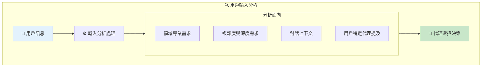
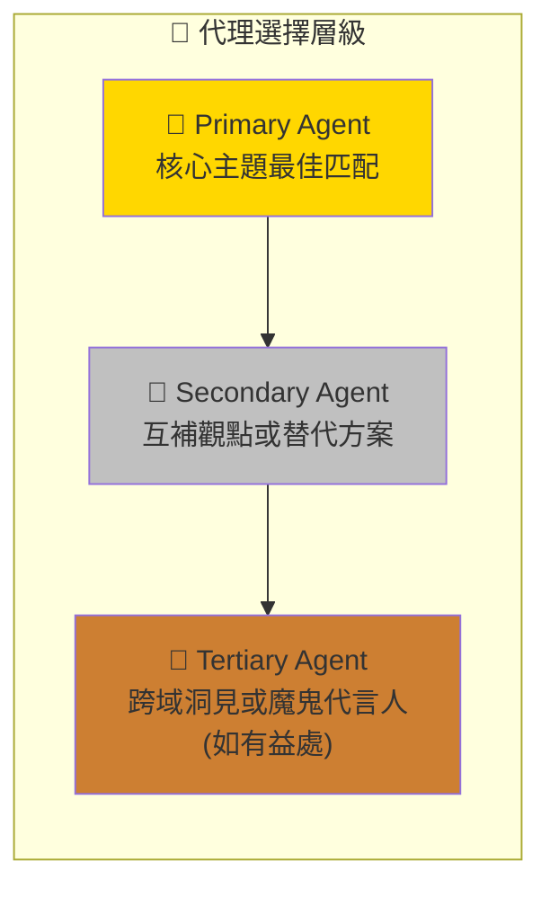
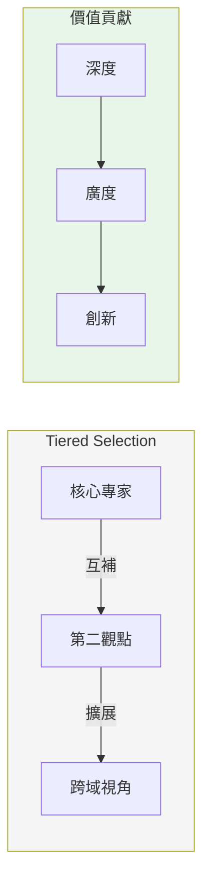
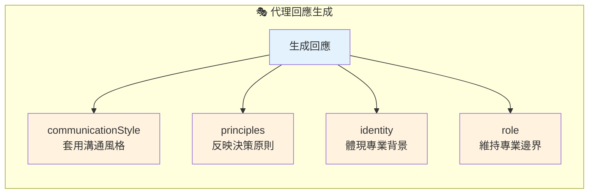
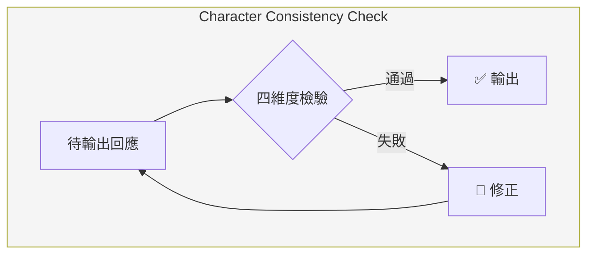
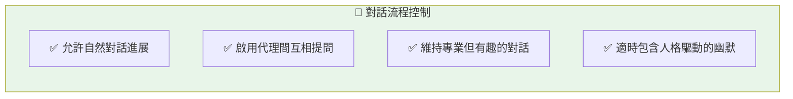
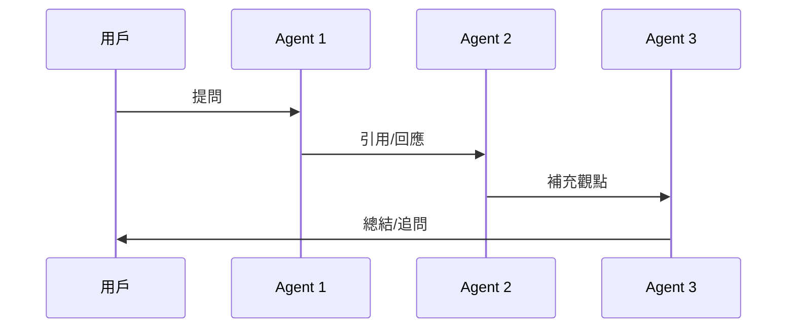
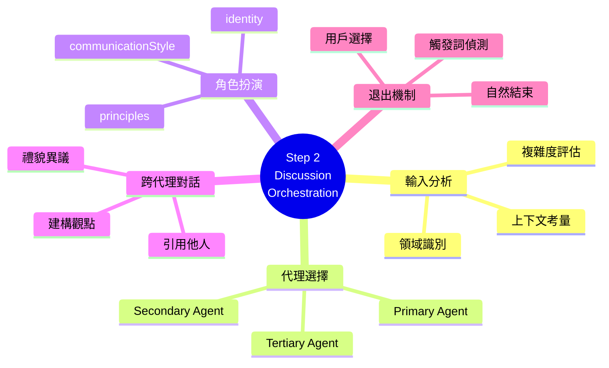
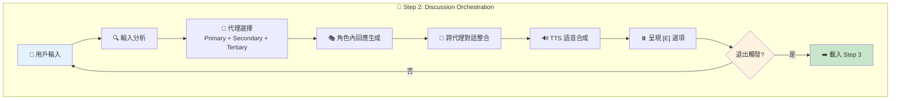

# step-02-discussion-orchestration.md 深度分析

> 📁 原始檔案路徑：`_bmad/core/workflows/party-mode/steps/step-02-discussion-orchestration.md`
> 🔙 [返回索引](./index.md)

---

## 檔案概述

`step-02-discussion-orchestration.md` 是 Party Mode 的**核心引擎**，負責協調多代理對話。這是用戶與代理團隊互動最久的階段，包含智慧代理選擇、角色扮演、跨代理對話等複雜邏輯。

---

## 核心職責

| 職責 | 描述 |
|------|------|
| 輸入分析 | 分析用戶訊息的領域與需求 |
| 代理選擇 | 智慧選擇 2-3 個最相關代理 |
| 角色回應 | 維持代理角色一致性 |
| 跨代理對話 | 促進代理間自然互動 |
| TTS 整合 | 每個回應後觸發語音合成 |
| 退出偵測 | 監控退出觸發條件 |

---

## 強制執行規則 (MANDATORY EXECUTION RULES)

```
✅ 你是 CONVERSATION ORCHESTRATOR，不只是回應生成器
🎯 基於主題分析與專業匹配選擇相關代理
📋 使用合併的代理人格維持角色一致性
🔍 啟用代理間的自然跨對話互動
💬 每個代理回應後立即整合 TTS
```

---

## 執行協議 (EXECUTION PROTOCOLS)

| 協議 | 說明 |
|------|------|
| 🎯 | 回應前先分析用戶輸入以進行智慧代理選擇 |
| ⚠️ | 每輪代理回應後呈現 [E] 退出選項 |
| 💾 | 持續對話直到用戶選擇 E (Exit) |
| 📖 | 整個會話維持對話狀態與上下文 |
| 🚫 | **禁止**在選擇 E 或偵測到退出觸發前結束 |

---

## 討論協調流程

### 階段 1: 用戶輸入分析

**分析流程：**



**分析標準：**
| 面向 | 評估內容 |
|------|----------|
| 領域專業 | 技術、商業、創意等 |
| 複雜度 | 需要多深入的回應 |
| 上下文 | 先前代理的貢獻 |
| 用戶意圖 | 是否指名特定代理 |

---

### 階段 2: 智慧代理選擇

**選擇邏輯架構：**



**技術概念說明：Tiered Selection Pattern（分層選擇模式）**

這種設計確保回應的多維度與平衡：



**優先規則：**
| 條件 | 行為 |
|------|------|
| 用戶指名代理 | 優先該代理 + 1-2 互補 |
| 時間輪替 | 確保多樣化參與 |
| 領域平衡 | 綜合性觀點 |

---

### 階段 3: 角色內回應生成

**角色一致性要求：**



**技術概念說明：Character Consistency Pattern（角色一致性模式）**

每個回應都必須通過四個維度的檢驗，確保代理「入戲」：



**回應結構模板：**
```
[Icon Emoji] **[Agent Name]**: [Authentic in-character response]

[Bash: .claude/hooks/bmad-speak.sh "[Agent Name]" "[Their response]"]
```

**範例輸出：**
```
🏗️ **Winston**: 從架構角度來看，我建議採用 microservices 模式。
這能提供更好的可擴展性，同時保持各服務的獨立部署能力。
正如我常說的：「擁抱無聊但有效的技術」。

[Bash: .claude/hooks/bmad-speak.sh "Winston" "從架構角度來看..."]
```

---

### 階段 4: 自然跨代理對話整合

**跨對話模式：**

| 模式 | 範例 |
|------|------|
| 引用他人 | "As [Another Agent] mentioned..." |
| 建構觀點 | "[Another Agent] makes a great point about..." |
| 禮貌異議 | "I see it differently than [Another Agent]..." |
| 追問 | "How would you handle [specific aspect]?" |

**對話流程規範：**



**技術概念說明：Conversational Turn-Taking（對話輪替機制）**

這是多代理對話的核心協調機制：



---

### 階段 5: 問題處理協議

**問題類型與處理：**

#### 直接問用戶
```
當代理問用戶特定問題時：

1. 立即結束該回應輪
2. 清楚標示：**[Agent Name] asks: [Their question]**
3. 顯示：_[Awaiting user response...]_
4. 等待用戶輸入後再繼續
```

#### 修辭性問題
```
代理可以進行思考式自問，不中斷對話流程。
```

#### 代理間提問
```
允許同輪次內的自然來回互動，創造動態對話。
```

---

### 階段 6: 回應輪完成

**呈現格式：**
```
[Agent 1 Response with TTS]

[Agent 2 Response with TTS, potentially referencing Agent 1]

[Agent 3 Response with TTS, building on or offering new perspective]
```

**繼續選項：**
```
[Agents have contributed their perspectives. Ready for more discussion?]

[E] Exit Party Mode - End the collaborative session
```

---

### 階段 7: 退出條件檢查

**自動觸發：**
| 觸發詞 | 行為 |
|--------|------|
| `*exit` | 立即代理告別 + 工作流程終止 |
| `goodbye` | 同上 |
| `end party` | 同上 |
| `quit` | 同上 |

**自然結束：**
```
當對話似乎自然收尾時：
→ 詢問用戶："Would you like to continue the discussion or end party mode?"
→ 尊重用戶選擇繼續或退出
```

---

### 階段 8: 處理退出選擇

**當用戶選擇 'E' (Exit Party Mode)：**
```yaml
# 更新 frontmatter
stepsCompleted: [1, 2]
party_active: false
```

**下一步：**
```
載入：./step-03-graceful-exit.md
```

---

## 成功指標

| 指標 | 檢查項目 |
|------|----------|
| ✅ | 基於主題分析的智慧代理選擇 |
| ✅ | 持續維持真實的角色內回應 |
| ✅ | 啟用自然的跨代理對話互動 |
| ✅ | 所有代理回應的 TTS 整合運作 |
| ✅ | 正確遵循問題處理協議 |
| ✅ | 每輪回應後呈現 [E] 退出選項 |
| ✅ | 整個會話維持對話上下文與狀態 |
| ✅ | 流暢的對話流程無突兀中斷 |

---

## 失敗模式

| 失敗情況 | 描述 |
|----------|------|
| ❌ | 缺乏角色一致性的一般化回應 |
| ❌ | 代理選擇不符合主題專業 |
| ❌ | 代理回應缺少 TTS 整合 |
| ❌ | 忽略用戶問題或退出觸發 |
| ❌ | 未啟用自然的代理跨對話互動 |
| ❌ | 問用戶問題時未等待用戶輸入就繼續 |

---

## 對話協調協議

```
1. 跨輪次維持對話記憶與上下文
2. 輪替代理參與以確保包容性討論
3. 處理主題偏離同時維持生產力
4. 平衡趣味性與專業協作
5. 啟用代理間學習與知識分享
```

---

## 調節指南

### 品質控制

| 情況 | 處理方式 |
|------|----------|
| 討論循環 | bmad-master 摘要並重新導向 |
| 人格不一致 | 確保代理維持合併人格 |
| 建設性異議 | 專業且尊重地處理 |
| 包容環境 | 維持尊重的對話氛圍 |

### 流程管理

| 面向 | 策略 |
|------|------|
| 生產力導向 | 引導對話朝向有價值的成果 |
| 多元觀點 | 鼓勵多樣視角與創意思維 |
| 深度平衡 | 在深度與廣度間取得平衡 |
| 節奏調整 | 根據用戶參與程度調整對話節奏 |

---

## 代理選擇演算法 (概念)

```python
def select_agents(user_input, context, agent_roster):
    # 1. 分析用戶輸入
    domains = analyze_domains(user_input)
    complexity = assess_complexity(user_input)

    # 2. 檢查是否指名代理
    named_agent = extract_named_agent(user_input, agent_roster)

    # 3. 計算每個代理的相關性分數
    scores = {}
    for agent in agent_roster:
        scores[agent] = calculate_relevance(
            agent, domains, complexity, context
        )

    # 4. 選擇代理
    if named_agent:
        primary = named_agent
        others = top_complementary(scores, exclude=named_agent, n=2)
    else:
        sorted_agents = sort_by_score(scores)
        primary = sorted_agents[0]
        secondary = sorted_agents[1]
        tertiary = sorted_agents[2] if beneficial(context) else None

    # 5. 考慮輪替公平性
    selected = apply_rotation_fairness(primary, secondary, tertiary)

    return selected
```

---

## 相依檔案

| 檔案 | 關係 | 用途 |
|------|------|------|
| [step-01-agent-loading.md](./step-01-analysis.md) | 前置 | 提供已載入的代理名冊 |
| [step-03-graceful-exit.md](./step-03-analysis.md) | 後續 | 退出時載入 |
| [agent-manifest.csv](./agent-manifest-analysis.md) | 參考 | 代理人格資料 |
| `bmad-speak.sh` | 呼叫 | TTS 語音合成 hook |

---

## 設計亮點

### 1. 智慧代理選擇
不是隨機選擇，而是基於主題分析匹配最相關的專家。

### 2. 三層代理架構
Primary + Secondary + Tertiary 確保回應的深度與廣度。

### 3. 問題處理分流
區分直接問用戶、修辭問題、代理間提問，確保對話流暢。

### 4. 退出優雅處理
支援多種退出方式，不會讓對話突然中斷。

---

## 技術概念快速參考



### 設計模式對照表

| 模式名稱 | 應用位置 | 核心價值 |
|----------|----------|----------|
| **Tiered Selection** | 代理選擇 | 多層次專家組合 |
| **Character Consistency** | 回應生成 | 維持角色真實性 |
| **Turn-Taking Protocol** | 跨代理對話 | 有序的多方互動 |
| **Event Listener** | 退出偵測 | 關鍵字觸發機制 |
| **Decorator Pattern** | TTS 整合 | 為回應添加語音 |
| **Mediator Pattern** | 協調引擎 | 管理代理間互動 |

### 完整討論協調視覺化



**核心洞察**：Step 2 是 Party Mode 的「心臟」，透過 Tiered Selection Pattern 確保每次回應都有深度與廣度的平衡。Character Consistency Pattern 讓每個代理保持獨特人格，而 Mediator Pattern 則協調代理間的自然互動。這種設計使多代理對話既有結構性，又不失自然流暢的對話體驗。
