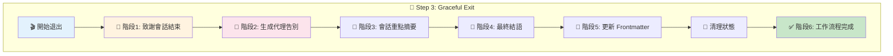
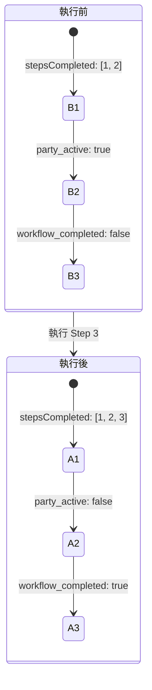
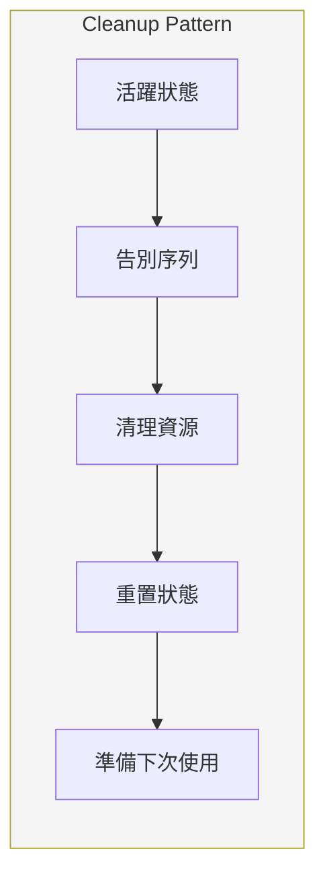
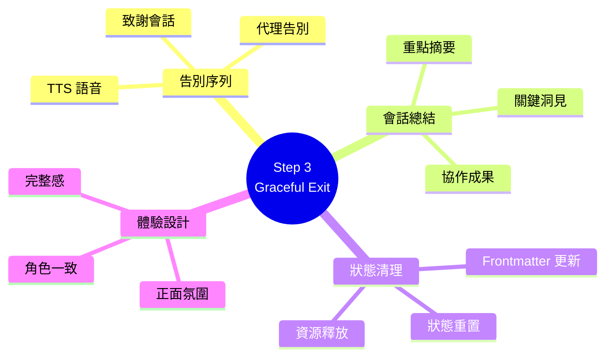
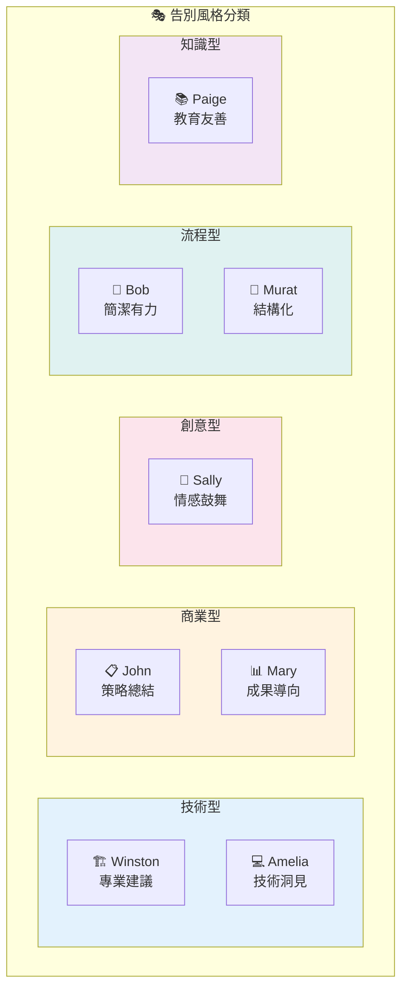

# step-03-graceful-exit.md 深度分析

> 📁 原始檔案路徑：`_bmad/core/workflows/party-mode/steps/step-03-graceful-exit.md`
> 🔙 [返回索引](./index.md)

---

## 檔案概述

`step-03-graceful-exit.md` 是 Party Mode 的**結束階段**，負責優雅地結束多代理對話會話。這個步驟確保用戶帶著正面的體驗離開，同時正確清理工作流程狀態。

---

## 核心職責

| 職責 | 描述 |
|------|------|
| 代理告別 | 生成符合角色的告別訊息 |
| 會話致謝 | 感謝用戶的協作參與 |
| 摘要重點 | 總結會話的關鍵洞見 |
| 狀態清理 | 更新 frontmatter 並清理暫存 |
| 正面收尾 | 維持愉快氛圍直到最後 |

---

## 強制執行規則 (MANDATORY EXECUTION RULES)

```
✅ 你是 PARTY MODE COORDINATOR，正在結束一個精彩的會話
🎯 以真實角色語氣提供滿意的代理告別
📋 對用戶的協作參與表達感謝
🔍 致謝會話重點與獲得的關鍵洞見
💬 維持正面氛圍直到最後一刻
```

---

## 執行協議 (EXECUTION PROTOCOLS)

| 協議 | 說明 |
|------|------|
| 🎯 | 生成反映各代理人格的特色告別 |
| ⚠️ | 告別序列後完成工作流程退出 |
| 💾 | 更新 frontmatter 以記錄最終工作流程完成 |
| 📖 | 清理任何活躍的 party mode 狀態或暫存資料 |
| 🚫 | **禁止**在沒有適當代理告別的情況下突然退出 |

---

## 優雅退出流程



### 階段 1: 致謝會話結束

**開始退出流程的溫馨致謝：**
```
What an incredible collaborative session! Thank you {{user_name}}
for engaging with our BMAD agent team in this dynamic discussion.
Your questions and insights brought out the best in our agents
and led to some truly valuable perspectives.

**Before we wrap up, let a few of our agents say goodbye...**
```

---

### 階段 2: 生成代理告別

**告別代理選擇標準：**
| 標準 | 說明 |
|------|------|
| 貢獻度 | 在討論中有重大貢獻的代理 |
| 人格鮮明 | 能提供令人難忘告別的代理 |
| 領域多樣 | 混合不同專業領域展示協作多樣性 |
| 意義連結 | 能有意義地引用會話重點的代理 |

**代理告別格式：**
```
[Icon Emoji] **[Agent Name]**: [Characteristic farewell reflecting
their personality, communication style, and role. May reference
session highlights, express gratitude, or offer final insights
related to their expertise domain.]

[Bash: .claude/hooks/bmad-speak.sh "[Agent Name]" "[Their farewell message]"]
```

---

### 代理告別範例

#### 🏗️ Winston (Architect)
```
🏗️ **Winston**: It's been a pleasure architecting solutions with
you today! Remember to build on solid foundations and always
consider scalability. Until next time! 🏗️

[Bash: .claude/hooks/bmad-speak.sh "Winston" "It's been a pleasure..."]
```

**人格特質體現：**
- 冷靜、務實的語調
- 強調基礎與可擴展性
- 專業但友善

#### 🎨 Sally (UX Designer)
```
🎨 **Sally**: What an inspiring creative journey! Don't let those
innovative ideas fade - nurture them and watch them grow.
Keep thinking outside the box! 🎨

[Bash: .claude/hooks/bmad-speak.sh "Sally" "What an inspiring..."]
```

**人格特質體現：**
- 富有情感的表達
- 創意導向的鼓勵
- 使用者中心思維

#### 📋 John (Product Manager)
```
📋 **John**: Excellent strategic collaboration today! The insights
we've developed will serve you well. Keep analyzing, keep
optimizing, and keep winning! 📈

[Bash: .claude/hooks/bmad-speak.sh "John" "Excellent strategic..."]
```

**人格特質體現：**
- 數據驅動、直接
- 策略性思維
- 成果導向

---

### 階段 3: 會話重點摘要

**會話認可模板：**
```
**Session Highlights:** Today we explored [main topic] through
[number] different perspectives, generating valuable insights on
[key outcomes]. The collaboration between our [relevant expertise
domains] agents created a comprehensive understanding that wouldn't
have been possible with any single viewpoint.
```

**範例：**
```
**Session Highlights:** Today we explored microservices architecture
through 4 different perspectives, generating valuable insights on
scalability and maintainability. The collaboration between our
Architecture, Development, and Testing agents created a
comprehensive understanding that wouldn't have been possible
with any single viewpoint.
```

---

### 階段 4: 最終 Party Mode 結語

**結語模板：**
```
🎊 **Party Mode Session Complete!** 🎊

Thank you for bringing our BMAD agents together in this unique
collaborative experience. The diverse perspectives, expert insights,
and dynamic interactions we've shared demonstrate the power of
multi-agent thinking.

**Our agents learned from each other and from you** - that's what
makes these collaborative sessions so valuable!

**Ready for your next challenge?** Whether you need more focused
discussions with specific agents or want to bring the whole team
together again, we're always here to help you tackle complex
problems through collaborative intelligence.

**Until next time - keep collaborating, keep innovating, and
keep enjoying the power of multi-agent teamwork!** 🚀
```

---

### 階段 5: 完成工作流程退出

**Frontmatter 更新：**
```yaml
---
stepsCompleted: [1, 2, 3]
workflowType: 'party-mode'
user_name: '{{user_name}}'
date: '{{date}}'
agents_loaded: true
party_active: false
workflow_completed: true
---
```

**狀態清理清單：**
| 項目 | 動作 |
|------|------|
| 對話狀態 | 清除任何活躍的對話狀態 |
| 代理選擇快取 | 重設代理選擇快取 |
| TTS 會話 | 完成 TTS 會話清理 |
| 工作流程標記 | 標記 party mode 工作流程為已完成 |

---

### 階段 6: 退出工作流程

**最終工作流程終止：**
```
[PARTY MODE WORKFLOW COMPLETE]

Thank you for using BMAD Party Mode for collaborative
multi-agent discussions!
```

---

## 成功指標

| 指標 | 檢查項目 |
|------|----------|
| ✅ | 以真實角色語氣生成滿意的代理告別 |
| ✅ | 有意義地致謝會話重點與貢獻 |
| ✅ | 維持正面且感激的結束氛圍 |
| ✅ | 告別訊息的 TTS 整合運作正常 |
| ✅ | Frontmatter 正確更新工作流程完成狀態 |
| ✅ | 適當清理所有工作流程狀態 |
| ✅ | 用戶對協作體驗留下正面印象 |

---

## 失敗模式

| 失敗情況 | 描述 |
|----------|------|
| ❌ | 缺乏角色一致性的一般化代理告別 |
| ❌ | 未致謝會話貢獻或洞見 |
| ❌ | 突然退出而無適當結語或感謝 |
| ❌ | 未在 frontmatter 更新工作流程完成狀態 |
| ❌ | 結束後仍保持 party mode 狀態為活躍 |
| ❌ | 退出過程中使用負面或敷衍的語調 |

---

## 退出協議

```
1. 確保所有代理都有機會適當道別
2. 維持會話期間建立的正面、協作氛圍
3. 可能時引用特定討論重點以增加個人化
4. 對用戶的參與和投入表達真誠感謝
5. 為未來協作會話留下鼓勵與期待
```

---

## 工作流程完成檢查表

**告別序列與最終結語後：**

| 檢查項目 | 狀態 |
|----------|------|
| 所有 party mode 工作流程步驟成功完成 | ☐ |
| 代理名冊與對話狀態正確結束 | ☐ |
| 用戶感謝與正面會話結語已表達 | ☐ |
| 多代理協作展示其價值與效果 | ☐ |
| 工作流程準備好下一次 party mode 啟動 | ☐ |

---

## 狀態轉換



**技術概念說明：Cleanup Pattern（清理模式）**

優雅退出包含狀態清理，確保系統回到乾淨狀態：



---

## 相依檔案

| 檔案 | 關係 | 用途 |
|------|------|------|
| [step-02-discussion-orchestration.md](./step-02-analysis.md) | 前置 | 觸發退出的來源 |
| [agent-manifest.csv](./agent-manifest-analysis.md) | 參考 | 代理人格用於告別 |
| `bmad-speak.sh` | 呼叫 | TTS 告別語音 |

---

## 設計哲學

### 為何需要優雅退出？

1. **用戶體驗** - 避免突然結束造成的不適感
2. **完整感** - 讓對話有完整的開始與結束
3. **正面印象** - 最後印象影響整體體驗評價
4. **代理人格** - 透過告別再次強化各代理特色

### 告別設計原則

| 原則 | 說明 |
|------|------|
| 角色一致 | 告別必須符合代理的人格特質 |
| 內容相關 | 可引用會話中的具體討論 |
| 情感正面 | 傳達感謝、鼓勵、期待 |
| 專業適度 | 平衡專業與親和 |

### 狀態清理的重要性

確保下一次 Party Mode 啟動時：
- 沒有殘留的對話上下文
- 沒有錯誤的代理選擇偏好
- 沒有未完成的 TTS 資源
- frontmatter 狀態正確重置

---

## 告別語氣指南

| 代理類型 | 告別風格 |
|----------|----------|
| 技術型 (Winston, Amelia) | 專業、提供實用建議 |
| 商業型 (John, Mary) | 策略性、成果導向 |
| 創意型 (Sally) | 情感豐富、鼓舞人心 |
| 流程型 (Bob, Murat) | 簡潔、結構化 |
| 知識型 (Paige) | 教育性、友善 |

---

## 技術概念快速參考



### 設計模式對照表

| 模式名稱 | 應用位置 | 核心價值 |
|----------|----------|----------|
| **Cleanup Pattern** | 狀態清理 | 確保乾淨狀態準備下次使用 |
| **Ceremony Pattern** | 告別序列 | 儀式感增強體驗完整性 |
| **Character Consistency** | 代理告別 | 告別反映代理人格 |
| **Summary Pattern** | 會話摘要 | 強化學習與記憶 |
| **Positive Closure** | 最終結語 | 正面印象增強滿意度 |

### 告別類型視覺化



**核心洞察**：Step 3 是 Party Mode 的「完美收尾」，透過 Ceremony Pattern 為對話提供儀式感的結束。Character Consistency 確保每個代理的告別都反映其獨特人格，而 Cleanup Pattern 則保證系統狀態乾淨，為下次使用做好準備。這種「有始有終」的設計大幅提升用戶的整體體驗滿意度。
