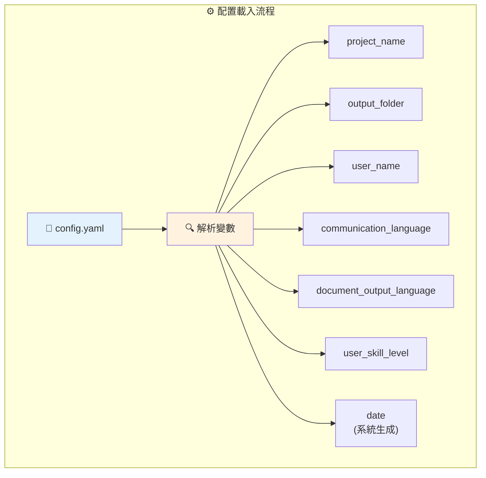
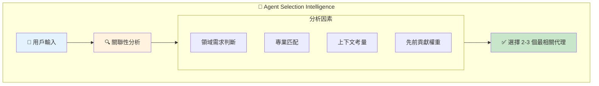
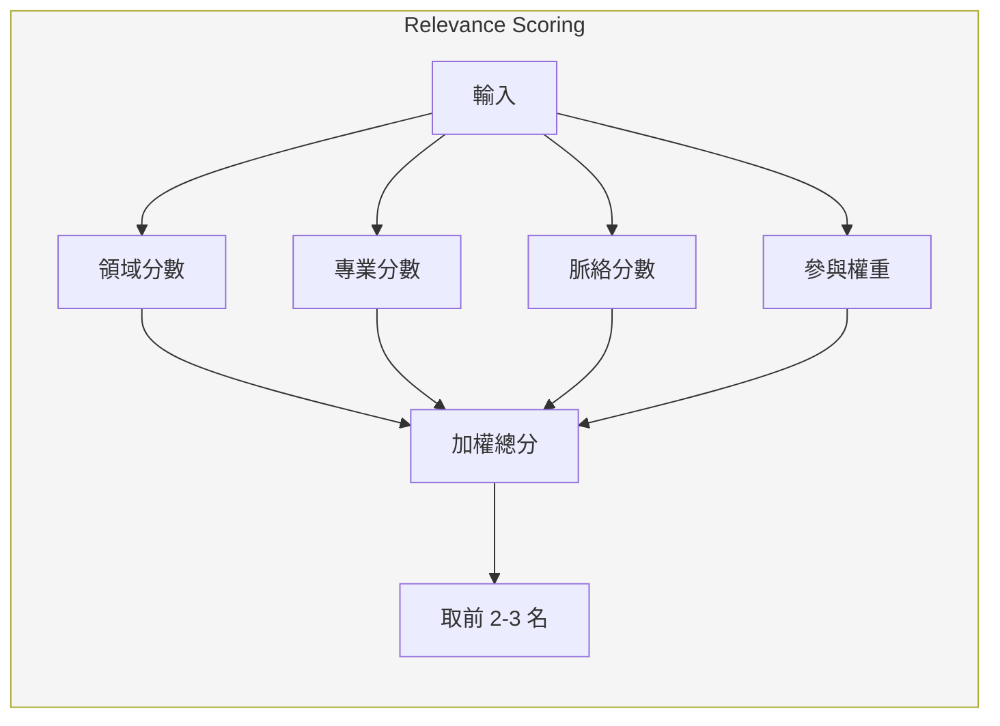
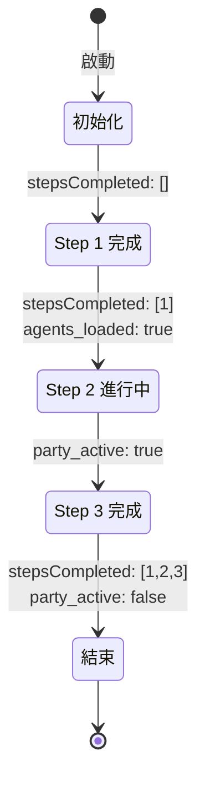
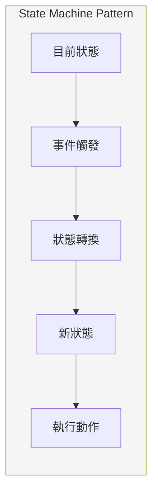
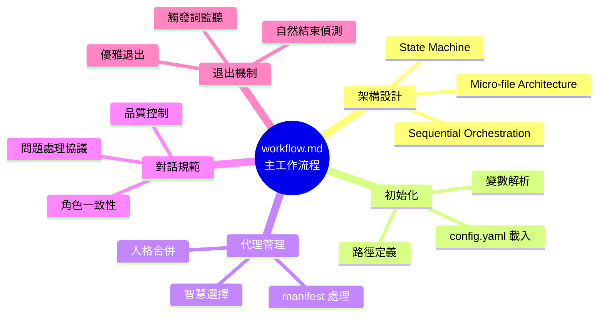
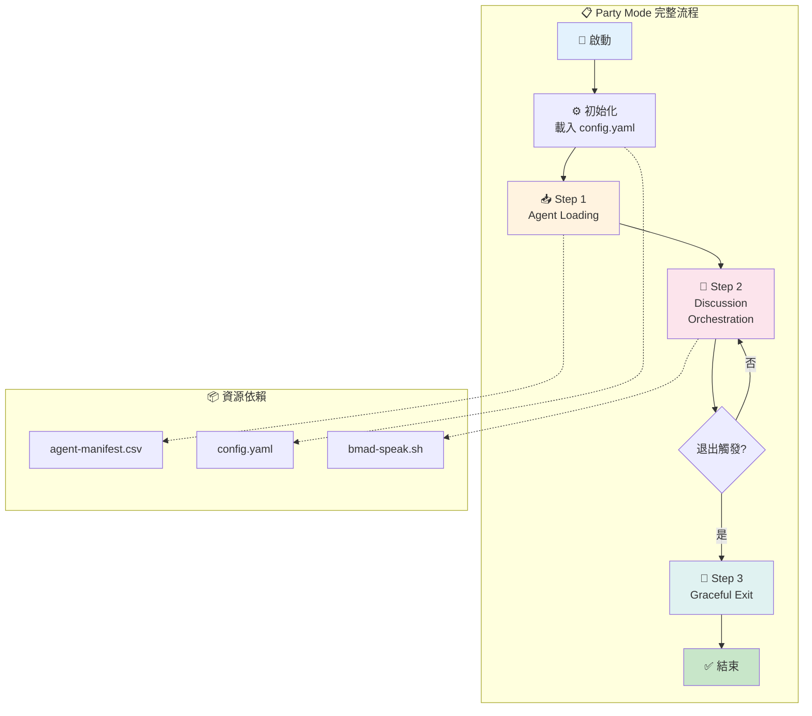

# workflow.md 深度分析

> 📁 原始檔案路徑：`_bmad/core/workflows/party-mode/workflow.md`
> 🔙 [返回索引](./index.md)

---

## 檔案概述

`workflow.md` 是 Party Mode 工作流程的**主定義檔案**，扮演整個工作流程的「藍圖」角色。它定義了：
- 整體架構與設計模式
- 初始化流程
- 代理資料處理邏輯
- 對話協調規則
- 狀態追蹤機制
- 退出條件

---

## 檔案結構剖析

### Frontmatter 區塊
```yaml
---
name: party-mode
description: Orchestrates group discussions between all installed BMAD agents...
---
```

**功能：**
- `name`: 工作流程識別碼，用於系統呼叫
- `description`: 人類可讀的描述，用於選單顯示

---

## 主要區塊分析

### 1. WORKFLOW ARCHITECTURE

```
架構類型：Micro-file Architecture + Sequential Conversation Orchestration
```

**設計理念：**
- **Micro-file**: 每個步驟獨立成檔，遵循單一職責原則
- **Sequential**: 步驟按順序執行 (Step 01 → 02 → 03)
- **State Tracking**: 透過 frontmatter 追蹤對話狀態

**步驟分工：**
| 步驟 | 檔案 | 職責 |
|------|------|------|
| 01 | step-01-agent-loading.md | 載入代理清單、初始化 |
| 02 | step-02-discussion-orchestration.md | 協調多代理對話 |
| 03 | step-03-graceful-exit.md | 優雅退出、狀態清理 |

---

### 2. INITIALIZATION

**配置載入流程：**



**路徑定義：**
```
installed_path     = {project-root}/_bmad/core/workflows/party-mode
agent_manifest_path = {project-root}/_bmad/_config/agent-manifest.csv
standalone_mode    = true
```

**獨立模式說明：**
`standalone_mode = true` 表示 Party Mode 是一個互動式工作流程，不依賴其他工作流程的輸出。

---

### 3. AGENT MANIFEST PROCESSING

**CSV 欄位對照表：**

| 欄位 | 用途 | 範例 |
|------|------|------|
| `name` | 系統識別碼 | `architect` |
| `displayName` | 顯示名稱 | `Winston` |
| `title` | 職稱 | `Architect` |
| `icon` | 視覺識別符 | `🏗️` |
| `role` | 能力摘要 | `System Architect + Technical Design Leader` |
| `identity` | 背景專業 | `Senior architect with expertise...` |
| `communicationStyle` | 溝通風格 | `Speaks in calm, pragmatic tones...` |
| `principles` | 決策原則 | `User journeys drive technical decisions...` |
| `module` | 來源模組 | `bmm` |
| `path` | 檔案路徑 | `_bmad/bmm/agents/architect.md` |

**人格合併邏輯：**
系統會將 manifest 資料與實際代理檔案配置合併，建立完整的代理名冊。

---

### 4. EXECUTION

#### Party Mode 啟動訊息

```
🎉 PARTY MODE ACTIVATED! 🎉

Welcome {{user_name}}! All BMAD agents are here...
```

**變數替換：**
- `{{user_name}}` → 從 config.yaml 取得，例如 `Pi`

#### 代理選擇智慧 (Agent Selection Intelligence)

**選擇流程：**



**技術概念說明：Relevance Scoring Algorithm（關聯性評分演算法）**

這是一種多因素評分機制，結合多個維度判斷最適合回應的代理：



**優先順序規則：**
1. 用戶明確指名 → 該代理 + 1-2 互補代理
2. 輪替參與 → 確保所有代理都有機會發言
3. 跨代理對話 → 允許代理間自然互動

---

### 5. WORKFLOW STATES

**Frontmatter 狀態追蹤：**

```yaml
---
stepsCompleted: [1]           # 已完成步驟
workflowType: 'party-mode'    # 工作流程類型
user_name: '{{user_name}}'    # 用戶名稱
date: '{{date}}'              # 執行日期
agents_loaded: true           # 代理載入狀態
party_active: true            # Party 模式啟用狀態
exit_triggers: ['*exit', 'goodbye', 'end party', 'quit']  # 退出觸發詞
---
```

**狀態轉換圖：**



**技術概念說明：Finite State Machine（有限狀態機）**

Party Mode 使用 FSM 追蹤工作流程狀態，每個狀態有明確的轉換條件：



| 狀態 | 進入條件 | 關鍵變數變化 |
|------|----------|--------------|
| INIT | 工作流程啟動 | `stepsCompleted: []` |
| STEP1 | 配置載入完成 | `agents_loaded: true` |
| STEP2 | 代理載入完成 | `party_active: true` |
| DONE | 退出觸發 | `party_active: false` |

---

### 6. ROLE-PLAYING GUIDELINES

**角色一致性要求：**

| 面向 | 規範 |
|------|------|
| 回應風格 | 必須符合 `communicationStyle` 定義 |
| 決策邏輯 | 必須反映 `principles` |
| 專業範圍 | 必須尊重 `role` 邊界 |
| 人格特質 | 可包含幽默與個性 |

**對話流程規範：**
- ✅ 代理間可自然引用彼此名稱
- ✅ 允許建設性異議
- ✅ 可進行 cross-talk
- ❌ 不可超出專業範圍

---

### 7. QUESTION HANDLING PROTOCOL

**問題類型處理：**

| 類型 | 處理方式 |
|------|----------|
| 直接問用戶 | 立即結束回合，等待用戶回應 |
| 代理間提問 | 同輪次內自然回應 |
| 修辭性問題 | 不中斷對話流程 |

---

### 8. EXIT CONDITIONS

**退出觸發方式：**

| 觸發類型 | 條件 |
|----------|------|
| 自動觸發 | 訊息包含 `*exit`, `goodbye`, `end party`, `quit` |
| 自然結束 | 對話自然收尾時詢問用戶 |
| 用戶選擇 | 選擇 `[E]` Exit 選項 |

---

### 9. TTS INTEGRATION

**語音合成協議：**
```bash
.claude/hooks/bmad-speak.sh "[Agent Name]" "[Their response]"
```

**執行時機：** 每個代理回應文字後立即觸發

**語音配置來源：** 從 manifest 的合併資料取得

---

### 10. MODERATION NOTES

**品質控制機制：**

| 情況 | 處理方式 |
|------|----------|
| 討論循環 | bmad-master 介入摘要並重新導向 |
| 主題偏離 | 維持生產性對話同時處理偏離 |
| 人格不一致 | 確保代理維持合併後的人格特質 |

---

## 相依檔案

| 檔案 | 關係 | 用途 |
|------|------|------|
| [config.yaml](./config-analysis.md) | 讀取 | 用戶配置與系統變數 |
| [agent-manifest.csv](./agent-manifest-analysis.md) | 讀取 | 代理資料來源 |
| [step-01-agent-loading.md](./step-01-analysis.md) | 載入 | 第一步驟 |
| [step-02-discussion-orchestration.md](./step-02-analysis.md) | 載入 | 第二步驟 |
| [step-03-graceful-exit.md](./step-03-analysis.md) | 載入 | 第三步驟 |

---

## 設計模式總結

1. **Micro-file Architecture** - 步驟獨立，易於維護
2. **State Machine** - frontmatter 追蹤狀態轉換
3. **Strategy Pattern** - 代理選擇策略可替換
4. **Observer Pattern** - 退出觸發詞監聽
5. **Decorator Pattern** - TTS 裝飾每個回應

---

## 技術概念快速參考



### 設計模式對照表

| 模式名稱 | 應用位置 | 核心價值 |
|----------|----------|----------|
| **Micro-file Architecture** | 步驟檔案 | 單一職責，易於維護擴展 |
| **Finite State Machine** | Frontmatter 狀態 | 明確的狀態轉換與追蹤 |
| **Strategy Pattern** | 代理選擇 | 可替換的選擇演算法 |
| **Observer Pattern** | 退出觸發 | 關鍵字監聽與事件驅動 |
| **Decorator Pattern** | TTS 整合 | 為回應添加語音輸出 |
| **Relevance Scoring** | 代理匹配 | 多因素評分機制 |

### 完整工作流程視覺化



**核心洞察**：`workflow.md` 是 Party Mode 的「藍圖」，透過 Micro-file Architecture 將複雜的多代理協調分解為三個清晰的步驟。State Machine 模式確保工作流程狀態可追蹤、可恢復。Relevance Scoring 演算法實現智慧代理選擇，而 Observer Pattern 則提供靈活的退出機制。這種設計使 Party Mode 既具備高度互動性，又保持良好的可維護性。
